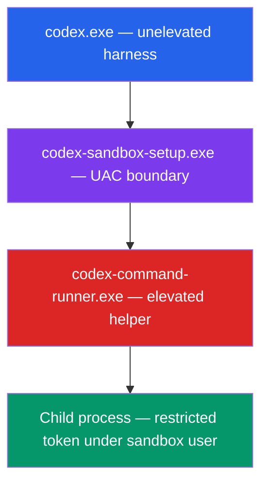
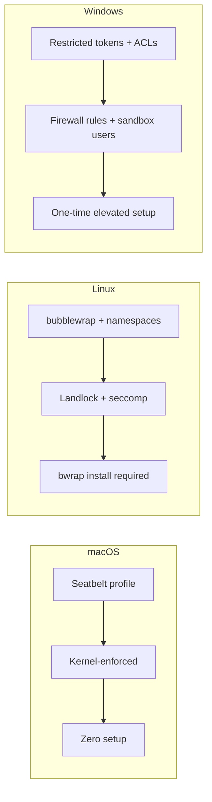

# Inside the Codex Windows Sandbox: Restricted Tokens, Synthetic SIDs, and the Four-Layer Execution Architecture


---

On 13 May 2026 OpenAI published an engineering deep-dive titled *Building a safe, effective sandbox to enable Codex on Windows* [^1]. The post, by David Wiesen of the Codex engineering team, traces the journey from "no sandbox at all" — where Windows users had to approve nearly every command or enable Full Access mode — to a production-grade isolation layer built on restricted tokens, synthetic SIDs, dedicated sandbox users, and firewall rules. This article unpacks the architecture, compares it with the macOS and Linux equivalents, and offers practical guidance for teams running Codex on Windows in production.

## Why Windows Was the Hard Platform

macOS and Linux shipped with sandbox support early. macOS uses the built-in **Seatbelt** framework, which works out of the box [^2]. Linux relies on **bubblewrap** (`bwrap`) with unprivileged user namespaces, Landlock LSM for filesystem filtering, and seccomp-BPF for syscall restriction [^2]. Both platforms provide kernel-level namespace isolation that cleanly separates the agent's view of the filesystem from the host.

Windows has no equivalent of `unshare(2)` or Seatbelt profiles. Its security model centres on **Security Identifiers (SIDs)**, **Access Control Lists (ACLs)**, **restricted tokens**, and **user-boundary isolation** — primitives that are powerful but designed for multi-user server workloads, not ephemeral sandboxes [^1]. OpenAI had to compose these primitives into something that felt as seamless as the Linux sandbox whilst remaining safe.

## The Unelevated Prototype

The first working sandbox ran entirely unelevated. It created a **synthetic SID** called `sandbox-write` and launched commands under a **write-restricted token** whose restricted SID list comprised `Everyone`, the current logon session SID, and the synthetic SID [^1].

To permit writes to the workspace, Codex stamped a write-allow ACE for the synthetic SID onto the working directory. Every other path on the filesystem lacked that ACE, so the restricted token's write filter blocked modifications outside the workspace [^1].

This approach had several advantages:

- No administrator privileges required
- Granular per-directory write control
- No user-visible elevation prompts

But the drawbacks were disqualifying:

- **ACL setup was expensive**: scanning and stamping ACEs across nested directory trees added noticeable latency before each command [^1]
- **Semantics were hard to change**: altering what could be written meant re-walking the filesystem
- **Network isolation was weak**: restricted tokens alone cannot block outbound network traffic without firewall rules, and firewall rules require elevation [^1]

## The Elevated Sandbox: Production Architecture

The production design introduces **two dedicated local users** created by Codex during initial setup [^1] [^3]:

| User | Purpose |
|------|---------|
| `CodexSandboxOffline` | Targeted by Windows Firewall deny-outbound rules; used for commands that should have no network access |
| `CodexSandboxOnline` | Not targeted by firewall rules; used when the permission profile grants `network_access` |

Commands run as one of these users rather than the developer's own account. Because they are distinct Windows principals, the filesystem permission boundary is natural — these users only have access to what has been explicitly granted [^3].

### The Four-Layer Execution Path

OpenAI describes a **four-layer execution path** that prepares each sandboxed command [^3]:



1. **`codex.exe`** — the main CLI binary, always unelevated. It never requests administrator privileges itself [^1].
2. **`codex-sandbox-setup.exe`** — a dedicated binary that crosses the UAC boundary when first-time setup is needed. It provisions sandbox users, configures firewall rules, and grants write ACEs to the working directory [^1] [^3].
3. **`codex-command-runner.exe`** — a long-lived elevated helper that accepts `SpawnRequest` messages over a **framed IPC pipe**. It validates each request against the active policy before spawning the child [^4].
4. **Child process** — the actual command (e.g. `npm test`, `cargo build`), launched via `CreateProcessAsUserW()` with a restricted token whose principal is `CodexSandboxOffline` or `CodexSandboxOnline` [^3] [^4].

### Why a Separate Setup Binary?

Encapsulating setup in a dedicated binary was not merely about crossing the UAC boundary. OpenAI's blog identifies four architectural reasons [^1]:

1. `codex.exe` stays a normal, unelevated harness
2. Windows-only setup machinery does not bloat the cross-platform binary
3. Longer-running setup work is decoupled from the main process lifetime
4. A single binary handles all divergent setup paths (elevated, unelevated, repair)

### IPC Bridge: Framed Pipes and SpawnRequest

The `codex-command-runner.exe` helper communicates with the main process over a **framed IPC pipe** — structured message passing using Windows named pipes [^4]. Each message is a `SpawnRequest` containing:

- The command and arguments
- The target sandbox user (`Offline` or `Online`)
- The permission profile (filesystem mode, network mode)
- Environment variables and working directory

The helper validates the request, constructs the restricted token, applies any additional ACLs, and calls `CreateProcessAsUserW()` [^4]. This separation means the main process never holds elevated privileges — it merely sends instructions to something that does.

## Filesystem Isolation in Detail

The elevated sandbox enforces a **deny-by-default model** [^4] [^5]:

1. **Base restrictions** — the sandbox user has no write access anywhere by default
2. **Workspace grants** — Codex stamps write-allow ACEs for the sandbox user on the workspace directory and any paths listed in `writable_roots` [^5]
3. **Sensitive path hardening** — directories like `.git`, `.codex`, and `.agents` receive explicit deny-write ACEs even in `workspace-write` mode [^4]
4. **World-writable audit** — `audit_everyone_writable` scans for directories with `Everyone` write access and warns the user, since these would bypass sandbox restrictions [^4]

```toml
# config.toml — grant write access beyond the workspace
[sandbox]
writable_roots = [
  "C:\\Users\\dev\\AppData\\Local\\Temp",
  "D:\\build-cache"
]
```

Path normalisation handles Windows edge cases: UNC paths, junction points, symbolic links, and the `\\?\` long-path prefix are all resolved before ACL operations [^4].

## Network Isolation

Network control uses the **firewall + user identity** pattern rather than token capabilities [^1] [^3]:

- During setup, Codex creates Windows Firewall rules that **deny all outbound traffic** for `CodexSandboxOffline`
- If the rules already exist, the setup binary validates they are correct and repairs them if tampered with
- Commands requiring network access run as `CodexSandboxOnline`, which has no deny rules
- **DPAPI-protected credentials** are bound to the developer's user profile, so the sandbox users cannot access stored secrets even if network access is granted [^3]

This is architecturally different from Linux, where bubblewrap uses network namespace isolation (`--unshare-net`), and from macOS, where Seatbelt profiles deny `network-outbound` [^2].

## Desktop and Session Isolation

Both elevated and unelevated modes run commands on a **private desktop** by default [^3] [^6]. This prevents sandboxed processes from:

- Sending keystrokes or messages to the developer's desktop
- Reading clipboard contents
- Interacting with GUI applications outside the sandbox

The private desktop can be disabled for compatibility:

```toml
[windows]
sandbox_private_desktop = false
```

OpenAI recommends keeping it enabled unless specific tools require access to the interactive desktop [^6].

## Comparing the Three Platform Sandboxes



| Aspect | macOS (Seatbelt) | Linux (bwrap) | Windows (Elevated) |
|--------|-----------------|---------------|---------------------|
| Isolation primitive | Sandbox profiles | User namespaces, Landlock | Restricted tokens, ACLs |
| Network blocking | Profile rule | `--unshare-net` | Firewall deny rules per user |
| Filesystem writes | Profile allow-list | Bind mounts, Landlock rules | ACE stamps on workspace |
| Setup required | None | `apt install bubblewrap` | One-time UAC elevation |
| Credential isolation | Keychain sandboxing | Namespace separation | DPAPI user binding |
| Process tree cleanup | Sandbox teardown | PID namespace | Job Objects [^4] |

## Troubleshooting Common Issues

Several GitHub issues document real-world friction with the Windows sandbox:

- **Error 1385** (`ERROR_LOGON_NOT_GRANTED`): the sandbox user lacks the "Log on locally" right. Enterprise group policies often strip this. Solution: add `CodexSandboxOffline` and `CodexSandboxOnline` to the local "Allow log on locally" policy, or ask IT to create a GPO exception [^6].
- **`CreateProcessAsUserW failed: 5`**: the elevated helper cannot spawn processes under the sandbox user. Often caused by antivirus software intercepting `CreateProcessAsUserW` calls. Adding `codex-command-runner.exe` to the AV exclusion list resolves this [^7].
- **`CreateRestrictedToken failed: 87`**: the unelevated sandbox cannot construct a valid restricted token. This occurs on heavily locked-down corporate machines where token manipulation is restricted by policy [^8]. Switching to `sandbox = "elevated"` resolves it.
- **Folders writable by Everyone**: the `audit_everyone_writable` check flags directories where the sandbox boundary would not hold. Remove broad permissions or exclude the directory from the workspace [^6].

## Practical Recommendations

**For individual developers:**

```toml
# ~/.codex/config.toml
[windows]
sandbox = "elevated"
sandbox_private_desktop = true
```

Run `codex` once with administrator approval to complete setup. After the initial UAC prompt, day-to-day usage requires no elevation.

**For enterprise teams:**

1. **Pre-provision sandbox users** via Group Policy or SCCM before developer onboarding — this avoids per-machine UAC prompts
2. **Deploy firewall rules centrally** using Windows Firewall with Advanced Security GPOs targeting the `CodexSandboxOffline` user
3. **Audit `writable_roots`** in managed configuration to prevent developers expanding write access beyond approved paths [^9]
4. **Monitor sandbox logs** at `CODEX_HOME/.sandbox/sandbox.log` — never share `CODEX_HOME/.sandbox-secrets/` [^6]

**For WSL2 users:**

If your team already works in WSL2, the Linux sandbox (bubblewrap) applies inside the WSL distribution. This avoids the Windows sandbox entirely and provides stronger namespace-based isolation. Store repositories on the Linux filesystem (`~/code/...`) rather than `/mnt/c/` to avoid cross-filesystem performance penalties [^6].

## What This Means for the Ecosystem

The Windows sandbox blog reveals a pattern that extends beyond Codex. As coding agents become standard developer tools, **every platform needs a sandbox story**, and Windows — the platform most developers use daily [^10] — had the weakest one. OpenAI's approach of composing existing Windows security primitives (restricted tokens, ACLs, firewall rules, separate user identities) into a coherent sandbox demonstrates that platform-native isolation is achievable without exotic kernel modifications.

The open-source sandbox code [^2] means other agent frameworks can study and adapt these patterns. For teams evaluating Codex on Windows, the elevated sandbox mode with DPAPI credential isolation and firewall-based network control now provides parity with the Linux and macOS sandboxes — the platform that was "second-class" six months ago is no longer a compromise.

## Citations

[^1]: OpenAI, "Building a safe, effective sandbox to enable Codex on Windows," 13 May 2026. [https://openai.com/index/building-codex-windows-sandbox/](https://openai.com/index/building-codex-windows-sandbox/)

[^2]: OpenAI Developers, "Sandbox — Codex Concepts," accessed 14 May 2026. [https://developers.openai.com/codex/concepts/sandboxing](https://developers.openai.com/codex/concepts/sandboxing)

[^3]: OpenAI Developers, "Windows — Codex," accessed 14 May 2026. [https://developers.openai.com/codex/windows](https://developers.openai.com/codex/windows)

[^4]: DeepWiki, "Sandboxing Implementation — openai/codex," accessed 14 May 2026. [https://deepwiki.com/openai/codex/5.6-sandboxing-implementation](https://deepwiki.com/openai/codex/5.6-sandboxing-implementation)

[^5]: OpenAI Developers, "Configuration Reference — Codex," accessed 14 May 2026. [https://developers.openai.com/codex/config-reference](https://developers.openai.com/codex/config-reference)

[^6]: OpenAI Developers, "Windows — Codex (Troubleshooting)," accessed 14 May 2026. [https://developers.openai.com/codex/windows](https://developers.openai.com/codex/windows)

[^7]: GitHub Issue #10090, "`elevated_windows_sandbox` causing all agent commands to fail with `(no output)`," openai/codex. [https://github.com/openai/codex/issues/10090](https://github.com/openai/codex/issues/10090)

[^8]: GitHub Issue #18451, "Windows sandboxed shell commands fail with CreateRestrictedToken failed: 87," openai/codex. [https://github.com/openai/codex/issues/18451](https://github.com/openai/codex/issues/18451)

[^9]: OpenAI Developers, "Agent approvals & security — Codex," accessed 14 May 2026. [https://developers.openai.com/codex/agent-approvals-security](https://developers.openai.com/codex/agent-approvals-security)

[^10]: Stack Overflow, "Developer Survey 2025 — Operating Systems," 2025. [https://survey.stackoverflow.co/2025/](https://survey.stackoverflow.co/2025/)
