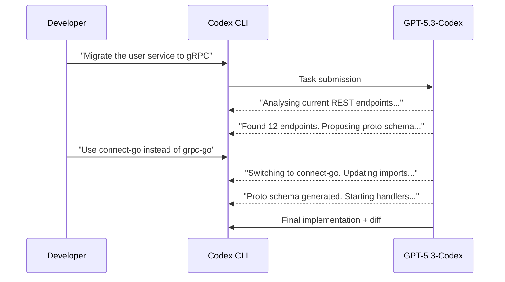
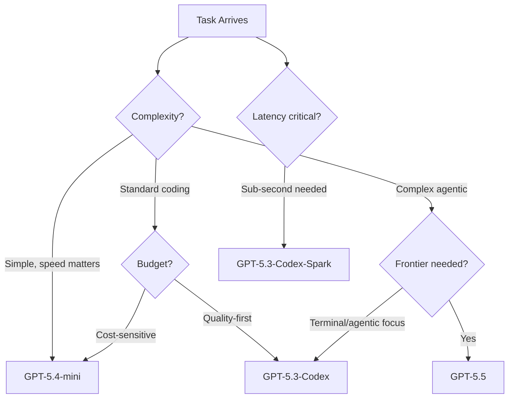

# GPT-5.3-Codex Deep Dive: Benchmarks, CLI Configuration, and Interactive Coding Workflows


---

GPT-5.3-Codex landed on 5 February 2026 as OpenAI's flagship coding model, promising industry-leading agentic performance alongside a 25 % speed improvement [^1]. Three months on, the model sits in a crowded lineup—GPT-5.4, GPT-5.4-mini, GPT-5.5, and the Cerebras-powered Spark variant all compete for the `model =` slot in your `config.toml`. This article dissects the benchmark numbers, walks through CLI configuration for daily use, and examines the interactive coding mode that makes GPT-5.3-Codex qualitatively different from its predecessors.

---

## Benchmark Performance: Where GPT-5.3-Codex Actually Excels

The headline SWE-Bench Pro score—56.8 % versus GPT-5.2-Codex's 56.4 %—is a 0.4-point delta that barely registers [^2]. The real story is elsewhere.

| Benchmark | GPT-5.3-Codex | GPT-5.2-Codex | Delta |
|---|---|---|---|
| SWE-Bench Pro (Public) | 56.8 % | 56.4 % | +0.4 |
| Terminal-Bench 2.0 | 77.3 % | 64.0 % | **+13.3** |
| OSWorld-Verified | 64.7 % | 38.2 % | **+26.5** |
| Cybersecurity CTF | 77.6 % | 67.4 % | +10.2 |
| SWE-Lancer IC Diamond | 81.4 % | 76.0 % | +5.4 |
| GDPval (wins or ties) | 70.9 % | 70.9 % | 0.0 |

*Sources: OpenAI GPT-5.3-Codex announcement [^1], independent analysis [^2]*

### Reading the Numbers

**Terminal-Bench 2.0** (+13.3 points) measures complex terminal operations: multi-step shell workflows, piped command chains, and system administration tasks [^2]. A 13-point gain means GPT-5.3-Codex reliably handles terminal sequences that previously required human intervention—directly relevant to anyone running `codex exec` in CI/CD pipelines.

**OSWorld-Verified** (+26.5 points) evaluates computer-use tasks requiring multi-step reasoning across GUI and terminal environments [^3]. At 64.7 %, GPT-5.3-Codex sits within striking distance of the human baseline (~72 %), making it the first Codex model to approach human-level computer operation [^3].

**SWE-Bench Pro** spans four programming languages rather than Python alone, testing production-style engineering across diverse codebases [^2]. The near-flat improvement here suggests GPT-5.3-Codex's gains are concentrated in agentic capability—tool use, long-horizon planning, and environmental interaction—rather than raw code generation.

### Token Efficiency

OpenAI claims GPT-5.3-Codex achieves its SWE-Bench Pro scores "with fewer output tokens than any prior model" [^1]. For teams billing by token, this matters: equivalent quality at lower cost per task. Combined with the 25 % inference speed improvement, the model delivers a meaningful reduction in both wall-clock time and spend per `codex exec` invocation.

---

## CLI Configuration: Setting Up GPT-5.3-Codex

### Basic Model Selection

Set GPT-5.3-Codex as your default in `~/.codex/config.toml`:

```toml
model = "gpt-5.3-codex"
```

Or specify it per-invocation:

```bash
codex --model gpt-5.3-codex "Refactor the auth middleware"
```

Mid-session switching is available via the TUI:

```
/model gpt-5.3-codex
```

### Reasoning Effort Tuning

GPT-5.3-Codex supports the full reasoning effort spectrum. A practical configuration separates planning from execution:

```toml
model = "gpt-5.3-codex"
model_reasoning_effort = "medium"
plan_mode_reasoning_effort = "high"
model_reasoning_summary = "concise"
```

This gives you deep reasoning during plan formulation (where correctness matters most) and efficient execution during implementation [^4]. The `xhigh` setting is available but model-dependent—test it on your specific workloads before committing to the token overhead.

### Profile-Based Model Switching

For teams that need different models for different contexts, profiles allow per-project overrides:

```toml
[profiles.deep]
model = "gpt-5.3-codex"
model_reasoning_effort = "high"

[profiles.fast]
model = "gpt-5.4-mini"
model_reasoning_effort = "low"

[profiles.frontier]
model = "gpt-5.5"
model_reasoning_effort = "medium"
```

Launch with a profile:

```bash
codex --profile deep "Analyse the payment service for race conditions"
```

### Context Window and Compaction

GPT-5.3-Codex operates within the standard context window configurable via `model_context_window` [^5]. For long sessions, tune the compaction threshold:

```toml
model_context_window = 128000
model_auto_compact_token_limit = 64000
tool_output_token_limit = 12000
```

The model's improved token efficiency means sessions run longer before hitting compaction triggers—a tangible benefit for complex refactoring tasks that span many files.

---

## Interactive Coding Mode: The Qualitative Shift

### From Command-Response to Collaboration

GPT-5.3-Codex introduced a fundamentally different interaction pattern. Rather than submitting a prompt and waiting for a final output, the model provides continuous progress updates, discusses its approach, and accepts mid-execution steering [^6].



This mid-task steering capability means you catch architectural missteps early rather than reviewing a completed (but wrong) implementation [^6].

### Enabling Follow-Up Behaviour

In the Codex app, interactive mode is toggled via **Settings > General > Follow-up behavior** [^6]. In the CLI, the behaviour is active by default—the model streams progress updates to the TUI, and you can type follow-up instructions at any point during execution.

### Practical Patterns

**Checkpoint-and-redirect**: Let the model work until it surfaces its plan, then adjust before implementation begins. This avoids wasted tokens on incorrect approaches.

**Narrowing scope**: Start with a broad instruction ("Improve error handling across the API layer"), observe which files the model targets, then constrain: "Focus on the payment endpoints only, skip the admin routes."

**Confirm-before-destructive**: For operations that modify database schemas or configuration files, the interactive mode lets you verify the model's understanding of the current state before it writes changes.

---

## GPT-5.3-Codex vs the Current Lineup

With five models now available in Codex CLI, model selection is a genuine engineering decision [^7]:



| Model | Sweet Spot | Trade-off |
|---|---|---|
| GPT-5.5 | Complex multi-step, research, computer use | Highest cost per token |
| GPT-5.4 | General professional coding | Superseded by 5.5 where available |
| GPT-5.4-mini | Fast subagent tasks, simple edits | Lower ceiling on complex reasoning |
| GPT-5.3-Codex | Terminal-heavy, agentic workflows, CI/CD | Narrower than 5.5 on general tasks |
| GPT-5.3-Codex-Spark | Real-time iteration, pair programming | Text-only, 128k context, Pro-only [^8] |

### When GPT-5.3-Codex Still Wins

Despite GPT-5.5's arrival, GPT-5.3-Codex remains the pragmatic choice for:

- **CI/CD pipelines** where the Terminal-Bench advantage translates to more reliable `codex exec` runs [^2]
- **Cost-conscious teams** where token efficiency matters more than frontier capability
- **Terminal-native workflows** where the 77.3 % Terminal-Bench score directly maps to daily usage
- **Agentic automation** where long-horizon tool use outweighs raw generation quality

---

## GPT-5.3-Codex-Spark: The Cerebras Variant

Released alongside GPT-5.3-Codex, the Spark variant runs on Cerebras Wafer-Scale Engine 3 hardware, delivering over 1,000 tokens per second [^8]. This is OpenAI's first model not running on Nvidia infrastructure.

### Current Limitations

- **Text-only**: No image input or generation
- **128k context window**: Adequate for most sessions but constrained for massive monorepo operations
- **Research preview**: Available only to ChatGPT Pro subscribers
- **No API access**: Currently limited to the app, CLI, and VS Code extension [^8]

### CLI Configuration

```toml
model = "gpt-5.3-codex-spark"
```

Spark excels at rapid iteration loops—the sub-100ms latency makes the CLI feel like an extension of your own typing rather than a request-response cycle. Pair it with low reasoning effort for maximum speed:

```toml
model = "gpt-5.3-codex-spark"
model_reasoning_effort = "low"
```

⚠️ Spark's speed advantage is most pronounced for short, focused tasks. For multi-file refactoring or complex architectural work, the full GPT-5.3-Codex or GPT-5.5 will produce better results despite higher latency.

---

## Non-Interactive Automation with GPT-5.3-Codex

The Terminal-Bench improvements make GPT-5.3-Codex particularly effective in `codex exec` pipelines:

```bash
# CI/CD: generate a migration summary with structured output
codex exec \
  --model gpt-5.3-codex \
  --json \
  --output-schema '{"type":"object","properties":{"breaking_changes":{"type":"array","items":{"type":"string"}},"risk_level":{"type":"string","enum":["low","medium","high"]},"summary":{"type":"string"}},"required":["breaking_changes","risk_level","summary"]}' \
  "Analyse the diff in this PR and identify breaking changes" < pr_diff.txt
```

The `--output-schema` flag enforces a JSON shape on the final response, making downstream pipeline integration deterministic [^9]. GPT-5.3-Codex's improved terminal comprehension means fewer malformed outputs and more reliable schema conformance compared to earlier models.

### Structured Output for Release Automation

```bash
codex exec \
  --model gpt-5.3-codex \
  -e medium \
  --output-last-message \
  "Generate release notes from the git log since the last tag" \
  2>/dev/null
```

The `-e medium` flag sets reasoning effort inline, useful when you want different effort levels per pipeline stage without maintaining separate config files [^4].

---

## Recommendations

1. **Default to GPT-5.5** for interactive development where budget permits—it subsumes GPT-5.3-Codex's capabilities and adds computer use, multimodal input, and stronger planning [^7].

2. **Use GPT-5.3-Codex for CI/CD** where the Terminal-Bench advantage and token efficiency directly reduce pipeline cost and failure rate.

3. **Reserve Spark for rapid iteration** cycles—linting, small fixes, quick explanations—where latency matters more than depth.

4. **Set `plan_mode_reasoning_effort = "high"`** regardless of which model you choose. Planning quality disproportionately affects overall task success.

5. **Profile your actual costs.** GPT-5.3-Codex's token efficiency claim is aggregate; your specific workloads may differ. Use `codex exec --json` to capture per-task token counts and build your own cost model [^9].

---

## Citations

[^1]: [Introducing GPT-5.3-Codex — OpenAI](https://openai.com/index/introducing-gpt-5-3-codex/) — Official announcement, 5 February 2026
[^2]: [GPT-5.3-Codex Performance Analysis: SWE-Bench Pro, Terminal-Bench 2.0, OSWorld Results — Pooya Golchian](https://pooya.blog/blog/gpt-5-3-codex-autonomous-coding-agent-2026/) — Independent benchmark analysis
[^3]: [GPT-5.3 Codex: Features, Benchmarks, and Migration Guide — Digital Applied](https://www.digitalapplied.com/blog/gpt-5-3-codex-release-features-benchmarks-guide) — Technical deep dive with benchmark tables
[^4]: [Configuration Reference — Codex CLI — OpenAI Developers](https://developers.openai.com/codex/config-reference) — Official config.toml reference
[^5]: [Sample Configuration — Codex CLI — OpenAI Developers](https://developers.openai.com/codex/config-sample) — Complete sample config.toml
[^6]: [GPT-5.3-Codex Powers Interactive Coding Agents — Auto-Post](https://auto-post.io/blog/gpt-5-3-codex-powers-interactive-coding-agents) — Interactive mode analysis
[^7]: [Models — Codex — OpenAI Developers](https://developers.openai.com/codex/models) — Current model lineup and recommendations
[^8]: [Introducing GPT-5.3-Codex-Spark — OpenAI](https://openai.com/index/introducing-gpt-5-3-codex-spark/) — Spark variant announcement
[^9]: [Non-interactive mode — Codex — OpenAI Developers](https://developers.openai.com/codex/noninteractive) — codex exec and structured output documentation
