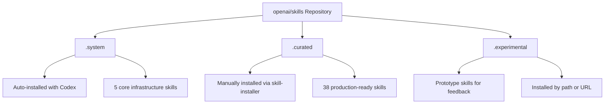
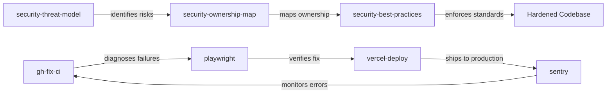

# The Official OpenAI Skills Catalogue: System, Curated, and Experimental Skills for Codex CLI


OpenAI maintains a public skills catalogue at [openai/skills](https://github.com/openai/skills) — a repository of packaged agent instructions, scripts, and resources that extend Codex CLI with task-specific capabilities [^1]. With 19,000+ stars and 38 curated skills at the time of writing, it has become the canonical source for production-ready agent workflows. Yet many Codex CLI users remain unaware it exists, or how the three-tier taxonomy — system, curated, and experimental — maps onto their daily work.

This article examines the catalogue's architecture, walks through installing and using its most practical skills, and covers the patterns worth adopting when building your own.

## The Three-Tier Taxonomy

The repository organises skills into three directories, each representing a maturity level [^2]:



### System Skills (`.system`)

These ship bundled with Codex and require no installation. As of v0.130.0, five system skills exist [^3]:

| Skill | Purpose |
|-------|---------|
| `skill-installer` | Installs curated and external skills from GitHub |
| `skill-creator` | Guides agents through building well-structured SKILL.md files |
| `plugin-creator` | Converts skills into distributable plugins |
| `openai-docs` | Structured access to OpenAI documentation |
| `imagegen` | Image generation via the OpenAI Images API |

The `skill-installer` is the gateway to everything else — invoke it with `$skill-installer` inside any Codex session to browse and install catalogue skills.

### Curated Skills (`.curated`)

These are production-ready workflows that have passed OpenAI's review. They require explicit installation but are stable enough for daily use. The 38 curated skills span several categories [^1]:

**GitHub Integration:**
- `gh-fix-ci` — inspects failing GitHub Actions checks, fetches logs, summarises root causes, drafts a fix plan, and implements only after approval [^4]
- `gh-address-comments` — resolves PR review comments systematically

**Deployment:**
- `cloudflare-deploy` — deploys to Cloudflare Workers and Pages
- `vercel-deploy` — deploys to Vercel
- `netlify-deploy` — deploys to Netlify
- `render-deploy` — deploys to Render

**Design-to-Code (Figma Suite):**
- `figma`, `figma-implement-design`, `figma-create-design-system-rules`, `figma-generate-design`, `figma-generate-library`, `figma-create-new-file`, `figma-code-connect-components`, `figma-use` — a comprehensive set for Figma-driven workflows

**Productivity:**
- `linear` — Linear issue management
- `notion-knowledge-capture`, `notion-meeting-intelligence`, `notion-research-documentation`, `notion-spec-to-implementation` — Notion integration suite
- `sentry` — production error triage

**Security:**
- `security-best-practices`, `security-ownership-map`, `security-threat-model` — a three-skill security workflow stack

**Testing:**
- `playwright`, `playwright-interactive` — browser automation and testing
- `screenshot` — captures screenshots for visual verification

**Content & Media:**
- `pdf` — PDF parsing and analysis
- `speech`, `transcribe` — audio generation and transcription
- `jupyter-notebook` — notebook workflows for data analysis

**Other:**
- `migrate-to-codex` — migrates sessions and configuration from Claude Code and other agents [^5]
- `openai-docs` — documentation access (also in `.system`)
- `cli-creator` — builds CLI tools
- `chatgpt-apps` — creates ChatGPT integrations
- `aspnet-core` — ASP.NET Core development
- `winui-app` — Windows UI applications
- `hatch-pet`, `yeet` — playful demonstration skills

### Experimental Skills (`.experimental`)

Prototype skills for testing and community feedback. Notable examples include `create-plan`, which generates structured implementation plans [^6]. These are not guaranteed stable and may change without notice.

## Installing Skills

### Curated Skills by Name

The simplest path — invoke the skill-installer with just the skill name:

```bash
# Inside a Codex CLI session
$skill-installer gh-fix-ci
```

This fetches the skill from `skills/.curated/gh-fix-ci` on the `main` branch of `openai/skills` and installs it to `$CODEX_HOME/skills/` (defaulting to `~/.codex/skills/`) [^7].

### Experimental Skills by Path

Reference the experimental folder explicitly:

```bash
$skill-installer install the create-plan skill from the .experimental folder
```

The installer accepts natural language and resolves it to the correct repository path [^7].

### External Skills by URL

Any GitHub-hosted skill can be installed via URL:

```bash
$skill-installer install https://github.com/openai/skills/tree/main/skills/.experimental/create-plan
```

### Advanced Options

The underlying `install-skill-from-github.py` script supports additional flags [^7]:

```bash
python install-skill-from-github.py \
  --ref v1.2.0 \          # Pin to a specific branch/tag/commit
  --dest /custom/path \   # Override installation directory
  --method git \           # Force git sparse checkout (for private repos)
  --name my-skill          # Override the skill directory name
```

For private repositories, set `GITHUB_TOKEN` or `GH_TOKEN` before installation. The installer attempts a ZIP download first, falling back to `git clone --sparse` if authentication is required [^7].

### Post-Installation

Restart Codex to activate newly installed skills. Verify with:

```bash
$skill-installer list
```

Skills marked `(already installed)` are ready to use. ⚠️ Installation aborts if the target directory already exists — remove the existing skill directory before reinstalling.

## Anatomy of a Well-Built Skill

Every skill follows the same structure [^8]:

```
my-skill/
├── SKILL.md              # Required: name, description, instructions
├── agents/
│   └── openai.yaml       # Recommended: invocation policies, tool deps
├── scripts/              # Optional: deterministic shell operations
├── references/           # Optional: documentation, examples
└── assets/               # Optional: templates, images
```

### The SKILL.md File

The frontmatter is routing metadata — Codex reads skill descriptions to decide when to activate them [^9]:

```markdown
---
name: gh-fix-ci
description: >
  Inspect failing GitHub Actions checks, fetch logs, summarise failures,
  draft a fix plan, and implement only after explicit approval.
  Use when: a PR has failing CI checks from GitHub Actions.
  Do not use for: external CI providers like Buildkite or CircleCI.
---

## Instructions

1. Verify `gh` CLI authentication via `gh auth status`
2. Resolve the current branch's PR or accept a user-provided number
3. Run the bundled inspection script...
```

Note the `description` field specifies both when the skill applies and when it does not. This is critical for implicit activation — Codex uses this field as routing metadata, not just documentation [^9].

### Progressive Disclosure

Codex loads skill names and descriptions eagerly but defers full SKILL.md instructions until a skill is selected [^8]. The system caps the initial skills list at approximately 8,000 characters to prevent context overflow — if many skills are installed, Codex shortens descriptions automatically [^8]. This makes concise, precise descriptions essential.

### Scripts vs Instructions

The OpenAI Agents SDK case study provides a useful heuristic [^9]:

> Repetitive shell operations live in skill scripts; interpretation, comparison, and reporting stay with the model.

The `gh-fix-ci` skill exemplifies this pattern: its `scripts/inspect_pr_checks.py` handles the deterministic work of fetching logs and extracting error snippets, while the SKILL.md instructions guide the model through analysis, plan drafting, and approval gating [^4].

## Composing Skills

The real power emerges when skills compose. The security suite demonstrates this — `security-threat-model` identifies risks, `security-ownership-map` maps code ownership boundaries, and `security-best-practices` enforces standards. Used together, they form a governance stack [^10].



Similarly, a CI-to-production loop might chain `gh-fix-ci` → `playwright` → `vercel-deploy` → `sentry`, with each skill handling its bounded domain.

## Building Skills for the Catalogue

If you are building skills intended for team or community use, the patterns from the curated catalogue are worth following:

1. **One skill, one job** — keep skills focused on a single workflow rather than bundling multiple capabilities [^8]
2. **Gate destructive actions** — skills like `gh-fix-ci` require explicit approval before implementing fixes [^4]
3. **Bundle validation scripts** — deterministic checks belong in `scripts/`, not in prompt instructions [^9]
4. **Specify activation boundaries** — the `description` field should state both when to use and when not to use the skill [^8]
5. **Support automation** — scripts should exit with non-zero status on failure for CI integration [^4]

The `skill-creator` system skill can guide you through this process interactively — invoke it with `$skill-creator` in any Codex session [^3].

## Discovery and the Wider Ecosystem

Beyond the official catalogue, community skill directories have emerged. The [awesome-agent-skills](https://github.com/VoltAgent/awesome-agent-skills) repository catalogues 1,000+ skills across Codex, Claude Code, Gemini CLI, Cursor, and other agents [^11]. The [awesome-codex-skills](https://github.com/ComposioHQ/awesome-codex-skills) repository focuses specifically on Codex workflows [^12].

Skills follow the open agent skills standard, meaning a well-structured SKILL.md can work across multiple agent platforms — though tool dependencies and script runtime assumptions may differ between agents [^8].

## Practical Recommendations

For teams adopting the skills catalogue:

- **Start with `gh-fix-ci`** — it delivers immediate value on any repository with GitHub Actions, and its approval-gated pattern demonstrates safe skill design
- **Install the security triple** (`security-best-practices`, `security-ownership-map`, `security-threat-model`) as a baseline governance layer
- **Pin skill versions** with `--ref` when stability matters — the `main` branch moves frequently
- **Audit installed skills** periodically — skills have filesystem and potentially network access within the Codex sandbox
- **Contribute upstream** — the contributing guidelines are lightweight, and the catalogue benefits from real-world workflow patterns [^13]

## Citations

[^1]: [OpenAI Skills Catalog for Codex — GitHub Repository](https://github.com/openai/skills)
[^2]: [Agent Skills — Codex | OpenAI Developers](https://developers.openai.com/codex/skills)
[^3]: [System Skills — openai/skills `.system` directory](https://github.com/openai/skills/tree/main/skills/.system)
[^4]: [gh-fix-ci Curated Skill — SKILL.md](https://github.com/openai/skills/blob/main/skills/.curated/gh-fix-ci/SKILL.md)
[^5]: [migrate-to-codex Curated Skill](https://github.com/openai/skills/tree/main/skills/.curated/migrate-to-codex)
[^6]: [create-plan Experimental Skill](https://github.com/openai/skills/tree/main/skills/.experimental/create-plan)
[^7]: [Installing Skills — openai/skills | DeepWiki](https://deepwiki.com/openai/skills/3.1-installing-skills)
[^8]: [Agent Skills Documentation — Codex | OpenAI Developers](https://developers.openai.com/codex/skills)
[^9]: [Using Skills to Accelerate OSS Maintenance — OpenAI Developers Blog](https://developers.openai.com/blog/skills-agents-sdk)
[^10]: [The Ultimate Codex Skills Directory — RZLT](https://www.rzlt.io/blog/the-ultimate-openai-codex-skills-directory---2026)
[^11]: [awesome-agent-skills — VoltAgent | GitHub](https://github.com/VoltAgent/awesome-agent-skills)
[^12]: [awesome-codex-skills — Composio | GitHub](https://github.com/ComposioHQ/awesome-codex-skills)
[^13]: [Contributing Guidelines — openai/skills](https://github.com/openai/skills/blob/main/contributing.md)
