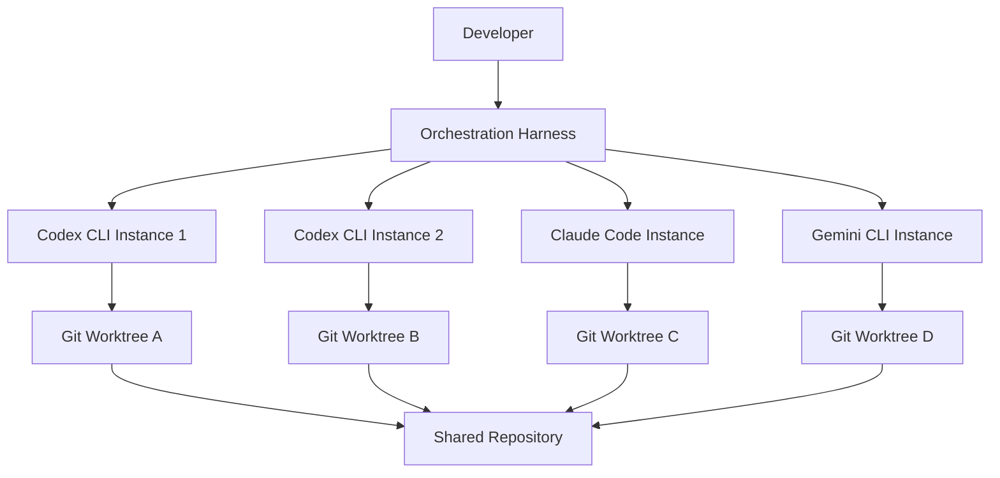

# Tokenmaxxing with Codex CLI: Multi-Agent Operator Stacks, Parallel Harnesses, and the End of Single-Tool Identity


---

In May 2026, four independent signals converged on the same pattern in a single news cycle: YC's Lightcone podcast coined the term "tokenmaxxing" [^1], OpenAI shipped Codex into Chrome with parallel-tab background execution [^2], GitHub's trending board surfaced three multi-agent routing tools in a week [^3], and a dev.to article documenting the Codex + Claude Code operator stack went viral [^4]. The message was clear: the era of single-tool loyalty is over. Senior developers now run multiple coding agents simultaneously, routing tasks across them through orchestration harnesses that treat token throughput — not headcount — as the primary productivity metric.

This article examines the tokenmaxxing pattern from a practitioner's perspective, covering the architecture of multi-agent operator stacks, the harness tooling that makes them work, and the Codex CLI configuration required to participate.

## What Is Tokenmaxxing?

Tokenmaxxing reframes developer productivity around a new unit of measure: **tokens deployed per developer per week** [^1]. Rather than choosing between Codex CLI and Claude Code, operators run both (and often Gemini CLI alongside them), dispatching tasks to whichever agent handles them best. A routing harness arbitrates between agents, selects outputs, and manages credential rotation when rate limits are hit.

The term deliberately echoes "looksmaxxing" — it is about maximising a single measurable axis (token throughput) with deliberate, systematic effort. As the YC Lightcone discussion framed it, one founder plus an agent harness can accomplish work previously requiring hundreds of engineers [^1].

## The Operator Stack Architecture

A typical tokenmaxxing stack has three layers:



### Layer 1: The Agents

Each agent operates in its own Git worktree, providing filesystem isolation without duplicating repository history [^5]. Codex CLI's `--add-dir` flag and worktree support make this straightforward:

```bash
# Create isolated worktrees for parallel agents
git worktree add ../codex-agent-1 -b feat/auth-refactor
git worktree add ../codex-agent-2 -b feat/api-validation

# Launch Codex CLI in each worktree
cd ../codex-agent-1 && codex --approval-mode suggest "Refactor auth middleware to use JWT rotation"
cd ../codex-agent-2 && codex --approval-mode suggest "Add OpenAPI validation to all API endpoints"
```

For non-interactive automation, `codex exec` provides the scriptable primitive [^6]:

```bash
codex exec --json \
  --sandbox workspace-write \
  "Implement retry logic with exponential backoff for all HTTP clients" \
  2>progress.log | jq '.result'
```

### Layer 2: The Routing Harness

The harness layer is where tokenmaxxing diverges from simply running multiple terminals. Three open-source tools have emerged as the primary routing solutions:

**CC-Switch** (`cc-switch-cli`) is a cross-platform desktop application that manages Claude Code, Codex, Gemini CLI, and OpenCode from a unified interface [^3]. It provides smart routing logic that redirects requests between premium, low-cost, and free providers based on quotas and availability. Configuration is visual rather than file-based, which suits operators who want rapid provider switching without editing TOML files.

**9Router** acts as a universal AI proxy, sitting between your CLI tools and their respective APIs [^7]. When one provider hits a rate limit, 9Router auto-switches to alternative accounts. Its React-powered dashboard monitors all API calls in real time, providing the observability layer that raw multi-terminal workflows lack. Installation is a single command:

```bash
npx 9router
# Dashboard launches on port 20128
```

**Claude Codex Bridge** (`claude_codex_bridge`) takes a fundamentally different approach: rather than routing at the API level, it creates a shared communication layer where agents can discover each other, delegate work, and broadcast updates [^8]. Named agents use `/ask` to query each other, enabling patterns like having Claude Code handle architectural decisions whilst Codex CLI handles implementation:

```bash
# Start a bridge session with named agents
ccb start --agents codex:implementer,claude:architect
```

### Layer 3: Isolation and Merge

Every parallel agent needs its own workspace. Codex CLI's worktree support provides Git-native isolation [^5], but the merge step is where most operators report friction. The practical pattern is:

1. Each agent works on its own feature branch within a dedicated worktree
2. Agents commit atomically — small, focused commits with clear messages
3. The operator reviews diffs and merges selectively
4. Conflicts are resolved manually or delegated back to an agent

## Codex CLI Configuration for Multi-Agent Stacks

Running multiple Codex CLI instances requires specific configuration to avoid resource contention.

### Profile-Based Model Routing

Use Codex CLI profiles to assign different models to different task types [^9]:

```toml
# ~/.codex/config.toml

[profile.heavy]
model = "gpt-5.5"
reasoning_effort = "high"

[profile.fast]
model = "gpt-5.3-codex"
reasoning_effort = "medium"
service_tier = "fast"

[profile.cheap]
model = "gpt-5.4-mini"
reasoning_effort = "low"
```

Launch different instances with different profiles:

```bash
# Heavy lifting: complex refactoring
codex --profile heavy exec "Decompose the monolith payment service into three microservices"

# Fast iteration: test writing
codex --profile fast exec "Write property-based tests for the validation module"

# Cheap background: documentation
codex --profile cheap exec "Update README and API docs to reflect the new service boundaries"
```

### Subagent Delegation

Codex CLI's native subagent system provides built-in parallelisation without external harnesses [^10]. Configure subagents in `config.toml`:

```toml
[[agents]]
name = "test-writer"
model = "gpt-5.4-mini"
instructions = "You write comprehensive test suites. Focus on edge cases and error paths."

[[agents]]
name = "reviewer"
model = "gpt-5.5"
instructions = "You review code for security issues, performance problems, and maintainability."
```

The main agent can then delegate to these subagents during a session, and each subagent runs with its own context window and model allocation.

### Token Budget Management

When running multiple instances against the same account, token budgets become critical. Codex CLI's `/status` command reports current token usage per session [^11], and `codex exec --json` streams `turn.completed` events that include `input_tokens`, `cached_input_tokens`, and `output_tokens` fields — essential for cost tracking across a parallel pipeline [^6].

For operators on Plus plans, the five-hour rolling window applies across all surfaces [^12]. Running four parallel Codex CLI instances drains the allowance four times faster. Pro 5x or 20x tiers, or API key authentication with pay-per-token billing, are the practical solutions for sustained parallel workloads.

## The Skills Composability Advantage

The tokenmaxxing pattern exposes a crucial insight: **prompts do not compose; skills do** [^4]. When routing tasks across multiple agents, reusable skill definitions provide consistency that ad-hoc prompting cannot.

Codex CLI's SKILL.md format bundles instructions, scripts, and hooks into portable units [^13]. A skill installed via `codex skill-installer` works identically whether invoked by a human operator, a subagent, or a CI pipeline. This portability matters in multi-agent stacks where the same task might be dispatched to Codex CLI or Claude Code depending on availability.

```bash
# Install a skill that works across sessions and instances
codex skill-installer install gh-fix-ci
```

The `openai/skills` repository provides 38 curated skills covering common development tasks [^13], and community directories like Composio's `awesome-codex-skills` extend the catalogue further.

## Architectural Prerequisites

Tokenmaxxing exposes architectural debt ruthlessly [^4]. When eight parallel agents work against the same codebase, well-structured repositories with clear module boundaries finish tasks cleanly. Monolithic codebases with tight coupling create merge conflicts, context confusion, and agents stepping on each other's work.

The practical prerequisites for effective multi-agent operation:

- **Clear module boundaries**: agents need ownership scopes that do not overlap
- **Comprehensive test suites**: automated verification replaces human review at scale
- **Consistent AGENTS.md**: every agent reads the same conventions [^14]
- **Small, focused tasks**: decompose work into units that fit a single agent session
- **Worktree isolation**: never run two agents against the same working directory

## When Not to Tokenmaxx

Multi-agent stacks add genuine complexity. The orchestration harness is another dependency to maintain. Credential rotation across providers increases the attack surface. Cost tracking across multiple models and tiers requires dedicated tooling.

For individual contributors working on a single feature, a single Codex CLI instance with appropriate model selection remains the simpler and more effective choice. Tokenmaxxing delivers returns when:

- The task backlog contains many independent, parallelisable items
- Rate limits on a single provider are the bottleneck
- The codebase architecture supports isolated work streams
- The operator has the context to review and merge outputs from multiple agents

## What This Displaces

The shift from "I use Codex" or "I use Claude Code" as professional identity to stack-shaped thinking is the most significant cultural change in the coding agent ecosystem since Codex CLI launched [^4]. The model is no longer the product — the orchestration layer is.

For Codex CLI practitioners, this means treating the CLI as one component in a larger system rather than the entire workflow. The CLI's strengths — terminal-native operation, Unix pipeline integration, `codex exec` for automation, native subagent delegation — make it the natural anchor for operator stacks. But the operators who ship fastest in May 2026 are the ones who stopped asking "which tool is best?" and started asking "how do I route the right task to the right agent at the right time?"

## Citations

[^1]: YC Lightcone Podcast, "Tokenmaxxing" discussion, May 2026. Referenced in [Tokenmaxxing: Codex + Claude Code Operator Stack 2026](https://dev.to/max_quimby/tokenmaxxing-codex-claude-code-operator-stack-2026-318)
[^2]: OpenAI, "Codex for Chrome Extension", May 7, 2026. [Codex Changelog](https://developers.openai.com/codex/changelog)
[^3]: CC-Switch CLI, cross-platform multi-agent manager. [GitHub Repository](https://github.com/saladday/cc-switch-cli)
[^4]: Max Quimby, "Tokenmaxxing: Codex + Claude Code Operator Stack 2026", dev.to, May 2026. [Article](https://dev.to/max_quimby/tokenmaxxing-codex-claude-code-operator-stack-2026-318)
[^5]: OpenAI, "Worktrees — Codex", Codex App Features documentation. [Worktrees Docs](https://developers.openai.com/codex/app/worktrees)
[^6]: OpenAI, "Non-interactive mode — Codex", `codex exec` documentation. [Non-interactive Mode](https://developers.openai.com/codex/noninteractive)
[^7]: 9Router, universal AI proxy for Claude Code, Codex, and Cursor. [Agent Skills Listing](https://agent-skills.cc/skills/decolua-9router)
[^8]: Claude Codex Bridge, multi-AI collaboration with persistent context. [GitHub Repository](https://github.com/bfly123/claude_codex_bridge)
[^9]: OpenAI, "Configuration Reference — Codex", profile and model configuration. [Config Reference](https://developers.openai.com/codex/config-reference)
[^10]: OpenAI, "Subagents — Codex", subagent configuration and delegation. [Subagents Docs](https://developers.openai.com/codex/subagents)
[^11]: OpenAI, "Features — Codex CLI", `/status` command and context reporting. [CLI Features](https://developers.openai.com/codex/cli/features)
[^12]: OpenAI, "Pricing — Codex", plan tiers and usage windows. [Pricing](https://developers.openai.com/codex/pricing)
[^13]: OpenAI, "Agent Skills — Codex", skill installation and the official skills catalogue. [Skills Docs](https://developers.openai.com/codex/skills)
[^14]: OpenAI, "Custom instructions with AGENTS.md — Codex", project-level agent conventions. [AGENTS.md Guide](https://developers.openai.com/codex/guides/agents-md)
