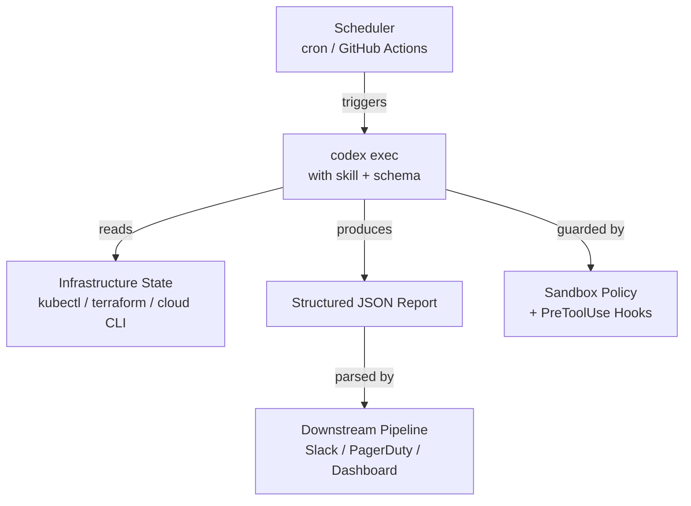

# Codex CLI for Day-Two Operations: Runbooks, Drift Detection, and Platform Engineering Automation


---

Most Codex CLI coverage focuses on writing and reviewing code. But senior platform engineers and SREs have a different problem: the grind of day-two operations — health checks, configuration drift detection, certificate renewals, compliance scans, and the hundred other tasks that keep production running. Codex CLI's non-interactive `codex exec` mode, combined with the skills system and structured output, turns these operational workflows into reproducible, auditable agent-driven pipelines.

This article maps out the patterns, safety constraints, and practical recipes for using Codex CLI as an operational runbook engine.

## Why Codex CLI for Operations?

Traditional runbooks — whether wiki pages or Ansible playbooks — suffer from two problems: they go stale, and they lack the judgement to handle edge cases. Codex CLI sits in a useful middle ground. It can execute shell commands, interpret their output, reason about anomalies, and produce structured reports — all without the overhead of building and maintaining a bespoke automation framework.

The key enablers, all stable as of Codex CLI v0.130.0 [^1], are:

- **`codex exec`** — non-interactive, single-shot execution with meaningful exit codes [^2]
- **Skills** — reusable SKILL.md instruction packs discovered automatically [^3]
- **`--output-schema`** — structured JSON output conforming to a schema [^2]
- **Sandbox policies** — `read-only` (default), `workspace-write`, and `danger-full-access` [^2]
- **Hooks** — PreToolUse and PostToolUse lifecycle events for guardrails [^4]

## Architecture: The Operational Runbook Stack



The scheduler fires `codex exec` with a specific skill and output schema. The agent reads infrastructure state through whichever CLI tools are available inside the sandbox, reasons about what it finds, and emits a structured report. Downstream tooling parses the JSON and routes alerts, updates dashboards, or files tickets.

## Writing Operational Skills

An operational skill follows the same SKILL.md conventions as any other [^3], but the description must make the operational context explicit so Codex loads it for the right tasks.

### Example: Infrastructure Drift Detection

```
.agents/skills/drift-check/
├── SKILL.md
├── scripts/
│   └── validate-report.sh
└── references/
    └── baseline-state.json
```

The SKILL.md:

```markdown
---
name: drift-check
description: >
  Detect infrastructure drift. Trigger when asked to check
  Terraform state, Kubernetes resource spec divergence,
  or cloud configuration baseline compliance.
---

## Objective

Compare live infrastructure state against the declared baseline
and report every deviation.

## Procedure

1. Run `terraform plan -detailed-exitcode -no-color` in the
   infrastructure directory. Exit code 2 means drift exists.
2. For each resource showing drift, extract the resource address,
   the expected value, and the actual value.
3. Run `kubectl diff -f k8s/` to detect Kubernetes manifest
   divergence.
4. Classify each deviation as CRITICAL (security group changes,
   IAM policy changes, storage encryption), WARNING (tag drift,
   scaling parameter changes), or INFO (annotation-only changes).
5. Produce the report as structured JSON matching the provided
   output schema.

## Constraints

- NEVER run `terraform apply` or `kubectl apply`.
- NEVER modify any infrastructure state.
- If a command fails, include the error in the report rather
  than retrying with elevated permissions.
```

### Example: Certificate Expiry Check

```markdown
---
name: cert-check
description: >
  Check TLS certificate expiry dates across domains and
  Kubernetes secrets. Trigger when asked about certificate
  health, expiry, or renewal status.
---

## Procedure

1. For each domain in the provided list, run
   `openssl s_client -connect <domain>:443 -servername <domain>`
   and extract the `notAfter` date.
2. For Kubernetes TLS secrets, run
   `kubectl get secrets -A -o json` filtered to type
   `kubernetes.io/tls`, decode the certificate, and extract
   expiry dates.
3. Flag any certificate expiring within 30 days as CRITICAL,
   within 90 days as WARNING.
4. Output the structured report.
```

## Output Schemas for Machine-Parseable Reports

The `--output-schema` flag constrains the agent's final response to a JSON Schema [^2]. This is essential for operational workflows where downstream tooling must parse the output reliably.

```json
{
  "$schema": "https://json-schema.org/draft/2020-12/schema",
  "title": "DriftReport",
  "type": "object",
  "required": ["timestamp", "status", "deviations"],
  "properties": {
    "timestamp": { "type": "string", "format": "date-time" },
    "status": { "enum": ["clean", "drifted", "error"] },
    "deviations": {
      "type": "array",
      "items": {
        "type": "object",
        "required": ["resource", "severity", "expected", "actual"],
        "properties": {
          "resource": { "type": "string" },
          "severity": { "enum": ["CRITICAL", "WARNING", "INFO"] },
          "expected": { "type": "string" },
          "actual": { "type": "string" },
          "detail": { "type": "string" }
        }
      }
    },
    "summary": { "type": "string" }
  }
}
```

Invoke it:

```bash
codex exec \
  --sandbox read-only \
  --output-schema ./schemas/drift-report.json \
  -o /tmp/drift-report.json \
  "Run the drift-check skill against the staging environment"
```

The `read-only` sandbox is deliberate — operational read tasks should never mutate state [^5].

## Sandbox Safety for Production Environments

The single most important decision for operational Codex workflows is the sandbox policy. The defaults are conservative by design [^5]:

| Sandbox Mode | Use Case | Risk |
|---|---|---|
| `read-only` (default) | Drift detection, health checks, compliance scans | Minimal — no writes possible |
| `workspace-write` | Generating reports, updating status files | Low — writes limited to repo |
| `danger-full-access` | ⚠️ Remediation actions, service restarts | High — full filesystem and network |

For day-two operations, **start with `read-only` and stay there** unless you have a compelling reason to escalate. When remediation is needed, split the workflow: the detection skill runs read-only and produces a report; a separate, human-approved step runs the fix.

### PreToolUse Hooks as Guardrails

Hooks provide an additional safety layer. A PreToolUse hook can deny specific commands before they execute [^4]:

```toml
[[hooks]]
event = "PreToolUse"
tool_name = "Bash"
command = "./.agents/hooks/deny-destructive-ops.sh"
timeout_ms = 5000
```

The hook script inspects the proposed command and returns a deny decision for anything destructive:

```bash
#!/bin/bash
# deny-destructive-ops.sh
COMMAND="$CODEX_TOOL_INPUT"
if echo "$COMMAND" | grep -qiE '(terraform apply|kubectl delete|kubectl apply|rm -rf)'; then
  echo '{"decision":"deny","permissionDecisionReason":"Destructive operation blocked by operational policy"}'
  exit 0
fi
echo '{"decision":"allow"}'
```

⚠️ Note: as of v0.130.0, PreToolUse hooks reliably fire for Bash tool calls but coverage for apply_patch and MCP tools remains incomplete (tracked at openai/codex#16732) [^6].

## Scheduling Patterns

### Cron with codex exec

For teams running Codex on a build server or operations host:

```bash
# /etc/cron.d/codex-drift-check
0 6 * * * ops-user cd /opt/infra-repo && \
  CODEX_TOKEN="$(cat /run/secrets/codex-key)" \
  codex exec \
    --sandbox read-only \
    --output-schema ./schemas/drift-report.json \
    --ephemeral \
    -o /tmp/drift-$(date +\%F).json \
    "Run drift-check against production" 2>>/var/log/codex-ops.log
```

The `--ephemeral` flag prevents session files accumulating on disk [^2].

### GitHub Actions


```yaml
name: Daily Infrastructure Drift Check
on:
  schedule:
    - cron: '0 6 * * 1-5'  # Weekday mornings

jobs:
  drift-check:
    runs-on: ubuntu-latest
    steps:
      - uses: actions/checkout@v4
      - uses: openai/codex-action@v1
        with:
          codex_token: ${{ secrets.CODEX_TOKEN }}
          prompt: "Run drift-check against staging"
          sandbox: read-only
          output_schema: ./schemas/drift-report.json
      - name: Parse and alert
        run: |
          STATUS=$(jq -r '.status' output.json)
          if [ "$STATUS" = "drifted" ]; then
            CRITICAL=$(jq '[.deviations[] | select(.severity=="CRITICAL")] | length' output.json)
            echo "::warning::Drift detected: $CRITICAL critical deviations"
          fi
```


The `codex-action` [^7] installs the CLI, starts the Responses API proxy, and runs `codex exec` with the specified permissions.

## Practical Runbook Catalogue

Here are operational skills that map well to the `codex exec` + structured output pattern:

### 1. Kubernetes Health Check

```bash
codex exec --sandbox read-only \
  --output-schema ./schemas/k8s-health.json \
  "Check all namespaces for pods in CrashLoopBackOff, \
   pending PVCs, and certificate-manager issuers with \
   errors. Classify by severity."
```

### 2. Dependency Vulnerability Audit

```bash
codex exec --sandbox workspace-write \
  --output-schema ./schemas/vuln-report.json \
  "Run Syft to generate an SBOM, then Grype to scan for \
   vulnerabilities. Report critical and high findings with \
   CVE IDs and affected packages."
```

Workspace-write is needed here because Syft generates an SBOM file [^8].

### 3. DNS and Endpoint Verification

```bash
codex exec --sandbox read-only \
  --output-schema ./schemas/endpoint-check.json \
  "For each domain in config/domains.txt, verify DNS \
   resolution, check HTTP response codes, measure \
   response times, and flag any anomalies."
```

### 4. Cloud Cost Anomaly Detection

```bash
codex exec --sandbox read-only \
  --output-schema ./schemas/cost-anomaly.json \
  "Using the AWS Cost Explorer CLI, compare today's \
   spend against the 7-day rolling average. Flag any \
   service where spend exceeds 150% of the average."
```

## Configuration Profiles for Operations

Named profiles in `config.toml` let you switch between development and operational configurations [^9]:

```toml
[profiles.ops-read]
model = "gpt-5.4"
model_reasoning_effort = "medium"
sandbox = "read-only"

[profiles.ops-audit]
model = "gpt-5.5"
model_reasoning_effort = "high"
sandbox = "read-only"
```

Invoke with:

```bash
codex exec --profile ops-read "Run the cert-check skill"
```

GPT-5.4 at medium reasoning is sufficient for most operational checks and keeps token costs low [^10]. Reserve GPT-5.5 at high reasoning for complex audit tasks that require deeper analysis.

## Exit Code Semantics for Pipeline Integration

`codex exec` returns meaningful exit codes [^2]:

- **0** — task completed successfully
- **Non-zero** — failure (timeout, model error, MCP initialisation failure, or agent-reported failure)

This makes it straightforward to gate downstream steps:

```bash
codex exec --sandbox read-only "Run drift-check" \
  --output-schema ./schemas/drift-report.json \
  -o /tmp/report.json

if [ $? -ne 0 ]; then
  echo "Drift check failed — escalating to on-call"
  pagerduty-cli trigger --severity critical
fi
```

## Limitations and Caveats

- **`--output-schema` and `--json` are silently ignored when MCP servers are active** in some configurations (tracked at openai/codex#15451) [^11]. Test your exact pipeline configuration before relying on it in production.
- **PreToolUse hooks do not fire for all tool types** — patches and some MCP calls bypass the hook engine [^6]. Do not treat hooks as a security boundary; use the sandbox policy as the primary enforcement layer.
- **Token costs accumulate** for scheduled runs. A typical drift check consumes 5,000–15,000 tokens per run. At GPT-5.4 rates, that is roughly \$0.10–\$0.30 per execution — negligible for daily runs, but it adds up with hourly schedules across multiple environments [^10].
- **Context window limits apply.** If your infrastructure state output is large (hundreds of resources), consider pre-filtering with shell commands in the skill instructions rather than passing everything to the model.

## Conclusion

Day-two operations are repetitive, judgemental, and high-stakes — exactly the workload profile where Codex CLI excels. The combination of `codex exec` for non-interactive execution, skills for reusable operational knowledge, `--output-schema` for machine-parseable reporting, and sandbox policies for safety constraints creates a practical operational runbook engine that senior platform engineers can adopt incrementally, starting with read-only health checks and expanding to more complex workflows as confidence grows.

---

## Citations

[^1]: [Codex CLI v0.130.0 Changelog — OpenAI Developers](https://developers.openai.com/codex/changelog) — May 2026 release notes confirming stable features.
[^2]: [Non-interactive mode — Codex CLI — OpenAI Developers](https://developers.openai.com/codex/noninteractive) — Official documentation for `codex exec`, flags, sandbox options, and output formats.
[^3]: [Agent Skills — Codex — OpenAI Developers](https://developers.openai.com/codex/skills) — Skills discovery, SKILL.md format, and directory structure reference.
[^4]: [Hooks — Codex — OpenAI Developers](https://developers.openai.com/codex/hooks) — PreToolUse and PostToolUse hook events, configuration, and lifecycle.
[^5]: [Agent Approvals & Security — Codex — OpenAI Developers](https://developers.openai.com/codex/agent-approvals-security) — Sandbox policies and approval modes.
[^6]: [ApplyPatchHandler doesn't emit PreToolUse/PostToolUse hook event — GitHub Issue #16732](https://github.com/openai/codex/issues/16732) — Tracking hook coverage gaps for non-Bash tools.
[^7]: [GitHub Action — Codex — OpenAI Developers](https://developers.openai.com/codex/github-action) — Official `openai/codex-action@v1` for CI/CD integration.
[^8]: [Codex CLI for Automated Dependency Auditing — Codex Blog](https://codex.danielvaughan.com/2026/05/14/codex-cli-dependency-auditing-licence-compliance-sbom-generation-supply-chain-policy/) — Syft as recommended SBOM generator with Codex CLI.
[^9]: [Configuration Reference — Codex — OpenAI Developers](https://developers.openai.com/codex/config-reference) — Named profiles, model selection, and sandbox configuration.
[^10]: [Pricing — Codex — OpenAI Developers](https://developers.openai.com/codex/pricing) — Token pricing by model tier.
[^11]: [--json and --output-schema silently ignored when tools/MCP servers are active — GitHub Issue #15451](https://github.com/openai/codex/issues/15451) — Known limitation with structured output and MCP.
