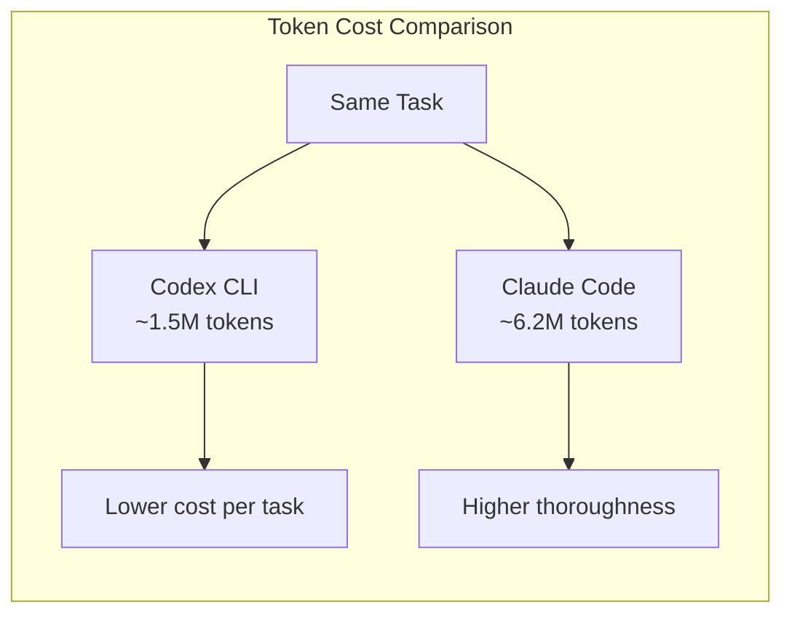
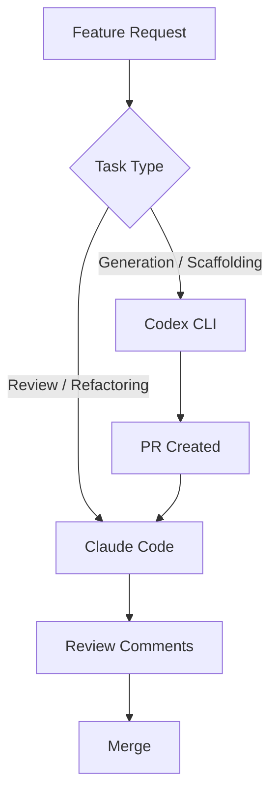

# The Agentic Pricing Wars: OpenAI's Enterprise Migration Offer, Anthropic's Quota Expansion, and the Real Cost of Switching

---

On 13 May 2026, OpenAI launched a 30-day "Switch to Codex" promotion offering two months of free enterprise usage for organisations transitioning from rival platforms [^1]. Within hours, Anthropic responded by raising Claude Code weekly limits by 50% through 13 July [^2]. The opening salvos of the agentic pricing wars had been fired.

This article unpacks what each offer actually delivers, what the hidden switching costs look like, and how senior engineering teams should evaluate the decision without getting distracted by the headlines.

## The OpenAI Offer: Two Months Free, with Conditions

OpenAI's promotion targets enterprise and business customers who apply within 30 days (deadline: approximately mid-June 2026) [^1]. Eligible organisations receive two months of Codex usage for net-new users — meaning the credits cover developers who were not previously on a ChatGPT Business or Enterprise plan [^3].

The application process runs through a dedicated form at `openai.com/form/codex-enterprise-promo/` and requires company details and information about current tooling [^4]. OpenAI reviews applications before approval, so this is not an automatic activation [^3].

### What the offer covers

The free period includes access to the full Codex surface: the desktop app, CLI, IDE extensions, Chrome extension, and mobile relay [^4]. Credit allocations during the promotional period match the standard Enterprise tier — token-based billing with no fixed rate limits, scaling with purchased credits [^5].

### What it does not cover

The offer applies to **new users only**, not existing ChatGPT subscribers upgrading their plan. It also does not waive the custom Enterprise contract negotiation that larger organisations typically require for SSO, data residency, and compliance controls [^5].

## Anthropic's Response: The 50% Quota Expansion

On the same day, Anthropic announced a temporary 50% increase to Claude Code weekly limits for Pro, Max, Team, and Enterprise subscribers [^2]. This stacks on top of an earlier hourly limit doubling from 6 May and the removal of peak-hour throttling for Pro and Max tiers from April — marking Anthropic's third consecutive capacity intervention in five weeks [^6].

The expansion runs through 13 July 2026 at 18:00 PDT [^2]. Anthropic has not confirmed whether the increased ceiling will become permanent, revert to baseline, or settle somewhere in between [^6].

Anthropic attributed the capacity expansion in part to a new compute partnership with SpaceX [^7], though market analysts widely interpret it as a defensive response to Codex's growing enterprise traction [^6].

## The Token Efficiency Gap

Raw pricing tells only part of the story. Multiple independent analyses report that Codex consumes significantly fewer tokens than Claude Code for equivalent tasks — a factor that materially affects the total cost of ownership.

One widely cited benchmark found that a Figma-to-code clone consuming 6.2 million tokens on Claude Code required only 1.5 million on Codex — a 4.1x efficiency advantage [^8]. This pattern holds broadly: GPT-5.5 tends to produce more concise outputs than Opus 4.7, and in agentic loops executing dozens of tool calls, that concision compounds [^8].

However, the efficiency gap cuts both ways. Claude Code's higher token usage correlates with more thorough, deterministic outputs in certain task categories — particularly large-scale refactoring and nuanced code review where exhaustive reasoning improves correctness [^9].

## The Real Switching Costs

Beyond promotional pricing, the practical cost of migrating an engineering team between agentic coding platforms involves several dimensions that do not appear on any rate card.

### Configuration translation

Both tools use project-scoped configuration files — Codex reads `AGENTS.md` and `.codex/config.toml`, while Claude Code reads `CLAUDE.md` and `.claude/settings.json` [^10]. Translating between them is non-trivial: permission models differ, hook systems are incompatible, and MCP server configurations use different registration patterns. A team with 50 repositories will spend meaningful engineering time on configuration migration alone.

Codex CLI v0.130 introduced an agent migration system that can detect and import Claude Code sessions, skills, and configuration [^11], which reduces — but does not eliminate — the translation burden.

### Workflow retraining

The two tools optimise for different interaction patterns. Codex encourages plan-then-execute workflows with explicit `/plan` mode, approval gates, and structured output schemas [^12]. Claude Code favours a more conversational, iterative style with inline corrections. Teams accustomed to one pattern will experience a productivity dip during the transition period — typically two to four weeks based on community reports [^13].

### MCP server compatibility

Both platforms support the Model Context Protocol, but their MCP ecosystems differ significantly. Codex's plugin marketplace and Chrome extension integrate MCP servers with approval controls and sandbox policies [^14]. Claude Code's MCP integration uses a different server discovery mechanism. An organisation relying on custom MCP servers may need to maintain dual configurations during a transition.

### Vendor lock-in signals

Neither platform has committed to full portability. The `AGENTS.md` format is gaining traction as an informal cross-tool standard [^10], but hooks, skills, and automation configurations remain vendor-specific. Teams should evaluate how deeply they have integrated platform-specific features before committing to a switch.

## The Hybrid Strategy

An emerging pattern among experienced engineering teams is to avoid choosing entirely. Multiple reports describe a hybrid workflow: Codex generates features in sandboxed sessions while Claude Code reviews the code before merging, or vice versa [^9]. This approach exploits each platform's strengths — Codex's token efficiency and structured output for generation, Claude's thoroughness for review — while avoiding full lock-in to either.

For teams considering this approach, the cost model looks roughly as follows:

| Component | Codex (Business) | Claude Code (Team) |
|-----------|------------------|--------------------|
| Base cost | \$30/user/month [^5] | \$30/user/month [^15] |
| Token model | Credits-based [^5] | Usage-based [^15] |
| Cached input discount | 90% [^5] | ~90% [^15] |
| Typical monthly cost/dev | \$100-200 [^5] | \$150-400 [^8] |

## What Engineering Leaders Should Do Now

**If you are already on Codex** and satisfied, the Anthropic quota expansion is irrelevant to your decision. Do not switch tools because a competitor offered a temporary limit increase.

**If you are already on Claude Code** and satisfied, the two-month Codex offer is worth evaluating only if your contract renewal is imminent or your team has specific pain points (token costs, sandbox isolation, or CI/CD integration via `codex exec`) that Codex addresses [^5].

**If you are evaluating both** for the first time, run a two-week parallel trial with a small team on a real project. Measure actual token consumption, completion quality, and developer satisfaction — not benchmark scores. The promotional offers from both vendors make this effectively free through mid-July.

**If you are already running both**, formalise the hybrid workflow. Define which tool handles which task category, establish shared `AGENTS.md` files that work across both platforms [^10], and monitor costs with a unified observability layer.

## The Bigger Picture

The May 2026 pricing escalation signals that the AI coding agent market has entered its growth-acquisition phase. Both OpenAI and Anthropic are prioritising user acquisition over margin — a pattern familiar from the cloud infrastructure wars of the early 2010s.

For engineering teams, this means: **take the discounts, avoid the lock-in**. The promotional window will close. The switching costs will compound. The teams that invest now in portable configuration patterns, cross-platform `AGENTS.md` standards, and vendor-neutral CI/CD integration will have the most flexibility when the pricing landscape inevitably shifts again.

---

## Citations

[^1]: Wes Roth, "OpenAI has launched a 30-day 'Switch to Codex' promotion", X, May 2026. [https://x.com/WesRoth/status/2054773700126232791](https://x.com/WesRoth/status/2054773700126232791)

[^2]: Anthropic, "Higher usage limits for Claude and a compute deal with SpaceX", Anthropic News, May 2026. [https://www.anthropic.com/news/higher-limits-spacex](https://www.anthropic.com/news/higher-limits-spacex)

[^3]: Digit.in, "OpenAI is offering two months of Codex access for free, but there is a catch", May 2026. [https://www.digit.in/news/general/openai-is-offering-two-months-of-codex-access-for-free-but-there-is-a-catch.html](https://www.digit.in/news/general/openai-is-offering-two-months-of-codex-access-for-free-but-there-is-a-catch.html)

[^4]: OpenAI, "Get Codex for your enterprise, free", OpenAI Promotional Form, May 2026. [https://openai.com/form/codex-enterprise-promo/](https://openai.com/form/codex-enterprise-promo/)

[^5]: OpenAI, "Pricing - Codex", OpenAI Developers, May 2026. [https://developers.openai.com/codex/pricing](https://developers.openai.com/codex/pricing)

[^6]: Pasquale Pillitteri, "Claude Code Increases Weekly Limits by 50% Through July 13, 2026: Anthropic's Anti-Codex Move", May 2026. [https://pasqualepillitteri.it/en/news/2494/claude-code-weekly-limits-50-percent-anti-codex-anthropic-2026](https://pasqualepillitteri.it/en/news/2494/claude-code-weekly-limits-50-percent-anti-codex-anthropic-2026)

[^7]: IT Pro, "Anthropic is increasing Claude Code usage limits - here's everything you need to know", May 2026. [https://www.itpro.com/software/development/anthropic-claude-code-usage-limits-increase-spacex-compute-deal](https://www.itpro.com/software/development/anthropic-claude-code-usage-limits-increase-spacex-compute-deal)

[^8]: SpectrumAI Lab, "Claude Code vs OpenAI Codex: \$20/mo Each but OpenAI Claims 4x Better Efficiency", May 2026. [https://spectrumailab.com/blog/claude-code-vs-openai-codex-comparison-2026](https://spectrumailab.com/blog/claude-code-vs-openai-codex-comparison-2026)

[^9]: Morphllm, "Codex vs Claude Code (2026): Benchmarks, Agent Teams & Limits Compared", May 2026. [https://www.morphllm.com/comparisons/codex-vs-claude-code](https://www.morphllm.com/comparisons/codex-vs-claude-code)

[^10]: OpenAI, "Best practices - Codex", OpenAI Developers, May 2026. [https://developers.openai.com/codex/learn/best-practices](https://developers.openai.com/codex/learn/best-practices)

[^11]: OpenAI, "Changelog - Codex", OpenAI Developers, May 2026. [https://developers.openai.com/codex/changelog](https://developers.openai.com/codex/changelog)

[^12]: OpenAI, "Features - Codex CLI", OpenAI Developers, May 2026. [https://developers.openai.com/codex/cli/features](https://developers.openai.com/codex/cli/features)

[^13]: CodersEra, "Claude Code vs OpenAI Codex (May 2026): The Honest Engineering-Team Comparison", May 2026. [https://codersera.com/blog/claude-code-vs-openai-codex-2026/](https://codersera.com/blog/claude-code-vs-openai-codex-2026/)

[^14]: OpenAI, "Plugins - Codex", OpenAI Developers, May 2026. [https://developers.openai.com/codex/plugins](https://developers.openai.com/codex/plugins)

[^15]: Anthropic, "Claude Code Pricing", Anthropic, May 2026. [https://www.anthropic.com/pricing](https://www.anthropic.com/pricing)
