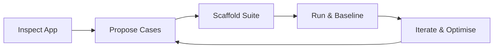
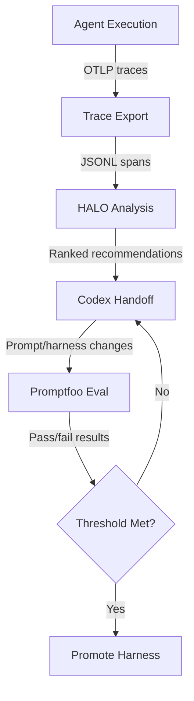

# Eval-Driven Development with Codex CLI: Building Promptfoo Test Suites for AI Applications


---

Most teams building AI applications still rely on manual spot-checking to validate prompt changes. A developer tweaks a system prompt, eyeballs a few outputs, and ships. This works until it doesn't — until a model migration silently degrades extraction accuracy, or a prompt refactor breaks tool-call routing in edge cases nobody thought to test.

Eval-driven development treats AI application quality the same way test-driven development treats code quality: you write the assertions first, then iterate until they pass. OpenAI's official "Add evals to your AI application" use case[^1] pairs Codex CLI with Promptfoo — the open-source eval framework OpenAI acquired and continues to maintain under an MIT licence[^2] — to automate the creation, execution, and maintenance of eval suites directly from your terminal.

## Why Eval-Driven Development Matters Now

Three developments in early 2026 made this approach practical for everyday teams:

1. **Model churn accelerated.** GPT-5.5, GPT-5.4, GPT-5.3-Codex, and their mini variants shipped within months of each other[^3]. Each model change is a potential regression vector for prompt-dependent applications.

2. **Promptfoo joined OpenAI.** The acquisition brought first-class Codex SDK provider support, including trajectory assertions and structured-output validation[^2].

3. **Codex CLI skills matured.** The `$promptfoo-evals` skill can inspect an application, propose high-signal test cases, scaffold the eval configuration, and run the suite — all within a single interactive session[^1].

## The Eval-Driven Loop

The workflow follows a five-phase cycle that mirrors red-green-refactor from TDD:



### Phase 1: Inspect the Application

Codex reads your project structure, identifies prompt files, model calls, tool definitions, and retrieval pipelines. It maps the paths users actually traverse — not just the happy path.

```bash
codex "Inspect this project. Identify all LLM calls, prompts, tools, and \
retrieval steps. List the user-visible behaviours that should be eval'd."
```

### Phase 2: Propose High-Signal Cases

Rather than exhaustive coverage, Codex targets the behaviours most likely to break under model or prompt changes[^1]:

- **Classification and routing** — does the agent pick the right tool?
- **Extraction accuracy** — are structured fields populated correctly?
- **Grounding and citation** — does the response stay faithful to retrieved context?
- **Business-rule compliance** — JSON schemas, field constraints, rate limits
- **Migration confidence** — does the new model match the old one's output distribution?

### Phase 3: Scaffold the Suite

Codex creates the standard Promptfoo project structure:

```
evals/
  promptfooconfig.yaml
  tests/
    cases.yaml
  providers/
    adapter.js
```

The configuration file follows Promptfoo's declarative YAML format[^4]:

```yaml
providers:
  - id: openai:codex-sdk
    config:
      model: gpt-5.5
      working_dir: ./src
      sandbox_mode: read-only
      output_schema:
        type: object
        properties:
          category:
            type: string
          confidence:
            type: number
        required: [category, confidence]

tests: file://tests/cases.yaml

defaultTest:
  options:
    threshold: 0.8
```

Test cases live in a separate YAML file for clean version control:

```yaml
- vars:
    input: "Refund my order #4821, the item arrived damaged"
  assert:
    - type: is-json
    - type: javascript
      value: "output.category === 'refund_request'"
    - type: cost
      threshold: 0.05

- vars:
    input: "What are your opening hours?"
  assert:
    - type: javascript
      value: "output.category === 'faq'"
    - type: latency
      threshold: 10000
```

### Phase 4: Run and Establish a Baseline

```bash
codex exec "Run the Promptfoo eval suite in evals/ and report the results. \
If any cases fail, explain why but do not change the application code."
```

Or run Promptfoo directly:

```bash
cd evals && npx promptfoo eval
```

The first run establishes a baseline. Subsequent runs compare against it, surfacing regressions before they reach production[^4].

### Phase 5: Iterate and Optimise

This is where eval-driven development diverges from traditional testing. You hand Codex both the failing eval cases and the prompt files, then ask it to optimise:

```bash
codex "The eval suite in evals/ has 3 failing cases for the refund classifier. \
Optimise the prompt in src/prompts/classifier.txt until all cases pass. \
After each change, run npx promptfoo eval, inspect failures, and keep edits minimal."
```

The OpenAI Cookbook's "Agent Improvement Loop" pattern[^5] formalises this further: traces from the Agents SDK feed into HALO analysis, which ranks optimisation recommendations, which Codex implements via a structured handoff file.

## Configuring the Codex SDK Provider

Promptfoo's `openai:codex-sdk` provider[^6] exposes Codex-specific evaluation capabilities beyond simple text comparison:

| Metric | Configuration | Use Case |
|--------|--------------|----------|
| Final response text | Default `response.output` | Content assertions |
| Token usage | `tokenUsage` field | Cost regression gates |
| Session/thread IDs | `sessionId` metadata | Session continuity checks |
| Tool trajectories | `enable_streaming: true` | Verifying tool-call sequences |
| Skill invocations | `metadata.skillCalls` | Confirming skill usage |
| Structured output | `output_schema` object | JSON shape validation |

### Trajectory Assertions

When you need to verify that the agent actually ran tests or checked documentation rather than just claiming it did, enable tracing[^6]:

```yaml
providers:
  - id: openai:codex-sdk:gpt-5.3-codex
    config:
      enable_streaming: true
      deep_tracing: true

defaultTest:
  assert:
    - type: trajectory:step-count
      value: ">= 3"
```

This catches a common failure mode: agents that produce plausible output without executing the verification steps you expected.

## Integrating Evals into CI/CD

Promptfoo ships with CI/CD integration[^7] that slots into existing pipelines:


```yaml
# .github/workflows/eval.yml
name: Eval Gate
on:
  pull_request:
    paths:
      - 'src/prompts/**'
      - 'evals/**'

jobs:
  eval:
    runs-on: ubuntu-latest
    steps:
      - uses: actions/checkout@v4
      - uses: actions/setup-node@v4
        with:
          node-version: '22'
      - run: npm ci
      - run: npx promptfoo eval --ci --output results.json
        env:
          OPENAI_API_KEY: ${{ secrets.OPENAI_API_KEY }}
      - run: npx promptfoo eval:assert --results results.json --threshold 0.9
```


The `--ci` flag suppresses interactive output and returns a non-zero exit code on failure, making it a natural gate for prompt changes[^7].

### Cost-Aware Evaluation

Agent evals can be expensive — Promptfoo's documentation notes typical costs of \$0.10–0.30 per security audit case[^8]. Two strategies keep costs manageable:

1. **Cache aggressively during development.** Promptfoo caches responses by default based on prompt template, model, and sandbox settings. Disable only when testing for stability (`PROMPTFOO_CACHE_ENABLED=false`)[^6].

2. **Use cheaper models for regression gates.** Run the full suite against `gpt-5.1-codex-mini` in CI, reserving `gpt-5.5` evals for pre-release validation[^6].

## The Improvement Loop in Practice

The OpenAI Cookbook's agent improvement loop[^5] connects traces, feedback, evals, and optimisation into a continuous flywheel:



The harness — system prompt, tool policy, model settings, and validation rules — is treated as an explicit, versioned contract[^5]:

```python
@dataclass(frozen=True)
class AgentConfig:
    version: str
    system_prompt: str
    model_settings: ModelSettings
    tool_policy: dict[str, Any]
    eval_metadata: dict[str, Any]
```

Each iteration produces a `codex_handoff.md` file containing the HALO diagnosis, ranked recommendations, and implementation guidance. Codex reads this file and applies the changes, then reruns the eval suite to verify improvement[^5].

## What Makes a Good First Eval Target

Not every AI behaviour warrants an eval suite. The official use case documentation[^1] recommends starting with behaviours that are:

- **Concrete and verifiable** — classification labels, extracted fields, tool-call names
- **User-visible** — failures that customers notice, not internal plumbing
- **Regression-prone** — behaviours that broke during the last model migration
- **Automatable** — assertions you can express in YAML without human judgement

Poor first targets include subjective tone assessments, creative writing quality, and conversational flow — these benefit more from LLM-as-judge rubrics added later[^8].

## Limitations and Caveats

- **The Codex SDK provider does not support embeddings, moderation, image generation, or the Realtime API**[^6]. If your application uses these, you'll need separate evaluation tooling.
- **Trajectory assertions require `enable_streaming`**, which increases token consumption and evaluation time[^6].
- **Promptfoo's Codex integration requires Node.js `^20.20.0` or `>=22.22.0`**[^6]. Older Node versions will fail silently.
- **Custom prompts in Codex CLI are deprecated**[^9]. Use skills (`$promptfoo-evals`) rather than custom slash commands for eval workflows.
- **Cost estimation requires known model names.** Custom or fine-tuned model identifiers may not produce accurate cost tracking[^6].

## Getting Started

The fastest path from zero to a working eval suite:

```bash
# Install Promptfoo alongside your project
npm install --save-dev promptfoo @openai/codex-sdk

# Ask Codex to scaffold the suite
codex "Use \$promptfoo-evals to add an eval suite for the support classifier \
in src/classifier.ts. Target classification accuracy and tool-call correctness. \
Run the suite and show me the baseline."
```

From there, commit the `evals/` directory, add the CI gate, and treat eval failures the same way you treat test failures: as blockers, not suggestions.

---

## Citations

[^1]: OpenAI, "Add evals to your AI application — Codex use cases," [https://developers.openai.com/codex/use-cases/ai-app-evals](https://developers.openai.com/codex/use-cases/ai-app-evals)

[^2]: Promptfoo, "GitHub — promptfoo/promptfoo: Test your prompts, agents, and RAGs," MIT licence, [https://github.com/promptfoo/promptfoo](https://github.com/promptfoo/promptfoo)

[^3]: OpenAI, "Models — Codex," [https://developers.openai.com/codex/models](https://developers.openai.com/codex/models)

[^4]: Promptfoo, "Intro — Getting started with Promptfoo," [https://www.promptfoo.dev/docs/intro/](https://www.promptfoo.dev/docs/intro/)

[^5]: OpenAI Cookbook, "Build an Agent Improvement Loop with Traces, Evals, and Codex," May 2026, [https://developers.openai.com/cookbook/examples/agents_sdk/agent_improvement_loop](https://developers.openai.com/cookbook/examples/agents_sdk/agent_improvement_loop)

[^6]: Promptfoo, "OpenAI Codex SDK Provider," [https://www.promptfoo.dev/docs/providers/openai-codex-sdk/](https://www.promptfoo.dev/docs/providers/openai-codex-sdk/)

[^7]: Promptfoo, "CI/CD Integration for LLM Eval and Security," [https://www.promptfoo.dev/docs/integrations/ci-cd/](https://www.promptfoo.dev/docs/integrations/ci-cd/)

[^8]: Promptfoo, "Evaluate Coding Agents," [https://www.promptfoo.dev/docs/guides/evaluate-coding-agents/](https://www.promptfoo.dev/docs/guides/evaluate-coding-agents/)

[^9]: OpenAI, "Custom Prompts — Codex," [https://developers.openai.com/codex/custom-prompts](https://developers.openai.com/codex/custom-prompts)
