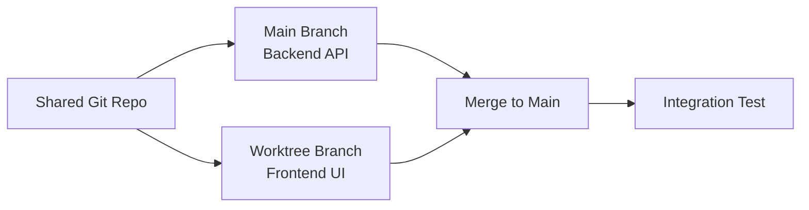

# The Codex CLI Hackathon Playbook: Rapid Prototyping Under Time Pressure


## Introduction

Sea Limited and OpenAI announced the first regional Codex Hackathon series today, kicking off in Singapore on 6 June 2026 with US\$30,000 in API credits for the winning team[^1]. The format is deliberately demanding: teams of three to four must build from scratch on the day — no pre-built code allowed — across three categories: autonomous and adaptive AI, AI-native products, and deep-domain AI[^2].

Hackathons reward a very specific skill: shipping a demonstrable product under brutal time constraints. Codex CLI, now at v0.130.0 with subagents, worktrees, goal mode, fast mode, and 30+ slash commands[^3], gives sprint-focused developers an unfair advantage — if they know which levers to pull. This article is the playbook.

## Pre-Game: The 15-Minute Setup

The first quarter-hour determines your ceiling. Before writing a single line of application code, invest in configuration that pays compound interest across every subsequent prompt.

### AGENTS.md as Your Sprint Spec

Create a minimal `AGENTS.md` at the repository root. In a hackathon, this is not the place for comprehensive engineering standards — it is a concise contract that prevents the agent from drifting[^4]:

```markdown
# Project: [Name]

## Stack
- Frontend: React + Vite
- Backend: FastAPI
- Database: SQLite (demo-grade, no migrations)

## Conventions
- TypeScript strict mode
- All API routes under /api/v1
- No authentication for demo — stub auth middleware

## Build & Test
- Frontend: cd frontend && npm run dev (port 5173)
- Backend: cd backend && uvicorn main:app --reload (port 8000)
- Lint: npm run lint && ruff check backend/

## Done When
- App runs locally with both servers
- Core user flow works end-to-end
- Demo script in DEMO.md covers the happy path
```

The `Done When` section is critical. OpenAI's best practices documentation explicitly recommends including completion criteria so the agent knows when to stop[^5]. Without it, Codex will gold-plate features you cannot demo.

### Config for Speed

Create `.codex/config.toml` in your project root to lock in sprint-optimised settings:

```toml
model = "gpt-5.4"
approval_policy = "auto-edit"

[features]
goals = true

[history]
persistence = "none"
```

Setting `approval_policy` to `auto-edit` lets Codex read and write files without pausing for confirmation on every change, whilst still requiring approval for shell commands that could have side effects[^6]. Disabling history persistence avoids wasting tokens on session replay you will never revisit.

For latency-critical moments — UI polish, copy tweaks, quick fixes — toggle fast mode mid-session:

```
/fast
```

This enables GPT-5.4's accelerated inference path, delivering up to 1.5× faster token velocity with the same model intelligence[^7].

## Phase 1: Architecture Sprint (First Hour)

### Plan Before You Build

Resist the urge to type "build me the app." Start in plan mode:

```
/plan Design the architecture for [your idea].
Propose a file tree, API routes, data model, and component hierarchy.
Keep it minimal — this is a hackathon demo, not production.
```

Plan mode prevents Codex from writing code prematurely[^8]. It will propose a structure, ask clarifying questions, and let you shape the architecture before committing tokens to implementation.

Once the plan looks right, approve it and switch to execution:

```
/goal Implement the architecture from the plan. Start with the backend
API, then the frontend shell, then wire them together.
```

The `/goal` command, available since v0.128.0, creates a persistent objective that survives compaction and session interruptions[^9]. In a hackathon, this means you can step away for coffee without losing momentum.

### Parallel Tracks with Worktrees

If your team has agreed on API contracts, split the work:

```bash
# Terminal 1 — Backend
codex --model gpt-5.4

# Terminal 2 — Frontend (separate worktree)
codex --model gpt-5.4
```

Each terminal session operates independently. Codex automatically detects when it is running in a Git worktree and scopes its file operations accordingly[^10]. One developer supervises backend generation while another steers the frontend — genuine parallel development with a single codebase.



## Phase 2: Feature Velocity (Hours 2–4)

### Subagents for Parallel Tasks

Once the scaffold is standing, use subagents to parallelise independent feature work. Subagents spawn child agents that work concurrently and report back[^11]:

```
Build three features in parallel using subagents:
1. User input form with validation
2. Data processing pipeline endpoint
3. Results dashboard with charts

Each subagent should work in its own directory and not modify shared files.
```

Subagents consume more tokens than single-agent runs, but in a hackathon the wall-clock savings dwarf the cost[^12]. The Sea x OpenAI hackathon awards API credits as prizes — spending credits to win credits is the correct trade.

### Skills for Repeated Patterns

If you find yourself asking Codex to do the same thing more than twice, package it as a skill:

```bash
mkdir -p skills/add-crud-endpoint
```

```markdown
# skills/add-crud-endpoint/SKILL.md
---
name: add-crud-endpoint
description: Scaffold a CRUD endpoint with model, route, and basic tests.
---

Given an entity name and its fields, create:
1. A SQLAlchemy model in backend/models/
2. A FastAPI router in backend/routes/
3. Pydantic schemas in backend/schemas/
4. A test file in backend/tests/

Follow the patterns in the existing endpoints.
```

Codex discovers skills automatically from the `skills/` directory[^13]. Subsequent prompts can simply say "use the add-crud-endpoint skill for the Projects entity" — consistent output, zero repeated explanation.

### The `/review` Loop

Every 30–45 minutes, run a quick self-review:

```
/review
```

This invokes Codex's built-in code review mode against your working tree[^14]. In a hackathon, you are not looking for style nits — you are catching integration bugs, missing imports, and broken API contracts before they compound into a 20-minute debugging spiral during the demo.

## Phase 3: Polish and Demo Prep (Final Hour)

### Model Selection for the Final Sprint

Switch models tactically in the final hour:

| Task | Recommended Model | Why |
|---|---|---|
| Bug fixes | GPT-5.4 + `/fast` | Speed matters more than depth |
| UI polish | GPT-5.3-Codex-Spark | Near-instant for small edits[^15] |
| Demo script writing | GPT-5.4 | Prose quality for DEMO.md |
| Last-minute architecture changes | GPT-5.4 (high effort) | You need it to think carefully |

Switch mid-session with `/model`:

```
/model gpt-5.3-codex-spark
```

### Computer Use for Visual QA

If you are building a web application, Codex can use the browser to verify your frontend. With the Playwright MCP server or the Chrome extension connected, ask:

```
Open http://localhost:5173, walk through the user flow in DEMO.md,
and screenshot each step. Flag any visual issues.
```

This catches broken layouts, missing error states, and failed API calls that you might miss when staring at code[^16].

### The Demo Script

The most undervalued hackathon artefact is the demo script. Dedicate the last 15 minutes:

```
Read AGENTS.md and all source files. Write DEMO.md with:
1. A one-paragraph elevator pitch
2. Step-by-step demo flow with expected outputs
3. Three talking points for the judges
4. Known limitations (be honest — judges respect it)
```

## The Sprint Workflow at a Glance

```mermaid
gantt
    title Hackathon Timeline
    dateFormat HH:mm
    axisFormat %H:%M

    section Setup
    AGENTS.md & config      :setup, 09:00, 15m

    section Architecture
    /plan mode              :arch1, after setup, 20m
    /goal implementation    :arch2, after arch1, 25m

    section Features
    Subagent parallel build :feat, after arch2, 120m
    /review checkpoints     :milestone, 11:00, 0m
    /review checkpoints     :milestone, 11:45, 0m
    /review checkpoints     :milestone, 12:30, 0m

    section Polish
    Bug fixes /fast mode    :polish1, 13:00, 20m
    Visual QA               :polish2, after polish1, 15m
    DEMO.md                 :demo, after polish2, 15m
    Practice run            :practice, after demo, 10m
```



## Anti-Patterns: What Kills Hackathon Agents

**Overloaded prompts.** A 500-word prompt asking for five features simultaneously produces worse results than five focused prompts. The official best practices guide recommends one coherent unit of work per thread[^5].

**Skipping `/compact`.** Long sessions accumulate context. When Codex's responses slow down or become repetitive, run `/compact` to summarise earlier conversation and free tokens[^17]. In a hackathon, a compaction every 60–90 minutes keeps responses sharp.

**Ignoring exit codes.** When Codex runs a command that fails, pay attention. The temptation under time pressure is to override and move on. Compounding failures in a hackathon codebase leads to a debugging spiral that consumes your demo prep time.

**Gold-plating.** Authentication, comprehensive error handling, database migrations, internationalisation — none of these win hackathons. Your `AGENTS.md` should explicitly list what to skip. Judges evaluate working demos, not production readiness.

## Context: Why This Matters Now

The Sea x OpenAI Hackathon is the first of a planned APAC regional series, with Indonesia, Taiwan, and Vietnam to follow[^1]. OpenAI also supports community-led hackathons globally with API credits and mentorship[^18]. The pattern — AI-first competitive building under time constraints — is becoming a standard format for developer events.

Codex CLI has reached 4 million weekly developers as of April 2026[^19]. The tooling has matured to the point where hackathon-style sprint workflows are not a novelty but a practical development mode. The techniques in this playbook — AGENTS.md contracts, goal-mode persistence, subagent parallelism, tactical model switching — apply equally to internal sprint days, proof-of-concept builds, and client demos.

The developers who win these events will not be the fastest typists. They will be the ones who configure their agents before coding, parallelise ruthlessly, and reserve time for polish.

## Citations

[^1]: Sea and OpenAI, "Sea and OpenAI Launch First Regional Codex Hackathon Series in Asia Pacific, Beginning in Singapore," Media OutReach Newswire, 15 May 2026. [https://www.media-outreach.com/news/singapore/2026/05/15/465075/](https://www.media-outreach.com/news/singapore/2026/05/15/465075/)

[^2]: Sea x OpenAI Regional Codex Hackathon - Singapore, Luma event page. [https://luma.com/kv0kks2a](https://luma.com/kv0kks2a)

[^3]: OpenAI, "Slash commands in Codex CLI," OpenAI Developers documentation. [https://developers.openai.com/codex/cli/slash-commands](https://developers.openai.com/codex/cli/slash-commands)

[^4]: OpenAI, "Custom instructions with AGENTS.md," OpenAI Developers documentation. [https://developers.openai.com/codex/guides/agents-md](https://developers.openai.com/codex/guides/agents-md)

[^5]: OpenAI, "Best practices," OpenAI Developers documentation. [https://developers.openai.com/codex/learn/best-practices](https://developers.openai.com/codex/learn/best-practices)

[^6]: OpenAI, "Agent approvals & security," OpenAI Developers documentation. [https://developers.openai.com/codex/agent-approvals-security](https://developers.openai.com/codex/agent-approvals-security)

[^7]: OpenAI, "Models – Codex," OpenAI Developers documentation. [https://developers.openai.com/codex/models](https://developers.openai.com/codex/models)

[^8]: OpenAI, "Features – Codex CLI," OpenAI Developers documentation. [https://developers.openai.com/codex/cli/features](https://developers.openai.com/codex/cli/features)

[^9]: OpenAI, "Using Goals in Codex," OpenAI Cookbook. [https://developers.openai.com/cookbook/examples/codex/using_goals_in_codex](https://developers.openai.com/cookbook/examples/codex/using_goals_in_codex)

[^10]: OpenAI, "Worktrees – Codex app," OpenAI Developers documentation. [https://developers.openai.com/codex/app/features](https://developers.openai.com/codex/app/features)

[^11]: OpenAI, "Subagents," OpenAI Developers documentation. [https://developers.openai.com/codex/subagents](https://developers.openai.com/codex/subagents)

[^12]: Sean Kim, "OpenAI Codex Subagents GA: How Multi-Agent Parallel Coding Works, Real-World Results, and Claude Code Comparison," blog.imseankim.com. [https://blog.imseankim.com/openai-codex-subagents-ga-multi-agent-parallel-coding-claude-code-comparison/](https://blog.imseankim.com/openai-codex-subagents-ga-multi-agent-parallel-coding-claude-code-comparison/)

[^13]: OpenAI, "Agent Skills," OpenAI Developers documentation. [https://developers.openai.com/codex/skills](https://developers.openai.com/codex/skills)

[^14]: OpenAI, "Workflows," OpenAI Developers documentation. [https://developers.openai.com/codex/workflows](https://developers.openai.com/codex/workflows)

[^15]: OpenAI, "Introducing GPT-5.3-Codex-Spark," OpenAI blog. [https://openai.com/index/introducing-gpt-5-3-codex-spark/](https://openai.com/index/introducing-gpt-5-3-codex-spark/)

[^16]: OpenAI, "Codex Chrome extension," OpenAI Developers documentation. [https://developers.openai.com/codex/app/chrome-extension](https://developers.openai.com/codex/app/chrome-extension)

[^17]: OpenAI, "Command line options – Codex CLI," OpenAI Developers documentation. [https://developers.openai.com/codex/cli/reference](https://developers.openai.com/codex/cli/reference)

[^18]: OpenAI, "Support for community-led hackathons," OpenAI Developers. [https://developers.openai.com/community/hackathons](https://developers.openai.com/community/hackathons)

[^19]: OpenAI, "Scaling Codex to enterprises worldwide," OpenAI blog. [https://openai.com/index/scaling-codex-to-enterprises-worldwide/](https://openai.com/index/scaling-codex-to-enterprises-worldwide/)
