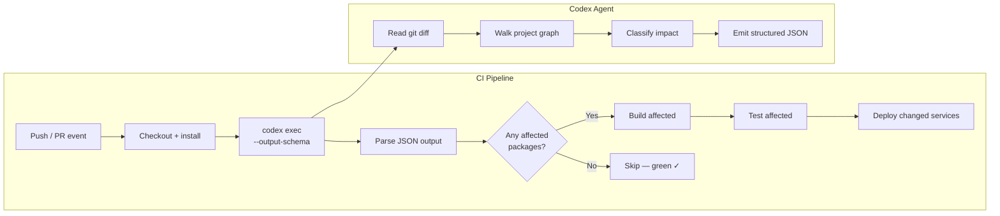

# Codex CLI for Monorepo CI Optimisation: Agent-Driven Test Impact Analysis and Selective Pipeline Execution


---

Monorepo CI pipelines are slow by default. A single-character change in a leaf package triggers a full build-and-test sweep across every project in the graph, burning credits, blocking merge queues, and training developers to ignore CI feedback because it takes too long to matter. The standard fix — hand-maintained `paths:` filters in workflow files — is brittle, falls behind as the dependency graph evolves, and misses transitive consumers entirely.

Codex CLI's non-interactive `codex exec` mode offers a different approach: let an agent analyse the git diff, walk the project graph, and emit a structured JSON decision about which packages need building and which tests need running. The pipeline consumes that JSON and executes only what matters.

---

## The Core Problem: Static Filters Cannot Follow the Graph

Consider a monorepo with 40 packages. Package `core-utils` is imported by 18 downstream consumers. A GitHub Actions workflow using `paths:` filters for each package will correctly trigger the `core-utils` job — but it will not trigger the 18 consumers unless every transitive dependency is duplicated in the filter list. Maintaining those lists by hand is a losing game.[^1]

Build tools like Nx and Turborepo solve this with dependency-graph-aware commands (`nx affected` and `turbo run --affected`), but they produce a flat list of project names.[^2][^3] Translating that list into CI matrix entries, conditional job triggers, and test-runner arguments still requires glue code. That glue code is where `codex exec` fits.

---

## Architecture: Agent as CI Decision Engine



The agent receives the diff, queries the project graph (via MCP tool, CLI command, or direct file reads), classifies each affected project by impact tier, and returns a JSON object that downstream pipeline steps parse without further LLM calls.

---

## Structured Output Schema

The `--output-schema` flag constrains the agent's response to a machine-parseable shape.[^4] Define a schema that captures everything the pipeline needs:

```json
{
  "type": "object",
  "properties": {
    "affected_packages": {
      "type": "array",
      "items": {
        "type": "object",
        "properties": {
          "name": { "type": "string" },
          "reason": { "type": "string" },
          "impact": { "enum": ["direct", "transitive"] },
          "actions": {
            "type": "array",
            "items": { "enum": ["lint", "build", "unit-test", "integration-test", "deploy"] }
          }
        },
        "required": ["name", "reason", "impact", "actions"]
      }
    },
    "skip_reason": { "type": "string" },
    "estimated_test_count": { "type": "integer" }
  },
  "required": ["affected_packages"]
}
```

Each entry tells the pipeline *what* to run and *why* — useful both for conditional execution and for auditable CI logs.

---

## GitHub Actions Integration

A practical workflow step using `codex exec`:


```yaml
jobs:
  analyse:
    runs-on: ubuntu-latest
    outputs:
      matrix: ${{ steps.impact.outputs.matrix }}
    steps:
      - uses: actions/checkout@v4
        with:
          fetch-depth: 0  # full history for accurate diff

      - name: Determine affected packages
        id: impact
        run: |
          codex exec \
            "Analyse the git diff between origin/main and HEAD. \
             Walk the Nx project graph (run 'npx nx graph --file=graph.json' first). \
             For each affected project, determine whether the change is direct or transitive. \
             Assign actions: lint and unit-test for all affected, integration-test only for \
             direct changes to API packages, deploy only for service packages with direct changes." \
            --output-schema ./ci/impact-schema.json \
            --full-auto \
            -o /tmp/impact.json
          echo "matrix=$(cat /tmp/impact.json | jq -c '.affected_packages')" >> "$GITHUB_OUTPUT"
        env:
          CODEX_MODEL: gpt-5.4-mini

  test:
    needs: analyse
    if: ${{ needs.analyse.outputs.matrix != '[]' }}
    strategy:
      matrix:
        package: ${{ fromJson(needs.analyse.outputs.matrix) }}
    runs-on: ubuntu-latest
    steps:
      - uses: actions/checkout@v4
      - run: npx nx run ${{ matrix.package.name }}:test
```


Key details:

- **`fetch-depth: 0`** gives the agent a full diff against `main`. Shallow clones produce incomplete change sets.
- **`gpt-5.4-mini`** keeps costs low. Graph walking and diff classification are read-heavy tasks that do not require deep reasoning — the same principle that applies to explorer subagents in interactive sessions.[^5]
- **`--full-auto`** removes approval gates. CI pipelines cannot pause for human input.[^4]
- The `if` guard on the `test` job means zero-impact PRs (documentation-only changes, for example) skip testing entirely.

---

## Nx Project Graph via MCP

For deeper integration, the Nx MCP server exposes the project graph as a tool the agent can query mid-session rather than shelling out to `npx nx graph`.[^6] Register it in your project-scoped config:

```toml
[mcp_servers.nx]
command = "npx"
args = ["nx-mcp"]
startup_timeout_sec = 20
tool_timeout_sec = 60
```

The agent can then call the `get_project_graph` tool to retrieve the full dependency structure, `get_affected_projects` to narrow the scope, and `get_project_details` for per-project metadata — all without writing intermediate files.

---

## Turborepo Alternative

Turborepo's `--affected` flag produces a similar result without an MCP server.[^3] Pipe it directly into the prompt:

```bash
AFFECTED=$(npx turbo run build --affected --dry-run=json | jq -c '.packages')
codex exec \
  "The following Turborepo packages are affected by this PR: $AFFECTED. \
   Classify each by impact tier and assign CI actions." \
  --output-schema ./ci/impact-schema.json \
  --full-auto \
  -o /tmp/impact.json
```

This hybrid approach uses Turborepo for graph resolution and Codex for classification and action assignment — each tool doing what it does best.

---

## GitLab CI Recipe

The same pattern translates to GitLab CI with `artifacts:reports`:

```yaml
analyse-impact:
  stage: prepare
  script:
    - codex exec "Analyse git diff and Nx graph. Return affected packages."
        --output-schema ci/impact-schema.json
        --full-auto
        -o impact.json
  artifacts:
    paths: [impact.json]

test-affected:
  stage: test
  needs: [analyse-impact]
  script:
    - |
      for pkg in $(jq -r '.affected_packages[].name' impact.json); do
        npx nx run "$pkg":test
      done
  rules:
    - if: $CI_PIPELINE_SOURCE == "merge_request_event"
```

---

## Cost Considerations

Running an LLM on every CI event raises a legitimate cost question. Three levers keep it manageable:

1. **Model selection** — `gpt-5.4-mini` handles graph classification at a fraction of `gpt-5.4` cost. Reserve the larger model for tasks requiring architectural judgement.[^5]
2. **Early exit** — check for documentation-only or CI-config-only changes before invoking `codex exec`. A five-line shell guard avoids an LLM call entirely for changes that cannot affect runtime code.
3. **Caching the decision** — store `impact.json` as a pipeline artefact. Re-runs of the same commit reuse the cached analysis without a fresh agent call.

At current token-based pricing, a typical monorepo impact analysis with `gpt-5.4-mini` costs under \$0.02 per invocation — negligible against the compute saved by skipping unnecessary builds and tests.[^7]

---

## What This Does Not Replace

Agent-driven impact analysis is a routing optimisation, not a testing strategy. It decides *which* tests to run, not *whether* to test. Critical safeguards remain:

- **Nightly full-suite runs** catch transitive failures the agent's heuristics might miss.
- **Release branches** should always run the complete pipeline regardless of diff analysis.
- **Security-sensitive packages** deserve an allowlist that forces full testing on any change, bypassing the agent's classification.

⚠️ Never let an LLM be the sole gatekeeper for shipping to production. Use it to accelerate feedback loops, not to replace safety nets.

---

## Summary

Monorepo CI pipelines waste most of their compute on unchanged packages. Static path filters cannot track transitive dependencies. Build-graph tools like Nx and Turborepo identify affected projects but leave the translation to CI matrix entries as an exercise for the reader. `codex exec` with `--output-schema` fills that gap: the agent reads the diff, walks the graph, classifies impact, and emits a structured JSON decision that the pipeline executes without further LLM involvement. The result is faster feedback, lower cost, and CI configuration that evolves with the codebase rather than falling behind it.

---

## Citations

[^1]: Nrwl, "CI Pipeline Configurations with Nx," [nx.dev/ci/intro/ci-setup-recipes](https://nx.dev/ci/intro/ci-setup-recipes), accessed May 2026. Documents the limitations of path-based CI triggers in monorepos.

[^2]: Nrwl, "nx affected," [nx.dev/ci/features/affected](https://nx.dev/ci/features/affected), accessed May 2026. Covers dependency-graph-aware change detection.

[^3]: Vercel, "Running Tasks — Turborepo," [turbo.build/repo/docs/crafting-your-repository/running-tasks](https://turbo.build/repo/docs/crafting-your-repository/running-tasks), accessed May 2026. Documents the `--affected` flag for selective task execution.

[^4]: OpenAI, "Non-interactive mode — Codex," [developers.openai.com/codex/noninteractive](https://developers.openai.com/codex/noninteractive), accessed May 2026. Covers `codex exec`, `--output-schema`, and `--full-auto` for CI integration.

[^5]: OpenAI, "Features — Codex CLI," [developers.openai.com/codex/cli/features](https://developers.openai.com/codex/cli/features), accessed May 2026. Discusses model selection for subagent roles and read-heavy tasks.

[^6]: Nrwl, "Nx MCP Server," [nx.dev/features/integrate-with-editors](https://nx.dev/features/integrate-with-editors), accessed May 2026. Documents the Nx MCP server for project graph exposure to AI tools.

[^7]: OpenAI, "Pricing — Codex," [developers.openai.com/codex/pricing](https://developers.openai.com/codex/pricing), accessed May 2026. Token-based credit pricing for Codex CLI models.
