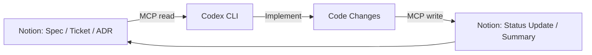
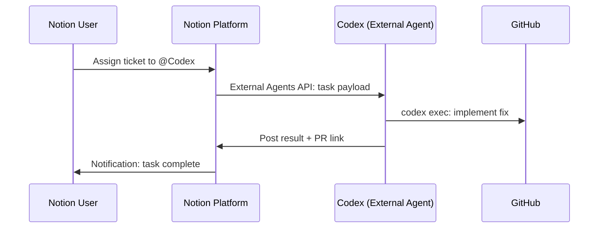

# Codex CLI Meets Notion: MCP Integration, the External Agents API, and Knowledge-Driven Development Workflows


---

On 13 May 2026, Notion shipped its Developer Platform—Workers, database sync, webhook triggers, and an External Agents API that turns Notion into an orchestration layer for coding agents [^1]. Codex is a launch partner alongside Claude Code, Cursor, and Decagon [^2]. Two days later, the integration is already usable from the CLI.

This article covers three things: wiring the Notion MCP server into Codex CLI, understanding where the new External Agents API fits, and building practical workflows that close the loop between project knowledge in Notion and code changes on disk.

## Why Notion Matters for Agent Workflows

Most engineering teams keep their specifications, design decisions, sprint boards, and post-mortems in Notion. Until now, feeding that context to a coding agent meant copy-pasting prose into a prompt or maintaining a parallel `AGENTS.md` that drifted from the source of truth.

The Notion MCP server exposes 22 tools [^3] that let Codex read databases, query pages with filters, create and update content, search across the workspace, and manage comments—all without leaving the terminal. The context loop becomes:



## Setting Up Notion MCP in Codex CLI

### Option 1: One-liner (recommended)

```bash
codex mcp add notion --url https://mcp.notion.com/mcp
```

This appends the server block to `~/.codex/config.toml` and starts the OAuth flow automatically [^4].

### Option 2: Manual config

Add the following to `~/.codex/config.toml` (user-level) or `.codex/config.toml` (project-scoped):

```toml
[mcp_servers.notion]
url = "https://mcp.notion.com/mcp"
```

Then authenticate:

```bash
codex mcp login notion
```

Codex opens your browser for the standard Notion OAuth consent screen. Once authorised, the token persists across sessions [^4].

### Verifying the connection

Launch Codex and run `/mcp`. You should see `notion` listed with its 22 tools. A quick smoke test:

```
Search my workspace for "API design guidelines"
```

If Codex returns page titles and snippets, the pipe is live.

### Team-level sharing

Commit the project-scoped `.codex/config.toml` so every team member inherits the MCP binding. Each developer still needs to complete their own OAuth flow—Notion MCP uses per-user authentication and does not support service-account tokens for the hosted endpoint [^5].

## Notion MCP Tool Surface

The hosted Notion MCP server (v2.0.0) exposes tools across four categories [^3]:

| Category | Tools | Typical Use |
|---|---|---|
| **Search & discovery** | `search`, `retrieve-a-database` | Find specs, ADRs, sprint items |
| **Data source operations** | `query-data-source`, `retrieve-a-data-source`, `create-a-data-source`, `update-a-data-source` | Filter tickets by status, read schema |
| **Page management** | `retrieve-a-page`, `create-a-page`, `update-a-page`, `move-page`, `append-block`, `delete-a-block` | Read requirements, update status, add summaries |
| **Collaboration** | `retrieve-comments`, `create-a-comment`, `retrieve-a-user`, `list-users` | Post implementation notes, tag reviewers |

Read operations are safe to run automatically. Write operations default to requiring approval in Notion's permission model [^6]. In Codex CLI, the sandbox policy inherits from your active permission profile—if you run in `suggest` mode, Codex will present the MCP write call for your approval before executing.

## The External Agents API

The MCP server is the read/write pipe. The External Agents API (alpha) is the orchestration layer [^1]. It lets Notion treat Codex as a first-class workspace participant: users can assign work to Codex from inside Notion, track task progress, and review results—all without opening a terminal.



At launch, the External Agents API supports Codex, Claude Code, Cursor, and Decagon as pre-integrated partners [^2]. Custom agents built on other frameworks can register via the API to become workspace participants.

### How it differs from MCP

| Dimension | MCP Integration | External Agents API |
|---|---|---|
| **Direction** | Codex calls into Notion | Notion calls out to Codex |
| **Trigger** | Developer prompt in CLI | Notion user assigns task |
| **Auth model** | OAuth per developer | Platform-level agent registration |
| **Status** | GA (hosted MCP) | Alpha |
| **Best for** | Context retrieval, status updates | Task delegation, autonomous workflows |

In practice, you will likely use both: MCP for pulling context during interactive sessions, and the External Agents API for fire-and-forget task delegation from project managers who live in Notion.

## Notion Workers: When MCP Is Not Enough

Notion Workers are the hosted runtime for custom code [^1]. They deploy via the Notion CLI (`ntn`) to a secure sandbox—no containers to manage. A single Worker can power database sync, custom agent tools, and webhook-triggered automation.

Workers matter for Codex users when you need deterministic logic that an LLM should not improvise: currency conversion, compliance checks, data validation, or calling an internal API with specific retry semantics. You write the Worker in JavaScript, deploy it, and it appears as a tool in your Notion Custom Agent—which Codex can then invoke via the External Agents API.

```bash
# Install the Notion CLI
curl -fsSL https://ntn.dev | bash

# Deploy a worker
ntn deploy ./workers/sync-jira-tickets
```

Workers are free during the beta period. From 11 August 2026, they consume Notion credits on the same meter as Custom Agents [^7].

## Practical Workflow Recipes

### 1. Ticket-driven development

Pull the next unstarted ticket from a Notion sprint board, implement it, and update the status—all from one Codex session:

```
Read the top unstarted ticket from the "Sprint 42" board in Notion.
Implement the feature described in the ticket.
Run the test suite.
If tests pass, update the ticket status to "In Review" and add
a comment with the branch name.
```

Codex uses `query-data-source` to filter by status, `retrieve-a-page` for the full spec, writes code, then calls `update-a-page` and `create-a-comment` to close the loop.

### 2. ADR-aware refactoring

Architecture Decision Records in Notion capture the *why* behind design choices. Feed them to Codex before a refactor so it respects existing constraints:

```
Search Notion for ADRs related to "authentication".
Read the most recent one.
Refactor the auth middleware in src/auth/ following the
constraints documented in that ADR.
```

### 3. Automated release notes

After merging a batch of PRs, generate release notes and publish them to Notion:

```
List all merged PRs since the last release tag.
Summarise each change in one sentence.
Create a new page under "Release Notes" in Notion with
today's date as the title and the summaries as content.
```

### 4. Non-interactive pipeline integration

Combine `codex exec` with Notion MCP for CI/CD pipelines that report back to your project tracker:

```bash
codex exec \
  "Query the 'Deployment Checklist' database in Notion. \
   For each unchecked item, verify the condition is met \
   in the current repository state. \
   Update each item's status to 'Passed' or 'Failed'." \
  --output-schema ./checklist-result.json \
  -o ./report.json
```

## Security Considerations

- **OAuth scoping**: The hosted Notion MCP server inherits the permissions of the authenticating user. Restrict the integration's access to specific pages or databases rather than granting full workspace access [^5].
- **Write confirmation**: Notion's default requires confirmation before write operations execute. Do not toggle this to "Run automatically" for write tools unless you have reviewed the agent's behaviour thoroughly [^6].
- **Sandbox interaction**: Codex CLI's sandbox prevents filesystem and network abuse, but MCP calls bypass the network sandbox by design (they are tool calls, not raw HTTP). Treat MCP write tools with the same caution as any other side-effecting tool.
- **Token storage**: OAuth tokens are stored locally by the MCP client. Rotate credentials periodically, especially in shared CI environments.

## Limitations and Caveats

- The External Agents API is in **alpha**. Expect breaking changes before GA [^1].
- Notion MCP does not yet support file uploads; use the Notion REST API directly for attachments [^3].
- OAuth authentication means `codex exec` pipelines need a pre-authenticated token. Headless OAuth refresh is not currently documented for the hosted MCP endpoint.
- Meeting Notes and block comments were only added to MCP recently; older Notion content types may have patchy coverage [^8].
- Workers require a Notion Business or Enterprise plan [^7].

## Citations

[^1]: Notion, "Introducing Notion's Developer Platform," *Notion Blog*, 13 May 2026. [https://www.notion.com/blog/introducing-developer-platform](https://www.notion.com/blog/introducing-developer-platform)

[^2]: TechCrunch, "Notion just turned its workspace into a hub for AI agents," 13 May 2026. [https://techcrunch.com/2026/05/13/notion-just-turned-its-workspace-into-a-hub-for-ai-agents/](https://techcrunch.com/2026/05/13/notion-just-turned-its-workspace-into-a-hub-for-ai-agents/)

[^3]: makenotion, "notion-mcp-server," *GitHub*, v2.0.0. [https://github.com/makenotion/notion-mcp-server](https://github.com/makenotion/notion-mcp-server)

[^4]: FlowDevs, "How to Set Up the Notion MCP Server with OpenAI Codex," 2026. [https://www.flowdevs.io/blog/post/how-to-set-up-the-notion-mcp-server-with-openai-codex](https://www.flowdevs.io/blog/post/how-to-set-up-the-notion-mcp-server-with-openai-codex)

[^5]: Notion, "Connecting to Notion MCP," *Notion Developer Docs*. [https://developers.notion.com/guides/mcp/get-started-with-mcp](https://developers.notion.com/guides/mcp/get-started-with-mcp)

[^6]: Notion, "MCP connections for Custom Agents," *Notion Help Centre*. [https://www.notion.com/help/mcp-connections-for-custom-agents](https://www.notion.com/help/mcp-connections-for-custom-agents)

[^7]: Notion, "Release notes: 3.5 — Notion Developer Platform," 13 May 2026. [https://www.notion.com/releases/2026-05-13](https://www.notion.com/releases/2026-05-13)

[^8]: OpenAI, "Model Context Protocol — Codex," *OpenAI Developer Docs*. [https://developers.openai.com/codex/mcp](https://developers.openai.com/codex/mcp)
