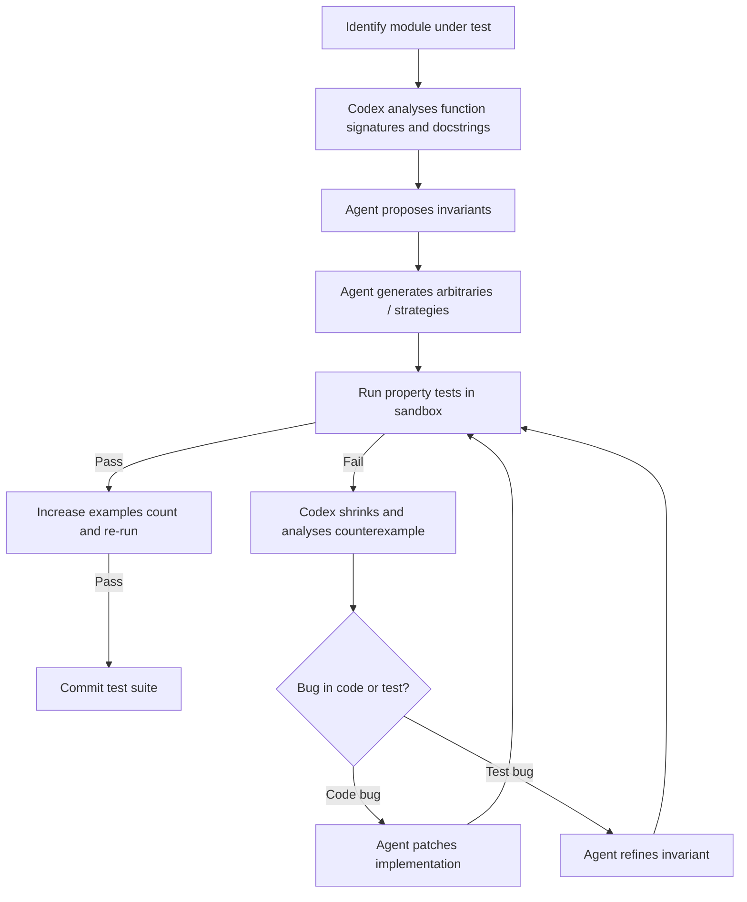

# Property-Based Testing and Fuzzing with Codex CLI: Agent-Driven Edge-Case Discovery Using Hypothesis and fast-check


---

Example-based unit tests verify the cases you thought of. Property-based tests verify the cases you didn't. The difference matters most in parsing, serialisation, state machines, and concurrent code — precisely the domains where hand-written examples leave the widest gaps. This article covers how to use Codex CLI to generate, run, and iteratively refine property-based test suites and fuzz harnesses, turning the agent into an edge-case discovery engine.

## Why Property-Based Testing Needs an Agent

Writing property-based tests requires two skills that are tedious for humans but natural for large language models: **identifying invariants** (round-trip serialisation, commutativity, idempotence) and **constructing arbitraries** (generators that produce valid, structured random inputs) [^1]. A senior developer might spend thirty minutes writing a Hypothesis strategy for a nested JSON schema; Codex can draft one in seconds, iterate when shrunk failures appear, and fix the implementation in the same session.

The sandbox also helps. Fuzz campaigns can consume CPU, spawn thousands of child processes, and occasionally trigger undefined behaviour. Running them inside Codex CLI's network-disabled, filesystem-scoped sandbox [^2] means a misbehaving harness cannot exfiltrate data or corrupt the host.

## The Property-Based Testing Lifecycle in Codex CLI



The key insight is that Codex CLI's iterative loop — generate, run, inspect failure, fix, re-run — maps directly onto the property-based testing workflow. Each shrunk counterexample gives the agent a concrete, minimal reproduction to reason about.

## Python: Hypothesis with Codex CLI

### AGENTS.md Configuration

Start by giving Codex the testing context it needs:

```markdown
# Testing

- Property-based tests live in `tests/property/`
- Use `hypothesis` (>=6.150) with `pytest`
- Run: `pytest tests/property/ -x --tb=short`
- When a property test fails, always show the shrunk counterexample
- Prefer `@given` with composite strategies over raw `@st.from_type`
- Set `max_examples=500` for CI, `max_examples=10000` for thorough runs
```

### Generating a Test Suite

A typical prompt for a serialisation module:

```bash
codex "Analyse src/codec.py. Identify all serialisation round-trip invariants
and write Hypothesis property tests in tests/property/test_codec_properties.py.
Use composite strategies for nested types. Run the tests and fix any failures."
```

Codex will typically produce tests like this:

```python
from hypothesis import given, settings, assume
from hypothesis import strategies as st

from src.codec import encode, decode, Schema

@st.composite
def schema_strategy(draw):
    """Generate arbitrary valid Schema instances."""
    name = draw(st.text(min_size=1, max_size=64, alphabet=st.characters(
        whitelist_categories=("L", "N"),
    )))
    fields = draw(st.dictionaries(
        keys=st.text(min_size=1, max_size=32),
        values=st.sampled_from(["string", "int", "float", "bool", "bytes"]),
        min_size=1,
        max_size=20,
    ))
    return Schema(name=name, fields=fields)


@given(schema=schema_strategy())
@settings(max_examples=500)
def test_encode_decode_roundtrip(schema):
    """Property: decode(encode(x)) == x for all valid schemas."""
    encoded = encode(schema)
    decoded = decode(encoded)
    assert decoded == schema


@given(data=st.binary(min_size=0, max_size=4096))
@settings(max_examples=500)
def test_decode_never_crashes_on_arbitrary_bytes(data):
    """Property: decode must raise ValueError, not crash, on invalid input."""
    try:
        decode(data)
    except ValueError:
        pass  # expected for invalid input
```

The agent identifies two classic properties: the round-trip invariant and the robustness invariant (no crashes on arbitrary input) [^3].

### Stateful Testing for APIs

Hypothesis's `RuleBasedStateMachine` is particularly powerful when combined with Codex. The agent can read your API routes, model the state space, and generate rule-based state machine tests that exercise operation sequences no human would think to try [^4]:

```bash
codex "Read the FastAPI routes in src/api/. Write a Hypothesis
RuleBasedStateMachine test that exercises create, update, delete, and
list operations in random sequences, checking list consistency after
each operation. Run it with max_examples=200."
```

## TypeScript: fast-check with Codex CLI

### AGENTS.md Configuration

```markdown
# Property Testing

- Property-based tests use `fast-check` (>=4.7) with `vitest`
- Tests live in `src/__tests__/property/`
- Run: `npx vitest run src/__tests__/property/`
- Use `@fast-check/vitest` for `fc.test.prop` integration
- Prefer `fc.record` and `fc.oneof` for domain model arbitraries
```

### Generating fast-check Tests

```bash
codex "Analyse src/parser.ts. Write fast-check property tests in
src/__tests__/property/parser.properties.test.ts. Test that:
1) parse(serialize(x)) === x for all valid AST nodes,
2) parse never throws on arbitrary strings (returns Result type),
3) serialized output is always valid UTF-8.
Use fc.letrec for recursive AST node generation. Run and fix failures."
```

Codex generates recursive arbitraries using `fc.letrec`, which became the standard pattern for tree-shaped data in fast-check 4.x [^5]:

```typescript
import fc from "fast-check";
import { test } from "@fast-check/vitest";
import { parse, serialize, type ASTNode } from "../../parser";

const astNodeArb = fc.letrec((tie) => ({
  leaf: fc.record({
    type: fc.constant("literal" as const),
    value: fc.oneof(fc.string(), fc.double(), fc.boolean()),
  }),
  branch: fc.record({
    type: fc.constant("expression" as const),
    operator: fc.constantFrom("+", "-", "*", "/"),
    left: tie("node"),
    right: tie("node"),
  }),
  node: fc.oneof({ depthSize: "small" }, tie("leaf"), tie("branch")),
}));

test.prop([astNodeArb.node])("round-trip: parse(serialize(x)) deep-equals x", (node) => {
  const serialized = serialize(node as ASTNode);
  const parsed = parse(serialized);
  expect(parsed).toEqual(node);
});

test.prop([fc.fullUnicodeString()])("parse never throws on arbitrary input", (input) => {
  const result = parse(input);
  // Must return a Result, not throw
  expect(result).toBeDefined();
});
```

The `@fast-check/vitest` integration (v0.4.1) [^6] allows `test.prop` to hook directly into Vitest's runner, giving Codex access to standard test output for failure analysis.

## Fuzz Harness Generation

Property-based testing and fuzzing share a common core: feed structured random input to code and watch for violations. Codex can generate fuzz harnesses that bridge the two worlds.

### Python: Hypothesis → HypoFuzz

HypoFuzz [^7] takes existing Hypothesis tests and applies coverage-guided fuzzing on top. The workflow with Codex:

```bash
codex "Install hypofuzz. Take all property tests in tests/property/ and
run them under coverage-guided fuzzing for 60 seconds each. Report any
new failures found beyond the default Hypothesis examples."
```

### JavaScript: fast-check → Fuzz Mode

fast-check's `.fuzz_one_input`-style integration [^8] lets you reuse property tests as fuzz targets:

```bash
codex "Convert the fast-check property tests in src/__tests__/property/
to also work as fuzz harnesses. Create a fuzz/ directory with one
harness per property test. Add an npm script 'fuzz' that runs each
harness for 30 seconds."
```

## Building a Property-Testing Skill

For teams that want this workflow on every project, wrap it as a Codex skill [^9]:

```markdown
# SKILL.md — property-test-generator

## When to use
When the user asks to "add property tests", "find edge cases",
"fuzz this module", or "write invariant tests".

## Steps
1. Detect language (Python → Hypothesis, TypeScript/JS → fast-check)
2. Read the module under test — identify public functions and types
3. Propose invariants as a numbered list — ask for confirmation
4. Generate arbitraries/strategies matching the type signatures
5. Write property tests in the project's test directory
6. Run with `max_examples=500` and fix any failures
7. If all pass, re-run with `max_examples=5000` for deeper coverage
8. Commit the test file with a descriptive message
```

Install with:

```bash
codex skills add ./property-test-generator
```

## Model Selection for Property Testing

Different phases benefit from different models [^10]:

| Phase | Recommended Model | Rationale |
|-------|------------------|-----------|
| Invariant identification | `gpt-5.5` | Requires deep code reasoning |
| Arbitrary generation | `gpt-5.4` | Sufficient for type-directed generation |
| Failure analysis and fix | `gpt-5.5` | Shrunk counterexamples need careful reasoning |
| Bulk harness generation | `gpt-5.4-mini` | Boilerplate-heavy, speed matters |
| Iterative fuzz-fix loop | `gpt-5.3-codex` | Best for sustained coding sessions [^11] |

Switch models mid-session with `/model gpt-5.4-mini` when moving from analysis to bulk generation.

## Non-Interactive Pipeline Integration

Run property test generation in CI as a scheduled job using `codex exec` [^12]:

```bash
codex exec \
  --model gpt-5.4 \
  --approval-policy auto-edit \
  --sandbox-permissions read-only \
  "Analyse all modules in src/ that lack property tests.
   Generate Hypothesis tests for each. Run them.
   Output a JSON report of modules tested and failures found." \
  --output-schema '{"type":"object","properties":{
    "modules_tested":{"type":"array","items":{"type":"string"}},
    "failures":{"type":"array","items":{"type":"object","properties":{
      "module":{"type":"string"},
      "invariant":{"type":"string"},
      "counterexample":{"type":"string"}
    }}}
  }}'
```

The `--output-schema` flag [^13] produces machine-parseable JSON for downstream processing — feed failures into issue trackers or Slack alerts.

## Common Invariant Patterns Codex Discovers

When given sufficient context, Codex reliably identifies these invariant families:

- **Round-trip**: `decode(encode(x)) == x` — serialisation, parsing, compression
- **Idempotence**: `f(f(x)) == f(x)` — normalisation, formatting, deduplication
- **Commutativity**: `f(a, b) == f(b, a)` — set operations, merge functions
- **Monotonicity**: `x ≤ y → f(x) ≤ f(y)` — sorting, ranking, accumulation
- **Robustness**: `f(arbitrary_input)` never panics — all public API surfaces
- **Conservation**: `len(input) == len(output)` — mapping, transformation pipelines
- **Oracle comparison**: `new_impl(x) == legacy_impl(x)` — migration validation

Prompt Codex explicitly with "check for round-trip, idempotence, and robustness invariants" to ensure comprehensive coverage.

## Limitations and Caveats

⚠️ Codex cannot yet run long-duration fuzz campaigns (hours/days) within a single session due to context window and timeout constraints. Use it to **generate** the harness, then run the campaign externally.

⚠️ Property-based tests with complex `assume()` filters can have high rejection rates. Codex sometimes generates overly broad strategies that waste most examples on rejected inputs. Review the `health_check` output and prompt the agent to tighten the strategy if rejection exceeds 20%.

⚠️ The sandbox's network isolation means property tests that require external services (databases, APIs) need mocked dependencies. Codex handles this well when `AGENTS.md` specifies the mocking approach.

## Citations

[^1]: fast-check, "What is Property-Based Testing?", [https://fast-check.dev/docs/introduction/what-is-property-based-testing/](https://fast-check.dev/docs/introduction/what-is-property-based-testing/)
[^2]: OpenAI, "Agent approvals & security — Codex", [https://developers.openai.com/codex/agent-approvals-security](https://developers.openai.com/codex/agent-approvals-security)
[^3]: Hypothesis documentation, "What you can generate and how", [https://hypothesis.readthedocs.io/en/latest/data.html](https://hypothesis.readthedocs.io/en/latest/data.html)
[^4]: Hypothesis documentation, "Stateful testing", [https://hypothesis.readthedocs.io/en/latest/stateful.html](https://hypothesis.readthedocs.io/en/latest/stateful.html)
[^5]: fast-check, "What's new in fast-check 4.7.0?", [https://fast-check.dev/blog/2026/04/18/whats-new-in-fast-check-4-7-0](https://fast-check.dev/blog/2026/04/18/whats-new-in-fast-check-4-7-0)
[^6]: npm, "@fast-check/vitest 0.4.1", [https://www.npmjs.com/package/@fast-check/vitest](https://www.npmjs.com/package/@fast-check/vitest)
[^7]: HypoFuzz documentation, [https://hypofuzz.com/](https://hypofuzz.com/)
[^8]: fast-check, "Why Property-Based Testing?", [https://fast-check.dev/docs/introduction/why-property-based/](https://fast-check.dev/docs/introduction/why-property-based/)
[^9]: OpenAI, "Agent Skills — Codex", [https://developers.openai.com/codex/skills](https://developers.openai.com/codex/skills)
[^10]: OpenAI, "Models — Codex", [https://developers.openai.com/codex/models](https://developers.openai.com/codex/models)
[^11]: OpenAI, "Introducing GPT-5.2-Codex", [https://openai.com/index/introducing-gpt-5-2-codex/](https://openai.com/index/introducing-gpt-5-2-codex/)
[^12]: OpenAI, "Non-interactive mode — Codex CLI", [https://developers.openai.com/codex/cli/non-interactive](https://developers.openai.com/codex/cli/non-interactive)
[^13]: OpenAI, "Command line options — Codex CLI", [https://developers.openai.com/codex/cli/reference](https://developers.openai.com/codex/cli/reference)
