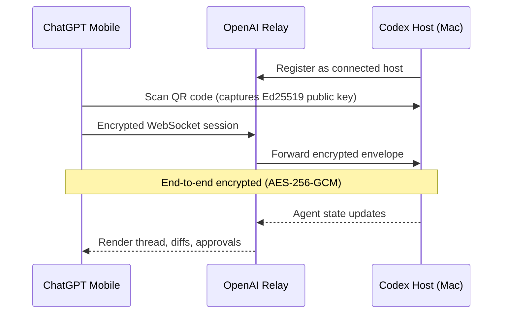
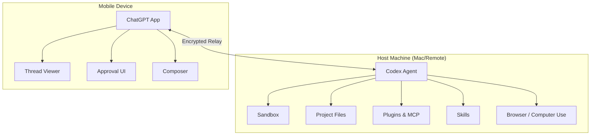

# Codex Mobile: Remote Agent Control from Your Phone via the ChatGPT App


---

On 14 May 2026, OpenAI shipped Codex inside the ChatGPT mobile app for iPhone, iPad, and Android — rolling it out in preview across all plans, including Free and Go [^1][^2]. The feature turns your phone into a lightweight control surface for Codex sessions running on a Mac (or any connected host), using a relay layer that never exposes your machine directly to the public internet [^3]. With over four million weekly Codex users, this is the first time the majority can approve commands, review diffs, and steer agent work without being at their desk [^1].

This article covers the relay architecture, the pairing and connection flow, what you can and cannot do from mobile, and practical patterns for integrating mobile oversight into a senior developer's workflow.

## Why Mobile Matters for Agentic Workflows

Long-running Codex sessions are the norm now. A `/goal` task can run for hours, periodically requiring approval gates, model switches, or follow-up instructions. Before mobile support, a developer who stepped away from their laptop either left the agent blocked on an approval prompt or pre-authorised everything with a permissive auto-review policy — neither ideal.

Mobile control addresses this by keeping the human in the loop without keeping them in their chair. The connected-host model means your phone is not running Codex locally; it is a thin client that renders the agent's state and relays your decisions back to the host machine [^3].

## Architecture: The Secure Relay Layer

The connection between your phone and your Codex host does not use a direct peer-to-peer connection. Instead, OpenAI operates a relay service that routes encrypted sessions between devices signed into the same ChatGPT account [^3][^4].



### Cryptographic Stack

The encryption design follows a belt-and-braces approach [^5]:

1. **Key exchange** — X25519 ephemeral keys generate a shared secret during the initial handshake.
2. **Identity verification** — The host signs the handshake transcript with its Ed25519 identity key; the phone verifies this against the public key embedded in the QR code. The phone then signs a client-auth transcript with its own Ed25519 key.
3. **Session encryption** — Both sides derive directional AES-256-GCM keys via HKDF-SHA256. Every message is wrapped in an encrypted envelope with monotonic counters for replay protection.
4. **Relay blindness** — The relay can see connection metadata (session IDs, device IDs, handshake control messages) but cannot decrypt application payloads [^5].

This means the relay routes sessions but never sees your prompts, code diffs, or approval decisions.

### Trust Persistence

After the first successful pairing, the phone stores the host's identity as a Keychain record (iOS) or Keystore entry (Android). Subsequent connections auto-reconnect without rescanning [^5]. If you revoke a device, the host discards the stored identity and requires a fresh QR pairing.

## Setup: QR Code Pairing

The setup flow requires four steps [^6]:

### Prerequisites

- Codex running on your Mac host (latest Codex App version)
- ChatGPT mobile app updated to the latest release
- Same ChatGPT account signed in on both devices
- Any required MFA, SSO, or passkey authentication completed

### Pairing Steps

1. **Open Codex on your Mac** — select "Set up Codex mobile" in the sidebar.
2. **Scan the QR code** — the Mac displays a QR code containing the host's Ed25519 public key and relay connection details. Scan it from the ChatGPT mobile app.
3. **Complete authentication** — if your workspace requires MFA or SSO, complete the challenge on your phone.
4. **Review host settings** — adjust preferences such as keeping the Mac awake when connected or enabling Computer Use access.

```toml
# Optional: ensure your Mac stays awake for mobile connections
# ~/.codex/config.toml

[features]
mobile_keep_awake = true     # Prevent sleep while mobile is connected
computer_use_mobile = false  # Disable Computer Use from mobile by default
```

## What You Can Do from Mobile

The mobile interface exposes a focused subset of the full Codex experience [^1][^3][^6]:

| Capability | Mobile support | Notes |
|---|---|---|
| Start new threads | Yes | Full composer with text input |
| Continue existing threads | Yes | Full conversation history |
| Send follow-up instructions | Yes | Steer active agent work |
| Approve commands and actions | Yes | Same approval gates as desktop |
| Review diffs and outputs | Yes | Syntax-highlighted diffs |
| View test results and screenshots | Yes | Including Computer Use captures |
| Change model mid-session | Yes | `/model` slash command |
| Switch reasoning effort | Yes | `/effort` slash command |
| Receive notifications | Yes | Push notifications for approval gates |
| Edit files directly | No | Host filesystem only |
| Run shell commands manually | No | Agent-mediated only |
| Configure plugins or MCP servers | No | Desktop settings only |
| Modify `config.toml` | No | Desktop settings only |

The critical insight is that mobile is designed for **oversight and steering**, not direct code editing. Your phone is a command bridge, not an IDE.

## Connected Host Model

The phone does not run its own sandbox or hold any local project files. All compute, filesystem access, plugins, MCP servers, skills, and browser configuration remain on the host machine [^3][^6].



### Multiple Hosts

If you have Codex running on multiple machines — a laptop, a Mac mini build server, a remote devbox — the mobile app lists all connected hosts. You select which host to interact with from a connection picker [^6]. Each host maintains its own threads, plugins, and project context.

### SSH Remote Hosts

For developers working with remote development environments, Codex's SSH remote connections feature (currently alpha) extends the mobile story further [^7]. Your Mac can connect to a remote host via SSH, and the mobile app then controls the Mac, which in turn proxies to the remote environment:

```
Phone → Relay → Mac → SSH → Remote devbox
```

To enable SSH remote connections on the Mac host:

```toml
# ~/.codex/config.toml
[features]
remote_connections = true
```

Then add hosts via **Settings > Connections** in the Codex App and verify that the `codex` binary is on the remote host's PATH [^7].

## Practical Workflow Patterns

### The Commute Approval Pattern

Start a long-running `/goal` task on your Mac before leaving for the day. Configure a moderately restrictive approval policy — `suggest` mode rather than full auto-review — so the agent pauses for significant decisions. On your commute, approve or redirect from your phone.

```bash
# On your Mac, before leaving
codex --approval-mode suggest "Refactor the payment module to use the new gateway SDK. Run the full test suite after each change."
```

The agent works autonomously on safe operations and pushes approval requests to your phone for anything outside the auto-review policy.

### The Morning Triage Pattern

Check overnight CI results from your phone before sitting down at your desk. If a Codex automation failed overnight, review the thread on mobile, send a follow-up instruction to fix the issue, and let the agent work while you make coffee.

### The Multi-Host Monitoring Pattern

If you run Codex on multiple machines — one per project or one per team repository — use mobile as a dashboard. Swipe between hosts to check thread status, review completed work, and approve queued actions across projects.

## Platform Support and Limitations

| Platform | Status | Notes |
|---|---|---|
| iPhone (iOS) | Preview | Available now across all plans [^1] |
| iPad (iPadOS) | Preview | Available now across all plans [^1] |
| Android | Preview | Available now across all plans [^1] |
| Mac host | Supported | Primary connected host platform |
| Windows host | Coming soon | Not yet available for mobile connections [^2] |
| Linux host | Via SSH | Connect through a Mac gateway using SSH remote connections |

### Plan Availability

Codex mobile is available on all ChatGPT plans: Free, Go, Plus, Pro, Business, Edu, and Enterprise [^1][^8]. Free and Go users have temporary Codex access (time-limited promotion) with lower usage limits [^8]. Enterprise workspaces can enforce additional authentication requirements through managed configuration [^9].

## Security Considerations

### What the Relay Can See

The relay handles connection metadata — session IDs, device identifiers, and handshake control messages. It cannot decrypt application payloads [^5]. This is a meaningful improvement over designs that decrypt at the relay for inspection.

### Enterprise Controls

Workspace admins can restrict mobile access through managed configuration policies. If your enterprise requires that all Codex interactions happen from managed devices, the admin can disable mobile connections at the workspace level [^9].

### Revoking Access

To disconnect a mobile device, open Codex on the host Mac and remove the device from the connected devices list. The phone's stored Keychain record becomes invalid, and a new QR pairing is required to reconnect.

⚠️ OpenAI's documentation does not currently detail whether workspace admins can force-revoke mobile connections remotely or whether revocation requires action on the host Mac. Enterprise teams should verify this with their OpenAI representative before relying on mobile access for sensitive projects.

## Comparison with Third-Party Solutions

Before the official mobile launch, the community built several third-party remote control tools. Remodex, an open-source iOS app, pioneered the QR-pairing approach in April 2026 using a local Node.js bridge and JSON-RPC forwarding [^10]. Relaydex forked Remodex for Windows-to-Android control [^10]. Codex Relay offered a hosted relay service as a commercial alternative [^10].

The official ChatGPT mobile integration differs in three important respects:

1. **No local bridge required** — OpenAI's relay eliminates the need for a separate Node.js process on the host.
2. **Native ChatGPT integration** — threads, plugins, and context are rendered natively rather than through a third-party UI.
3. **Account-level trust** — pairing is tied to your ChatGPT account and workspace, not to a standalone bridge process.

Third-party tools remain useful for Windows hosts (until official support ships) and for developers who want finer-grained control over the relay infrastructure.

## What Comes Next

The mobile launch aligns with OpenAI's broader strategy of making ChatGPT a unified cross-platform surface [^2]. Windows host support is the obvious next step. Beyond that, the relay architecture opens the door to tablet-optimised interfaces with split-pane code review, watch-based approval notifications, and multi-user mobile access to shared Codex sessions in enterprise teams.

For now, the practical advice is straightforward: update your ChatGPT mobile app, pair it with your Mac, and stop letting approval gates block your agent while you are away from your desk.

## Citations

[^1]: OpenAI, "Work with Codex from anywhere," openai.com, 14 May 2026. [https://openai.com/index/work-with-codex-from-anywhere/](https://openai.com/index/work-with-codex-from-anywhere/)

[^2]: Chance Miller, "OpenAI brings Codex to ChatGPT for iPhone, iPad, and Android with these features," 9to5Mac, 14 May 2026. [https://9to5mac.com/2026/05/14/openai-brings-codex-control-to-chatgpt-for-iphone-and-android/](https://9to5mac.com/2026/05/14/openai-brings-codex-control-to-chatgpt-for-iphone-and-android/)

[^3]: Engadget, "OpenAI brings its Codex coding app to mobile," 14 May 2026. [https://www.engadget.com/2173235/openai-brings-its-codex-coding-app-to-mobile/](https://www.engadget.com/2173235/openai-brings-its-codex-coding-app-to-mobile/)

[^4]: OpenAI Developers, "Changelog – Codex," 13 May 2026. [https://developers.openai.com/codex/changelog](https://developers.openai.com/codex/changelog)

[^5]: Remodex documentation and community analysis of Codex relay encryption stack, GitHub, 2026. [https://github.com/Emanuele-web04/remodex](https://github.com/Emanuele-web04/remodex)

[^6]: OpenAI Developers, "Mobile – Codex app," 2026. [https://developers.openai.com/codex/app/mobile](https://developers.openai.com/codex/app/mobile)

[^7]: OpenAI Developers, "Remote connections – Codex," 2026. [https://developers.openai.com/codex/remote-connections](https://developers.openai.com/codex/remote-connections)

[^8]: OpenAI Developers, "Pricing – Codex," 2026. [https://developers.openai.com/codex/pricing](https://developers.openai.com/codex/pricing)

[^9]: OpenAI Developers, "Managed configuration – Codex," 2026. [https://developers.openai.com/codex/enterprise/managed-configuration](https://developers.openai.com/codex/enterprise/managed-configuration)

[^10]: Remodex, Relaydex, and Codex Relay community projects, GitHub and Product Hunt, 2026. [https://www.producthunt.com/products/remodex-codex-remote-control](https://www.producthunt.com/products/remodex-codex-remote-control)
