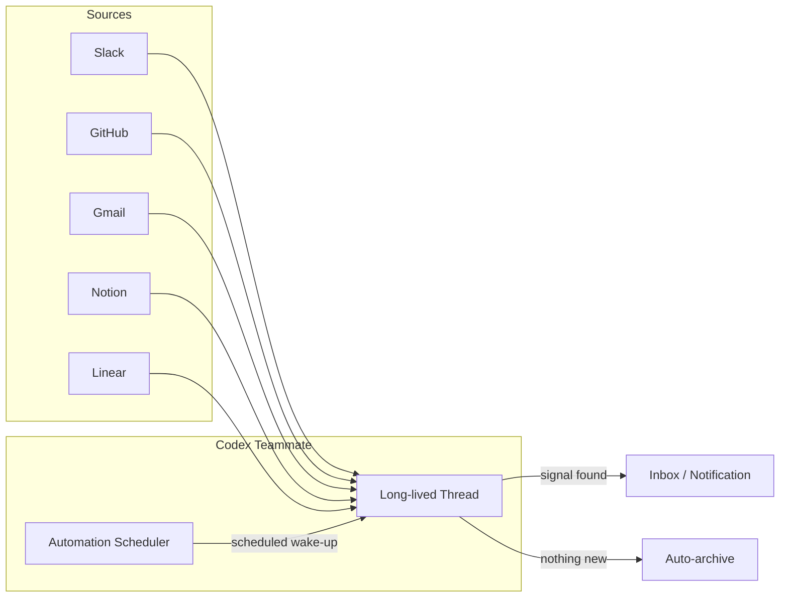
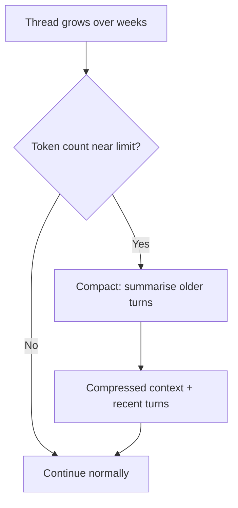

# Codex as a Proactive Teammate: Thread Automations, Scheduled Monitoring, and Durable Views


---

Most developers still treat Codex as a reactive tool: open a session, issue a prompt, close the session. But a quieter pattern has been maturing since the proactive memory and thread automation features shipped in the Codex App and the `codex exec` non-interactive mode stabilised in the CLI[^1]. The pattern is simple: **teach Codex what matters once, then let it watch for changes on a schedule**. OpenAI now documents this as the "Set up a teammate" use case[^2] — a durable, long-running agent thread that monitors your work across tools, surfaces what needs attention, and proposes concrete next steps.

This article walks through the architecture, configuration, and practical recipes for turning Codex into a proactive teammate — whether you work in the Codex App with its built-in automations panel or run headless `codex exec` jobs from cron on a server.

## The Teammate Model

A Codex teammate is a long-lived thread that satisfies three properties:

1. **Connected context** — plugins or MCP servers wired to the sources where work happens (Slack, GitHub, Gmail, Notion, Linear, local file systems).
2. **Learned priorities** — feedback loops that teach the thread what counts as signal versus noise.
3. **Scheduled wake-ups** — automations that send Codex back through those sources on a cadence, posting a message only when something warrants attention[^2].



The thread persists across sessions. Because Codex supports conversation compaction, the same thread can accumulate weeks of corrections and priority adjustments without hitting context limits[^3].

## Setting Up a Teammate in the Codex App

### Step 1: Connect Plugins

Open the Codex App and enable the plugins for every tool that holds your work context. For a typical engineering lead, that means:

| Plugin | What It Provides |
|--------|-----------------|
| **Slack** | Channel messages, threads, ownership changes, blockers |
| **GitHub** | PRs, issues, CI status, review requests |
| **Gmail** | Reply-worthy threads, cross-referenced against workstreams |
| **Google Calendar** | Meeting schedule for prioritising urgency |
| **Notion** | Project trackers, decision logs, specs |
| **Linear** | Sprint boards, issue state changes |

You can also wire MCP servers for tools without first-party plugins — any MCP server that exposes read tools works[^4].

### Step 2: Run the First Manual Check

Start a new thread and use a prompt like the one OpenAI recommends:

```
Can you check @slack, @gmail, @google-calendar, and @notion and tell me
what needs my attention? Look for anything important or surprising that
I might miss.
```

Codex traverses each source, compiles a summary, and returns findings grouped by urgency[^2].

### Step 3: Teach It What Matters

This is the critical feedback loop. After each check-in, tell Codex explicitly:

- "The deploy alert was useful — always flag those."
- "I don't need to know about #random channel activity."
- "Sarah already handles billing issues — skip those unless they escalate."

These corrections persist in the thread's compacted context. Over several iterations, the signal-to-noise ratio improves dramatically[^2].

### Step 4: Add an Automation

Convert the thread into a scheduled automation:

```
Keep an eye on these sources and let me know if anything useful pops up.
Check every weekday morning at 9 AM.
```

Alternatively, open the Automations panel in the sidebar, name the automation, select the project scope, and set the schedule. The Codex App supports preset intervals (daily, weekly), minute-based intervals for active monitoring loops, and custom cron syntax for non-standard cadences[^5].

### Step 5: Ongoing Refinement

Use the same thread for ad-hoc questions between scheduled runs. Ask Codex to draft replies, summarise threads, or propose action items. The thread accumulates context about your role, your team, and your preferences — becoming a genuinely useful teammate rather than a stateless assistant[^2].

## Automation Types and When to Use Each

The Codex App offers two automation models[^5]:

### Standalone Automations

Standalone automations start fresh runs on a schedule, report results in the Triage inbox, and are ideal when each run should be independent or span multiple projects. Use these for broad-sweep checks: "Scan all repos for stale PRs older than 5 days."

### Thread Automations

Thread automations are heartbeat-style recurring wake-up calls attached to a specific thread[^5]. They preserve thread context across scheduled runs, making them ideal for the teammate pattern. The thread remembers previous findings, your corrections, and the evolving priority model.

| Characteristic | Standalone | Thread |
|---------------|-----------|--------|
| Context persistence | None (fresh each run) | Full (compacted thread) |
| Best for | Independent sweeps | Ongoing monitoring |
| Output | Triage inbox | Thread message |
| Scheduling | Cron syntax, presets | Minute intervals, presets |

## The CLI Equivalent: `codex exec` + Cron

For teams that prefer headless, terminal-first automation — or need to run on a CI server — `codex exec` is the CLI counterpart to the App's automations[^6]. It runs a single task non-interactively and exits with a meaningful exit code.

### Basic Cron Setup

```bash
# Check for stale PRs every weekday at 09:00
0 9 * * 1-5 /usr/local/bin/codex exec \
  "Check GitHub for PRs older than 3 days without review. \
   List them with author, age, and suggested reviewer." \
  --output-schema /opt/codex/schemas/stale-prs.json \
  -o /var/log/codex/stale-prs-$(date +\%Y\%m\%d).json \
  2>> /var/log/codex/exec.log
```

### Structured Output for Downstream Pipelines

The `--output-schema` flag constrains Codex's final response to a JSON Schema, making the output machine-parseable for downstream tools[^6]:

```json
{
  "type": "object",
  "properties": {
    "findings": {
      "type": "array",
      "items": {
        "type": "object",
        "properties": {
          "source": { "type": "string" },
          "summary": { "type": "string" },
          "urgency": { "type": "string", "enum": ["high", "medium", "low"] },
          "suggested_action": { "type": "string" }
        },
        "required": ["source", "summary", "urgency"]
      }
    },
    "nothing_to_report": { "type": "boolean" }
  },
  "required": ["findings", "nothing_to_report"],
  "additionalProperties": false
}
```

### Exit Code Semantics

`codex exec` exits with a non-zero code on failure, which CI/CD pipelines and monitoring systems can gate on[^6]. Pair this with a simple wrapper script:

```bash
#!/usr/bin/env bash
# codex-teammate-check.sh
set -euo pipefail

RESULT=$(codex exec "$PROMPT" --output-schema "$SCHEMA" 2>/dev/null)
NOTHING=$(echo "$RESULT" | jq -r '.nothing_to_report')

if [ "$NOTHING" = "true" ]; then
  echo "No findings — skipping notification."
  exit 0
fi

# Forward findings to Slack webhook
echo "$RESULT" | jq -c '.findings[]' | while read -r finding; do
  curl -s -X POST "$SLACK_WEBHOOK" \
    -H 'Content-Type: application/json' \
    -d "{\"text\": \"$(echo "$finding" | jq -r '.summary')\"}"
done
```

## Security Considerations

### Sandbox Modes for Automations

Background automations carry elevated risk because they run without human oversight. The Codex App supports three sandbox modes for automations[^5]:

- **Read-only** — tool calls fail if they attempt file modifications, network access, or application interaction. Safest for monitoring-only teammates.
- **Workspace-write** — allows file writes within the project directory; blocks network access and external app interaction unless explicitly allowlisted.
- **Full access** — permits file changes, command execution, and network access without approval. Use with caution and only when organisation policy permits.

For the proactive teammate pattern, **read-only** is sufficient in most cases. The teammate reads from connected sources and reports findings — it does not need to modify files or execute commands.

### Enterprise Guardrails

Managed environments can enforce restrictions through `requirements.toml`[^7]:

```toml
# Restrict automations to read-only in production
allowed_sandbox_modes = ["read-only"]
allowed_approval_policies = ["on-request"]
```

This prevents individual developers from granting full access to background automations, which is critical for organisations handling sensitive data.

## Practical Teammate Recipes

### Recipe 1: Deploy Watcher

Monitor deployment pipelines and alert when a deploy fails or takes unusually long.

```
Watch our GitHub Actions workflows in the main repo. Every 30 minutes,
check for:
1. Failed workflow runs in the last hour
2. Runs that have been queued for more than 15 minutes
3. Successful deploys (just note them briefly)
Flag failures as high urgency. Include the run URL and failure step.
```

### Recipe 2: PR Review Staleness Monitor

Surface PRs that have gone unreviewed, using calendar context to route them appropriately.

```
Every weekday at 10 AM, check GitHub for:
- PRs open more than 48 hours without a review
- PRs where the author has responded to review comments but no re-review
  has happened
- Draft PRs that have been draft for more than a week
Cross-reference with @google-calendar to see who is on leave.
Suggest specific reviewers based on file ownership.
```

### Recipe 3: Documentation Freshness Checker

Catch documentation that has drifted from the code it describes.

```
Every Monday at 8 AM, compare the README files and docs/ folder against
recent code changes in the last 7 days. Flag any documentation that
references functions, endpoints, or configuration keys that have been
renamed or removed. Include the specific file paths and line numbers.
```

### Recipe 4: Cross-Tool Context Synthesiser

The most powerful teammate pattern: synthesise context across multiple tools to surface patterns no single tool reveals.

```
Every morning at 8:30 AM, check:
- @slack for any threads mentioning my name or my team's projects
- @github for PRs assigned to me or my direct reports
- @linear for issues that moved to "blocked" or "needs review"
- @notion for any changes to our team's project tracker

Synthesise a brief morning digest. Group by project. Highlight anything
that looks like it needs my input today. Skip routine status updates
unless they represent a state change.
```

## Compaction and Long-Lived Threads

Thread automations accumulate context over time. Without management, the thread would eventually exceed the context window. Codex handles this through automatic compaction: when the token count approaches the model's limit, the system replaces older conversation history with a compressed summary that preserves key decisions and learned preferences[^3].



For the teammate pattern, compaction is essential. The thread's value comes from accumulated corrections and priority adjustments. Compaction preserves these while discarding the verbose details of individual check-ins that are no longer relevant[^3].

## Limitations and Caveats

- **App must be running** for project-scoped automations. If the Codex App is closed, scheduled automations will not execute until it restarts[^5].
- **Frequent schedules accumulate worktrees.** Standalone automations that run every 30 minutes can generate many worktrees over time. Archive automation runs you no longer need[^5].
- **Plugin availability varies.** Not all tools have first-party Codex plugins. For unsupported tools, wire an MCP server — any server that exposes read-capable tools works with the teammate pattern[^4].
- **Compaction is lossy.** While compaction preserves key decisions, subtle nuances from early corrections may be lost over many compaction cycles. Periodically review and reinforce important preferences.
- **CLI teammates lack thread persistence.** `codex exec` runs are stateless by default. To approximate thread persistence in the CLI, pipe previous findings into the next run via `--stdin` or maintain a summary file that the prompt references.

## When Not to Use the Teammate Pattern

The teammate pattern works best for monitoring, synthesis, and triage — tasks where the output is a report or recommendation. It is less suitable for:

- **Autonomous code changes** — use goal workflows or standalone automations in workspace-write mode instead.
- **One-shot tasks** — if the task is not recurring, a regular `codex exec` invocation or interactive session is simpler.
- **Latency-sensitive alerting** — Codex automations run on a schedule (minimum: minute-based intervals). For sub-minute alerting, traditional monitoring tools (PagerDuty, Datadog, Grafana Alertmanager) are more appropriate.

## Conclusion

The shift from reactive tool to proactive teammate is the most significant workflow change Codex has introduced since non-interactive mode. A well-configured teammate thread — connected to your tools, trained on your priorities, and waking up on a schedule — eliminates the cognitive overhead of monitoring multiple platforms manually. It does not replace specialised monitoring infrastructure, but it fills the gap between "I need PagerDuty for production alerts" and "I wish someone would tell me about that stale PR before standup."

Start with one thread, one source, and one daily check-in. Refine from there.

## Citations

[^1]: OpenAI, "Changelog — Codex", developers.openai.com/codex/changelog, accessed May 2026. Thread automations and proactive memory features documented across v0.121.0 and later releases.
[^2]: OpenAI, "Set up a teammate — Codex use cases", developers.openai.com/codex/use-cases/proactive-teammate, accessed May 2026.
[^3]: OpenAI, "Features — Codex CLI", developers.openai.com/codex/cli/features, accessed May 2026. Documents context compaction for long-running conversations.
[^4]: OpenAI, "Model Context Protocol — Codex", developers.openai.com/codex/mcp, accessed May 2026. MCP server configuration for extending Codex with external tools.
[^5]: OpenAI, "Automations — Codex app", developers.openai.com/codex/app/automations, accessed May 2026. Documents standalone and thread automations, scheduling options, sandbox modes, and best practices.
[^6]: OpenAI, "Non-interactive mode — Codex", developers.openai.com/codex/noninteractive, accessed May 2026. Documents `codex exec`, `--output-schema`, exit code semantics, and CI/CD integration patterns.
[^7]: OpenAI, "Managed configuration — Codex", developers.openai.com/codex/enterprise/managed-configuration, accessed May 2026. Documents `requirements.toml` enterprise guardrails.
