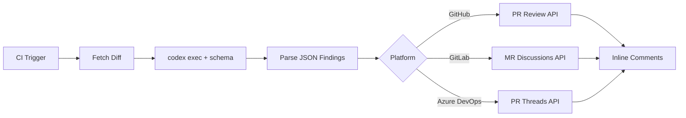

# Building Custom Code Review Pipelines with the Codex SDK: Structured Findings Across GitHub, GitLab, and Azure DevOps


---

Codex ships with built-in GitHub pull request review — enable it in settings and every PR gets an automatic `@codex review` pass [^1]. For teams on GitHub who only need that, the built-in integration is the shortest path. But the moment you need reviews on GitLab, Azure DevOps, Bitbucket, or a self-hosted forge — or you want to feed findings into a custom dashboard, compliance pipeline, or defect-tracking system — you need to build your own.

This article walks through the architecture of a custom Codex-powered code review pipeline: the SDK surface, the structured output schema that makes findings machine-parseable, and concrete CI/CD recipes for the three major platforms.

## Why Build Custom Review Pipelines

The built-in Codex GitHub review is opinionated by design. It posts inline comments, gives a verdict, and moves on [^1]. That works for many teams, but several common scenarios fall outside its scope:

- **Non-GitHub forges.** GitLab, Azure DevOps, and Bitbucket Server have no native Codex review integration [^2].
- **Custom finding schemas.** Security teams often need findings in CodeClimate, SARIF, or internal formats for aggregation dashboards [^3].
- **Layered review policies.** Enterprise pipelines may require findings routed through separate approval gates — security findings to the AppSec team, performance findings to SRE, style findings to the author [^4].
- **Audit and compliance.** Regulated environments need review artefacts stored with tamper-evident checksums, not just ephemeral PR comments [^5].

The Codex SDK and `codex exec` non-interactive mode give you the primitives to cover all of these.

## The Codex SDK: Two Languages, One Pattern

The SDK is available in TypeScript and Python [^6]. Both wrap the Codex CLI binary and communicate over a JSONL event stream (for `codex exec`) or JSON-RPC 2.0 (for the persistent app-server) [^6].

### TypeScript

```bash
npm install @openai/codex-sdk
```

```typescript
import { Codex } from "@openai/codex-sdk";

const codex = new Codex();
const thread = codex.startThread();
const result = await thread.run(
  "Review the diff in STDIN for correctness, security, and performance issues."
);
console.log(result);
```

The TypeScript SDK requires Node.js 18+ and spawns the Codex CLI as a child process [^6].

### Python

```bash
pip install codex-sdk-py
```

```python
from codex import Codex

with Codex() as codex:
    thread = codex.thread_start(model="gpt-5.5")
    result = thread.run(
        "Review the diff for correctness, security, and performance issues."
    )
    print(result)
```

The Python SDK supports both synchronous and asynchronous contexts via `AsyncCodex` [^6]. For CI/CD runners where you want fire-and-forget execution, `codex exec` is simpler than the full SDK — it runs a single prompt, streams progress to stderr, and prints the final output to stdout [^7].

## Designing the Structured Output Schema

The key to machine-parseable review output is `--output-schema`, which constrains the model's final response to a JSON Schema you define [^7]. OpenAI's cookbook recommends GPT-5.5 for code review accuracy and consistency [^2].

Here is a minimal but production-useful schema:

```json
{
  "$schema": "https://json-schema.org/draft/2020-12/schema",
  "type": "object",
  "properties": {
    "findings": {
      "type": "array",
      "items": {
        "type": "object",
        "properties": {
          "title": { "type": "string" },
          "body": { "type": "string" },
          "confidence_score": { "type": "number", "minimum": 0, "maximum": 1 },
          "priority": { "type": "integer", "minimum": 0, "maximum": 3 },
          "code_location": {
            "type": "object",
            "properties": {
              "relative_file_path": { "type": "string" },
              "line_range": {
                "type": "object",
                "properties": {
                  "start": { "type": "integer" },
                  "end": { "type": "integer" }
                },
                "required": ["start", "end"]
              }
            },
            "required": ["relative_file_path", "line_range"]
          }
        },
        "required": ["title", "body", "confidence_score", "priority", "code_location"]
      }
    },
    "overall_correctness": {
      "type": "string",
      "enum": ["patch is correct", "patch is incorrect"]
    },
    "overall_explanation": { "type": "string" },
    "overall_confidence_score": { "type": "number", "minimum": 0, "maximum": 1 }
  },
  "required": ["findings", "overall_correctness", "overall_explanation", "overall_confidence_score"],
  "additionalProperties": false
}
```

Save this as `codex-review-schema.json` in your repository root. The `priority` field uses a 0–3 scale: 0 = informational, 1 = low, 2 = medium, 3 = critical [^2]. The `confidence_score` lets downstream tooling filter noisy findings — a common pattern is to suppress anything below 0.7 in automated comments and surface low-confidence items in a digest instead.

### Known Caveat: MCP and Tool Conflicts

When MCP servers or tools are active in the request context, the model can silently ignore `--output-schema` constraints [^8]. For review pipelines, run `codex exec` without MCP servers enabled — pass `--no-mcp` or ensure no MCP configuration is present in the runner's environment. This is a known issue tracked in GitHub Issue #15451 [^8].

## The Review Flow



The pattern is identical across platforms: fetch the diff, pipe it to `codex exec` with the output schema, parse the resulting JSON, and post findings through the platform's API.

## GitHub Actions Recipe

For GitHub, the official `openai/codex-action` provides a thin wrapper [^2]:


```yaml
name: Codex Review
on:
  pull_request:
    types: [opened, synchronize]

permissions:
  contents: read
  pull-requests: write

jobs:
  review:
    runs-on: ubuntu-latest
    steps:
      - uses: actions/checkout@v4
        with:
          fetch-depth: 0

      - name: Generate diff
        run: |
          git diff origin/${{ github.base_ref }}...HEAD > /tmp/pr.diff

      - name: Codex review
        uses: openai/codex-action@main
        with:
          openai-api-key: ${{ secrets.OPENAI_API_KEY }}
          prompt-file: .codex/review-prompt.md
          output-schema-file: codex-review-schema.json
          sandbox: read-only
          model: gpt-5.5

      - name: Post findings
        uses: actions/github-script@v7
        with:
          script: |
            const fs = require('fs');
            const findings = JSON.parse(fs.readFileSync('codex-output.json', 'utf8'));
            for (const f of findings.findings) {
              await github.rest.pulls.createReviewComment({
                owner: context.repo.owner,
                repo: context.repo.repo,
                pull_number: context.issue.number,
                body: `**${f.title}** (priority: ${f.priority}, confidence: ${f.confidence_score})\n\n${f.body}`,
                path: f.code_location.relative_file_path,
                start_line: f.code_location.line_range.start,
                line: f.code_location.line_range.end,
              });
            }
```


The `sandbox: read-only` flag prevents the review agent from modifying files — it can only read the repository and produce findings [^9].

## GitLab CI/CD Recipe

GitLab requires installing the Codex binary directly since there is no native GitLab integration [^3]:

```yaml
codex_review:
  stage: review
  image: node:22-slim
  rules:
    - if: '$CI_PIPELINE_SOURCE == "merge_request_event"'
    - if: '$CI_PIPELINE_SOURCE == "merge_request_event" && $CI_MERGE_REQUEST_SOURCE_PROJECT_ID != $CI_PROJECT_ID'
      when: never
  script:
    - apt-get update && apt-get install -y git ca-certificates
    - npm install -g @openai/codex@latest
    - git diff origin/$CI_MERGE_REQUEST_TARGET_BRANCH_NAME...HEAD > /tmp/mr.diff
    - |
      codex exec \
        --model gpt-5.5 \
        --output-schema codex-review-schema.json \
        --sandbox read-only \
        --no-mcp \
        "Review the diff in /tmp/mr.diff. Focus on correctness, security, and performance." \
        > codex-output.json
    - |
      node -e "
        const https = require('https');
        const findings = require('./codex-output.json');
        for (const f of findings.findings.filter(f => f.priority >= 2)) {
          const body = JSON.stringify({
            body: '**' + f.title + '** (P' + f.priority + ')\n\n' + f.body +
                  '\n\n📍 ' + f.code_location.relative_file_path +
                  ':' + f.code_location.line_range.start + '-' + f.code_location.line_range.end
          });
          const req = https.request({
            hostname: 'gitlab.com',
            path: '/api/v4/projects/${CI_PROJECT_ID}/merge_requests/${CI_MERGE_REQUEST_IID}/discussions',
            method: 'POST',
            headers: {
              'Content-Type': 'application/json',
              'PRIVATE-TOKEN': process.env.GITLAB_TOKEN,
              'Content-Length': Buffer.byteLength(body)
            }
          });
          req.write(body);
          req.end();
        }
      "
  artifacts:
    paths:
      - codex-output.json
    expire_in: 14 days
```

Note the fork protection rule: merge requests from forked projects are skipped to prevent API key exfiltration [^3]. The pipeline strips ANSI escape codes and validates JSON before posting to prevent injection via malformed output [^3].

## Azure DevOps Recipe

Azure DevOps uses the Pull Request Threads API for inline comments [^2]:

```yaml
trigger: none

pr:
  branches:
    include:
      - main

pool:
  vmImage: 'ubuntu-latest'

steps:
  - checkout: self
    fetchDepth: 0

  - task: NodeTool@0
    inputs:
      versionSpec: '22.x'

  - script: |
      npm install -g @openai/codex@latest
      git diff origin/main...HEAD > /tmp/pr.diff
      codex exec \
        --model gpt-5.5 \
        --output-schema codex-review-schema.json \
        --sandbox read-only \
        --no-mcp \
        "Review the diff in /tmp/pr.diff for correctness, security, and performance." \
        > $(Build.ArtifactStagingDirectory)/codex-output.json
    displayName: 'Run Codex Review'
    env:
      OPENAI_API_KEY: $(OPENAI_API_KEY)

  - script: |
      node -e "
        const findings = require('$(Build.ArtifactStagingDirectory)/codex-output.json');
        const threads = findings.findings
          .filter(f => f.priority >= 2)
          .map(f => ({
            comments: [{ content: '**' + f.title + '**\n\n' + f.body, commentType: 1 }],
            threadContext: {
              filePath: '/' + f.code_location.relative_file_path,
              rightFileStart: { line: f.code_location.line_range.start },
              rightFileEnd: { line: f.code_location.line_range.end }
            },
            status: f.priority >= 3 ? 1 : 0
          }));
        console.log(JSON.stringify(threads));
      " | xargs -I{} curl -s -X POST \
        '$(System.CollectionUri)$(System.TeamProject)/_apis/git/repositories/$(Build.Repository.Name)/pullRequests/$(System.PullRequest.PullRequestId)/threads?api-version=7.1' \
        -H 'Authorization: Bearer $(System.AccessToken)' \
        -H 'Content-Type: application/json' \
        -d '{}'
    displayName: 'Post Review Threads'
```

The `threadContext` object anchors each comment to the correct file and line range in the PR diff view [^2].

## Security Hardening

Running Codex in CI/CD requires deliberate security boundaries:

1. **Read-only sandbox.** Always pass `--sandbox read-only` for review jobs. The agent should never modify the repository during review [^9].
2. **Drop privileges.** On self-hosted runners, drop sudo permissions before invoking Codex to prevent credential exfiltration [^2].
3. **Fork protection.** Skip review jobs on forked merge requests or pull requests from external contributors — the fork does not have access to your secrets, but a compromised fork could manipulate the diff to extract them through the review prompt [^3].
4. **Output validation.** Always validate the JSON output before feeding it to platform APIs. Strip ANSI escape codes, check for valid JSON structure, and reject outputs that contain unexpected fields [^3].
5. **Disable MCP.** Pass `--no-mcp` to prevent the review agent from connecting to any MCP servers configured in the runner environment. Review agents should have zero external tool access [^8].

## Model Selection for Review

OpenAI explicitly recommends GPT-5.5 for code review pipelines [^2]. In practice:

| Model | Accuracy | Speed | Cost | Best For |
|-------|----------|-------|------|----------|
| GPT-5.5 | Highest | Moderate | Higher | Security-critical reviews, compliance |
| GPT-5.2-Codex | High | Faster | Moderate | General correctness reviews [^10] |
| GPT-5.3-Codex-Spark | Good | Fastest | Lowest | High-throughput pre-commit checks [^11] |

For most teams, GPT-5.5 on merge-to-main PRs and Spark for pre-commit or draft PR quick-scans strikes the right balance between thoroughness and token spend.

## Filtering and Routing Findings

Raw findings from the model include confidence scores and priorities. A production pipeline should filter before posting:

```typescript
const actionable = findings.findings.filter(
  (f) => f.confidence_score >= 0.7 && f.priority >= 2
);

const securityFindings = actionable.filter((f) =>
  f.title.toLowerCase().includes("security") ||
  f.title.toLowerCase().includes("injection") ||
  f.title.toLowerCase().includes("auth")
);

const performanceFindings = actionable.filter((f) =>
  f.title.toLowerCase().includes("performance") ||
  f.title.toLowerCase().includes("n+1") ||
  f.title.toLowerCase().includes("complexity")
);
```

Route `securityFindings` to your AppSec channel, `performanceFindings` to the SRE team, and post everything else as standard PR comments. The structured schema makes this trivial — without it, you are parsing free-text comments with regex.

## Limitations

- **Output schema and MCP conflicts.** As noted, `--output-schema` can be silently ignored when MCP servers are active. Always disable MCP for review jobs [^8].
- **Large diffs.** Diffs exceeding the model's context window will be truncated. For monorepo PRs with hundreds of changed files, consider splitting the review into per-package or per-directory `codex exec` calls and merging the findings [^7].
- **Structured output on resume.** The `--output-schema` flag is not yet supported with `codex exec resume`, limiting the ability to checkpoint long reviews [^12].
- **Rate limits.** High-throughput pipelines hitting hundreds of PRs per hour will encounter API rate limits. Implement exponential backoff and consider batching smaller PRs [^7].

## What Comes Next

The 0.131.0 alpha line includes 65 new features [^13], and the SDK surface is expanding rapidly. Watch for first-class SARIF output support, which would eliminate the need for custom schema-to-SARIF transforms, and for improved `--output-schema` reliability when tools are present.

For now, the pattern described here — `codex exec` with a structured schema, platform-specific posting, and disciplined security boundaries — gives you a code review pipeline that works wherever your repositories live.

## Citations

[^1]: OpenAI, "Code review in GitHub – Codex," developers.openai.com/codex/integrations/github (accessed 15 May 2026).
[^2]: OpenAI, "Build Code Review with the Codex SDK," developers.openai.com/cookbook/examples/codex/build_code_review_with_codex_sdk (accessed 15 May 2026).
[^3]: OpenAI, "Automating Code Quality and Security Fixes with Codex CLI on GitLab," developers.openai.com/cookbook/examples/codex/secure_quality_gitlab (accessed 15 May 2026).
[^4]: OpenAI, "Agent approvals & security – Codex," developers.openai.com/codex/agent-approvals-security (accessed 15 May 2026).
[^5]: OpenAI, "Running Codex safely at OpenAI," openai.com/index/running-codex-safely/ (accessed 15 May 2026).
[^6]: OpenAI, "SDK – Codex," developers.openai.com/codex/sdk (accessed 15 May 2026).
[^7]: OpenAI, "Non-interactive mode – Codex," developers.openai.com/codex/noninteractive (accessed 15 May 2026).
[^8]: GitHub, "Issue #15451: --json and --output-schema are silently ignored when tools/MCP servers are active," github.com/openai/codex/issues/15451 (accessed 15 May 2026).
[^9]: OpenAI, "Best practices – Codex," developers.openai.com/codex/learn/best-practices (accessed 15 May 2026).
[^10]: OpenAI, "Introducing GPT-5.2-Codex," openai.com/index/introducing-gpt-5-2-codex/ (accessed 15 May 2026).
[^11]: OpenAI/Cerebras, "Introducing GPT-5.3-Codex-Spark," openai.com/index/introducing-gpt-5-3-codex-spark/ (accessed 15 May 2026).
[^12]: GitHub, "Issue #14343: Add --output-schema support to codex exec resume," github.com/openai/codex/issues/14343 (accessed 15 May 2026).
[^13]: GitHub, "Releases – openai/codex – 0.131.0-alpha.18," github.com/openai/codex/releases (accessed 15 May 2026).
