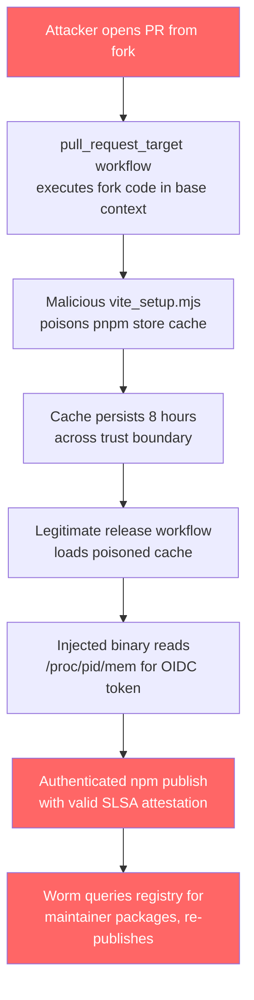
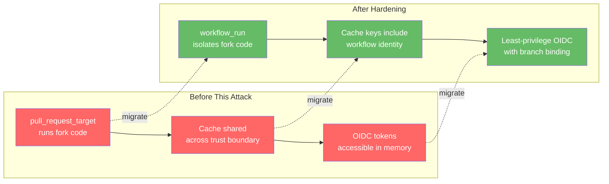

# The TanStack Supply Chain Attack: What Codex CLI Users Need to Know and How to Defend Your Pipeline


On 11 May 2026, a coordinated supply chain attack compromised 84 npm package versions across 42 `@tanstack/*` packages, then self-propagated to over 170 additional packages including Mistral AI's SDK and UiPath's automation tooling [^1][^2]. The malware—dubbed **Mini Shai-Hulud** by researchers—exfiltrated credentials from CI runners and developer machines, installed persistence mechanisms, and specifically targeted AI coding tool configurations including Claude Code session history [^3]. Two OpenAI employee devices were affected, forcing the company to re-sign every application—including Codex—across all platforms [^4].

This article dissects the attack chain, explains the direct implications for Codex CLI users, and maps Codex's existing security features to a practical defence posture against npm supply chain threats.

## The Attack Chain: Three Vulnerabilities, One Worm

The Mini Shai-Hulud campaign, attributed to threat group TeamPCP (CVE-2026-45321, GHSA-g7cv-rxg3-hmpx), chained three weaknesses in GitHub Actions to mint legitimate npm publish tokens [^1][^2]:



### Stage 1: Pwn Request

TanStack's `bundle-size.yml` workflow used the `pull_request_target` trigger, which runs fork-contributed code with the base repository's security context [^1]. The attacker's PR #7378 injected a malicious `vite_setup.mjs` script (~30,000 lines) that executed automatically without maintainer approval.

### Stage 2: Cache Poisoning

The script wrote a poisoned pnpm store (1.1 GB) to the GitHub Actions cache under the predictable key `Linux-pnpm-store-${hashFiles('**/pnpm-lock.yaml')}` [^1]. Cache writes use runner-internal tokens that are not gated by the workflow's `permissions` block—a fundamental trust boundary gap in GitHub Actions.

### Stage 3: OIDC Token Extraction

Eight hours later, when a legitimate release workflow ran, it restored the poisoned cache. Attacker-controlled binaries then read `/proc/<pid>/maps` and `/proc/<pid>/mem` to extract the runner's OIDC token, using it to authenticate direct npm publishes [^1][^2]. The resulting packages carried valid SLSA Build Level 3 attestations—provenance verification alone could not detect the compromise.

## The Payload: What the Malware Did

The 2.3 MB `router_init.js` payload, protected by three obfuscation layers (JavaScript Obfuscator, Fisher-Yates substitution cipher, AES-256-GCM encryption), executed during `npm install` and performed the following [^2][^3]:

| Capability | Detail |
|---|---|
| **Credential harvesting** | AWS IMDSv2, Secrets Manager, SSM; GCP metadata; Kubernetes service accounts; HashiCorp Vault tokens; GitHub PATs; SSH keys |
| **AI tool targeting** | `.claude/projects/*.jsonl` (session history), `.claude/settings.json` (hook injection) |
| **Editor persistence** | `.vscode/tasks.json` executing `setup.mjs` on folder open |
| **System persistence** | `gh-token-monitor` systemd service (Linux), LaunchAgent (macOS) |
| **Destructive fallback** | Wipes home directory if tokens are revoked |
| **Exfiltration** | Session/Oxen P2P network; GitHub GraphQL API dead drops |
| **Self-propagation** | Queries `registry.npmjs.org/-/v1/search?text=maintainer:<user>` and re-publishes with forged Sigstore attestations |

The malware was detected within approximately 20 minutes of publication by external researcher ashishkurmi at StepSecurity [^5].

## Impact on OpenAI and Codex CLI

OpenAI confirmed that two employee devices in the corporate environment were compromised [^4]. The key findings:

- **Signing keys for Windows, macOS, iOS, and Android were impacted** [^4]
- Limited credential material was exfiltrated from internal source code repositories
- No customer data, production systems, or deployed software was affected
- All OpenAI applications—including Codex CLI—are being re-signed with new certificates

**macOS users must update by 12 June 2026** for applications to continue functioning, as OpenAI has blocked further notarisation with the impacted certificate material [^4].

### Verifying Your Codex CLI Installation

After updating, verify the binary signature:

```bash
# macOS: verify code signature
codesign --verify --deep --strict /usr/local/bin/codex 2>&1

# macOS: check notarisation status
spctl --assess --type execute /usr/local/bin/codex

# Windows: verify Authenticode signature (PowerShell)
Get-AuthenticodeSignature "C:\Program Files\Codex\codex.exe" | Select-Object Status, SignerCertificate
```

## Defending Your Pipeline: Codex CLI's Security Layers

Codex CLI's architecture provides several built-in defences that map directly to the attack vectors exploited in this campaign.

### 1. Sandbox Isolation During Dependency Installation

Codex runs commands inside an OS-enforced sandbox. When Codex executes `npm install` or `pnpm install`, the sandbox restricts what the process can touch [^6]:

```toml
# .codex/config.toml — restrict dependency installation
sandbox_mode = "workspace-write"
approval_policy = "on-request"

[sandbox]
# Block network access to known C2 domains
blocked_domains = [
    "*.getsession.org",
    "litter.catbox.moe",
]
```

With `sandbox_mode = "workspace-write"`, any attempt by a malicious `postinstall` script to read `/proc/<pid>/mem`, access `~/.ssh/`, or write systemd services outside the workspace would be blocked at the kernel level (Seatbelt on macOS, Landlock + seccomp on Linux) [^6].

### 2. Hooks for Install-Script Governance

Codex CLI hooks can intercept shell commands before execution. A `before_command` hook can enforce `--ignore-scripts` on dependency installation [^7]:

```toml
# .codex/config.toml
[[hooks]]
event = "before_command"
match = "npm install|pnpm install|yarn install"
action = "warn"
message = "Dependency install detected. Ensure --ignore-scripts is set for untrusted packages."
```

For stricter enforcement, use pnpm v11's `strictDepBuilds = true` default, which blocks all `preinstall` and `postinstall` scripts unless explicitly allowed [^8].

### 3. Lockfile Verification with Agent Assistance

Codex can audit lockfile changes in pull requests. A practical pattern is to use `codex exec` in CI to review dependency changes:

```bash
# In your GitHub Actions workflow
codex exec --approval-policy suggest-edits \
  "Review the changes in pnpm-lock.yaml. Flag any new packages, \
   changed registries, or unexpected optionalDependencies entries. \
   Check for packages added outside the normal dependency tree."
```

The TanStack malware injected itself via an `optionalDependencies` entry pointing to a Git reference (`@tanstack/setup` → `github:tanstack/router#79ac49...`) [^1]. Codex can flag such anomalies in lockfile diffs during code review.

### 4. Network Egress Control

The Codex CLI sandbox supports domain-level network restrictions. For CI pipelines, lock down egress to only known-good registries [^6]:

```toml
# requirements.toml (admin-enforced)
[network]
allowed_domains = [
    "registry.npmjs.org",
    "registry.yarnpkg.com",
    "github.com",
    "api.github.com",
]
```

This would have prevented the malware's exfiltration to `filev2.getsession.org` and `litter.catbox.moe`.

## CI/CD Hardening Checklist

The TanStack attack exploited weaknesses in GitHub Actions that apply to every project using Codex in CI:



### Immediate Actions

1. **Audit your lockfiles** — search `node_modules` for `router_init.js` (SHA-256: `ab4fcadaec49c03278063dd269ea5eef82d24f2124a8e15d7b90f2fa8601266c`) [^2]
2. **Rotate credentials** if you installed affected packages on 11 May 2026: AWS, GCP, Kubernetes, Vault, GitHub, npm, and SSH keys [^1]
3. **Disable the dead-man's switch first** — the malware wipes `$HOME` if it detects token revocation; remove editor persistence hooks in `.claude/` and `.vscode/` before rotating credentials [^2]
4. **Update Codex CLI** to the latest re-signed build and verify the signature

### Structural Hardening

| Defence | Implementation |
|---|---|
| **Replace `pull_request_target`** | Use `workflow_run` triggered by `pull_request` to isolate fork code from base secrets [^1] |
| **Pin actions to commit SHAs** | Replace `uses: actions/cache@v4` with `uses: actions/cache@hash` [^1] |
| **Block install scripts by default** | Use pnpm's `strictDepBuilds = true` or npm's `--ignore-scripts` [^8] |
| **Add `repository_owner` guards** | Reject workflow runs from forks with mismatched owners [^1] |
| **Set npm minimum release age** | Configure `npm config set min-release-age 7d` to delay consumption of newly published versions [^5] |
| **Bind OIDC trusted publishers** | Pin to specific branch and workflow file [^1] |
| **Implement Codex CLI dependency hooks** | Use `before_command` hooks to gate dependency operations [^7] |

## The Provenance Paradox

The most unsettling aspect of this attack: the malicious packages carried **valid SLSA Build Level 3 provenance attestations** [^2]. The attacker minted legitimate OIDC tokens from the real CI pipeline, so every attestation checked out. This breaks a common assumption in supply chain security: that provenance verification equals trust.

The lesson for Codex CLI users is clear: provenance answers *which pipeline built this artifact*, not *whether the pipeline was compromised*. Defence-in-depth remains essential—sandboxing, install-script blocking, lockfile auditing, and network egress control must work together.

## Key Takeaways

1. **Update Codex CLI immediately** and verify signatures; macOS users face a 12 June 2026 deadline [^4]
2. **Run dependency installations inside Codex's sandbox** with `workspace-write` mode to contain malicious install scripts
3. **Block install scripts by default** using pnpm's `strictDepBuilds` or npm's `--ignore-scripts`
4. **Audit lockfile diffs with Codex** — the malware's injection point was an anomalous `optionalDependencies` entry
5. **SLSA provenance is necessary but not sufficient** — it cannot detect compromised-pipeline attacks
6. **Harden your GitHub Actions**: eliminate `pull_request_target`, pin actions to SHAs, bind OIDC publishers to specific branches

The npm ecosystem's trust model was stress-tested to breaking point on 11 May. Codex CLI's sandbox, hooks, and network controls provide genuine defence layers—but only if they are configured and enforced before the next worm arrives.

## Citations

[^1]: TanStack, "Postmortem: TanStack npm supply-chain compromise," *TanStack Blog*, 12 May 2026. [https://tanstack.com/blog/npm-supply-chain-compromise-postmortem](https://tanstack.com/blog/npm-supply-chain-compromise-postmortem)

[^2]: Snyk, "TanStack npm Packages Hit by Mini Shai-Hulud," *Snyk Blog*, 12 May 2026. [https://snyk.io/blog/tanstack-npm-packages-compromised/](https://snyk.io/blog/tanstack-npm-packages-compromised/)

[^3]: Wiz, "Mini Shai-Hulud Strikes Again: TanStack + more npm Packages Compromised," *Wiz Blog*, 12 May 2026. [https://www.wiz.io/blog/mini-shai-hulud-strikes-again-tanstack-more-npm-packages-compromised](https://www.wiz.io/blog/mini-shai-hulud-strikes-again-tanstack-more-npm-packages-compromised)

[^4]: OpenAI, "Our response to the TanStack npm supply chain attack," *OpenAI Blog*, 14 May 2026. [https://openai.com/index/our-response-to-the-tanstack-npm-supply-chain-attack/](https://openai.com/index/our-response-to-the-tanstack-npm-supply-chain-attack/)

[^5]: StepSecurity, "TeamPCP's Mini Shai-Hulud Is Back: A Self-Spreading Supply Chain Attack," *StepSecurity Blog*, 11 May 2026. [https://www.stepsecurity.io/blog/mini-shai-hulud-is-back-a-self-spreading-supply-chain-attack-hits-the-npm-ecosystem](https://www.stepsecurity.io/blog/mini-shai-hulud-is-back-a-self-spreading-supply-chain-attack-hits-the-npm-ecosystem)

[^6]: OpenAI, "Agent approvals & security," *Codex Developer Docs*, 2026. [https://developers.openai.com/codex/agent-approvals-security](https://developers.openai.com/codex/agent-approvals-security)

[^7]: OpenAI, "Hooks," *Codex Developer Docs*, 2026. [https://developers.openai.com/codex/hooks](https://developers.openai.com/codex/hooks)

[^8]: Mondoo, "npm Supply Chain Security in 2026: What Your Package Manager Does (and Doesn't) Protect You From," *Mondoo Blog*, May 2026. [https://mondoo.com/blog/npm-supply-chain-security-package-manager-defenses-2026](https://mondoo.com/blog/npm-supply-chain-security-package-manager-defenses-2026)
