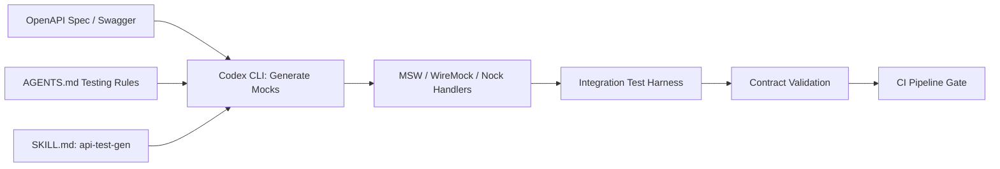
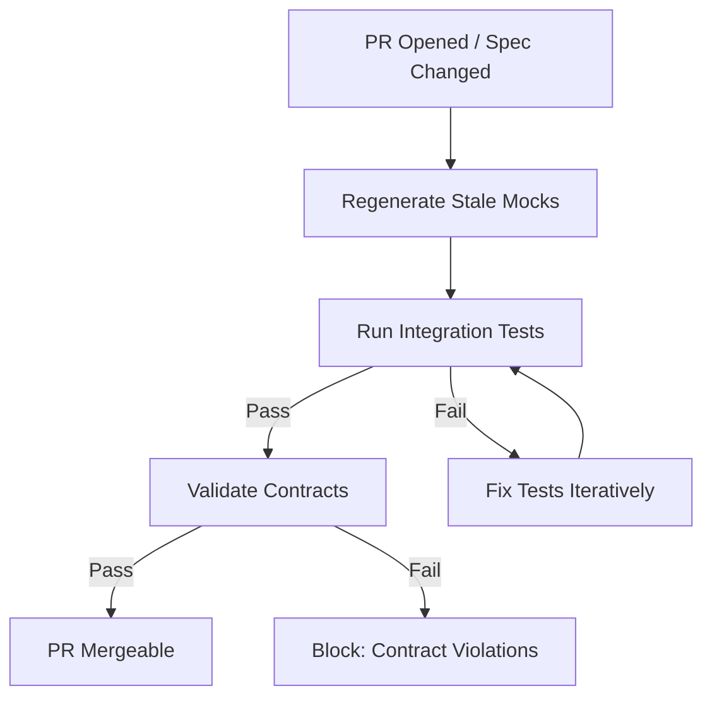

# Codex CLI for API Integration Testing: Agent-Driven Mock Generation, Contract Validation, and Test Harness Automation


---

Unit tests verify components in isolation. End-to-end tests verify the full stack. Between them sits integration testing — the practice of validating that your services communicate correctly across API boundaries. It is also the layer most teams under-invest in, because writing realistic mocks, maintaining contract fidelity, and keeping test harnesses current as APIs evolve is tedious, repetitive work. Codex CLI is exceptionally well suited to automating precisely that kind of tedium.

This article covers a practical workflow for using Codex CLI to generate API integration test harnesses, create and maintain mock services, validate API contracts, and run the whole pipeline non-interactively in CI — using current features as of CLI 0.130.0 and models available in May 2026.

## The Integration Testing Gap

Most senior developers know the pattern: your service calls three downstream APIs, each with dozens of endpoints. You write a handful of integration tests with hand-rolled mocks, they drift out of sync within weeks, and eventually the test suite is either skipped or deleted. The root cause is maintenance cost — every upstream API change requires updating mocks, assertions, and test fixtures in lockstep.

Codex CLI addresses this by treating mock generation as a repeatable, agent-driven task rather than a one-time manual effort.

## Architecture Overview



The workflow has four stages: mock generation from API specifications, test harness scaffolding, contract validation against live schemas, and non-interactive CI execution via `codex exec`.

## Stage 1: Mock Generation from OpenAPI Specs

If your upstream APIs publish OpenAPI specifications — and they should — Codex can generate framework-specific mock handlers directly from the spec.

### MSW (TypeScript/JavaScript)

For TypeScript projects, Mock Service Worker (MSW) intercepts requests at the network level, giving you the same mock behaviour in browser tests, Node.js test runners, and React Native [^1]. Codex CLI can generate MSW handlers from an OpenAPI spec in a single prompt:

```bash
codex "Read the OpenAPI spec at ./specs/payments-api.yaml. \
Generate MSW 2.x request handlers for every endpoint. \
Use typed response factories with faker.js for realistic data. \
Write handlers to src/mocks/payments-handlers.ts and \
a server setup file to src/mocks/server.ts. \
Follow the patterns in our existing handlers at src/mocks/."
```

The key instruction is `Follow the patterns in our existing handlers` — Codex reads your codebase and matches your team's conventions rather than generating generic boilerplate [^2].

### WireMock (JVM / Language-Agnostic)

For Java, Kotlin, or polyglot services, WireMock runs as a standalone process or Docker container and serves mock responses via HTTP [^3]. Codex generates WireMock JSON stubs:

```bash
codex "Read ./specs/inventory-api.yaml. \
Generate WireMock JSON stub mappings for each endpoint \
with realistic response bodies. \
Include request matchers for required headers and query params. \
Write stubs to src/test/resources/wiremock/__files/ and \
mappings to src/test/resources/wiremock/mappings/."
```

### Nock (Node.js Unit Tests)

For lightweight Node.js tests where you want interceptors rather than a running server, Nock patches the `http` module directly [^4]:

```bash
codex "Generate nock interceptors for the endpoints in \
./specs/user-service.yaml. Group by resource. \
Include error scenarios (401, 404, 429, 500) alongside happy paths. \
Write to test/mocks/user-service.nock.ts."
```

## Stage 2: Test Harness Scaffolding

Mock handlers alone are not tests. Codex CLI generates the complete harness — setup, teardown, assertions, and edge cases — by reading your existing test patterns.

### Encoding Testing Standards in AGENTS.md

Before generating tests, encode your team's conventions in `AGENTS.md` so every Codex session follows them [^2]:

```markdown
## Integration Testing Standards

- Framework: Vitest with MSW for HTTP mocking
- File naming: `*.integration.test.ts` alongside the module under test
- Setup: import shared MSW server from `src/mocks/server.ts`
- Assertions: use `expect` with `toMatchObject` for response shapes
- Coverage: every endpoint needs happy path, auth failure, and timeout tests
- Teardown: reset handlers between tests with `server.resetHandlers()`
- No real HTTP calls — MSW server must intercept all outbound requests
```

### Generating the Harness

```bash
codex "Generate integration tests for src/services/PaymentService.ts. \
It calls the Payments API (mocked in src/mocks/payments-handlers.ts). \
Cover: successful payment, declined card, network timeout, \
idempotency key collision, and rate limiting. \
Follow the integration testing standards in AGENTS.md."
```

Codex reads `PaymentService.ts`, the mock handlers, and your `AGENTS.md` testing rules, then produces a harness that fits your codebase. The test-first verification pattern — running the tests after generation to confirm they pass — is essential [^2]:

```bash
codex "Run the integration tests you just generated with \
'npx vitest run --reporter=verbose src/services/PaymentService.integration.test.ts'. \
If any fail, fix them. Iterate until all pass."
```

## Stage 3: Contract Validation

Mocks drift. The upstream team adds a required field, renames an enum value, or changes a status code. Your mocks keep returning the old shape, and your tests pass while production breaks.

Contract validation closes this gap by checking that your mocks conform to the current API specification.

### Schema Validation Skill

Create a reusable Codex skill for contract validation:

```
.agents/skills/validate-api-contracts/
├── SKILL.md
└── validate.sh
```

**SKILL.md:**
```markdown
---
name: validate-api-contracts
description: >
  Validate mock response bodies against OpenAPI specifications.
  Use when asked to check API contracts, validate mocks, or detect schema drift.
---

## Steps

1. For each OpenAPI spec in `./specs/`:
   a. Parse all response schemas for every endpoint
   b. Find corresponding mock handlers (MSW, WireMock, or Nock)
   c. Extract mock response bodies
   d. Validate each mock body against its schema
2. Report mismatches: missing fields, wrong types, unknown properties
3. Generate a fix PR if `--fix` is specified
```

Invoke it with:

```bash
codex "$validate-api-contracts Check all payment API mocks \
against the latest spec. List any drift."
```

### Structured Output for CI

For automated pipelines, use `codex exec` with `--output-schema` to produce machine-parseable results [^5]:

```bash
codex exec \
  --sandbox read-only \
  --model gpt-5.4-mini \
  --output-schema '{"type":"object","properties":{"contracts_checked":{"type":"integer"},"violations":{"type":"array","items":{"type":"object","properties":{"endpoint":{"type":"string"},"field":{"type":"string"},"expected":{"type":"string"},"actual":{"type":"string"}}}},"passed":{"type":"boolean"}},"required":["contracts_checked","violations","passed"]}' \
  "Validate all mock handlers in src/mocks/ against specs in ./specs/. \
   Report contract violations as structured JSON."
```

This returns clean JSON that your CI pipeline can parse:

```json
{
  "contracts_checked": 47,
  "violations": [
    {
      "endpoint": "POST /payments",
      "field": "response.metadata.trace_id",
      "expected": "string (required)",
      "actual": "missing"
    }
  ],
  "passed": false
}
```

## Stage 4: CI Pipeline Integration

The full workflow — generate mocks, run tests, validate contracts — runs non-interactively with `codex exec` [^5].

### GitHub Actions Recipe

```yaml
name: API Integration Tests
on:
  pull_request:
    paths:
      - 'specs/**'
      - 'src/services/**'
      - 'src/mocks/**'

jobs:
  integration-tests:
    runs-on: ubuntu-latest
    steps:
      - uses: actions/checkout@v4

      - name: Regenerate mocks from updated specs
        uses: openai/codex-action@v1
        with:
          prompt: |
            Check if any OpenAPI specs in ./specs/ have changed
            compared to the mock handlers in src/mocks/.
            Regenerate any stale mock handlers to match current specs.
            Run 'npx vitest run --reporter=verbose **/*.integration.test.ts'
            and fix any failures.
          sandbox: workspace-write
          model: gpt-5.4

      - name: Validate contracts
        run: |
          npx @openai/codex exec \
            --sandbox read-only \
            --model gpt-5.4-mini \
            --output-schema contracts-schema.json \
            "Validate all mock handlers against OpenAPI specs. Report violations." \
            > contract-report.json

      - name: Gate on contract violations
        run: |
          if ! jq -e '.passed' contract-report.json; then
            echo "::error::Contract violations detected"
            jq '.violations[]' contract-report.json
            exit 1
          fi
```



## Model Selection for Testing Tasks

Not every testing task needs the flagship model. A practical routing strategy [^6]:

| Task | Recommended Model | Reasoning |
|---|---|---|
| Mock handler generation from OpenAPI | `gpt-5.4-mini` | Mechanical translation; speed matters |
| Integration test scaffolding | `gpt-5.4` | Needs codebase understanding |
| Contract validation | `gpt-5.4-mini` | Schema comparison is structured |
| Debugging test failures | `gpt-5.5` | Requires deep reasoning about state |
| Test maintenance after API changes | `gpt-5.4` | Balanced cost and comprehension |

Use the `--model` flag or `/model` command to switch per task, or configure model routing in `config.toml` [^6].

## Maintaining the Test Suite Over Time

The real value emerges when API specifications change. Rather than manually updating mocks, encode the regeneration as a scheduled workflow:

```bash
# Weekly mock freshness check (cron or GitHub Actions schedule)
codex exec \
  --sandbox workspace-write \
  --model gpt-5.4-mini \
  "For each OpenAPI spec in ./specs/, check if the corresponding \
   mock handlers are up to date. Regenerate any that have drifted. \
   Run integration tests to verify. Commit changes if tests pass."
```

This pattern — specification as source of truth, mocks as derived artefacts, agent as maintenance engine — eliminates the drift problem that kills most integration test suites.

## Limitations and Caveats

- **Sandbox network isolation**: Codex CLI's sandbox blocks outbound network by default [^7]. Integration tests using real HTTP clients need `--sandbox workspace-write` or network allowlisting in `config.toml`. Tests using MSW or Nock interceptors work in read-only mode because no real HTTP calls leave the process.
- **Mock fidelity**: Agent-generated mocks match the schema but may not capture subtle API behaviour (rate limiting headers, pagination cursors, conditional fields). Review generated mocks before trusting them as contract baselines.
- **Large specifications**: OpenAPI specs exceeding 50,000 tokens may need chunking. ⚠️ The agent handles most specs within a single context window, but very large monolithic specs may hit context limits with smaller models.
- **`--output-schema` and `codex exec resume`**: These two features cannot currently be combined — a known limitation tracked in GitHub Issue #14343 [^8].

## Citations

[^1]: Mock Service Worker — API mocking library for browser and Node.js. [https://mswjs.io/docs/](https://mswjs.io/docs/)
[^2]: OpenAI, "Best practices — Codex," OpenAI Developers. [https://developers.openai.com/codex/learn/best-practices](https://developers.openai.com/codex/learn/best-practices)
[^3]: WireMock — Flexible, open source API mocking. [https://wiremock.org/](https://wiremock.org/)
[^4]: Nock — HTTP server mocking and expectations library for Node.js. [https://github.com/nock/nock](https://github.com/nock/nock)
[^5]: OpenAI, "Non-interactive mode — Codex," OpenAI Developers. [https://developers.openai.com/codex/noninteractive](https://developers.openai.com/codex/noninteractive)
[^6]: OpenAI, "Models — Codex," OpenAI Developers. [https://developers.openai.com/codex/models](https://developers.openai.com/codex/models)
[^7]: OpenAI, "Agent approvals & security — Codex," OpenAI Developers. [https://developers.openai.com/codex/agent-approvals-security](https://developers.openai.com/codex/agent-approvals-security)
[^8]: GitHub Issue #14343, "Add --output-schema support to codex exec resume," openai/codex. [https://github.com/openai/codex/issues/14343](https://github.com/openai/codex/issues/14343)
