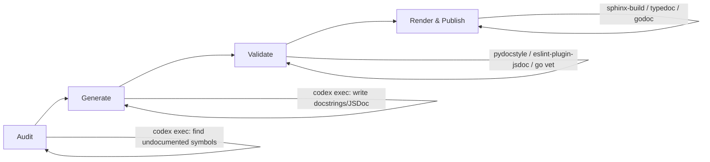

# Automated Code Documentation Generation with Codex CLI: Docstrings, JSDoc, and CI-Integrated Doc Pipelines


---

Documentation debt accumulates silently. Functions ship without docstrings, type annotations drift from reality, and README files describe architectures that no longer exist. Codex CLI offers a practical path out of this: agent-driven documentation generation that can be scoped per language, validated against your existing toolchain, and wired into CI so documentation never falls behind the code again.

This article covers a complete workflow — from one-off interactive documentation passes through to non-interactive `codex exec` pipelines and scheduled automations — with concrete examples for Python (Google-style docstrings, Sphinx), TypeScript (JSDoc, TypeDoc), and Go (godoc conventions).

## The Documentation Gap Problem

Most codebases have documentation coverage well below their test coverage. A 2025 Stack Overflow survey found that 62% of developers consider poor documentation a bigger productivity drain than technical debt in the code itself [^1]. The problem is structural: documentation is written once and never updated, or never written at all because it is not enforced.

Traditional documentation generators — Sphinx [^2], TypeDoc [^3], JSDoc [^4] — parse what exists but cannot create what is missing. They are renderers, not authors. Codex CLI bridges this gap by reading source code, understanding intent, and generating documentation that conforms to your project's conventions.

## Architecture: The Doc-Gen Pipeline

The workflow has four stages, each suitable for a different level of automation:



Each stage can run independently. The audit stage identifies gaps; the generate stage fills them; the validate stage checks conformance with your chosen style; the render stage produces the published documentation artefacts.

## Stage 1: Auditing Documentation Gaps

Before generating anything, you need to know what is missing. Codex CLI can produce a structured gap report using `--output-schema`:

```json
{
  "type": "object",
  "properties": {
    "undocumented": {
      "type": "array",
      "items": {
        "type": "object",
        "properties": {
          "file": { "type": "string" },
          "symbol": { "type": "string" },
          "kind": { "type": "string", "enum": ["function", "class", "method", "module"] },
          "line": { "type": "integer" }
        },
        "required": ["file", "symbol", "kind", "line"]
      }
    },
    "total_symbols": { "type": "integer" },
    "documented_symbols": { "type": "integer" },
    "coverage_pct": { "type": "number" }
  },
  "required": ["undocumented", "total_symbols", "documented_symbols", "coverage_pct"]
}
```

Save this as `doc-audit-schema.json`, then run:

```bash
codex exec \
  "Audit all Python files in src/ for missing docstrings. \
   Count every public function, class, and method. \
   Report undocumented symbols and overall coverage percentage." \
  --output-schema ./doc-audit-schema.json \
  -o ./doc-audit-report.json
```

The structured output gives you a machine-readable baseline. Pipe it into a dashboard, set a threshold, or use it as input to the generation stage [^5].

## Stage 2: Generating Documentation with AGENTS.md Standards

The quality of generated documentation depends entirely on the conventions you encode. An `AGENTS.md` file at the repository root sets the standard [^6]:

```markdown
## Documentation standards

- Python: Google-style docstrings (per PEP 257). Include Args, Returns,
  Raises sections. Use type annotations in signatures, not in docstrings.
- TypeScript: JSDoc with @param, @returns, @throws, @example tags.
  Preserve existing TSDoc comments. Add @see cross-references where relevant.
- Go: Package-level doc comments on every exported symbol. First sentence
  is the symbol summary. No @param tags — use prose.
- Never overwrite existing documentation. Only add missing docstrings.
- Every generated docstring must reference the function's actual behaviour,
  not its name. Read the implementation before writing.
- Include one @example or doctest per public function where feasible.
```

This file loads automatically into every Codex session and every `codex exec` invocation [^6]. It prevents the common failure mode of LLM-generated documentation: restating the function name as a sentence.

### Interactive Generation

For a focused session on a single module:

```bash
codex "Add Google-style docstrings to every undocumented public function \
  in src/payments/processor.py. Run pydocstyle --convention=google \
  on each file after editing to verify conformance."
```

Codex reads the implementation, writes the docstrings, and validates them in a single turn. The sandbox ensures `pydocstyle` runs safely [^7].

### Batch Generation with codex exec

For large-scale documentation passes, use `codex exec` with `--sandbox workspace-write`:

```bash
codex exec \
  "Find all Python files in src/ with public functions missing docstrings. \
   Add Google-style docstrings to each. Run pydocstyle --convention=google \
   on every modified file. Fix any style violations." \
  --sandbox workspace-write
```

For TypeScript projects:

```bash
codex exec \
  "Find all .ts files in src/ with exported functions missing JSDoc comments. \
   Add JSDoc with @param, @returns, and @example tags. \
   Run eslint --rule 'jsdoc/require-jsdoc: error' on modified files." \
  --sandbox workspace-write
```

## Stage 3: The doc-gen Skill

For teams that run documentation passes regularly, package the workflow as a reusable skill [^8].

Create `.agents/skills/doc-gen/SKILL.md`:

```markdown
---
name: doc-gen
description: >
  Generate missing code documentation (docstrings, JSDoc, godoc comments)
  for a specified directory or file. Validates output against the project's
  linting rules. Use when asked to "document", "add docstrings", "generate
  JSDoc", or "improve documentation coverage".
---

## Workflow

1. Detect the primary language of the target path.
2. Identify all public symbols without documentation.
3. Read each symbol's implementation to understand behaviour.
4. Write documentation following the project's AGENTS.md standards.
5. Run the appropriate linter:
   - Python: `pydocstyle --convention=google`
   - TypeScript: `npx eslint --rule 'jsdoc/require-jsdoc: error'`
   - Go: `go vet ./...`
6. Fix any linter violations and re-run until clean.
7. Report: files modified, symbols documented, linter status.

## Parameters

- `target`: File or directory path (default: `src/`)
- `style`: Documentation style override (default: from AGENTS.md)
- `dry-run`: If true, report gaps without modifying files
```

Invoke it explicitly with `$doc-gen target=src/api/` or let Codex trigger it implicitly when you say "add docstrings to the API module" [^8].

## Stage 4: CI Integration

### GitHub Actions Recipe

Wire the audit stage into your CI pipeline as a documentation coverage gate:

```yaml
name: Documentation Coverage
on:
  pull_request:
    paths: ['src/**']

jobs:
  doc-coverage:
    runs-on: ubuntu-latest
    steps:
      - uses: actions/checkout@v4
      - uses: openai/codex-action@v1
        with:
          prompt: |
            Audit all Python files in src/ for missing docstrings.
            Report coverage percentage.
          output-schema: .codex/doc-audit-schema.json
          output-file: doc-audit-report.json
          sandbox: read-only

      - name: Check coverage threshold
        run: |
          COVERAGE=$(jq '.coverage_pct' doc-audit-report.json)
          echo "Documentation coverage: ${COVERAGE}%"
          if (( $(echo "$COVERAGE < 80" | bc -l) )); then
            echo "::error::Documentation coverage ${COVERAGE}% is below 80% threshold"
            exit 1
          fi
```

This blocks merges when documentation coverage drops below your threshold [^9]. The `read-only` sandbox ensures the audit cannot modify files in CI.

### Generating Documentation in CI

For teams that want automatic documentation generation on PRs:

```yaml
      - uses: openai/codex-action@v1
        with:
          prompt: |
            Add missing docstrings to all files changed in this PR.
            Follow the AGENTS.md documentation standards.
            Run pydocstyle on each modified file.
          sandbox: workspace-write

      - name: Commit generated docs
        run: |
          git diff --quiet || \
            (git add -A && git commit -m "docs: add missing docstrings [codex]")
```

⚠️ Auto-committing generated documentation to PRs requires careful review. Consider using this as a suggestion mechanism (posting a review comment) rather than auto-committing, particularly for public-facing API documentation.

## Model Selection for Documentation Tasks

Different documentation tasks benefit from different models [^10]:

| Task | Recommended Model | Rationale |
|------|-------------------|-----------|
| Gap audit (counting symbols) | gpt-5.4-mini | Mechanical parsing, low cost |
| Docstring generation (simple functions) | gpt-5.4-mini | Straightforward, high throughput |
| Docstring generation (complex logic) | gpt-5.4 | Needs deeper reasoning about behaviour |
| Architecture documentation | gpt-5.5 | Requires cross-file understanding |
| README and guide generation | gpt-5.5 | Needs holistic project comprehension |

Configure model routing in `config.toml`:

```toml
[model]
default = "gpt-5.4-mini"

[model.overrides]
# Override for specific skills or when complexity warrants it
```

For batch documentation runs, gpt-5.4-mini keeps costs manageable. At current pricing, documenting a 500-file Python project typically costs under \$2 with gpt-5.4-mini versus \$8–12 with gpt-5.5 [^11].

## Rendering the Output

Once docstrings are in place, your existing documentation toolchain takes over:

```bash
# Python: Sphinx with autodoc
sphinx-build -b html docs/ docs/_build/

# TypeScript: TypeDoc
npx typedoc --entryPointStrategy expand src/

# Go: godoc or pkgsite
go install golang.org/x/pkgsite/cmd/pkgsite@latest
pkgsite -http=:8080
```

The key insight is that Codex generates the *source material* — the docstrings, JSDoc comments, and package-level comments — while your existing renderers handle presentation. This avoids vendor lock-in and keeps your documentation pipeline standard [^2] [^3] [^4].

## Scheduled Automations

For ongoing documentation maintenance, use Codex App automations to run the doc-gen skill on a schedule [^12]:

```
Name: Weekly documentation audit
Project: my-project
Prompt: $doc-gen target=src/ dry-run=true
Schedule: Weekly (Monday 09:00)
```

This produces a weekly gap report without modifying code. Pair it with a second automation that generates documentation for new code merged in the previous week:

```
Name: Weekly doc generation
Project: my-project
Prompt: $doc-gen target=src/
Schedule: Weekly (Monday 10:00)
```

The automation runs in a dedicated worktree, preserving your working branch [^12].

## Anti-Patterns to Avoid

**The "document everything" trap.** Running a blanket documentation pass on a large codebase generates noise. Scope to changed files, new modules, or public API surfaces.

**Trusting without validation.** Always run your documentation linter after generation. Codex generally produces conformant output, but edge cases (complex generics, overloaded functions) can produce malformed JSDoc or incorrect type references.

**Documenting implementation details.** AGENTS.md should instruct Codex to document *what* and *why*, not *how*. Internal implementation details in docstrings couple documentation to code structure.

**Skipping the audit stage.** Without a baseline, you cannot measure improvement. The structured audit report is your documentation equivalent of test coverage.

## Limitations

- `codex exec` with `--output-schema` cannot currently be combined with `--resume`, limiting incremental documentation workflows across sessions [^13].
- Sandbox network restrictions prevent Codex from fetching external API documentation during generation. Pre-load relevant reference material in `.agents/skills/doc-gen/references/` [^7].
- Very large files (>2,000 lines) may require splitting the documentation task across multiple `codex exec` invocations to stay within context limits.
- Generated doctests and `@example` blocks should be executed separately — Codex validates syntax but does not always run embedded examples.

## Citations

[^1]: Stack Overflow Developer Survey 2025 — Documentation and developer productivity findings. [https://survey.stackoverflow.co/2025/](https://survey.stackoverflow.co/2025/)

[^2]: Sphinx Documentation Generator — Automatic documentation generation from code. [https://www.sphinx-doc.org/en/master/tutorial/automatic-doc-generation.html](https://www.sphinx-doc.org/en/master/tutorial/automatic-doc-generation.html)

[^3]: TypeDoc — Documentation generator for TypeScript projects, v0.28.x. [https://typedoc.org/](https://typedoc.org/)

[^4]: JSDoc — API documentation generator for JavaScript. [https://jsdoc.app/](https://jsdoc.app/)

[^5]: OpenAI Codex Non-interactive Mode — `codex exec` reference including `--output-schema` and structured output. [https://developers.openai.com/codex/noninteractive](https://developers.openai.com/codex/noninteractive)

[^6]: OpenAI AGENTS.md Guide — Custom instructions and instruction hierarchy. [https://developers.openai.com/codex/guides/agents-md](https://developers.openai.com/codex/guides/agents-md)

[^7]: OpenAI Codex CLI Security — Sandbox modes and permission levels. [https://developers.openai.com/codex/cli/security](https://developers.openai.com/codex/cli/security)

[^8]: OpenAI Codex Skills — SKILL.md format, authoring, and invocation. [https://developers.openai.com/codex/skills](https://developers.openai.com/codex/skills)

[^9]: OpenAI Codex GitHub Action — `openai/codex-action` for CI/CD integration. [https://developers.openai.com/codex/guides/github-action](https://developers.openai.com/codex/guides/github-action)

[^10]: OpenAI Codex Models — Model catalogue with capabilities and recommendations. [https://developers.openai.com/codex/models](https://developers.openai.com/codex/models)

[^11]: OpenAI Codex Pricing — Token costs per model tier. [https://developers.openai.com/codex/pricing](https://developers.openai.com/codex/pricing)

[^12]: OpenAI Codex Automations — Scheduled task configuration and worktree behaviour. [https://developers.openai.com/codex/app/automations](https://developers.openai.com/codex/app/automations)

[^13]: GitHub Issue #14343 — `--output-schema` and `--resume` mutual exclusion. [https://github.com/openai/codex/issues/14343](https://github.com/openai/codex/issues/14343)
