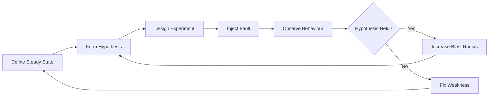
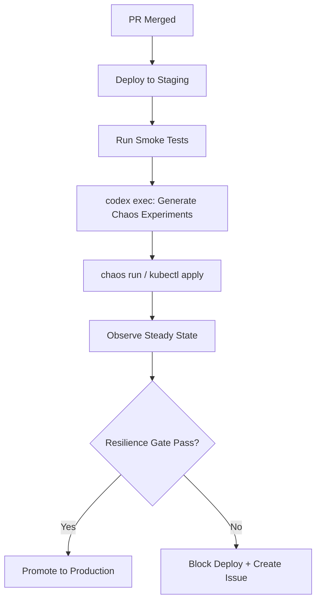

# Codex CLI for Chaos Engineering: Agent-Driven Experiment Generation, Fault Injection Manifests, and Resilience Validation Pipelines


---

Production systems fail. The question is whether you discover failure modes through controlled experimentation or through a 3 a.m. page. Chaos engineering — the discipline of injecting deliberate faults to validate system resilience — has matured from Netflix's Chaos Monkey into a structured practice with declarative experiment definitions, Kubernetes-native fault injection, and CI/CD-integrated validation gates [^1]. Yet writing chaos experiments remains tedious: each experiment requires a steady-state hypothesis, targeted fault actions, probes to verify impact, and rollback guards — all expressed in tool-specific YAML or JSON that most developers write infrequently enough to forget the schema every time.

Codex CLI can close this gap. By combining domain knowledge of chaos engineering frameworks with structured output and non-interactive execution, Codex generates experiment manifests, validates them against cluster state, and integrates resilience checks into deployment pipelines. This article covers practical patterns for using Codex CLI with Chaos Toolkit, Chaos Mesh, and AWS Fault Injection Service (FIS).

## The Chaos Engineering Workflow

Before diving into Codex patterns, here is the canonical chaos engineering cycle that every experiment should follow:



Every step produces artefacts that Codex can generate or validate: steady-state probe definitions, fault action manifests, observation queries, and remediation tickets.

## AGENTS.md for Chaos Engineering

Encode your chaos engineering standards in AGENTS.md so that every Codex session inherits them:

```markdown
## Chaos Engineering Standards

- Every experiment MUST define a steady-state hypothesis with measurable tolerances
- Fault injection MUST use blast-radius controls (namespace selectors, percentage mode)
- Experiments MUST include rollback/abort conditions
- Target only non-production environments unless explicitly approved
- Use Chaos Mesh for Kubernetes workloads, Chaos Toolkit for service-level experiments
- All experiment manifests MUST be committed to `chaos-experiments/` directory
- Include duration limits: no experiment should run longer than 5 minutes without explicit override
```

## Generating Chaos Toolkit Experiments

Chaos Toolkit uses a declarative JSON format with three core sections: steady-state hypothesis (probes with tolerances), method (sequence of actions and probes), and rollbacks [^2]. This structure maps naturally to Codex's `--output-schema` flag.

### Structured Experiment Generation

Create a JSON schema for Chaos Toolkit experiments:

```json
{
  "type": "object",
  "properties": {
    "title": { "type": "string" },
    "description": { "type": "string" },
    "steady-state-hypothesis": {
      "type": "object",
      "properties": {
        "title": { "type": "string" },
        "probes": {
          "type": "array",
          "items": {
            "type": "object",
            "properties": {
              "type": { "const": "probe" },
              "name": { "type": "string" },
              "tolerance": { "type": ["boolean", "integer", "object"] },
              "provider": { "type": "object" }
            }
          }
        }
      }
    },
    "method": { "type": "array" },
    "rollbacks": { "type": "array" }
  },
  "required": ["title", "steady-state-hypothesis", "method"]
}
```

Then generate an experiment:

```bash
codex exec \
  "Generate a Chaos Toolkit experiment that tests whether the payments \
   service tolerates a 500ms network delay to the database. The steady \
   state is p99 latency under 2s measured via Prometheus query \
   histogram_quantile(0.99, rate(http_duration_seconds_bucket[5m])). \
   Use the chaostoolkit-kubernetes driver for fault injection." \
  --output-schema ./chaos-toolkit-schema.json \
  -o ./chaos-experiments/payments-db-latency.json
```

Codex produces a valid Chaos Toolkit experiment file with the correct probe/action structure, ready for `chaos run` [^3].

### Reusable Chaos Skill

Wrap the pattern in a SKILL.md:

```markdown
# Skill: chaos-experiment-generator

## Purpose
Generate Chaos Toolkit experiment JSON files from natural-language
resilience scenarios.

## Inputs
- Service name and architecture context
- Fault type (network delay, pod kill, CPU stress, IO fault)
- Steady-state metric and threshold
- Blast radius constraints

## Process
1. Read the service's deployment manifest and AGENTS.md for architecture context
2. Identify the appropriate chaos driver (kubernetes, aws, process)
3. Define steady-state probes with measurable tolerances
4. Generate method actions with blast-radius controls
5. Add rollback actions that reverse the injected fault
6. Validate the experiment JSON against the Chaos Toolkit schema

## Output
A valid Chaos Toolkit experiment JSON file in `chaos-experiments/`

## Constraints
- NEVER target production namespaces unless the prompt explicitly says "production"
- ALWAYS include duration limits on fault actions
- ALWAYS include at least one rollback action
```

Invoke with:

```bash
codex exec "$chaos-experiment-generator \
  Service: order-processor. Fault: pod-kill 30% of replicas. \
  Steady state: order throughput > 100/min via Prometheus."
```

## Generating Chaos Mesh Manifests

Chaos Mesh is the CNCF-incubated Kubernetes-native chaos platform [^4]. Its experiments are Custom Resource Definitions (CRDs) — PodChaos, NetworkChaos, IOChaos, StressChaos — applied via `kubectl` [^5]. This makes them excellent targets for agent generation: the schema is well-defined, the manifests are declarative, and validation is immediate via `kubectl apply --dry-run=server`.

### Pod Fault Generation

```bash
codex exec \
  "Generate a Chaos Mesh PodChaos manifest that kills one random pod \
   in the 'checkout' namespace with label app=checkout-api every 60 \
   seconds for 5 minutes. Use mode: one and include a duration field." \
  --sandbox workspace-write \
  -o ./chaos-experiments/checkout-pod-kill.yaml
```

Codex generates:

```yaml
apiVersion: chaos-mesh.org/v1alpha1
kind: PodChaos
metadata:
  name: checkout-pod-kill
  namespace: chaos-mesh
spec:
  action: pod-kill
  mode: one
  selector:
    namespaces:
      - checkout
    labelSelectors:
      app: checkout-api
  scheduler:
    cron: "*/1 * * * *"
  duration: "5m"
```

### Network Fault Generation

```bash
codex exec \
  "Generate a Chaos Mesh NetworkChaos manifest that adds 200ms latency \
   with 50ms jitter to traffic between the 'api-gateway' and 'inventory' \
   services in the 'staging' namespace. Target 50% of pods." \
  -o ./chaos-experiments/api-inventory-latency.yaml
```

### Validation Pipeline

Chain generation with dry-run validation:

```bash
codex exec "Generate a Chaos Mesh StressChaos manifest for the \
  recommendation-engine pods: 2 CPU workers, 256MB memory stress, \
  duration 3 minutes, namespace staging" \
  -o ./chaos-experiments/reco-stress.yaml \
&& kubectl apply --dry-run=server \
  -f ./chaos-experiments/reco-stress.yaml
```

The `--dry-run=server` flag catches schema errors and missing CRDs before any fault is injected [^5].

## AWS Fault Injection Service Templates

For teams running on AWS, Codex can generate FIS experiment templates that target EC2 instances, ECS tasks, or RDS clusters [^6]. FIS templates are JSON documents specifying targets, actions, stop conditions, and IAM roles.

```bash
codex exec \
  "Generate an AWS FIS experiment template JSON that terminates 1 \
   ECS task in the 'payment-service' cluster with tag Environment=staging. \
   Include a CloudWatch alarm stop condition on \
   TargetResponseTime > 5 seconds. Use role arn:aws:iam::123456789:role/FISRole." \
  --output-schema ./fis-template-schema.json \
  -o ./chaos-experiments/payment-ecs-kill.json
```

## Resilience Validation in CI/CD

The real power emerges when chaos experiments run automatically in deployment pipelines. Codex generates the experiments; CI executes them.



### GitHub Actions Recipe


```yaml
name: Resilience Gate
on:
  deployment_status:
    types: [success]

jobs:
  chaos-validation:
    if: github.event.deployment.environment == 'staging'
    runs-on: ubuntu-latest
    steps:
      - uses: actions/checkout@v4

      - name: Generate chaos experiments
        env:
          CODEX_API_KEY: ${{ secrets.CODEX_API_KEY }}
        run: |
          codex exec \
            "$chaos-experiment-generator \
            Service: ${{ github.event.deployment.payload.service }}. \
            Fault: network-delay 200ms to database. \
            Steady state: error rate < 1% via Prometheus." \
            -o ./chaos-experiments/deploy-gate.json

      - name: Run chaos experiment
        run: |
          pip install chaostoolkit chaostoolkit-kubernetes
          chaos run ./chaos-experiments/deploy-gate.json \
            --journal-path ./chaos-journal.json

      - name: Evaluate results
        run: |
          STATUS=$(jq -r '.status' ./chaos-journal.json)
          if [ "$STATUS" != "completed" ]; then
            echo "::error::Resilience gate failed: $STATUS"
            exit 1
          fi
```


## Model Selection for Chaos Tasks

Different phases of chaos engineering benefit from different models [^7]:

| Task | Recommended Model | Reasoning |
|------|------------------|-----------|
| Manifest generation (YAML/JSON) | o4-mini | Mechanical, schema-constrained output |
| Steady-state hypothesis design | o3 | Requires understanding system architecture |
| Failure mode analysis | o3 | Complex reasoning about cascading failures |
| Experiment review and hardening | o3 | Security-sensitive, needs careful judgement |
| Batch manifest generation | o4-mini | High volume, low complexity per item |

Configure model routing in `config.toml`:

```toml
[model]
default = "o4-mini"

# Override for complex analysis tasks
# Use: codex --model o3 "Analyse failure modes..."
```

## Anti-Patterns

**Generating without validating.** Never trust agent-generated chaos manifests blindly. Always run `--dry-run=server` for Kubernetes manifests or `chaos verify` for Chaos Toolkit experiments before execution. A malformed blast-radius selector could target every pod in the cluster.

**Skipping the steady-state hypothesis.** Codex will happily generate a fault action without a hypothesis if you do not ask for one. An experiment without a measurable hypothesis is not chaos engineering — it is just breaking things. Always include the steady-state requirement in your prompt or skill definition.

**Production without guardrails.** Encode namespace restrictions in AGENTS.md and verify them in CI. A single prompt injection or hallucinated namespace could direct fault injection at production workloads.

**Over-scoping experiments.** Start with single-fault, single-service experiments. Codex can generate complex multi-fault workflows, but cascading faults are harder to reason about and diagnose. Increase blast radius incrementally [^1].

**Ignoring rollbacks.** Every Chaos Toolkit experiment should include a rollbacks section; every Chaos Mesh manifest should have a duration field. Without these, a failed experiment can leave faults active indefinitely.

## Known Limitations

- **Sandbox network isolation**: Codex CLI's sandbox blocks outbound network by default, so `codex exec` cannot directly query Prometheus or kubectl during generation [^8]. Generate manifests offline, then execute them in a CI step with cluster access.
- **`--output-schema` and `resume` mutual exclusion**: You cannot use `--output-schema` with `codex exec resume`, so each experiment generation must be a fresh invocation [^9].
- **Cluster state awareness**: Codex generates manifests based on the prompt and AGENTS.md context, not live cluster state. Always validate selectors match actual deployments before running experiments.
- **⚠️ Chaos Mesh version compatibility**: Chaos Mesh v2.7+ changed some CRD field names; verify generated manifests against your installed version.

## Citations

[^1]: [Chaos Engineering: A Comprehensive Guide to Testing System Resilience — Netalith (2026)](https://netalith.com/blogs/quality-assurance/chaos-engineering-resilience-testing-2026)
[^2]: [Chaos Toolkit Experiment API Reference](https://chaostoolkit.org/reference/api/experiment/)
[^3]: [Chaos Toolkit Concepts — Probes, Actions, and Steady State](https://chaostoolkit.org/reference/concepts/)
[^4]: [Chaos Mesh — CNCF Chaos Engineering Solution for Kubernetes](https://chaos-mesh.org/blog/chaos_mesh_your_chaos_engineering_solution/)
[^5]: [Chaos Mesh — Simulate Pod Faults on Kubernetes](https://chaos-mesh.org/docs/simulate-pod-chaos-on-kubernetes/)
[^6]: [AWS Fault Injection Service — Hands-On Tutorial (2026)](https://reintech.io/blog/getting-started-aws-fault-injection-service-tutorial)
[^7]: [OpenAI Codex CLI Models Documentation](https://developers.openai.com/codex/cli)
[^8]: [OpenAI Codex Non-Interactive Mode Documentation](https://developers.openai.com/codex/noninteractive)
[^9]: [GitHub Issue #14343 — Add --output-schema support to codex exec resume](https://github.com/openai/codex/issues/14343)
