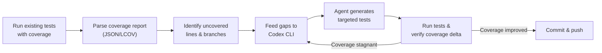

# Coverage-Driven Test Generation with Codex CLI: Closing Gaps Using Istanbul, Coverage.py, and Agent Workflows


---

Every engineering team has coverage gaps — untested error handlers, edge-case branches nobody thought to exercise, and legacy modules with zero assertions. The traditional approach is to assign a developer to grind through coverage reports and write tests by hand. Codex CLI offers a better pattern: feed the agent a coverage report, let it identify the uncovered paths, and have it generate targeted tests that push coverage upward without producing the brittle, over-mocked stubs that plague naive AI-generated test suites.

This article walks through the complete coverage-driven test generation workflow — from collecting coverage data, through agent-assisted test authoring, to CI/CD integration that prevents coverage regressions.

## The Coverage-Driven Workflow

The core idea is straightforward: coverage tools tell you *what* is untested; Codex CLI figures out *how* to test it.



The feedback loop is the critical piece. Codex generates tests, the coverage tool measures the delta, and the agent iterates until the target is met or the remaining uncovered paths are genuinely untestable.

## Collecting Coverage Data

### JavaScript/TypeScript with Istanbul (nyc)

Istanbul — exposed through the `nyc` CLI — remains the standard for JavaScript and TypeScript coverage in 2026 [^1]. Most teams already run it via Jest or Vitest without realising it.

Generate a machine-readable JSON summary:

```bash
npx nyc --reporter=json-summary --report-dir=./coverage \
  npx jest --coverage
```

This produces `coverage/coverage-summary.json` with per-file statement, branch, function, and line percentages [^1]. The JSON format is what Codex CLI consumes most cleanly.

For Vitest projects, the equivalent:

```bash
npx vitest run --coverage --coverage.reporter=json-summary
```

### Python with Coverage.py

Coverage.py is Python's universal coverage library, typically invoked through `pytest-cov` [^2]:

```bash
pytest --cov=src --cov-report=json:coverage/coverage.json \
       --cov-branch
```

The `--cov-branch` flag is essential — line coverage alone misses the conditional paths where bugs hide. The JSON report includes per-file `missing_lines` and `missing_branches` arrays that map directly to the gaps Codex needs to target [^2].

### Java with JaCoCo

For JVM projects, JaCoCo's CSV or XML report provides the same data:

```bash
./gradlew test jacocoTestReport
```

The XML report at `build/reports/jacoco/test/jacocoTestReport.xml` includes line and branch counters per class [^3].

## Feeding Coverage Gaps to Codex CLI

### Interactive Mode: Targeted File-by-File Generation

For a hands-on session, attach the coverage report and point Codex at a specific uncovered module:

```bash
codex -i coverage/coverage-summary.json \
  "Read the attached coverage report. The file src/billing/invoice.ts has
   47% branch coverage. Examine the source, identify the uncovered branches,
   and write Jest tests that exercise them. Follow the patterns in
   tests/billing/invoice.test.ts."
```

The `-i` flag passes the coverage JSON as image/file input, giving the agent structured data about exactly which lines and branches lack coverage [^4].

### Non-Interactive Mode: Batch Processing

For CI pipelines or large-scale gap closure, `codex exec` drives the workflow without human interaction [^5]:

```bash
codex exec \
  --sandbox workspace-write \
  --output-schema ./schemas/coverage-delta.json \
  -o ./results/coverage-report.json \
  "Analyse the coverage report at coverage/coverage.json. For each file
   below 80% branch coverage, generate pytest tests targeting the uncovered
   branches. Write tests to tests/generated/. After writing, run
   pytest --cov=src --cov-report=json to verify coverage improved."
```

The `--output-schema` flag constrains the final response to a structured JSON shape [^5], enabling downstream pipeline steps to parse the results programmatically:

```json
{
  "type": "object",
  "properties": {
    "files_processed": { "type": "integer" },
    "tests_generated": { "type": "integer" },
    "coverage_before": { "type": "number" },
    "coverage_after": { "type": "number" },
    "remaining_gaps": {
      "type": "array",
      "items": {
        "type": "object",
        "properties": {
          "file": { "type": "string" },
          "uncovered_lines": { "type": "array", "items": { "type": "integer" } },
          "reason": { "type": "string" }
        }
      }
    }
  },
  "required": ["files_processed", "tests_generated", "coverage_before", "coverage_after"]
}
```

## Configuring AGENTS.md for Quality Test Generation

Raw coverage-chasing produces worthless tests — assertions that duplicate implementation logic, mocks that never break when the code changes, and tests that pass trivially. The AGENTS.md file is where you encode the standards that prevent this [^6].

```markdown
## Test Generation Standards

- **No trivial assertions.** Every test must exercise a meaningful behaviour,
  not merely confirm that a function returns without throwing.
- **Branch coverage over line coverage.** Target the uncovered conditional
  paths identified in the coverage report, not just uncovered lines.
- **Minimal mocking.** Mock only external I/O (HTTP, database, filesystem).
  Never mock the module under test or its direct dependencies.
- **Follow existing patterns.** Read the nearest existing test file and match
  its describe/it structure, assertion library, and setup/teardown approach.
- **Edge cases first.** Prioritise null inputs, empty collections, boundary
  values, error states, and concurrency edge cases.
- **No snapshot tests for logic.** Snapshots are acceptable for serialised
  output formats; never use them to assert business logic.
```

These instructions steer the agent away from the "over-mocked test" anti-pattern that plagues naive AI-generated suites [^7].

## Building a Coverage Audit Skill

For teams that run coverage-driven generation regularly, encapsulating the workflow as a Codex skill eliminates repetitive prompting [^8].

Create `.codex/skills/coverage-audit/SKILL.md`:

```markdown
---
name: coverage-audit
description: >
  Analyses code coverage reports and generates targeted tests for uncovered
  branches. Supports Istanbul JSON, Coverage.py JSON, and JaCoCo XML.
triggers:
  - "audit coverage"
  - "close coverage gaps"
  - "generate tests for uncovered"
---

## Coverage Audit Workflow

1. **Locate the coverage report.** Check for:
   - `coverage/coverage-summary.json` (Istanbul/nyc)
   - `coverage/coverage.json` (Coverage.py)
   - `build/reports/jacoco/test/jacocoTestReport.xml` (JaCoCo)

2. **Parse the report.** Extract per-file branch and line coverage.
   Identify files below the project threshold (default: 80%).

3. **For each under-covered file:**
   a. Read the source file and its nearest existing test file.
   b. Identify the specific uncovered branches and lines.
   c. Generate tests that exercise those paths.
   d. Write tests following the patterns in the existing test file.

4. **Verify.** Run the test suite with coverage enabled.
   Compare before/after coverage for each targeted file.

5. **Report.** Output a structured summary of files processed,
   tests generated, and coverage delta achieved.

## Constraints
- Never modify source code — only add test files.
- Respect the project's testing framework (detect from package.json,
  pyproject.toml, or build.gradle).
- If a branch is genuinely untestable (dead code, platform-specific guard),
  note it in the report rather than writing a meaningless test.
```

Invoke it with:

```bash
codex "audit coverage — target 85% branch coverage"
```

The skill's trigger phrases activate it automatically when the agent encounters matching instructions [^8].

## Model Selection for Test Generation

Not every phase of coverage-driven generation requires the same model [^9]:

| Phase | Recommended Model | Rationale |
|---|---|---|
| Coverage report parsing | GPT-5.4-mini | Mechanical extraction; fast and cheap |
| Test authoring (complex logic) | GPT-5.5 | Needs semantic understanding of code paths |
| Test authoring (straightforward) | GPT-5.2-Codex | Good balance of quality and token efficiency |
| Verification & iteration | GPT-5.3-Codex-Spark | Near-instant feedback for the run-check loop |

Switch models mid-session with `/model gpt-5.5` when transitioning from parsing to authoring, or configure per-phase model selection in your skill's instructions [^9].

## CI/CD Integration: Coverage Gates

The real payoff arrives when coverage-driven generation runs automatically on every pull request that drops below threshold.

### GitHub Actions Recipe


```yaml
name: Coverage Gate
on:
  pull_request:
    branches: [main]

jobs:
  coverage-check:
    runs-on: ubuntu-latest
    steps:
      - uses: actions/checkout@v4

      - name: Run tests with coverage
        run: npm test -- --coverage --coverageReporters=json-summary

      - name: Check coverage threshold
        id: threshold
        run: |
          BRANCH_COV=$(jq '.total.branches.pct' coverage/coverage-summary.json)
          echo "branch_coverage=$BRANCH_COV" >> "$GITHUB_OUTPUT"
          if (( $(echo "$BRANCH_COV < 80" | bc -l) )); then
            echo "below_threshold=true" >> "$GITHUB_OUTPUT"
          fi

      - name: Generate missing tests
        if: steps.threshold.outputs.below_threshold == 'true'
        uses: openai/codex-action@v1
        with:
          task: |
            Branch coverage is ${{ steps.threshold.outputs.branch_coverage }}%.
            Read coverage/coverage-summary.json, identify files below 80%
            branch coverage, and generate Jest tests for uncovered branches.
            Write tests to tests/generated/.
          sandbox: workspace-write

      - name: Verify coverage improvement
        if: steps.threshold.outputs.below_threshold == 'true'
        run: |
          npm test -- --coverage --coverageReporters=json-summary
          NEW_COV=$(jq '.total.branches.pct' coverage/coverage-summary.json)
          echo "Coverage improved to ${NEW_COV}%"
```


This workflow runs the existing suite, checks the threshold, and only invokes Codex when coverage has dropped [^10]. The `openai/codex-action` GitHub Action handles authentication and sandbox configuration [^10].

### Cost Considerations

Coverage-driven generation in CI consumes tokens proportional to the number of uncovered files. Practical cost controls [^11]:

- **Scope limits.** Cap the number of files processed per run (`--max-files 10` in your skill).
- **Differential coverage.** Only process files changed in the PR, not the entire codebase.
- **Model routing.** Use GPT-5.4-mini for parsing and GPT-5.2-Codex for generation — avoid GPT-5.5 in CI unless the code is genuinely complex.
- **Caching.** Codex supports prompt caching; repeated runs against the same codebase benefit from cached context [^12].

## Common Pitfalls

### The 100% Trap

Chasing 100% coverage produces tests for unreachable code, platform-specific guards, and defensive error handlers that exist solely for safety. Configure your skill to *report* untestable paths rather than generating meaningless assertions for them.

### Snapshot Drift

Codex may default to snapshot tests for complex output structures. Snapshots are brittle — they break on formatting changes and teach nothing about behaviour. Explicitly forbid them for logic tests in AGENTS.md.

### Mock Explosion

Without constraints, the agent will mock everything to achieve coverage. The resulting tests pass but never catch real bugs. The AGENTS.md rule "mock only external I/O" is the single most important guardrail [^7].

### Flaky Test Generation

Generated tests that depend on timing, random values, or test execution order will poison your suite. Add a post-generation step that runs the new tests three times in isolation to catch flakiness before committing:

```bash
for i in 1 2 3; do
  npx jest tests/generated/ --runInBand --forceExit || exit 1
done
```

## Limitations

- **`--output-schema` and `resume` are mutually exclusive.** You cannot resume a `codex exec` session that used `--output-schema` [^13]. For multi-pass workflows, use separate `codex exec` invocations.
- **Sandbox network restrictions.** By default, `codex exec` runs in a read-only sandbox with no network access [^5]. Tests that require database connections or HTTP calls need `--sandbox workspace-write` or `danger-full-access` in isolated CI environments.
- **Large codebases strain context.** For monorepos with hundreds of uncovered files, batch processing with subagents is more effective than feeding everything into a single prompt. ⚠️ Token costs scale linearly with the number of files processed.

## Citations

[^1]: [Istanbul/nyc Documentation — Code Coverage for JavaScript](https://istanbul.js.org/)
[^2]: [Coverage.py Documentation — Coverage.py 7.x](https://coverage.readthedocs.io/)
[^3]: [JaCoCo — Java Code Coverage Library](https://www.jacoco.org/jacoco/)
[^4]: [Codex CLI Features — Image Input](https://developers.openai.com/codex/cli/features)
[^5]: [Non-interactive Mode — Codex Developers](https://developers.openai.com/codex/noninteractive)
[^6]: [Custom Instructions with AGENTS.md — Codex Developers](https://developers.openai.com/codex/guides/agents-md)
[^7]: [Over-Mocked Tests: Agent-Generated Test Quality — Codex Blog](https://codex.danielvaughan.com/2026/05/02/over-mocked-tests-agent-generated-test-quality/)
[^8]: [Skills Documentation — Codex Developers](https://developers.openai.com/codex/skills)
[^9]: [Models — Codex Developers](https://developers.openai.com/codex/models)
[^10]: [GitHub Action — Codex Developers](https://developers.openai.com/codex/github-action)
[^11]: [Pricing — Codex Developers](https://developers.openai.com/codex/pricing)
[^12]: [Best Practices — Codex Developers](https://developers.openai.com/codex/learn/best-practices)
[^13]: [GitHub Issue #14343 — Add --output-schema Support to codex exec resume](https://github.com/openai/codex/issues/14343)
