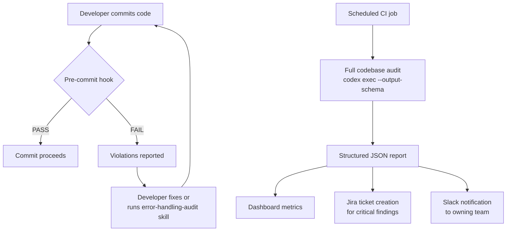

# Codex CLI for Automated Error Handling Strategy: Auditing, Generating, and Enforcing Consistent Error Patterns


---

Error handling is the seam where production systems fracture. Inconsistent patterns — bare `catch` blocks swallowing context, untyped error strings propagating through call stacks, missing retry logic around I/O boundaries — create silent failure modes that only surface under load. Yet error handling audits rarely make it onto sprint boards. Codex CLI transforms this from a tedious manual review into an automated, repeatable pipeline: audit the current state, generate idiomatic fixes, and enforce standards via hooks so regressions never land.

## The Problem: Error Handling Entropy

Every codebase accumulates error handling debt. Common patterns include:

- **Catch-all suppression** — `catch (e) {}` or `except Exception: pass` that silently swallows failures
- **Stringly-typed errors** — bare string messages with no structured context for observability tools
- **Inconsistent hierarchies** — each module inventing its own error taxonomy rather than deriving from a shared base
- **Missing boundary handling** — network calls, file I/O, and database queries lacking timeout, retry, or circuit-breaker logic
- **Log-and-rethrow noise** — errors logged at every layer creating duplicate alerts

Static analysis tools catch some of these (ESLint's `no-empty` rule[^1], Go's `errcheck`[^2], Python's `flake8-bugbear` B001[^3]), but they lack the semantic understanding to propose *idiomatic* fixes or design cohesive error hierarchies. This is where Codex CLI's reasoning capabilities complement traditional linting.

## Phase 1: Structured Error Handling Audit with `codex exec`

The first step is establishing a baseline. Use `codex exec` with `--output-schema` to produce a machine-readable audit report[^4]:

```json
{
  "$schema": "https://json-schema.org/draft/2020-12/schema",
  "type": "object",
  "properties": {
    "findings": {
      "type": "array",
      "items": {
        "type": "object",
        "properties": {
          "file": { "type": "string" },
          "line": { "type": "integer" },
          "category": {
            "type": "string",
            "enum": ["swallowed_error", "untyped_error", "missing_boundary_handling", "log_and_rethrow", "inconsistent_hierarchy", "missing_context"]
          },
          "severity": { "type": "string", "enum": ["critical", "high", "medium", "low"] },
          "description": { "type": "string" },
          "suggested_pattern": { "type": "string" }
        },
        "required": ["file", "line", "category", "severity", "description"]
      }
    },
    "summary": {
      "type": "object",
      "properties": {
        "total_findings": { "type": "integer" },
        "critical_count": { "type": "integer" },
        "files_scanned": { "type": "integer" }
      }
    }
  }
}
```

Run the audit in read-only sandbox mode:

```bash
codex exec \
  "Audit all error handling in src/. Identify: swallowed errors, \
   untyped error strings, missing boundary handling around I/O, \
   log-and-rethrow anti-patterns, and inconsistent error hierarchies. \
   Classify severity: critical if it can cause silent data loss, \
   high if it masks production failures, medium if it reduces \
   observability, low if it's a style inconsistency." \
  --sandbox read-only \
  --output-schema ./error-audit-schema.json \
  -o ./error-audit-report.json
```

The structured output feeds downstream tooling — Jira ticket creation, Slack notifications, or dashboard metrics[^5].

## Phase 2: Error Hierarchy Generation

Once the audit identifies patterns, Codex can generate a typed error hierarchy tailored to your domain. Define the requirements in AGENTS.md:

```markdown
## Error Handling Standards

- All application errors MUST extend a base `AppError` class/type
- Errors MUST carry: code (string enum), message (human-readable),
  cause (wrapped original error), context (structured metadata)
- HTTP boundary errors map to status codes via error code
- Database errors wrap driver errors with operation context
- External service errors include: service name, endpoint, latency
- Never throw raw strings or generic Error instances
```

Then generate the hierarchy:

```bash
codex exec \
  "Based on the error patterns found in src/, generate a typed error \
   hierarchy following the standards in AGENTS.md. Create: \
   1. Base error class with code, message, cause, context \
   2. Domain-specific error subclasses for each module \
   3. Error factory functions for common patterns \
   4. Type guards / type predicates for error narrowing" \
  --sandbox workspace-write
```

### TypeScript Example Output

```typescript
// src/errors/base.ts
export abstract class AppError extends Error {
  abstract readonly code: ErrorCode;
  readonly cause?: Error;
  readonly context: Record<string, unknown>;
  readonly timestamp: string;

  constructor(message: string, opts?: { cause?: Error; context?: Record<string, unknown> }) {
    super(message);
    this.name = this.constructor.name;
    this.cause = opts?.cause;
    this.context = opts?.context ?? {};
    this.timestamp = new Date().toISOString();
  }

  toJSON(): Record<string, unknown> {
    return {
      code: this.code,
      message: this.message,
      name: this.name,
      context: this.context,
      timestamp: this.timestamp,
      ...(this.cause && { cause: this.cause.message }),
    };
  }
}

// src/errors/database.ts
export class DatabaseError extends AppError {
  readonly code = 'DATABASE_ERROR' as const;
  constructor(
    operation: string,
    opts: { cause?: Error; table?: string; query?: string }
  ) {
    super(`Database operation failed: ${operation}`, {
      cause: opts.cause,
      context: { operation, table: opts.table, query: opts.query },
    });
  }
}
```

### Go Example Output

```go
// pkg/errors/errors.go
package errors

import "fmt"

type Code string

const (
    CodeDatabase    Code = "DATABASE_ERROR"
    CodeNetwork     Code = "NETWORK_ERROR"
    CodeValidation  Code = "VALIDATION_ERROR"
)

type AppError struct {
    Code    Code
    Message string
    Cause   error
    Context map[string]any
}

func (e *AppError) Error() string {
    if e.Cause != nil {
        return fmt.Sprintf("[%s] %s: %v", e.Code, e.Message, e.Cause)
    }
    return fmt.Sprintf("[%s] %s", e.Code, e.Message)
}

func (e *AppError) Unwrap() error { return e.Cause }

func NewDatabaseError(op string, cause error, ctx map[string]any) *AppError {
    return &AppError{
        Code:    CodeDatabase,
        Message: fmt.Sprintf("database operation failed: %s", op),
        Cause:   cause,
        Context: ctx,
    }
}
```

## Phase 3: Reusable Error Handling Skill

Encode the audit-and-fix workflow as a reusable skill:

```markdown
---
name: error-handling-audit
description: Audit and fix error handling patterns across the codebase
triggers:
  - "audit error handling"
  - "fix error patterns"
  - "error handling review"
---

# Error Handling Audit Skill

## Steps

1. Run static analysis first (`eslint --rule 'no-empty: error'` for TS,
   `errcheck ./...` for Go, `flake8 --select=B001,E722` for Python)
2. Feed linter output as context to the semantic audit
3. Classify findings by severity using the output schema
4. For critical/high findings, generate fixes following AGENTS.md standards
5. Validate fixes compile and pass existing tests
6. Present a summary diff for human review

## Constraints

- Never auto-merge fixes for critical error handling changes
- Preserve existing error messages that are referenced in monitoring dashboards
- Wrap, never replace, third-party library errors
- Generated error codes must be unique across the codebase
```

Install it:

```bash
codex skills install ./skills/error-handling-audit/SKILL.md
```

## Phase 4: Enforcement via Hooks

Prevent regressions with a Codex hook that validates error handling on every commit[^6]:

```toml
# .codex/config.toml
[[hooks]]
name = "error-handling-gate"
event = "pre-commit"
command = """
codex exec \
  "Check the staged diff for error handling violations: \
   bare catch blocks, untyped throw statements, missing error \
   wrapping at I/O boundaries, and raw string errors. \
   Return PASS if clean, FAIL with locations if violations found." \
  --sandbox read-only \
  --output-schema .codex/error-gate-schema.json \
  -o /tmp/error-gate-result.json
"""
pass_condition = "jq -r '.verdict' /tmp/error-gate-result.json | grep -q PASS"
```

The hook schema is minimal:

```json
{
  "type": "object",
  "properties": {
    "verdict": { "type": "string", "enum": ["PASS", "FAIL"] },
    "violations": {
      "type": "array",
      "items": {
        "type": "object",
        "properties": {
          "file": { "type": "string" },
          "line": { "type": "integer" },
          "violation": { "type": "string" }
        }
      }
    }
  }
}
```

## Pipeline Architecture



## Model Selection Matrix

| Task | Recommended Model | Rationale |
|------|-------------------|-----------|
| Structured audit (schema output) | GPT-5.4-mini | Mechanical classification, schema compliance[^7] |
| Error hierarchy design | GPT-5.5 | Requires understanding domain semantics and relationships |
| Fix generation | GPT-5.4 | Balanced reasoning for idiomatic code generation |
| Hook validation (pass/fail) | GPT-5.4-mini | Binary decision, minimal reasoning needed |

Configure model routing in `config.toml`:

```toml
[models]
default = "gpt-5.4"

[models.overrides]
audit = "gpt-5.4-mini"
design = "gpt-5.5"
```

## Anti-Patterns to Avoid

1. **Over-wrapping** — Adding error context at every call frame creates noise. Wrap at boundaries (HTTP handlers, service interfaces, repository layers), not at every function call.

2. **Generating without validating** — Always run the test suite after error handling changes. New error types can break `instanceof` checks, pattern matches, or serialisation logic.

3. **Ignoring observability** — Generated error hierarchies must integrate with your existing logging and tracing setup. Include structured fields that your log aggregator (Datadog, Grafana, SigNoz) indexes[^8].

4. **Blanket enforcement** — Not every function needs custom error types. Reserve structured errors for boundaries and domain events; utility functions can use simpler patterns.

5. **Trusting without reviewing** — Use `--sandbox read-only` for audits and always review generated fixes before merging. Error handling changes can silently alter control flow.

## Known Limitations

- **`--output-schema` and `exec resume` are mutually exclusive** — you cannot resume a structured audit session with additional schema constraints[^9]
- **Sandbox network isolation** — hooks running in sandboxed mode cannot reach external services (monitoring APIs, ticket systems) directly; pipe results to a post-hook script
- **Context window limits** — for monorepos with thousands of files, scope audits to specific modules or use differential analysis on changed files only
- **False positives in framework code** — frameworks like Express.js intentionally use middleware error patterns that may trigger audit findings; configure exclusions in AGENTS.md

## Putting It Together: A Weekly Error Health Report

Combine all phases in a scheduled automation:

```bash
#!/usr/bin/env bash
# scripts/weekly-error-audit.sh

set -euo pipefail

# Phase 1: Audit
codex exec \
  "Perform a comprehensive error handling audit of src/. \
   Focus on changes since last Monday. Compare against our \
   error handling standards in AGENTS.md." \
  --sandbox read-only \
  --output-schema ./error-audit-schema.json \
  -o ./reports/error-audit-$(date +%Y-%m-%d).json

# Phase 2: Metrics extraction
CRITICAL=$(jq '.summary.critical_count' ./reports/error-audit-$(date +%Y-%m-%d).json)
TOTAL=$(jq '.summary.total_findings' ./reports/error-audit-$(date +%Y-%m-%d).json)

echo "Error handling health: ${CRITICAL} critical, ${TOTAL} total findings"

# Phase 3: Alert on regression
if [ "$CRITICAL" -gt 0 ]; then
  # Send to Slack/PagerDuty
  curl -X POST "$SLACK_WEBHOOK" \
    -d "{\"text\": \"Error handling audit: ${CRITICAL} critical findings detected\"}"
fi
```

Schedule via cron or GitHub Actions to maintain continuous error handling hygiene without manual intervention[^10].

## Citations

[^1]: ESLint. "no-empty - Rules." *ESLint Documentation*, 2026. https://eslint.org/docs/latest/rules/no-empty
[^2]: kisielk. "errcheck - checks for unchecked errors in Go." *GitHub*, 2026. https://github.com/kisielk/errcheck
[^3]: Cooper Ry Lees et al. "flake8-bugbear - Opinionated linting for Python." *GitHub*, 2026. https://github.com/PyCQA/flake8-bugbear
[^4]: OpenAI. "Non-interactive mode - Codex CLI." *OpenAI Developers*, 2026. https://developers.openai.com/codex/noninteractive
[^5]: OpenAI. "Build Code Review with the Codex SDK." *OpenAI Cookbook*, 2026. https://developers.openai.com/cookbook/examples/codex/build_code_review_with_codex_sdk
[^6]: OpenAI. "Customization - Codex CLI." *OpenAI Developers*, 2026. https://developers.openai.com/codex/concepts/customization
[^7]: OpenAI. "Models - Codex CLI." *OpenAI Developers*, 2026. https://developers.openai.com/codex/models
[^8]: OpenAI. "Best practices - Codex CLI." *OpenAI Developers*, 2026. https://developers.openai.com/codex/learn/best-practices
[^9]: GitHub. "Add --output-schema support to codex exec resume - Issue #14343." *openai/codex*, 2026. https://github.com/openai/codex/issues/14343
[^10]: OpenAI. "Workflows - Codex CLI." *OpenAI Developers*, 2026. https://developers.openai.com/codex/workflows
