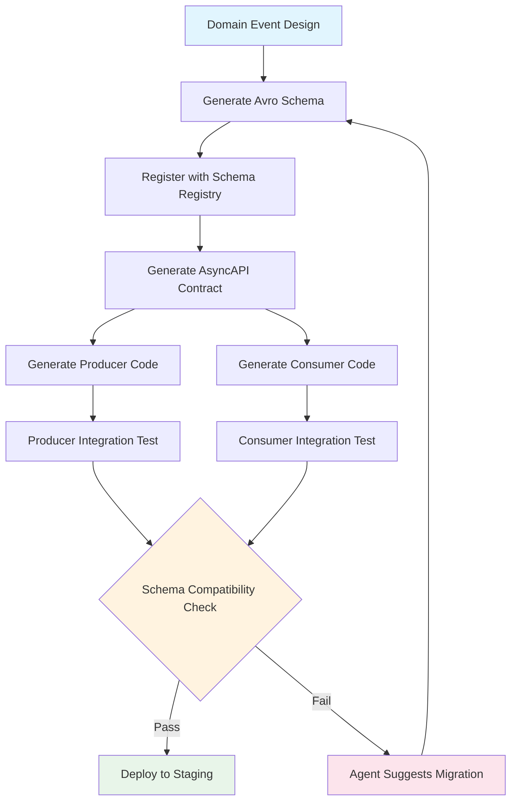

# Codex CLI for Event-Driven Architecture: AsyncAPI Contracts, Schema Registry Workflows, and Consumer Generation


---

Event-driven architecture (EDA) is experiencing a renaissance. The convergence of streaming SQL, AI-powered state views, and the CloudEvents specification has moved EDA from "hard to get right" to "essential for scalable systems".[^1] Yet the tooling gap remains: writing Avro schemas, maintaining AsyncAPI contracts, generating consumer boilerplate, and validating message flow compatibility are all tedious, error-prone tasks that sit squarely in Codex CLI's sweet spot.

This article covers a complete agent-driven EDA development workflow — from schema-first contract design through consumer generation and CI validation — using Codex CLI's skills, non-interactive pipelines, and structured output.

---

## Why EDA Development Benefits from Agent Assistance

Three properties of EDA development make it particularly amenable to AI agents:

1. **High boilerplate-to-logic ratio.** A Kafka consumer in Spring Boot requires serialiser configuration, error handling, retry policies, dead-letter routing, and schema binding — all before a single line of business logic.[^2]
2. **Strict schema contracts.** Avro, Protobuf, and JSON Schema enforce structural rules that an agent can validate mechanically.[^3]
3. **Cross-service coordination.** Schema evolution affects every downstream consumer; tracing compatibility is a graph problem that benefits from automated analysis.

---

## AGENTS.md for Event-Driven Projects

Encode your EDA conventions in `AGENTS.md` so that every Codex session respects them without manual repetition:[^4]

```markdown
## Event-Driven Architecture Standards

### Schema Conventions
- All event schemas use Avro (.avsc) stored in `schemas/`
- Namespace pattern: `com.company.domain.events.v{major}`
- Every schema MUST include a `metadata` record with:
  - `event_id` (string, UUID)
  - `event_type` (string, CloudEvents `type` field)
  - `event_time` (long, Unix millis)
  - `source` (string, CloudEvents `source` URI)
- Schema evolution: BACKWARD compatibility enforced via Schema Registry

### Consumer Standards
- All consumers implement idempotent processing (dedup on event_id)
- Dead-letter topic naming: `{topic}.dlq`
- Retry policy: exponential backoff, max 3 attempts
- Consumer group ID pattern: `{service-name}.{topic}.{environment}`

### Validation Commands
- Schema compatibility: `mvn schema-registry:compatibility`
- AsyncAPI lint: `asyncapi validate asyncapi.yaml`
- Consumer contract test: `./gradlew contractTest`
```

---

## Schema-First Development with Codex CLI

### Generating Avro Schemas from Domain Events

Start by describing your domain events in natural language and let Codex generate compliant schemas:

```bash
codex "Generate an Avro schema for an OrderPlaced event following our
AGENTS.md conventions. Include fields: order_id (UUID), customer_id (UUID),
items (array of {sku, quantity, unit_price}), total_amount, currency (ISO 4217),
and our standard metadata record."
```

Codex reads `AGENTS.md`, understands the namespace pattern and metadata requirements, and produces:

```json
{
  "type": "record",
  "name": "OrderPlaced",
  "namespace": "com.company.orders.events.v1",
  "fields": [
    {"name": "metadata", "type": "com.company.common.events.v1.EventMetadata"},
    {"name": "order_id", "type": {"type": "string", "logicalType": "uuid"}},
    {"name": "customer_id", "type": {"type": "string", "logicalType": "uuid"}},
    {"name": "items", "type": {"type": "array", "items": {
      "type": "record",
      "name": "OrderItem",
      "fields": [
        {"name": "sku", "type": "string"},
        {"name": "quantity", "type": "int"},
        {"name": "unit_price", "type": {"type": "bytes", "logicalType": "decimal", "precision": 10, "scale": 2}}
      ]
    }}},
    {"name": "total_amount", "type": {"type": "bytes", "logicalType": "decimal", "precision": 12, "scale": 2}},
    {"name": "currency", "type": "string"}
  ]
}
```

### AsyncAPI Contract Generation

AsyncAPI serves as the "OpenAPI for event-driven APIs," describing channels, operations, and message schemas in a single machine-readable document.[^5] Generate one from your existing schemas:

```bash
codex "Generate an AsyncAPI 3.0 document for our orders domain.
Channels: orders.placed (pub), orders.confirmed (pub), orders.cancelled (pub).
Use our Avro schemas in schemas/ as payload references.
Include Kafka bindings with partitionKey on order_id."
```

The resulting `asyncapi.yaml` provides a single source of truth for producers, consumers, and documentation generators.

---

## Consumer Generation Skill

Package your consumer generation workflow as a reusable skill:

```markdown
# .agents/skills/generate-consumer/SKILL.md

## Trigger
"generate consumer for {topic}", "scaffold kafka consumer", "new event handler"

## Workflow
1. Read the AsyncAPI document to identify the channel and message schema
2. Determine the target language from the project's build system
3. Generate consumer class with:
   - Schema-specific deserialiser configuration
   - Idempotency guard (dedup on event_id using a local cache or database)
   - Dead-letter routing on deserialisation failure
   - Structured logging with correlation ID from metadata
   - Health check endpoint integration
4. Generate corresponding integration test using Testcontainers + embedded Kafka
5. Update the AsyncAPI document's `x-consumers` extension

## Constraints
- Follow AGENTS.md consumer standards
- Never generate consumers without a corresponding test
- Use the project's existing error handling patterns
```

Invoke with:

```bash
codex "Generate a consumer for the orders.placed topic in the payments service"
```

---

## Schema Evolution Validation Pipeline

Schema evolution is where EDA projects most frequently break. Use `codex exec` to build a CI gate that catches incompatible changes before they reach production:[^6]

```bash
codex exec \
  -m gpt-5.4-mini \
  --output-schema '{"type":"object","properties":{"compatible":{"type":"boolean"},"breaking_changes":{"type":"array","items":{"type":"string"}},"migration_steps":{"type":"array","items":{"type":"string"}},"risk_level":{"type":"string","enum":["none","low","medium","high"]}},"required":["compatible","breaking_changes","risk_level"]}' \
  "Analyse the schema diff between schemas/v1/OrderPlaced.avsc and
   schemas/v2/OrderPlaced.avsc. Check BACKWARD compatibility per
   Confluent Schema Registry rules. Report breaking changes and
   suggest migration steps."
```

This produces structured JSON that your CI pipeline can parse:

```json
{
  "compatible": false,
  "breaking_changes": [
    "Removed field 'currency' without default value",
    "Changed 'total_amount' from decimal to double (precision loss)"
  ],
  "migration_steps": [
    "Add default value 'GBP' to currency field before removal",
    "Introduce total_amount_v2 as double, deprecate original with default"
  ],
  "risk_level": "high"
}
```

---

## End-to-End Workflow Diagram



---

## CloudEvents Envelope Validation

CloudEvents provides a standard envelope format for event data that ensures interoperability across platforms.[^7] Use a Codex hook to validate every generated event conforms:

```toml
# config.toml
[[hooks]]
type = "post-tool-use"
event = "file_write"
match_path = "schemas/**/*.avsc"
command = "python scripts/validate_cloudevents_envelope.py $FILE_PATH"
```

The validation script checks that every schema includes the required CloudEvents attributes (`id`, `source`, `type`, `specversion`, `time`) within its metadata record.

---

## Model Selection for EDA Tasks

| Task | Recommended Model | Rationale |
|------|------------------|-----------|
| Schema generation from requirements | gpt-5.5 | Complex domain modelling requires strong reasoning[^8] |
| Consumer boilerplate generation | gpt-5.4-mini | Mechanical code generation, cost-efficient[^8] |
| Schema compatibility analysis | gpt-5.4 | Nuanced rule application (Avro compatibility matrix) |
| AsyncAPI document generation | gpt-5.4-mini | Structured YAML output, well-defined format |
| Migration strategy planning | gpt-5.5 | Cross-service impact analysis requires broad context |

---

## GitHub Actions Integration

Wire the schema validation into your CI pipeline:

```yaml
name: Schema Compatibility Gate
on:
  pull_request:
    paths:
      - 'schemas/**'
      - 'asyncapi.yaml'

jobs:
  validate-schemas:
    runs-on: ubuntu-latest
    steps:
      - uses: actions/checkout@v4
      - uses: openai/codex-action@v1
        with:
          model: gpt-5.4-mini
          prompt: |
            Validate all modified schemas in this PR for BACKWARD
            compatibility. Check the AsyncAPI document references
            are consistent. Report findings as GitHub PR comments.
          output-schema: |
            {"type":"object","properties":{"pass":{"type":"boolean"},"findings":{"type":"array","items":{"type":"string"}}}}
```

---

## Multi-Service Schema Coordination with Subagents

For organisations with multiple services consuming shared events, delegate cross-service impact analysis to subagents:[^9]

```bash
codex "I'm adding a 'loyalty_tier' field to OrderPlaced.
Use subagents to check each downstream consumer (payments-service,
inventory-service, analytics-service) for compatibility.
Report which services need updates and generate the required changes."
```

Each subagent analyses one service's consumer code against the proposed schema change, then reports back with a structured compatibility assessment. This parallelises what would otherwise be a tedious manual review across repositories.

---

## Anti-Patterns to Avoid

**Schema sprawl without governance.** Letting Codex generate schemas freely without `AGENTS.md` constraints leads to inconsistent naming, missing metadata, and undocumented evolution.

**Skipping the AsyncAPI contract.** Generating producers and consumers directly from Avro schemas without an intermediary contract document makes it impossible to understand the full system topology.

**Testing only happy paths.** Always generate tests for deserialisation failures, schema mismatches, and dead-letter routing — not just successful message processing.

**Over-engineering schema versioning.** Prefer BACKWARD compatibility (new schema can read old data) for most use cases. FULL compatibility adds complexity without proportional benefit unless you have genuine bidirectional version requirements.[^3]

---

## Known Limitations

- **Sandbox network isolation.** Codex CLI cannot connect to a live Schema Registry during generation.[^10] Pre-fetch compatibility rules or run validation as a post-generation CI step.
- **Large schema graphs.** Avro schemas with deep `$ref` chains may exceed context limits. Use subagents to handle individual schema files.
- **AsyncAPI 3.0 coverage.** The specification is still maturing; Codex may occasionally generate AsyncAPI 2.x syntax. Pin version requirements in `AGENTS.md`.

---

## Citations

[^1]: RisingWave, "Event-Driven Architecture in 2026: Kafka, Streaming SQL, and the AI Layer," [https://risingwave.com/blog/event-driven-architecture-2026/](https://risingwave.com/blog/event-driven-architecture-2026/)

[^2]: Matthaios Stavrou, "Building a Kafka Event-Driven Spring Boot Application with Avro, Schema Registry and PostgreSQL," Medium, January 2026, [https://medium.com/@mstauroy/building-a-kafka-event-driven-spring-boot-application-with-avro-schema-registry-and-postgresql-45114526fb87](https://medium.com/@mstauroy/building-a-kafka-event-driven-spring-boot-application-with-avro-schema-registry-and-postgresql-45114526fb87)

[^3]: Confluent Documentation, "Schema Registry for Confluent Platform," [https://docs.confluent.io/platform/current/schema-registry/index.html](https://docs.confluent.io/platform/current/schema-registry/index.html)

[^4]: OpenAI Developers, "Best practices — Codex," [https://developers.openai.com/codex/learn/best-practices](https://developers.openai.com/codex/learn/best-practices)

[^5]: AsyncAPI Initiative, "AsyncAPI and CloudEvents," [https://www.asyncapi.com/blog/asyncapi-cloud-events](https://www.asyncapi.com/blog/asyncapi-cloud-events)

[^6]: OpenAI Developers, "CLI — Codex," [https://developers.openai.com/codex/cli](https://developers.openai.com/codex/cli)

[^7]: CloudEvents Specification, via AsyncAPI, "AsyncAPI, CloudEvents, OpenTelemetry: Which Event-Driven Specs Should Your DevOps Include?" [https://www.asyncapi.com/blog/async_standards_compare](https://www.asyncapi.com/blog/async_standards_compare)

[^8]: OpenAI Developers, "Models — Codex," [https://developers.openai.com/codex/models](https://developers.openai.com/codex/models)

[^9]: OpenAI Developers, "Features — Codex CLI," [https://developers.openai.com/codex/cli/features](https://developers.openai.com/codex/cli/features)

[^10]: OpenAI Developers, "CLI — Codex: Sandbox," [https://developers.openai.com/codex/cli](https://developers.openai.com/codex/cli)
