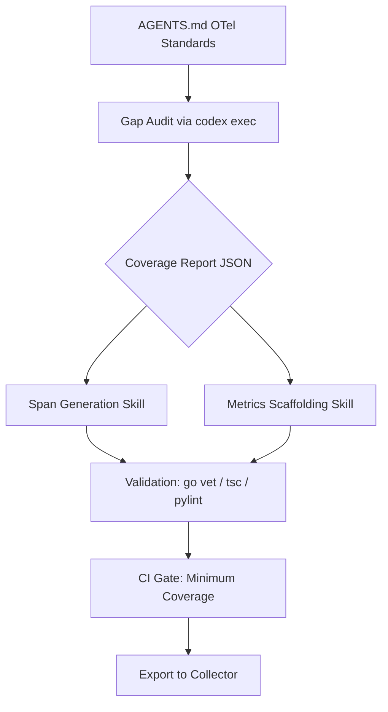

# Codex CLI for OpenTelemetry Instrumentation: Agent-Driven Span Generation, Metrics Scaffolding, and Observability Pipelines


---

Existing Codex CLI observability coverage focuses on monitoring the *agent itself* — exporting traces from Codex sessions to backends like Grafana or SigNoz. This article addresses the inverse: using Codex CLI to systematically add OpenTelemetry instrumentation *to your application code*. The workflow covers gap auditing, span generation, metrics scaffolding, and CI enforcement — turning weeks of manual instrumentation grind into repeatable agent-driven pipelines.

## The Instrumentation Debt Problem

Most production services ship with auto-instrumentation covering HTTP handlers and database calls, but lack custom spans around business logic, domain events, and internal state machines[^1]. The OpenTelemetry project recommends starting with automatic instrumentation then progressively adding manual spans for areas needing deeper visibility[^2]. In practice, teams accumulate instrumentation debt because manual span creation is tedious and easily deprioritised.

Codex CLI's non-interactive mode (`codex exec`) with `--output-schema` makes this tractable at scale[^3]. The agent can audit gaps, generate idiomatic instrumentation, and validate the result — all without human intervention per file.

## Architecture Overview



## Phase 1: Encoding Standards in AGENTS.md

Before the agent generates a single span, establish conventions in your repository's `AGENTS.md`:

```markdown
## OpenTelemetry Standards

### Tracing
- Every exported function handling a business operation MUST create a span
- Span names follow `<package>.<Function>` convention (e.g. `orders.ProcessPayment`)
- Always defer span.End() immediately after creation
- Record errors with both span.RecordError(err) AND span.SetStatus(codes.Error, msg)
- Add semantic attributes: `service.operation`, `business.entity_id`, `business.outcome`

### Metrics
- Use histograms for latency, counters for throughput, gauges for queue depth
- Metric names follow `<service>.<subsystem>.<metric>` (e.g. `checkout.payments.duration_ms`)
- All metrics MUST include `environment` and `service.version` attributes

### Anti-patterns
- Do NOT create spans inside tight loops (>100 iterations)
- Do NOT add PII as span attributes
- Do NOT use string concatenation for span names — use constants
```

This ensures every agent-generated instrumentation line follows team conventions without per-prompt repetition[^4].

## Phase 2: Instrumentation Gap Audit

Create a JSON schema for structured audit output:

```json
{
  "$schema": "https://json-schema.org/draft/2020-12/schema",
  "type": "object",
  "properties": {
    "files_audited": { "type": "integer" },
    "gaps": {
      "type": "array",
      "items": {
        "type": "object",
        "properties": {
          "file": { "type": "string" },
          "function": { "type": "string" },
          "line": { "type": "integer" },
          "gap_type": { "enum": ["missing_span", "missing_error_recording", "missing_attributes", "missing_metric"] },
          "severity": { "enum": ["critical", "high", "medium", "low"] },
          "rationale": { "type": "string" }
        },
        "required": ["file", "function", "gap_type", "severity"]
      }
    },
    "coverage_score": { "type": "number", "minimum": 0, "maximum": 100 }
  },
  "required": ["files_audited", "gaps", "coverage_score"]
}
```

Run the audit:

```bash
codex exec \
  --model gpt-5.4-mini \
  --output-schema ./schemas/otel-audit.schema.json \
  -o ./reports/otel-gaps.json \
  "Audit all Go files in ./internal/orders/ for OpenTelemetry instrumentation gaps. \
   Check: exported functions without spans, spans missing error recording, \
   operations without duration metrics. Rate severity by traffic impact."
```

The `--output-schema` flag guarantees parseable JSON conforming to your schema, enabling downstream automation[^3]. Use `gpt-5.4-mini` for audit tasks — it handles pattern matching at lower cost than full-size models[^5].

## Phase 3: Span Generation Skill

Create a reusable skill at `.codex/skills/otel-instrumentor/SKILL.md`:

```markdown
---
name: otel-instrumentor
description: Adds OpenTelemetry tracing spans and error recording to Go, TypeScript, or Python functions identified in an instrumentation gap report.
---

## Instructions

1. Read the gap report JSON from the path provided
2. For each gap with severity "critical" or "high":
   - Open the target file
   - Add the appropriate OTel import if missing
   - Create a span at function entry following AGENTS.md conventions
   - Add `defer span.End()` immediately after span creation
   - Wrap error returns with `span.RecordError(err)` and `span.SetStatus(codes.Error, err.Error())`
   - Add business-relevant attributes as span attributes
3. Do NOT modify function signatures or return types
4. Do NOT add spans inside loops iterating more than 10 times
5. Run the language-appropriate type checker after each file modification
```

Invoke the skill in batch mode:

```bash
codex exec \
  --model gpt-5.4 \
  --skill otel-instrumentor \
  "Process all critical and high severity gaps from ./reports/otel-gaps.json"
```

### Generated Output Example (Go)

Before:

```go
func (s *OrderService) ProcessPayment(ctx context.Context, orderID string, amount Money) error {
    validated, err := s.validator.Validate(orderID, amount)
    if err != nil {
        return fmt.Errorf("validation failed: %w", err)
    }
    return s.gateway.Charge(ctx, validated)
}
```

After agent instrumentation:

```go
func (s *OrderService) ProcessPayment(ctx context.Context, orderID string, amount Money) error {
    ctx, span := s.tracer.Start(ctx, "orders.ProcessPayment",
        trace.WithAttributes(
            attribute.String("business.entity_id", orderID),
            attribute.String("service.operation", "process_payment"),
        ))
    defer span.End()

    validated, err := s.validator.Validate(orderID, amount)
    if err != nil {
        span.RecordError(err)
        span.SetStatus(codes.Error, "validation failed")
        return fmt.Errorf("validation failed: %w", err)
    }

    if err := s.gateway.Charge(ctx, validated); err != nil {
        span.RecordError(err)
        span.SetStatus(codes.Error, "charge failed")
        return fmt.Errorf("charge failed: %w", err)
    }

    span.SetAttributes(attribute.String("business.outcome", "success"))
    return nil
}
```

Note the agent propagates context correctly, defers `span.End()`, records errors at each failure point with status codes, and adds business attributes — all following the AGENTS.md conventions[^6].

## Phase 4: Metrics Scaffolding

For metrics, create a separate skill focused on counter, histogram, and gauge generation:

```bash
codex exec \
  --model gpt-5.4 \
  "For each public handler in ./internal/api/, add a histogram recording \
   request duration and a counter recording total requests. Follow the \
   metric naming convention in AGENTS.md. Use the global meter provider. \
   Add attributes for HTTP method, route, and status code."
```

### TypeScript Example

```typescript
import { metrics } from '@opentelemetry/api';

const meter = metrics.getMeter('api-gateway');
const requestDuration = meter.createHistogram('api.gateway.request_duration_ms', {
  description: 'HTTP request duration in milliseconds',
  unit: 'ms',
});
const requestCount = meter.createCounter('api.gateway.requests_total', {
  description: 'Total HTTP requests processed',
});

export async function handleOrder(req: Request, res: Response): Promise<void> {
  const start = performance.now();
  const attrs = {
    'http.method': req.method,
    'http.route': '/api/orders',
  };

  try {
    const result = await processOrder(req.body);
    requestCount.add(1, { ...attrs, 'http.status_code': 201 });
    res.status(201).json(result);
  } finally {
    requestDuration.record(performance.now() - start, attrs);
  }
}
```

## Phase 5: CI Enforcement Gate

Add a GitHub Actions workflow that runs the audit on every PR and blocks merges below a coverage threshold:

```yaml
name: OTel Coverage Gate
on:
  pull_request:
    paths: ['internal/**', 'src/**']

jobs:
  otel-audit:
    runs-on: ubuntu-latest
    steps:
      - uses: actions/checkout@v4
      - uses: openai/codex-action@v1
        with:
          command: |
            codex exec \
              --model gpt-5.4-mini \
              --output-schema ./schemas/otel-audit.schema.json \
              -o ./reports/otel-coverage.json \
              "Audit changed files for OpenTelemetry instrumentation coverage"
      - name: Check threshold
        run: |
          SCORE=$(jq '.coverage_score' ./reports/otel-coverage.json)
          if (( $(echo "$SCORE < 80" | bc -l) )); then
            echo "::error::OTel coverage $SCORE% below 80% threshold"
            exit 1
          fi
```

This creates a feedback loop: developers see exactly which functions lack instrumentation before merge[^7].

## Model Selection Matrix

| Task | Recommended Model | Rationale |
|------|------------------|-----------|
| Gap audit (read-only analysis) | gpt-5.4-mini | Pattern matching at low cost[^5] |
| Span generation (code modification) | gpt-5.4 | Needs AST awareness and import management |
| Complex metrics design | gpt-5.5 | Architecture-level decisions on metric cardinality |
| Validation pass (type checking) | N/A — use `go vet`, `tsc`, `pylint` | Deterministic tooling, not LLM |

## Anti-Patterns to Avoid

**Instrumenting everything blindly.** Not every function needs a span. The agent should respect the severity ratings from the audit phase and skip low-value internal helpers. Over-instrumentation increases trace storage costs and degrades signal-to-noise ratio[^8].

**Generating without validating.** Always run type checkers after instrumentation. The `--output-schema` and `codex exec` pipeline should include a validation step — either via a hooks-based post-execution check or a subsequent `codex exec` pass.

**Ignoring context propagation.** In Go, spans must receive and pass `context.Context`. In TypeScript, the active context flows via `api.context`. The AGENTS.md file must specify context propagation rules to prevent orphaned spans[^6].

**Trusting attribute values without sanitisation.** PII can leak into spans via user-provided IDs. Encode attribute allow-lists in AGENTS.md and instruct the agent to hash or redact sensitive fields.

**Duplicating auto-instrumentation coverage.** If your HTTP framework middleware already creates spans for handler entry/exit, the agent should not add redundant spans at the same boundary. The audit skill should detect existing instrumentation before flagging gaps[^1].

## Known Limitations

- **`--output-schema` and `--resume` are mutually exclusive** — you cannot resume a structured audit session with schema validation[^9]
- **Sandbox network isolation** — if your validation step requires fetching OTel SDK packages, configure `full_auto` approval or pre-install dependencies before the agent run[^10]
- **Context window limits** — for monorepos with hundreds of files, batch the audit by package/directory rather than running a single pass
- **Import path resolution** — the agent may generate incorrect import paths for internal packages; include your module path in AGENTS.md

## Scheduling Recurring Audits

Use Codex automations to run instrumentation audits weekly:

```toml
# .codex/automations/otel-audit.toml
[trigger]
schedule = "weekly"

[task]
prompt = "Run the OTel instrumentation gap audit on all packages modified in the last 7 days. Generate a report and create a GitHub issue if coverage drops below 80%."
model = "gpt-5.4-mini"
```

This catches instrumentation drift as new code lands without manual oversight[^11].

## Citations

[^1]: OpenTelemetry Project, "Instrumentation — Getting Started," https://opentelemetry.io/docs/languages/go/instrumentation/ (accessed 2026-05-16)
[^2]: Red Hat Developer, "How to use auto-instrumentation with OpenTelemetry," https://developers.redhat.com/articles/2026/02/25/how-use-auto-instrumentation-opentelemetry (accessed 2026-05-16)
[^3]: OpenAI, "Non-interactive mode — Codex CLI," https://developers.openai.com/codex/noninteractive (accessed 2026-05-16)
[^4]: OpenAI, "Custom instructions with AGENTS.md," https://developers.openai.com/codex/guides/agents-md (accessed 2026-05-16)
[^5]: OpenAI, "Models — Codex," https://developers.openai.com/codex/models (accessed 2026-05-16)
[^6]: OpenTelemetry Project, "Go SDK Instrumentation — Context Propagation," https://opentelemetry.io/docs/languages/go/instrumentation/ (accessed 2026-05-16)
[^7]: OpenAI, "Codex GitHub Action," https://developers.openai.com/codex/guides/github-action (accessed 2026-05-16)
[^8]: Uptrace, "OpenTelemetry for AI Systems: LLM and Agent Observability (2026)," https://uptrace.dev/blog/opentelemetry-ai-systems (accessed 2026-05-16)
[^9]: GitHub Issue #14343, "Add --output-schema support to codex exec resume," https://github.com/openai/codex/issues/14343 (accessed 2026-05-16)
[^10]: OpenAI, "Codex CLI Sandbox Documentation," https://developers.openai.com/codex/cli/sandbox (accessed 2026-05-16)
[^11]: OpenAI, "Workflows — Codex," https://developers.openai.com/codex/workflows (accessed 2026-05-16)
