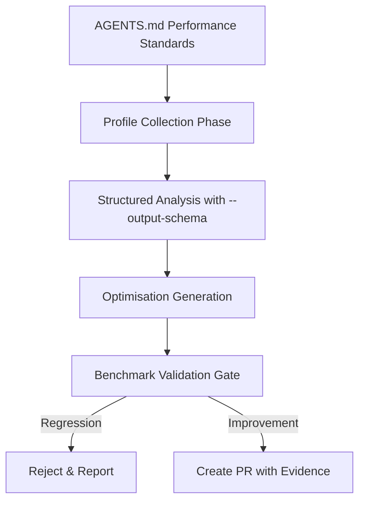

# Codex CLI for Performance Profiling and Optimisation: Agent-Driven Bottleneck Discovery, pprof Analysis, and Automated Fix Generation


---

Performance profiling remains one of the most cognitively demanding tasks in software engineering. Interpreting flame graphs, correlating CPU hotspots with memory allocation patterns, and translating findings into targeted code changes requires deep expertise across tooling and language runtimes. Codex CLI transforms this workflow from a manual investigation into a structured, repeatable pipeline — profiling, analysis, and fix generation in a single automated pass.

This article covers a four-phase performance optimisation workflow using `codex exec` with structured output, reusable SKILL.md definitions, and CI integration for continuous performance regression detection.

## The Performance Profiling Pipeline



The pipeline encodes performance engineering standards in `AGENTS.md`, collects profiling data using language-native tools, analyses results through Codex with structured JSON output, generates targeted fixes, and validates improvements against baseline benchmarks before creating a pull request.

## Phase 1: Encoding Performance Standards in AGENTS.md

The foundation is an `AGENTS.md` file that encodes your team's performance contracts and profiling conventions:

```markdown
# Performance Engineering Standards

## Profiling Requirements
- All Go services MUST expose `/debug/pprof/` endpoints in non-production builds
- CPU profiles MUST be collected for a minimum of 30 seconds under load
- Memory profiles MUST use `allocs` profile type (not `heap`) for allocation-rate analysis
- Node.js services MUST use Clinic.js Flame for CPU and Clinic.js Doctor for event loop analysis
- Python services MUST use py-spy for production-safe sampling profiling

## Performance Budgets
- P99 latency budget: 200ms for API endpoints, 500ms for batch operations
- Allocation rate budget: <10MB/s sustained for Go services
- Event loop delay budget: <50ms for Node.js services

## Optimisation Constraints
- NEVER replace safe abstractions with unsafe code for marginal gains
- NEVER remove error handling or observability for performance
- Prefer algorithmic improvements over micro-optimisations
- All optimisations MUST include before/after benchmark evidence
```

These constraints prevent the agent from generating unsafe or unmaintainable optimisations — a common failure mode when AI tools are given unconstrained performance targets [^1].

## Phase 2: Profile Collection and Structured Analysis

Define a JSON schema for profiling findings to ensure machine-parseable output:

```json
{
  "type": "object",
  "properties": {
    "service": { "type": "string" },
    "profile_type": { "type": "string", "enum": ["cpu", "memory", "goroutine", "event_loop"] },
    "duration_seconds": { "type": "number" },
    "hotspots": {
      "type": "array",
      "items": {
        "type": "object",
        "properties": {
          "function": { "type": "string" },
          "file": { "type": "string" },
          "line": { "type": "integer" },
          "percentage": { "type": "number" },
          "category": { "type": "string", "enum": ["algorithmic", "allocation", "io_wait", "lock_contention", "serialisation"] },
          "severity": { "type": "string", "enum": ["critical", "high", "medium", "low"] },
          "suggested_approach": { "type": "string" }
        },
        "required": ["function", "file", "line", "percentage", "category", "severity"]
      }
    },
    "summary": { "type": "string" },
    "estimated_improvement": { "type": "string" }
  },
  "required": ["service", "profile_type", "hotspots", "summary"],
  "additionalProperties": false
}
```

Run the analysis pipeline with `codex exec`:

```bash
# Collect a 30-second CPU profile from a Go service
curl -s "http://localhost:6060/debug/pprof/profile?seconds=30" > cpu.prof

# Pipe pprof text output into Codex for structured analysis
go tool pprof -text -cum cpu.prof | \
  codex exec "Analyse this Go CPU profile. Identify the top 5 hotspots, \
  categorise each by root cause, assess severity based on the percentage \
  of total CPU time, and suggest optimisation approaches. \
  The service is called 'order-service'." \
  --output-schema ./perf-schema.json \
  -o ./perf-findings.json \
  --model gpt-5.4-mini
```

The `--output-schema` flag constrains the agent's response to the defined structure, making the output safe to parse programmatically in downstream automation [^2]. Using `gpt-5.4-mini` here is deliberate — profile analysis is pattern-matching work that doesn't require the reasoning depth of `gpt-5.5` [^3].

## Phase 3: Multi-Language Profiling Recipes

### Go: pprof with Allocation Analysis

```bash
# Allocation-rate profiling (preferred over heap snapshots for sustained load)
curl -s "http://localhost:6060/debug/pprof/allocs?seconds=30" > allocs.prof

go tool pprof -text -alloc_space allocs.prof | \
  codex exec "Analyse this Go allocation profile. Focus on functions \
  allocating >1MB/s. Suggest pool-based or stack-allocation alternatives. \
  Flag any allocations in hot paths that could use sync.Pool." \
  --output-schema ./perf-schema.json \
  -o ./alloc-findings.json
```

Go 1.26's Green Tea GC reduces garbage collection overhead by up to 40% in real-world applications [^4], but excessive allocation rates still cause latency spikes during GC pauses. The agent identifies allocation hotspots and suggests `sync.Pool` usage or stack allocation where safe.

### Python: py-spy for Production-Safe Profiling

```bash
# Record a py-spy profile in speedscope format
py-spy record --format speedscope --duration 30 \
  --pid $(pgrep -f "uvicorn main:app") \
  -o profile.speedscope.json

# Analyse with Codex
cat profile.speedscope.json | \
  codex exec "Analyse this Python speedscope profile. Identify CPU-bound \
  hotspots excluding framework overhead (uvicorn, starlette internals). \
  Focus on application code in src/. Suggest async alternatives for I/O-bound \
  functions and algorithmic improvements for CPU-bound ones." \
  --output-schema ./perf-schema.json \
  -o ./python-findings.json
```

py-spy operates via process sampling with zero code changes and minimal overhead, making it safe for production profiling [^5].

### Node.js: Clinic.js Flame and Event Loop Analysis

```bash
# Generate a Clinic.js flame profile
npx clinic flame -- node dist/server.js &
SERVER_PID=$!
# Run load test
npx autocannon -d 30 http://localhost:3000/api/orders
kill $SERVER_PID

# Analyse the generated flamegraph data
cat .clinic/*.flamegraph | \
  codex exec "Analyse this Node.js flamegraph. Identify functions with \
  high self-time excluding V8 internals and libuv. Focus on application \
  code hotspots. Check for synchronous operations blocking the event loop \
  and suggest Worker thread or streaming alternatives." \
  --output-schema ./perf-schema.json \
  -o ./node-findings.json
```

## Phase 4: Automated Optimisation Generation

Once findings are structured, a second Codex pass generates the actual fixes:

```bash
# Generate optimisations based on findings
codex exec "Read ./perf-findings.json and generate optimised implementations \
  for all 'critical' and 'high' severity hotspots. For each fix: \
  1. Create the optimised code \
  2. Add a benchmark test comparing old vs new \
  3. Preserve all existing tests \
  4. Add comments explaining the performance rationale" \
  --sandbox workspace-write \
  --model gpt-5.5
```

This phase uses `gpt-5.5` — OpenAI's most capable model for complex coding tasks [^6] — because generating correct optimisations requires deeper reasoning about algorithms, concurrency, and memory models.

## Reusable SKILL.md: The Performance Auditor

Encode the full workflow as a reusable skill:

```markdown
# perf-auditor

## Purpose
Automated performance profiling, analysis, and optimisation generation for
Go, Python, and Node.js services.

## Workflow
1. Collect profiles using language-appropriate tooling (pprof/py-spy/clinic)
2. Analyse with codex exec --output-schema for structured findings
3. Generate optimisations for critical/high severity hotspots
4. Run benchmarks to validate improvements
5. Create PR with before/after evidence

## Constraints
- Never optimise without profiling evidence
- Never remove error handling or observability
- Minimum 30-second profile collection under representative load
- All fixes must include benchmark tests
- Reject changes that improve <5% (noise threshold)

## Model Selection
- Analysis phase: gpt-5.4-mini (fast pattern matching)
- Optimisation phase: gpt-5.5 (complex reasoning required)
```

## CI/CD Integration: Continuous Performance Gates

Integrate the profiling pipeline into GitHub Actions for continuous regression detection:


```yaml
name: Performance Gate
on:
  pull_request:
    paths: ['src/**', 'cmd/**']

jobs:
  perf-check:
    runs-on: ubuntu-latest
    steps:
      - uses: actions/checkout@v4

      - name: Run baseline benchmarks
        run: go test -bench=. -benchmem -count=5 ./... > baseline.txt

      - name: Run PR benchmarks
        run: go test -bench=. -benchmem -count=5 ./... > pr.txt

      - name: Compare with benchstat
        run: |
          go install golang.org/x/perf/cmd/benchstat@latest
          benchstat baseline.txt pr.txt > comparison.txt

      - name: Analyse regressions with Codex
        env:
          CODEX_API_KEY: ${{ secrets.CODEX_API_KEY }}
        run: |
          cat comparison.txt | codex exec \
            "Analyse this benchstat comparison. Flag any regressions >5% \
            as blocking. For each regression, identify the likely cause \
            from the PR diff and suggest whether it's acceptable (e.g. \
            added safety/observability) or needs fixing." \
            --output-schema ./perf-gate-schema.json \
            -o ./gate-result.json

      - name: Gate decision
        run: |
          BLOCKING=$(jq '.blocking_regressions | length' gate-result.json)
          if [ "$BLOCKING" -gt 0 ]; then
            echo "::error::Performance regressions detected"
            jq '.blocking_regressions' gate-result.json
            exit 1
          fi
```


This workflow runs benchmarks on every PR that touches source code, uses `benchstat` for statistical comparison, and passes regressions through Codex for intelligent triage — distinguishing acceptable trade-offs (added observability) from genuine performance bugs [^7].

## Anti-Patterns to Avoid

| Anti-Pattern | Why It Fails | Correct Approach |
|---|---|---|
| Profiling without load | Profiles idle code paths | Use realistic load generators (k6, autocannon) during collection |
| Optimising without measuring | Changes may be noise | Require benchstat with statistical significance (p<0.05) |
| Micro-optimising cold paths | Wasted effort, added complexity | Focus exclusively on hotspots consuming >5% of total time |
| Removing allocations blindly | May break GC ergonomics | Profile allocation *rate*, not total — pools for hot paths only |
| Trusting agent fixes without benchmarks | Optimisations may regress other paths | Always validate with full benchmark suite before merging |

## Known Limitations

- **Sandbox network isolation**: `codex exec` cannot directly query running services for profiles; collect profiles externally and pipe them in via stdin [^8]
- **`--output-schema` and `--resume` mutual exclusion**: Cannot resume a structured-output session; design pipelines as single-pass operations [^9]
- **Context window limits**: Large flame graphs (>100K lines) exceed context windows; pre-filter with `pprof -text -cum -top 50` before passing to Codex
- **No runtime state awareness**: The agent analyses static profile data but cannot observe live metrics; combine with observability tooling for production decisions

## Model Selection Matrix

| Task | Recommended Model | Rationale |
|---|---|---|
| Profile text analysis | gpt-5.4-mini | Fast pattern matching, low token cost |
| Optimisation generation | gpt-5.5 | Complex algorithmic reasoning required |
| Benchmark comparison triage | gpt-5.4-mini | Structured comparison, limited reasoning |
| Architecture-level redesign | gpt-5.5 | Requires understanding system-wide implications |

## Conclusion

Codex CLI transforms performance profiling from a manual, expertise-heavy investigation into a structured pipeline. By encoding performance standards in `AGENTS.md`, collecting profiles with language-native tools, analysing with `--output-schema` for structured findings, and validating with benchmarks before merging, teams can maintain continuous performance accountability without requiring every developer to be a profiling expert.

The key insight is separation of concerns: use cheap, fast models for analysis and expensive, capable models for generation. This mirrors how senior engineers work — quick to spot the problem, deliberate about the fix.

## Citations

[^1]: OpenAI, "Best practices — Codex," OpenAI Developers, 2026. [https://developers.openai.com/codex/learn/best-practices](https://developers.openai.com/codex/learn/best-practices)

[^2]: OpenAI, "Non-interactive mode — Codex," OpenAI Developers, 2026. [https://developers.openai.com/codex/noninteractive](https://developers.openai.com/codex/noninteractive)

[^3]: OpenAI, "Models — Codex," OpenAI Developers, 2026. [https://developers.openai.com/codex/models](https://developers.openai.com/codex/models)

[^4]: Go Team, "Go 1.26 Release Notes — Green Tea GC," The Go Programming Language, February 2026. [https://go.dev/doc/go1.26](https://go.dev/doc/go1.26)

[^5]: Ben Frederickson, "py-spy: Sampling profiler for Python programs," GitHub, 2024. [https://github.com/benfred/py-spy](https://github.com/benfred/py-spy)

[^6]: OpenAI, "Introducing upgrades to Codex," OpenAI Blog, 2026. [https://openai.com/index/introducing-upgrades-to-codex/](https://openai.com/index/introducing-upgrades-to-codex/)

[^7]: OpenAI, "GitHub Action — Codex," OpenAI Developers, 2026. [https://developers.openai.com/codex/github-action](https://developers.openai.com/codex/github-action)

[^8]: OpenAI, "Features — Codex CLI," OpenAI Developers, 2026. [https://developers.openai.com/codex/cli/features](https://developers.openai.com/codex/cli/features)

[^9]: GitHub, "Add --output-schema support to codex exec resume," Issue #14343, openai/codex, 2026. [https://github.com/openai/codex/issues/14343](https://github.com/openai/codex/issues/14343)
