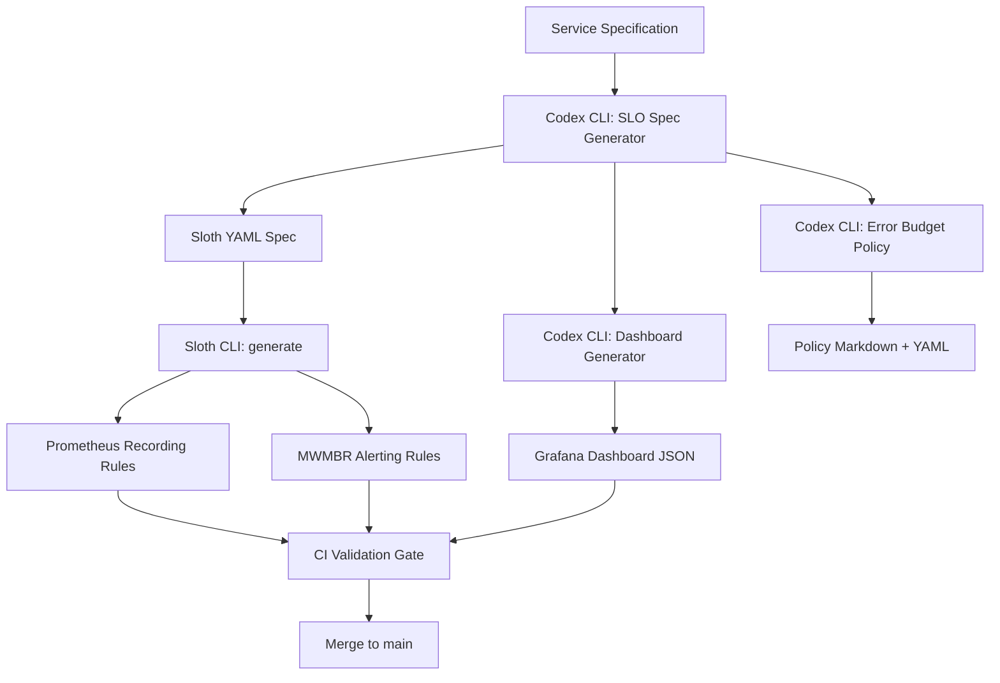

# Codex CLI for SRE Automation: Generating SLO Definitions, Prometheus Alerting Rules, and Burn-Rate Policies


---

Defining SLOs and translating them into multi-window multi-burn-rate (MWMBR) alerting rules is one of the most error-prone tasks in site reliability engineering. The arithmetic is straightforward; the boilerplate is not. A single service with a 99.9% availability target requires at minimum four alert tiers, each with two PromQL windows, recording rules for the SLI, and a Grafana dashboard panel—all kept in sync with the service's actual query patterns[^1].

This article demonstrates how to use Codex CLI's non-interactive mode to generate, validate, and maintain SLO infrastructure as code, integrating with Sloth for Prometheus rule generation and enforcing standards through AGENTS.md constraints.

## The Problem: SLO Drift and Alert Entropy

Most teams start with hand-written alerting rules. Within months, the rules drift:

- New endpoints appear without corresponding SLI recording rules
- Burn-rate thresholds are copy-pasted without adjusting for the service's actual error budget
- Dashboard panels reference stale metric names after a refactor
- Alert annotations lack runbook links, making pages useless at 3am

An agent-driven approach treats SLO definitions as the single source of truth and generates everything downstream—recording rules, alerting rules, dashboards, and error budget policies—from that spec.

## Architecture Overview



## Phase 1: Encoding SRE Standards in AGENTS.md

Before generating anything, encode your reliability standards so the agent cannot deviate from them:


```markdown
# AGENTS.md — SRE Standards

## SLO Definitions
- All SLOs use Sloth spec format (prometheus/v1)
- Objectives MUST be one of: 99.99%, 99.9%, 99.5%, 99.0%
- Every SLO MUST define both page_alert and ticket_alert
- SLI queries MUST use {{.window}} placeholder for time windows
- Labels MUST include: owner, tier, service

## Alerting Rules
- Follow Google SRE Workbook MWMBR pattern
- Page alerts: 14.4x burn rate (1h window) AND 6x burn rate (6h window)
- Ticket alerts: 3x burn rate (1d window) AND 1x burn rate (3d window)
- All alerts MUST include runbook_url annotation
- Alert names follow pattern: SLO_{Service}_{SLOName}_{Severity}

## Error Budget Policy
- Services with <25% remaining budget enter change freeze
- Services with <10% remaining budget trigger incident review
- Budget resets are monthly, aligned to calendar month
```


## Phase 2: Generating Sloth SLO Specs with codex exec

Use `codex exec` with `--output-schema` to produce validated Sloth YAML from a service description[^2]:

```bash
codex exec -m gpt-5.4 \
  --output-schema ./schemas/sloth-spec.json \
  -o ./slos/payment-service.json \
  "Generate a Sloth SLO spec for the payment-service. \
   It exposes HTTP endpoints at /v1/charges and /v1/refunds. \
   Availability target: 99.9%. Latency target: p99 < 500ms. \
   Owner: payments-team. Tier: critical."
```

The JSON schema enforces the structure:

```json
{
  "$schema": "https://json-schema.org/draft/2020-12/schema",
  "type": "object",
  "properties": {
    "version": { "const": "prometheus/v1" },
    "service": { "type": "string" },
    "labels": {
      "type": "object",
      "properties": {
        "owner": { "type": "string" },
        "tier": { "enum": ["critical", "high", "medium", "low"] }
      },
      "required": ["owner", "tier"],
      "additionalProperties": false
    },
    "slos": {
      "type": "array",
      "items": {
        "type": "object",
        "properties": {
          "name": { "type": "string" },
          "objective": { "type": "number" },
          "sli": { "type": "object" },
          "alerting": { "type": "object" }
        },
        "required": ["name", "objective", "sli", "alerting"],
        "additionalProperties": false
      }
    }
  },
  "required": ["version", "service", "labels", "slos"],
  "additionalProperties": false
}
```

The generated Sloth spec follows the standard format[^3]:


```yaml
version: "prometheus/v1"
service: "payment-service"
labels:
  owner: "payments-team"
  tier: "critical"
slos:
  - name: "availability"
    objective: 99.9
    description: "Payment service HTTP availability"
    sli:
      events:
        error_query: >
          sum(rate(http_requests_total{service="payment-service",
          code=~"5.."}[{{.window}}]))
        total_query: >
          sum(rate(http_requests_total{service="payment-service"}[{{.window}}]))
    alerting:
      name: "SLO_PaymentService_Availability"
      labels:
        category: "availability"
      annotations:
        runbook_url: "https://runbooks.internal/payment-service/availability"
        summary: "Payment service availability SLO burn rate exceeded"
      page_alert:
        labels:
          severity: "critical"
          routing_key: "payments-oncall"
      ticket_alert:
        labels:
          severity: "warning"
          slack_channel: "#payments-alerts"
  - name: "latency-p99"
    objective: 99.9
    description: "Payment service p99 latency under 500ms"
    sli:
      events:
        error_query: >
          sum(rate(http_request_duration_seconds_bucket{service="payment-service",
          le="0.5"}[{{.window}}]))
        total_query: >
          sum(rate(http_request_duration_seconds_count{service="payment-service"}[{{.window}}]))
    alerting:
      name: "SLO_PaymentService_Latency"
      labels:
        category: "latency"
      annotations:
        runbook_url: "https://runbooks.internal/payment-service/latency"
        summary: "Payment service latency SLO burn rate exceeded"
      page_alert:
        labels:
          severity: "critical"
          routing_key: "payments-oncall"
      ticket_alert:
        labels:
          severity: "warning"
          slack_channel: "#payments-alerts"
```


## Phase 3: Generating Prometheus Rules via Sloth

Once you have a validated Sloth spec, run the Sloth CLI to produce MWMBR alerting rules[^4]:

```bash
sloth generate -i ./slos/payment-service.yaml \
  -o ./prometheus-rules/payment-service.yaml
```

Sloth produces recording rules for SLI error ratios across standard windows (5m, 30m, 1h, 2h, 6h, 1d, 3d) and MWMBR alerting rules following Google's recommended burn-rate thresholds[^1]:

| Severity | Burn Rate | Long Window | Short Window | Budget Consumed |
|----------|-----------|-------------|--------------|-----------------|
| Page     | 14.4x     | 1 hour      | 5 minutes    | 2% in 1h       |
| Page     | 6x        | 6 hours     | 30 minutes   | 5% in 6h       |
| Ticket   | 3x        | 1 day       | 2 hours      | 10% in 1d      |
| Ticket   | 1x        | 3 days      | 6 hours      | 10% in 3d      |

## Phase 4: Batch SLO Auditing with codex exec

For existing services lacking SLO definitions, use `codex exec` to audit what's missing:

```bash
codex exec -m gpt-5.4 \
  --output-schema ./schemas/slo-audit.json \
  "Audit the ./prometheus-rules/ directory. \
   Compare against ./services.yaml to identify services \
   without SLO definitions. Output a list of gaps with \
   recommended SLO targets based on service tier."
```

This produces a structured gap report:

```json
{
  "gaps": [
    {
      "service": "notification-service",
      "tier": "medium",
      "recommended_objectives": {
        "availability": 99.5,
        "latency_p99_ms": 1000
      },
      "reason": "No recording rules found; service handles 50k RPM"
    }
  ],
  "coverage": {
    "total_services": 12,
    "services_with_slos": 8,
    "coverage_percentage": 66.7
  }
}
```

## Phase 5: Grafana Dashboard Generation

Generate dashboards directly from the SLO spec:

```bash
codex exec -m gpt-5.4 \
  --sandbox workspace-write \
  "Read ./slos/payment-service.yaml and generate a Grafana \
   dashboard JSON at ./dashboards/payment-service.json. \
   Include panels for: SLI error ratio (30d trailing), \
   error budget remaining (%), burn rate gauge, \
   and request rate by endpoint. Use the Grafana 11 schema."
```

## Phase 6: Reusable SRE Skill

Encode the full pipeline as a Codex CLI skill[^5]:

```markdown
# SKILL.md — slo-generator

## Description
Generates complete SLO infrastructure from a service description:
Sloth spec, Prometheus rules, Grafana dashboard, and error budget policy.

## Inputs
- Service name
- Endpoint list with expected latency budgets
- Availability target (99.99 | 99.9 | 99.5 | 99.0)
- Owner team
- Tier (critical | high | medium | low)

## Steps
1. Generate Sloth YAML spec with structured output validation
2. Run `sloth generate` to produce Prometheus recording + alerting rules
3. Validate rules with `promtool check rules`
4. Generate Grafana dashboard JSON
5. Generate error budget policy document
6. Commit all artefacts to the sre/ directory

## Constraints
- All alerting rules MUST follow MWMBR pattern
- All alerts MUST include runbook_url annotation
- Dashboard MUST use Grafana 11 schema
- Error budget policy MUST define freeze and review thresholds
```

## CI/CD Enforcement

Add a GitHub Actions workflow to validate SLO changes on every PR:


```yaml
name: SLO Validation Gate
on:
  pull_request:
    paths:
      - 'slos/**'
      - 'prometheus-rules/**'

jobs:
  validate:
    runs-on: ubuntu-latest
    steps:
      - uses: actions/checkout@v4

      - name: Install Sloth
        run: |
          curl -L https://github.com/slok/sloth/releases/latest/download/sloth-linux-amd64 \
            -o /usr/local/bin/sloth && chmod +x /usr/local/bin/sloth

      - name: Regenerate rules from specs
        run: |
          for spec in slos/*.yaml; do
            service=$(basename "$spec" .yaml)
            sloth generate -i "$spec" -o "prometheus-rules/${service}.yaml"
          done

      - name: Validate with promtool
        run: |
          for rules in prometheus-rules/*.yaml; do
            promtool check rules "$rules"
          done

      - name: Check SLO coverage
        env:
          CODEX_API_KEY: ${{ secrets.CODEX_API_KEY }}
        run: |
          codex exec -m gpt-5.4 \
            --output-schema ./schemas/slo-audit.json \
            --ignore-user-config \
            "Verify all services in services.yaml have corresponding \
             SLO specs in slos/. Fail if coverage < 80%."
```


## Model Selection for SRE Tasks

| Task | Recommended Model | Rationale |
|------|-------------------|-----------|
| SLO spec generation | gpt-5.4 | Requires understanding of PromQL semantics and Sloth schema |
| Gap audit | gpt-5.4 | Needs cross-file analysis of service registry vs rules |
| Dashboard JSON | gpt-5.4 | Complex nested JSON with Grafana panel grammar |
| Error budget policy | o4-mini | Straightforward document generation from template |
| Rule validation triage | o4-mini | Pattern matching on promtool output |

## Anti-Patterns

**Generating without validating.** Always pipe Sloth output through `promtool check rules` before committing. The agent can produce syntactically valid YAML with semantically broken PromQL[^6].

**Skipping the short window.** Single-window burn-rate alerts either fire too late (long window only) or flap continuously (short window only). The MWMBR pattern requires both windows to be true simultaneously[^1].

**Over-alerting on low-tier services.** Not every service needs a page alert. Reserve 14.4x burn-rate pages for critical-tier services; medium-tier services should use ticket alerts only.

**Ignoring error budget resets.** Generated policies must specify the reset cadence. Without it, teams accumulate alert fatigue from burn-rate alerts on budgets that should have reset.

**Duplicating Sloth's work manually.** If you're writing recording rules by hand alongside Sloth-generated rules, you'll get duplicate time series. Use Sloth as the sole generator and treat its output as authoritative.

## Known Limitations

- **Sandbox network isolation**: `codex exec` runs in a sandboxed environment that cannot reach your Prometheus instance for query validation. Use `promtool` for offline validation instead[^2].
- **--output-schema and MCP conflict**: When MCP servers are active, `--output-schema` may be silently ignored. Run SLO generation without MCP tools configured[^7].
- **Context window limits**: For organisations with hundreds of services, batch the audit across multiple `codex exec` invocations rather than passing the entire service registry in one prompt.
- **Sloth version dependency**: Generated specs target Sloth's `prometheus/v1` format. If your organisation uses the Kubernetes operator mode, adjust the spec version to `prometheus-operator/v1`.

## Conclusion

Codex CLI transforms SLO management from a specialist craft into a repeatable pipeline. By encoding reliability standards in AGENTS.md, validating output with JSON schemas, and integrating Sloth for rule generation, teams can maintain consistent, auditable SLO infrastructure across dozens of services without manual PromQL authoring. The CI gate ensures that no service ships without its reliability contract in place.

## Citations

[^1]: Google SRE Workbook — Alerting on SLOs, Multi-Window Multi-Burn-Rate approach. [https://sre.google/workbook/alerting-on-slos/](https://sre.google/workbook/alerting-on-slos/)

[^2]: OpenAI Codex CLI — Non-interactive mode documentation. [https://developers.openai.com/codex/noninteractive](https://developers.openai.com/codex/noninteractive)

[^3]: Sloth — Prometheus SLO generator, SLO spec format. [https://github.com/slok/sloth](https://github.com/slok/sloth)

[^4]: Sloth CLI usage — generate command reference. [https://sloth.dev/usage/cli/](https://sloth.dev/usage/cli/)

[^5]: OpenAI Codex — Skills documentation for reusable agent workflows. [https://developers.openai.com/codex/cli/features](https://developers.openai.com/codex/cli/features)

[^6]: Prometheus — promtool rule validation. [https://prometheus.io/docs/prometheus/latest/configuration/recording_rules/](https://prometheus.io/docs/prometheus/latest/configuration/recording_rules/)

[^7]: GitHub Issue #15451 — --json and --output-schema silently ignored when MCP servers active. [https://github.com/openai/codex/issues/15451](https://github.com/openai/codex/issues/15451)
