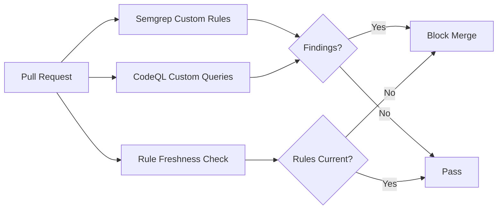

# Codex CLI for Static Analysis: Agent-Driven Semgrep Rule Authoring, CodeQL Query Generation, and Security Scanning Pipelines


---

Static analysis tools catch bugs before they reach production, but writing custom rules is tedious enough that most teams never do it. Semgrep rules require YAML pattern syntax; CodeQL queries demand a Datalog-derived query language with a steep learning curve [^1]. The result: organisations run the default rulesets and miss project-specific vulnerability classes entirely.

Codex CLI changes this calculus. By combining the Semgrep MCP server for real-time scanning, `codex exec` for batch rule generation, and AGENTS.md guardrails for rule quality, you can build a pipeline that turns ad-hoc security knowledge into tested, enforceable static analysis rules — without becoming a QL expert.

## The Semgrep MCP Server in Codex CLI

Semgrep ships an official MCP server that exposes its scanning engine as tools callable by any MCP-compatible agent [^2]. The server bundles three Semgrep products — Code (SAST), Supply Chain (SCA), and Secrets detection — into a single integration [^3].

### Configuration

Add the server to your Codex configuration:

```toml
# ~/.codex/config.toml
[mcp_servers.semgrep]
command = "semgrep"
args = ["mcp"]
```

Prerequisites: Python 3.10+, `semgrep` installed via Homebrew or `pipx`, and `semgrep login && semgrep install-semgrep-pro` for the Pro engine [^3].

Once configured, Codex sessions gain access to several MCP tools [^2]:

| Tool | Purpose |
|------|---------|
| `security_check` | Rapid vulnerability scan on code snippets |
| `scan_code` | Full scan using standard rulesets |
| `scan_with_custom_rule` | Scan using a user-defined YAML rule |
| `get_rule_schema` | JSON schema for custom rule development |
| `get_ast` | Abstract syntax tree for structural analysis |

Unlike Claude Code's hook-based Semgrep integration, Codex invokes Semgrep tools through MCP — the agent calls them explicitly rather than triggering on file writes [^3].

## Encoding Rule-Authoring Standards in AGENTS.md

Before generating rules, encode your organisation's static analysis conventions:

```markdown
# AGENTS.md — Static Analysis Standards

## Semgrep Rule Authoring
- Every rule MUST include a `fix` field with an auto-fix pattern where feasible
- Rules MUST use `severity: ERROR` for exploitable vulnerabilities, `WARNING` for
  code-quality issues, `INFO` for style enforcement
- Every rule MUST have at least two `test_cases` — one true positive, one true negative
- Taint-mode rules MUST specify explicit `sources`, `sinks`, and `sanitizers`
- Rule IDs follow the pattern: `<org>.<language>.<category>.<description>`
  e.g. `acme.python.injection.sqlalchemy-raw-text`

## CodeQL Query Authoring
- Queries MUST include `@kind problem` or `@kind path-problem` metadata
- Every query MUST have a companion `.qlref` test file
- Prefer `DataFlow::PathGraph` over manual recursion for taint tracking
- Query IDs follow: `<org>/<language>/<category>/<description>`
```

This gives the agent concrete constraints rather than vague instructions. The Semgrep team's own guidance confirms that "agents learn far more from seeing a vulnerable code snippet next to its fixed version" than from descriptive paragraphs [^4].

## Generating Custom Semgrep Rules with Codex

### Interactive Rule Authoring

In an interactive session with the Semgrep MCP server active, prompt Codex to author rules contextually:

```
Scan src/ for SQL injection patterns, then write a custom Semgrep rule
that catches any use of f-strings or string concatenation inside
SQLAlchemy execute() calls. Include an auto-fix using text() with
bound parameters.
```

The agent can call `get_rule_schema` to understand the correct YAML structure, draft the rule, then immediately validate it with `scan_with_custom_rule` against your codebase [^2]. This feedback loop — draft, scan, refine — compresses what was previously hours of trial-and-error into minutes.

### Batch Rule Generation with `codex exec`

For systematic rule creation, use non-interactive mode with structured output:

```bash
codex exec \
  --model o4-mini \
  --approval-mode full-auto \
  --output-schema semgrep-rules-schema.json \
  "Analyse the top 10 most common vulnerability patterns in src/ using
   the Semgrep MCP tools. For each pattern, generate a custom Semgrep
   rule with test cases. Output the rules as a JSON array conforming
   to the provided schema."
```

The `--output-schema` flag ensures structured, parseable output [^5]. A suitable schema:

```json
{
  "type": "object",
  "properties": {
    "rules": {
      "type": "array",
      "items": {
        "type": "object",
        "properties": {
          "id": { "type": "string" },
          "severity": { "enum": ["ERROR", "WARNING", "INFO"] },
          "language": { "type": "string" },
          "pattern": { "type": "string" },
          "message": { "type": "string" },
          "fix": { "type": "string" },
          "test_positive": { "type": "string" },
          "test_negative": { "type": "string" }
        },
        "required": ["id", "severity", "language", "pattern", "message"]
      }
    }
  },
  "required": ["rules"]
}
```

### Example Generated Rule

A Codex-generated rule for detecting insecure deserialisation in Python:

```yaml
rules:
  - id: acme.python.security.pickle-untrusted-load
    severity: ERROR
    languages: [python]
    message: >
      Deserialising untrusted data with pickle can lead to arbitrary
      code execution (CWE-502). Use json.loads() or a safe
      deserialisation library instead.
    patterns:
      - pattern: pickle.loads($DATA)
      - pattern-not-inside: |
          $DATA = pickle.dumps(...)
    fix: json.loads($DATA)
    metadata:
      cwe: ["CWE-502"]
      owasp: ["A08:2021"]
      confidence: HIGH
```

## CodeQL Query Generation

CodeQL's QL language is substantially more complex than Semgrep's YAML patterns — a comparison study notes that "CodeQL queries use a SQL-like QL language requiring days of study to write effectively" [^1]. This makes it an ideal candidate for agent assistance.

### Prompting for CodeQL Queries

```
Write a CodeQL query for JavaScript that finds cases where user input
from Express req.query or req.body reaches a child_process.exec() call
without sanitisation. Use DataFlow::PathGraph for taint tracking.
Include @kind path-problem metadata and a .qlref test file.
```

Codex generates both the query and its test harness:

```codeql
/**
 * @name Command injection from HTTP parameters
 * @description User input from Express reaches child_process.exec
 *              without sanitisation.
 * @kind path-problem
 * @problem.severity error
 * @security-severity 9.8
 * @precision high
 * @id acme/javascript/injection/express-command-injection
 * @tags security
 *       external/cwe/cwe-078
 */

import javascript
import DataFlow::PathGraph

class HttpSource extends DataFlow::Node {
  HttpSource() {
    exists(Express::RouteHandler rh |
      this = rh.getARequestSource()
    )
  }
}

class ExecSink extends DataFlow::Node {
  ExecSink() {
    exists(DataFlow::CallNode call |
      call = DataFlow::moduleMember("child_process", "exec").getACall() and
      this = call.getArgument(0)
    )
  }
}

class CommandInjectionConfig extends TaintTracking::Configuration {
  CommandInjectionConfig() { this = "CommandInjectionConfig" }
  override predicate isSource(DataFlow::Node node) { node instanceof HttpSource }
  override predicate isSink(DataFlow::Node node) { node instanceof ExecSink }
}

from CommandInjectionConfig cfg, DataFlow::PathNode source, DataFlow::PathNode sink
where cfg.hasFlowPath(source, sink)
select sink.getNode(), source, sink,
  "Command injection: user input from $@ reaches exec() call.",
  source.getNode(), "HTTP parameter"
```

⚠️ CodeQL queries generated by the agent should always be validated with `codeql test run` against a known-vulnerable test case before deployment. The agent cannot execute CodeQL inside the Codex sandbox due to database construction requirements.

## Building a Reusable Rule-Authoring Skill

Encode the full workflow as a SKILL.md:

```markdown
# static-analysis-rule-author

## Trigger
When asked to create custom static analysis rules, security scanning
rules, or SAST custom patterns.

## Workflow
1. Use the Semgrep MCP `scan_code` tool to identify existing findings
   in the target directory
2. Analyse the findings to identify patterns not covered by default rules
3. For each gap, generate a custom rule:
   - Semgrep: YAML rule with pattern, message, severity, fix, and tests
   - CodeQL: QL query with metadata, taint config, and .qlref test file
4. Validate Semgrep rules using `scan_with_custom_rule` against the codebase
5. Output rules to `.semgrep/` and `.codeql/` directories respectively

## Constraints
- Follow AGENTS.md static analysis standards
- Every rule must have test cases (true positive + true negative)
- Prefer Semgrep for pattern-matching rules (faster, simpler)
- Use CodeQL only for inter-procedural taint tracking that Semgrep
  cannot express
- Never generate rules that suppress or weaken existing coverage
```

## CI/CD Integration: The Security Gate

Wire the generated rules into your pipeline:


```yaml
# .github/workflows/security-gate.yml
name: Custom SAST Gate
on: [pull_request]

jobs:
  semgrep-custom:
    runs-on: ubuntu-latest
    steps:
      - uses: actions/checkout@v4
      - name: Run custom Semgrep rules
        uses: semgrep/semgrep-action@v1
        with:
          config: .semgrep/
        env:
          SEMGREP_APP_TOKEN: ${{ secrets.SEMGREP_APP_TOKEN }}

  codeql-custom:
    runs-on: ubuntu-latest
    steps:
      - uses: actions/checkout@v4
      - uses: github/codeql-action/init@v3
        with:
          queries: .codeql/
          languages: javascript
      - uses: github/codeql-action/analyze@v3

  rule-freshness:
    runs-on: ubuntu-latest
    steps:
      - uses: actions/checkout@v4
      - name: Check rule freshness
        run: |
          codex exec \
            --model o4-mini \
            --approval-mode full-auto \
            "Review .semgrep/ rules against current Semgrep best
             practices. Flag any rules using deprecated patterns or
             missing required metadata fields. Output a pass/fail
             summary."
```




## Model Selection Matrix

| Task | Recommended Model | Rationale |
|------|-------------------|-----------|
| Scanning with Semgrep MCP | Any (tool call) | MCP tools run locally |
| Simple pattern rules | o4-mini | Mechanical YAML generation |
| Taint-mode Semgrep rules | o3 | Requires reasoning about data flow |
| CodeQL query authoring | o3 | Complex QL syntax and type system |
| Rule review and freshness | o4-mini | Structural comparison task |

GPT-5.5 is available in Codex as the newest frontier model [^6], but for rule generation the reasoning models (o3, o4-mini) typically produce better results due to the logical precision required.

## Running Both Tools: Practical Guidance

Many teams run Semgrep and CodeQL in tandem: "Semgrep in CI for fast PR-level gates and CodeQL in nightly builds for deeper dataflow and taint tracking analysis" [^1]. The performance difference is stark — Semgrep scans in roughly 10 seconds using ~150 MB of memory, whilst CodeQL takes minutes to 30+ minutes and uses ~450 MB due to database construction [^1].

Use Codex to enforce this division of labour. Your AGENTS.md should specify:

- **Semgrep**: pattern matching, string detection, simple data flow, auto-fixes
- **CodeQL**: inter-procedural taint tracking, type-state analysis, complex control-flow queries

## Anti-Patterns

1. **Generating without validating** — Always test rules with `scan_with_custom_rule` before committing. Untested rules produce false positives that erode developer trust.
2. **Duplicating default coverage** — Check existing rulesets before writing custom rules. Semgrep's registry contains over 20,000 Pro rules [^1].
3. **Over-scoping rules** — Semgrep Skills guidance confirms that rules "work best when narrowly focused" [^4]. A rule targeting "SQL injection in SQLAlchemy" outperforms one targeting "all injection vulnerabilities".
4. **Ignoring auto-fixes** — Rules without `fix` fields create work; rules with fixes create value.
5. **Trusting agent output without review** — Static analysis rules are security-critical. Every generated rule should undergo human review, particularly CodeQL queries where the QL type system can produce subtle logical errors.

## Known Limitations

- **`--output-schema` and `--resume` are mutually exclusive** — you cannot resume a structured-output session [^7]
- **Sandbox network isolation** — the Semgrep MCP server runs locally but `semgrep login` requires network access, so authenticate before entering the sandbox
- **CodeQL database construction** — CodeQL requires building a database from source, which cannot run inside the Codex sandbox; generate queries with Codex, validate them externally
- **Context window limits** — large monorepos may exceed context when scanning for patterns; scope scans to specific directories

## Citations

[^1]: [Semgrep vs CodeQL: Lightweight Patterns vs Semantic Analysis for SAST (2026)](https://dev.to/rahulxsingh/semgrep-vs-codeql-lightweight-patterns-vs-semantic-analysis-for-sast-2026-412k)
[^2]: [The AI Engineer's Deep Dive into the Official Semgrep MCP Server](https://skywork.ai/skypage/en/ai-engineer-semgrep-server/1977936492883283968)
[^3]: [Semgrep Plugin Documentation — Semgrep Guardian](https://semgrep.dev/docs/guardian)
[^4]: [How-to Write Skills That Make Your AI-Generated Code Secure — Semgrep Blog](https://semgrep.dev/blog/2026/security-skills-ai-agents/)
[^5]: [Non-interactive mode — Codex CLI | OpenAI Developers](https://developers.openai.com/codex/noninteractive)
[^6]: [Codex Changelog — OpenAI Developers](https://developers.openai.com/codex/changelog)
[^7]: [Add --output-schema support to codex exec resume — GitHub Issue #14343](https://github.com/openai/codex/issues/14343)
