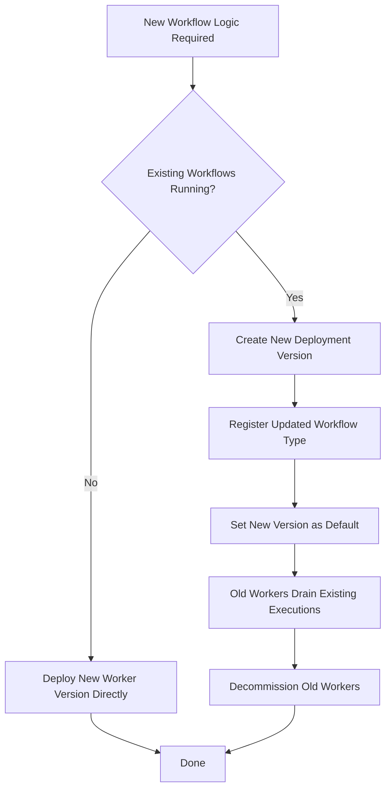

# Codex CLI for Temporal Workflow Development: Deterministic Workflow Generation, Activity Scaffolding, and Worker Versioning


---

Temporal's durable execution model demands strict determinism in workflow definitions — a constraint that makes AI-assisted code generation both tremendously useful and potentially dangerous. Codex CLI, configured with appropriate AGENTS.md guardrails, can scaffold workflow definitions, activity implementations, and versioning strategies that respect Temporal's replay semantics. This article covers practical patterns for using Codex CLI to accelerate Temporal development across Go, TypeScript, and Python SDKs.

## Why Temporal Needs Specialised Agent Configuration

Temporal workflow code replays from event history on every recovery[^1]. Any non-deterministic operation — network calls, random number generation, system clock reads — inside a workflow definition breaks replay and corrupts execution state[^2]. Standard AI code generation frequently violates these constraints by embedding HTTP calls or time-dependent logic directly in workflow functions.

Without explicit guardrails, Codex CLI will happily generate workflow code that calls `http.Get()` inside a Go workflow function or uses `Date.now()` in a TypeScript workflow. The AGENTS.md approach solves this by encoding Temporal's determinism rules as hard constraints the agent follows on every generation.

## AGENTS.md: Encoding Temporal Determinism Rules

Create a project-level AGENTS.md that encodes Temporal's core constraints:

```markdown
# AGENTS.md

## Temporal Workflow Rules (MANDATORY)

- NEVER place I/O, network calls, or non-deterministic operations inside workflow functions
- ALL external operations MUST be Activities invoked via workflow.ExecuteActivity (Go), proxyActivities (TS), or workflow.execute_activity (Python)
- NEVER use system time in workflows; use workflow.Now() (Go), workflow current time (TS), or workflow.time() (Python)
- NEVER use random number generators in workflows; use workflow-provided deterministic alternatives
- ALL workflow parameters and return types MUST be serialisable (no channels, functions, or interface types)
- Use context.Context (Go) or CancellationScope (TS) for cancellation propagation
- Activities MUST be idempotent or use Temporal's idempotency keys
- Worker Versioning: use Deployment Versions for new workflow logic; never modify running workflow behaviour in-place

## Code Structure

- workflows/ — workflow definitions only (deterministic)
- activities/ — activity implementations (I/O permitted)
- workers/ — worker bootstrap and registration
- tests/ — workflow replay tests and activity unit tests
```

This encoding means every `codex` invocation against your Temporal repo automatically respects determinism boundaries[^3].

## Generating Workflow Definitions

### Go SDK Workflow Generation

```bash
codex "Generate a Go Temporal workflow for order processing: \
  1. ValidateOrder activity \
  2. ChargePayment activity with retry policy (max 3 attempts, 5s initial interval) \
  3. FulfillOrder activity \
  4. SendConfirmation activity \
  Use saga pattern with compensations for ChargePayment (RefundPayment) and FulfillOrder (CancelFulfilment)"
```

With the AGENTS.md in place, Codex generates deterministic workflow code:

```go
package workflows

import (
    "time"

    "go.temporal.io/sdk/temporal"
    "go.temporal.io/sdk/workflow"

    "myapp/activities"
)

func OrderProcessingWorkflow(ctx workflow.Context, order activities.Order) (activities.OrderResult, error) {
    retryPolicy := &temporal.RetryPolicy{
        InitialInterval:    5 * time.Second,
        MaximumAttempts:    3,
        BackoffCoefficient: 2.0,
    }

    actOpts := workflow.ActivityOptions{
        StartToCloseTimeout: 30 * time.Second,
        RetryPolicy:         retryPolicy,
    }
    ctx = workflow.WithActivityOptions(ctx, actOpts)

    // Step 1: Validate
    var validateResult activities.ValidateResult
    if err := workflow.ExecuteActivity(ctx, activities.ValidateOrder, order).Get(ctx, &validateResult); err != nil {
        return activities.OrderResult{}, err
    }

    // Step 2: Charge (with compensation)
    var chargeResult activities.ChargeResult
    if err := workflow.ExecuteActivity(ctx, activities.ChargePayment, order).Get(ctx, &chargeResult); err != nil {
        return activities.OrderResult{}, err
    }

    // Step 3: Fulfil (with compensation on failure)
    var fulfilResult activities.FulfilResult
    if err := workflow.ExecuteActivity(ctx, activities.FulfillOrder, order).Get(ctx, &fulfilResult); err != nil {
        // Compensate: refund payment
        _ = workflow.ExecuteActivity(ctx, activities.RefundPayment, chargeResult).Get(ctx, nil)
        return activities.OrderResult{}, err
    }

    // Step 4: Confirm
    if err := workflow.ExecuteActivity(ctx, activities.SendConfirmation, order).Get(ctx, nil); err != nil {
        // Non-critical: log but don't compensate
        workflow.GetLogger(ctx).Warn("confirmation failed", "error", err)
    }

    return activities.OrderResult{OrderID: order.ID, Status: "completed"}, nil
}
```

The AGENTS.md constraints ensure Codex never places the actual payment logic inside the workflow function[^4].

### TypeScript SDK Workflow Generation

```bash
codex "Generate a TypeScript Temporal workflow for user onboarding: \
  createAccount, sendVerificationEmail, waitForVerification (signal), \
  provisionResources. Use proxyActivities and a 24-hour verification timeout."
```

```typescript
import { proxyActivities, defineSignal, setHandler, condition, ApplicationFailure } from '@temporalio/workflow';
import type * as activities from '../activities';

const { createAccount, sendVerificationEmail, provisionResources } = proxyActivities<typeof activities>({
  startToCloseTimeout: '30s',
  retry: { maximumAttempts: 5 },
});

export const verificationSignal = defineSignal<[boolean]>('verification');

export async function userOnboardingWorkflow(email: string): Promise<{ userId: string }> {
  const account = await createAccount(email);
  await sendVerificationEmail(account.userId, email);

  let verified = false;
  setHandler(verificationSignal, (isVerified: boolean) => {
    verified = isVerified;
  });

  const didVerify = await condition(() => verified, '24h');
  if (!didVerify) {
    throw ApplicationFailure.nonRetryable('Verification timeout exceeded');
  }

  await provisionResources(account.userId);
  return { userId: account.userId };
}
```

## Activity Scaffolding with Structured Output

Use `codex exec` with `--output-schema` to generate activity implementations in batch:

```bash
codex exec "Given this workflow definition, generate all required activity \
  implementations with proper error handling, idempotency guards, \
  and structured logging" \
  --input-file workflows/order_processing.go \
  --output-schema '{
    "type": "object",
    "properties": {
      "activities": {
        "type": "array",
        "items": {
          "type": "object",
          "properties": {
            "name": {"type": "string"},
            "filename": {"type": "string"},
            "code": {"type": "string"},
            "idempotency_strategy": {"type": "string"}
          }
        }
      }
    }
  }'
```

This produces structured JSON you can pipe into a file-creation script, ensuring every activity referenced in the workflow gets a corresponding implementation[^5].

## Reusable Temporal Skill Definition

Create a `SKILL.md` for repeatable Temporal workflow generation:

```markdown
# temporal-workflow-generator

## Purpose
Generate Temporal workflow definitions, activities, and worker configurations
from a high-level process description.

## Inputs
- Process description (natural language)
- Target SDK (go | typescript | python)
- Compensation requirements (saga pattern activities)
- Timeout and retry specifications

## Steps
1. Parse process into ordered activity steps
2. Generate workflow definition (deterministic, no I/O)
3. Generate activity stubs with retry annotations
4. Generate worker registration code
5. Generate workflow replay test

## Constraints
- Follow all rules in AGENTS.md
- Every activity must have a defined StartToCloseTimeout
- Saga compensations must be explicitly wired
- Generate replay tests using recorded histories
```

Invoke the skill:

```bash
codex "Use the temporal-workflow-generator skill to create a \
  subscription renewal workflow in Go with activities: \
  CheckSubscriptionStatus, ProcessPayment, ExtendSubscription, \
  SendReceipt. Saga compensations for ProcessPayment."
```

## Worker Versioning Strategy

Temporal's Worker Versioning (GA as of Replay 2026) pins running workflows to the worker deployment version that started them[^6]. This eliminates the need for `workflow.GetVersion()` patching — but requires careful deployment orchestration.



Generate versioning-aware worker configuration:

```bash
codex "Generate a Go Temporal worker with Worker Versioning enabled. \
  Use deployment version from BUILD_VERSION env var. \
  Register OrderProcessingWorkflow and all order activities. \
  Include graceful shutdown handling."
```

```go
package main

import (
    "log"
    "os"

    "go.temporal.io/sdk/client"
    "go.temporal.io/sdk/worker"

    "myapp/activities"
    "myapp/workflows"
)

func main() {
    c, err := client.Dial(client.Options{})
    if err != nil {
        log.Fatalln("Unable to create client", err)
    }
    defer c.Close()

    buildVersion := os.Getenv("BUILD_VERSION")
    if buildVersion == "" {
        buildVersion = "dev"
    }

    w := worker.New(c, "order-processing", worker.Options{
        DeploymentOptions: worker.DeploymentOptions{
            UseVersioning: true,
        },
        BuildID: buildVersion,
    })

    w.RegisterWorkflow(workflows.OrderProcessingWorkflow)
    w.RegisterActivity(&activities.OrderActivities{})

    if err := w.Run(worker.InterruptCh()); err != nil {
        log.Fatalln("Unable to start worker", err)
    }
}
```

## Replay Testing with Codex CLI

Temporal's replay test pattern verifies that workflow code changes don't break existing executions[^7]. Use Codex to generate replay tests from recorded histories:

```bash
codex "Generate a Go replay test for OrderProcessingWorkflow. \
  Download the workflow history from the dev namespace using tctl, \
  save it as a JSON fixture, and write a test that replays it \
  against the current workflow definition."
```

```go
package workflows_test

import (
    "testing"

    "go.temporal.io/sdk/testsuite"

    "myapp/workflows"
)

func TestOrderProcessingWorkflowReplay(t *testing.T) {
    replayer := worker.NewWorkflowReplayer()
    replayer.RegisterWorkflow(workflows.OrderProcessingWorkflow)

    err := replayer.ReplayWorkflowHistoryFromJSONFile(
        nil,
        "testdata/order_processing_history.json",
    )
    if err != nil {
        t.Fatalf("Replay failed: workflow is non-deterministic: %v", err)
    }
}
```

## CI Pipeline: Temporal Determinism Gate

Integrate a determinism validation step into your GitHub Actions pipeline:

```yaml
name: Temporal Determinism Gate
on: [pull_request]

jobs:
  temporal-validation:
    runs-on: ubuntu-latest
    steps:
      - uses: actions/checkout@v4

      - name: Replay Test Against Recorded Histories
        run: go test ./workflows/... -run TestReplay -v

      - name: Codex Determinism Audit
        uses: openai/codex-github-action@v1
        with:
          prompt: |
            Audit all files in workflows/ for Temporal determinism violations:
            - Direct I/O or network calls
            - System time usage (time.Now, Date.now)
            - Random number generation
            - Non-serialisable parameters
            Report violations as structured JSON.
          model: gpt-5.4-mini
          output_schema: '{"type":"object","properties":{"violations":{"type":"array","items":{"type":"object","properties":{"file":{"type":"string"},"line":{"type":"integer"},"violation":{"type":"string"},"fix":{"type":"string"}}}}}}'
```

## Model Selection for Temporal Tasks

| Task | Recommended Model | Rationale |
|------|-------------------|-----------|
| Workflow definition generation | gpt-5.5 | Complex control flow, saga patterns |
| Activity stub generation | gpt-5.4-mini | Mechanical scaffolding |
| Replay test generation | gpt-5.4-mini | Template-driven |
| Determinism audit | gpt-5.4-mini | Pattern matching |
| Worker versioning strategy | gpt-5.5 | Architectural reasoning |
| Migration from legacy patching | gpt-5.5 | Understanding existing version branches |

## Anti-Patterns

**Generating workflows without AGENTS.md constraints.** Without determinism rules encoded, Codex will embed I/O in workflow functions. Always configure AGENTS.md before generating Temporal code.

**Trusting generated code without replay tests.** Even with guardrails, validate every workflow change against recorded histories. A single non-deterministic call breaks all in-flight executions.

**Over-generating compensations.** Not every activity needs a saga compensation. Only activities with observable side effects (payments, provisioning) require explicit rollback logic.

**Ignoring Worker Versioning for long-running workflows.** If your workflows run for days or weeks, in-place code changes without versioning will cause non-determinism errors on replay. Use Deployment Versions from the start[^6].

**Generating activities without timeout specifications.** Temporal requires explicit timeouts. Configure AGENTS.md to mandate `StartToCloseTimeout` on every activity invocation.

## Known Limitations

- **Sandbox network isolation:** Codex CLI's sandbox blocks outbound network by default, so you cannot run `tctl` or connect to a Temporal cluster during generation. Use `network_access = true` in `[sandbox_workspace_write]` if you need live cluster interaction[^8].
- **output-schema and resume mutual exclusion:** `codex exec --output-schema` cannot be combined with `--resume`, limiting structured output to single-shot generation[^5].
- **Context window limits:** Large workflow histories (10,000+ events) may exceed context limits when passed as input. Use filtered or summarised histories for replay test generation.

## Conclusion

Temporal's determinism requirements make it an ideal use case for AGENTS.md-governed code generation. By encoding workflow constraints once and reusing them across every Codex session, you eliminate the most common class of Temporal bugs — non-deterministic workflow definitions — before they reach replay. Combine this with structured activity scaffolding, automated replay testing, and Worker Versioning awareness, and Codex CLI becomes a reliable accelerator for durable workflow development.

## Citations

[^1]: Temporal Workflow Documentation — [https://docs.temporal.io/workflows](https://docs.temporal.io/workflows)
[^2]: Temporal Workflow Determinism Constraints — [https://docs.temporal.io/workflow-definition](https://docs.temporal.io/workflow-definition)
[^3]: OpenAI Codex CLI AGENTS.md Guide — [https://developers.openai.com/codex/guides/agents-md](https://developers.openai.com/codex/guides/agents-md)
[^4]: OpenAI Codex CLI Best Practices — [https://developers.openai.com/codex/learn/best-practices](https://developers.openai.com/codex/learn/best-practices)
[^5]: OpenAI Codex Non-Interactive Mode Documentation — [https://developers.openai.com/codex/cli/reference](https://developers.openai.com/codex/cli/reference)
[^6]: Temporal Worker Versioning GA Announcement (Replay 2026) — [https://temporal.io/blog/replay-2026-product-announcements](https://temporal.io/blog/replay-2026-product-announcements)
[^7]: Temporal Go SDK Versioning Guide — [https://docs.temporal.io/develop/go/workflows/versioning](https://docs.temporal.io/develop/go/workflows/versioning)
[^8]: OpenAI Codex CLI Sandbox Configuration — [https://developers.openai.com/codex/concepts/sandboxing](https://developers.openai.com/codex/concepts/sandboxing)
