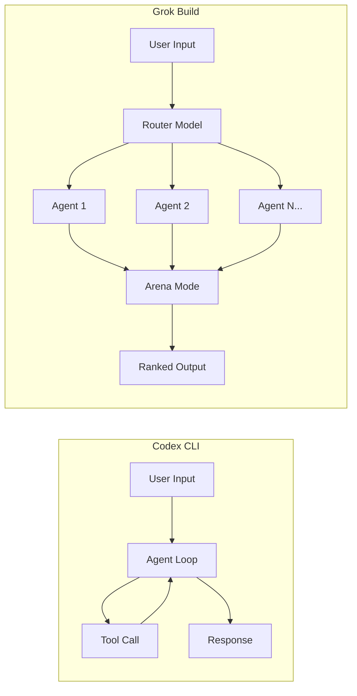
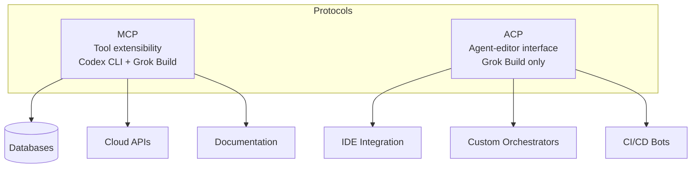

# Grok Build Enters the Ring: How xAI's Parallel-Agent CLI Compares to Codex CLI

---

On 14 May 2026, Elon Musk posted a broad call for beta testers of Grok Build, xAI's first terminal-native coding agent[^1]. The tool enters a market dominated by two incumbents --- OpenAI's Codex CLI (4 million weekly active users as of May 2026)[^2] and Anthropic's Claude Code --- but it arrives with an architectural wager that neither competitor has yet matched: up to eight parallel sub-agents orchestrated by a router model, scored and ranked by an automated Arena Mode before a developer ever reviews the output[^3].

This article examines what Grok Build ships today, where it diverges from Codex CLI's design philosophy, and what Codex CLI users should take from the comparison.

## Architecture: Router-Orchestrated Parallelism vs Single-Agent Depth

Codex CLI runs a single agent loop: user input enters the loop, the model reasons, invokes tools, observes results, and iterates until a termination condition is met. Subagents can be spawned for bounded parallel work, but the primary loop remains sequential and deterministic[^4]. This design favours deep, context-rich reasoning within a single thread.

Grok Build takes a fundamentally different approach. Its underlying engine, Grok 4.3 beta Heavy, coordinates sixteen specialised sub-models via a router[^5]. At the user-facing level, a single session can spawn up to eight concurrent sub-agents, each inheriting a slice of the context and working on an isolated branch of the task graph[^3]. A dedicated TUI viewer renders the plan as a directed graph of sub-tasks, showing which agent is working on which branch[^5].

The trade-off is legibility. Codex CLI's linear loop produces a conversation transcript that reads like a pair-programming session; Grok Build's fan-out-and-rank model produces a tournament bracket. For tasks with a single correct approach (bug fixes, targeted refactors), Codex CLI's depth-first reasoning is efficient. For tasks with multiple plausible implementations (greenfield features, architectural spikes), Grok Build's breadth-first exploration could surface options a single agent would never try.

## Arena Mode: Automated Code Review Before Human Review

Arena Mode is Grok Build's headline differentiator[^3]. When enabled, competing sub-agent outputs are scored against each other on correctness, style conformance, and test passage before being presented to the developer in ranked order. Think of it as an automated tournament where multiple implementations compete and only the winners reach human review.

Codex CLI has no direct equivalent. The closest pattern is spawning subagents on separate worktrees and using `/review` to assess each branch, but this remains a manual, sequential process[^4]. Teams wanting similar behaviour today would need to build it themselves using `codex exec` with `--output-schema` to collect structured findings from multiple runs, then score them externally.

Whether Arena Mode justifies the additional compute cost depends on the task. For well-specified tickets with clear acceptance criteria, a single high-quality agent pass (Codex CLI's strength) is likely more cost-effective. For exploratory work where "good enough" is hard to define upfront, having multiple candidates ranked automatically has genuine appeal.

## Context Windows and Model Capabilities

| Dimension | Codex CLI (GPT-5.5) | Codex CLI (GPT-5.3-Codex) | Grok Build (Grok 4.3 Heavy) |
|---|---|---|---|
| Context window | 400K--1M tokens[^6] | 128K tokens[^7] | 2M tokens (claimed)[^5] |
| SWE-bench Verified | 88.7%[^8] | 85.0%[^8] | 70.8% (self-reported)[^3] |
| Terminal-Bench 2.0 | 82.0%[^9] | 77.3%[^9] | Not yet benchmarked |
| Throughput | ~240 tok/s[^9] | ~240 tok/s[^9] | Not published |

Grok Build's 2M token context window is its largest numerical advantage, doubling what Claude Code offers and significantly exceeding Codex CLI's current ceiling[^5]. For monorepo-scale tasks where loading extensive context is essential, this could matter. However, context window size alone does not determine agent quality --- Codex CLI's GPT-5.5 scores 18 percentage points higher on SWE-bench Verified despite a smaller window[^8].

It is worth noting that xAI's benchmark figures have not been independently verified. When vals.ai tested Grok 4 with the SWE-agent scaffold, the score dropped to 58.6% from xAI's self-reported 72--75%[^10]. Grok Build's 70.8% figure should be treated with similar caution until independent evaluation data appears.

## Protocol Support: MCP vs ACP

Codex CLI uses the Model Context Protocol (MCP) for tool extensibility, supporting both STDIO and streaming HTTP transports configured via `config.toml`[^11]. The MCP ecosystem is mature, with hundreds of community servers covering databases, cloud providers, documentation sources, and IDE integrations.

Grok Build ships with MCP support and adds native support for the Agent Client Protocol (ACP), an open-source specification (Apache-licensed) that standardises bidirectional communication between code editors and AI coding agents[^12]. ACP aims to do for coding agents what the Language Server Protocol did for language servers --- decouple the agent from the client[^12].

Codex CLI does not yet support ACP natively. Its equivalent is the app-server JSON-RPC protocol and the `codex remote-control` command introduced in v0.130.0, which exposes Codex as a programmable backend over JSON-RPC[^13]. The question is whether ACP gains enough adoption to become a de facto standard. If it does, Codex CLI will likely need to support it; if it remains niche, the JSON-RPC approach serves the same integration use cases.

## Instruction Compatibility

A pragmatic detail: Grok Build recognises `AGENTS.md` instruction files, the same format Codex CLI uses for repository-level agent guidance[^5]. It also loads skill folders in Anthropic's format[^5]. This cross-compatibility lowers switching costs --- teams already maintaining `AGENTS.md` files for Codex CLI can trial Grok Build without rewriting their agent instructions.

## Security and Data Handling

Codex CLI's security model is well-documented: a two-axis system combining approval policies (suggest, auto-edit, full-auto) with sandbox enforcement (Seatbelt on macOS, Bubblewrap/Landlock on Linux, restricted tokens on Windows)[^14]. Network access is denied by default, write permissions are scoped to the workspace, and permission profiles persist across sessions[^14].

Grok Build claims a local-first architecture where "all code runs on your machine" and nothing is transmitted to xAI's servers during sessions[^3]. However, xAI has not yet published a Data Processing Agreement, a detailed threat model, or independent security audit results[^5]. For teams in regulated industries, this gap is significant. Codex CLI's sandbox has been publicly audited, hardened across three platforms, and documented with a formal threat model[^14].

## Pricing Comparison

| Tier | Codex CLI | Grok Build |
|---|---|---|
| Entry subscription | Pro \$20/month | SuperGrok Heavy \$299/month (\$99/month introductory)[^3] |
| API input tokens | \$2.50/M (GPT-5.5)[^15] | \$0.20/M (grok-code-fast-1)[^3] |
| API output tokens | \$10.00/M (GPT-5.5)[^15] | \$1.50/M[^3] |

Grok Build's API token pricing is aggressively low, but the subscription barrier is steep --- \$99/month introductory, rising to \$299/month, compared to Codex CLI's \$20/month Pro tier[^3]. The eight-agent parallelism also multiplies token consumption. A task that costs N tokens on Codex CLI could cost up to 8N on Grok Build if all sub-agents run to completion, though Arena Mode's early pruning may mitigate this.

For enterprise teams already on OpenAI's Business or Enterprise plans (\$30/user/month), Codex CLI's pricing is bundled into existing contracts. Grok Build requires a separate, premium subscription with no enterprise volume discounts announced.

## What Codex CLI Users Should Watch

**Arena Mode in practice.** If xAI publishes convincing evidence that automated ranking reduces review time and improves code quality beyond what single-agent depth achieves, the pattern will likely be replicated. Codex CLI's subagent system could support a similar workflow today with custom tooling around `codex exec`.

**ACP adoption.** If ACP gains traction as a cross-agent standard, expect Codex CLI to add support. The protocol's LSP-inspired design is sound, and OpenAI has a track record of adopting open standards (MCP support shipped within months of the protocol's release).

**Independent benchmarks.** Until Grok Build appears on Terminal-Bench, SWE-bench Pro, and independent evaluations with standardised scaffolding, the performance claims remain unverified. The gap between xAI's self-reported Grok 4 scores and independent results (72--75% vs 58.6%)[^10] warrants scepticism about Grok Build's 70.8% figure.

**Context window utilisation.** Grok Build's 2M token window is impressive on paper, but effective context utilisation matters more than raw size. Codex CLI's compaction system, which intelligently summarises earlier conversation turns to preserve working context, may deliver better long-session quality than simply loading more tokens.

## The Verdict for Now

Grok Build introduces genuinely novel ideas --- parallel agent execution, automated arena scoring, and native ACP support --- that push the CLI coding agent category forward. But it arrives in early beta with unverified benchmarks, no published security model, a premium price tag, and an ecosystem that is months behind Codex CLI's mature plugin, skill, and hook systems.

For teams already invested in Codex CLI, there is no compelling reason to switch today. The instruction-format compatibility means trialling Grok Build is low-cost, and watching Arena Mode's evolution is worthwhile. For teams evaluating the landscape fresh, Codex CLI remains the safer choice: production-hardened, extensively documented, competitively priced, and backed by benchmark results that have survived independent scrutiny.

The most interesting outcome may not be choosing one over the other. Grok Build's parallel-agent pattern and Codex CLI's deep single-agent reasoning represent complementary strategies. The agent that figures out how to combine both --- depth when certainty is high, breadth when it is not --- will likely define the next generation of CLI coding tools.

## Citations

[^1]: Elon Musk, Grok Build beta call for testers, X (formerly Twitter), 14 May 2026
[^2]: OpenAI, "Introducing upgrades to Codex", [openai.com/index/introducing-upgrades-to-codex](https://openai.com/index/introducing-upgrades-to-codex/), May 2026
[^3]: DevOps.com, "xAI Enters the Coding Agent Race With Grok Build", [devops.com](https://devops.com/xai-enters-the-coding-agent-race-with-grok-build/), May 2026
[^4]: OpenAI, "Subagents --- Codex", [developers.openai.com/codex/subagents](https://developers.openai.com/codex/subagents)
[^5]: Pasquale Pillitteri, "Grok Build: xAI's Agentic Coding CLI Takes On Claude Code", [pasqualepillitteri.it](https://pasqualepillitteri.it/en/news/2584/grok-build-xai-cli-2026), May 2026
[^6]: OpenAI, "Models --- Codex", [developers.openai.com/codex/concepts/models](https://developers.openai.com/codex/concepts/models)
[^7]: OpenAI, "Introducing GPT-5.3-Codex", [openai.com](https://openai.com/index/introducing-gpt-5-2-codex/)
[^8]: marc0.dev, "SWE-Bench Leaderboard May 2026", [marc0.dev/en/leaderboard](https://www.marc0.dev/en/leaderboard), accessed 16 May 2026
[^9]: SmartScope, "GPT-5.3-Codex Complete Guide | Terminal-Bench 77.3%", [smartscope.blog](https://smartscope.blog/en/blog/gpt-5-3-codex-complete-guide/), May 2026
[^10]: vals.ai, SWE-bench Verified independent evaluation results, [vals.ai/benchmarks/swebench](https://www.vals.ai/benchmarks/swebench), accessed May 2026
[^11]: OpenAI, "MCP --- Codex", [developers.openai.com/codex/mcp](https://developers.openai.com/codex/mcp)
[^12]: PromptLayer, "Agent Client Protocol: The LSP for AI Coding Agents", [blog.promptlayer.com](https://blog.promptlayer.com/agent-client-protocol-the-lsp-for-ai-coding-agents/), 2026
[^13]: OpenAI, "Codex CLI v0.130.0 Changelog", [developers.openai.com/codex/changelog](https://developers.openai.com/codex/changelog), 8 May 2026
[^14]: OpenAI, "Agent approvals and security --- Codex", [developers.openai.com/codex/agent-approvals-security](https://developers.openai.com/codex/agent-approvals-security)
[^15]: OpenAI, "Codex Pricing", [developers.openai.com/codex/pricing](https://developers.openai.com/codex/pricing)
