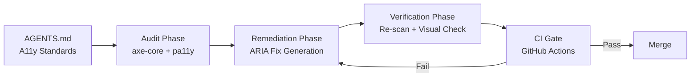

# Codex CLI for Accessibility Auditing: WCAG Compliance Scanning, ARIA Remediation, and CI Enforcement Pipelines


---

With ADA Title II now mandating WCAG 2.1 Level AA for US state and local government digital services — large entities by April 2027, smaller ones by April 2028 [^1] — and the European Accessibility Act applying from June 2025 [^2], accessibility compliance has shifted from "nice to have" to "legally required." Automated scanners catch roughly 57% of WCAG issues [^3], but fixing what they find still demands manual effort across hundreds of components. Codex CLI bridges that gap: it runs the scanners, interprets the violations, generates ARIA-correct remediation code, and enforces compliance in CI — all from the terminal.

This article covers a four-phase pipeline: encoding accessibility standards in AGENTS.md, running structured audits with `codex exec`, generating targeted fixes with a reusable skill, and wiring the lot into a GitHub Actions enforcement gate.

## The Accessibility Agent Pipeline



The pipeline treats accessibility violations the same way a linting pipeline treats code style: scan, fix, verify, gate.

## Phase 1: Encoding Accessibility Standards in AGENTS.md

Before Codex touches any component, it needs to know your project's accessibility conventions. Encode these in your repository's AGENTS.md file so every interactive and non-interactive session inherits them [^4].

```toml
# .codex/AGENTS.md (relevant section)
```

```markdown
## Accessibility Standards

### Target Compliance
- WCAG 2.1 Level AA minimum for all user-facing components
- WCAG 2.2 Level AA for new components (success criteria 2.4.11 Focus Not Obscured, 2.4.13 Focus Appearance, 3.3.7 Redundant Entry)

### ARIA Patterns
- Use native HTML semantics before ARIA — a `<button>` beats `<div role="button">`
- Every interactive element must be keyboard-operable (Enter and Space for buttons, Arrow keys for menus)
- Dynamic content changes require `aria-live` regions: `polite` for non-urgent, `assertive` for errors
- Form inputs must have associated `<label>` elements; `aria-label` only when visible labels are impossible

### Colour and Contrast
- Normal text: minimum 4.5:1 contrast ratio
- Large text (18pt or 14pt bold): minimum 3:1
- Focus indicators: minimum 3:1 against adjacent colours, 2px minimum thickness

### Testing Tools
- Primary: axe-core via @axe-core/cli (WCAG 2.1 AA tags)
- Secondary: pa11y-ci for page-level batch scanning
- Visual: Playwright screenshots with forced-colors media query for high-contrast mode verification
```

This context shapes every prompt Codex processes. When you ask it to fix a form component, it already knows to prefer native `<label>` over `aria-label` [^5].

## Phase 2: Structured Accessibility Auditing with codex exec

### Single-Component Audit

For a targeted audit of a specific component:

```bash
codex exec "Run axe-core against the LoginForm component. \
  Start a local dev server, navigate to /login, execute axe-core \
  with --tags wcag2a,wcag2aa,wcag21aa,best-practice, and report \
  every violation with its WCAG success criterion, impact level, \
  affected HTML, and a suggested fix." \
  --sandbox workspace-write
```

### Batch Audit with Structured Output

For larger projects, use `--output-schema` to produce machine-readable results [^6]:

```json
{
  "type": "object",
  "properties": {
    "pages_scanned": { "type": "integer" },
    "total_violations": { "type": "integer" },
    "critical": { "type": "integer" },
    "serious": { "type": "integer" },
    "violations": {
      "type": "array",
      "items": {
        "type": "object",
        "properties": {
          "rule_id": { "type": "string" },
          "wcag_criterion": { "type": "string" },
          "impact": { "type": "string" },
          "file": { "type": "string" },
          "element": { "type": "string" },
          "fix_description": { "type": "string" }
        }
      }
    }
  }
}
```

```bash
codex exec "Audit all pages listed in sitemap.xml for WCAG 2.1 AA \
  violations using axe-core and pa11y. For each violation, identify \
  the source component file responsible." \
  --output-schema ./a11y-audit-schema.json \
  -o ./a11y-audit-results.json
```

The structured output feeds downstream tooling — dashboards, ticket creation scripts, or the remediation phase itself.

### Combining axe-core and pa11y

Using both scanners in combination catches roughly 35% of known WCAG issues — each tool's rule set overlaps but covers different edges [^7]. axe-core excels at DOM-level rule accuracy with fewer false positives, whilst pa11y-ci handles page-level batch scanning with HTML CodeSniffer rules that axe misses [^8].

```bash
# Install both scanners
npm install -g @axe-core/cli pa11y-ci

# axe-core scan
axe http://localhost:3000/dashboard --tags wcag2aa --save axe-results.json

# pa11y-ci batch scan
pa11y-ci --config .pa11yci.json --json > pa11y-results.json
```

A pa11y-ci configuration file for your routes:

```json
{
  "defaults": {
    "timeout": 30000,
    "standard": "WCAG2AA",
    "runners": ["axe", "htmlcs"]
  },
  "urls": [
    "http://localhost:3000/",
    "http://localhost:3000/login",
    "http://localhost:3000/dashboard",
    "http://localhost:3000/settings"
  ]
}
```

## Phase 3: Agent-Driven ARIA Remediation

### The a11y-remediator Skill

Package the remediation workflow as a reusable skill [^9]:

```markdown
# .agents/skills/a11y-remediator/SKILL.md

## Trigger
When asked to "fix accessibility", "remediate a11y", or "fix WCAG violations"

## Inputs
- Audit results JSON (from axe-core or pa11y)
- Component file paths

## Workflow
1. Parse the violations JSON, grouping by component file
2. For each component, read the source and identify the violating elements
3. Apply fixes following this priority:
   a. Use native HTML semantics (replace `<div>` with `<button>`, `<nav>`, `<main>`)
   b. Add missing labels (`<label for="">`, `aria-label`, `aria-labelledby`)
   c. Fix contrast issues (update CSS custom properties, not inline styles)
   d. Add keyboard handlers (onKeyDown for Enter/Space on interactive elements)
   e. Add `aria-live` regions for dynamic content
4. Run axe-core against the modified component to verify the fix
5. If new violations appear, iterate (max 3 attempts)

## Constraints
- NEVER remove existing ARIA attributes without replacing them
- NEVER use `tabindex` values greater than 0
- NEVER suppress focus outlines without providing an alternative indicator
- Prefer CSS custom properties for colour changes to maintain theme consistency

## Output
- Modified component files with fixes applied
- Summary of changes per WCAG success criterion
```

### Interactive Remediation Session

Feed the audit results into an interactive session:

```bash
cat a11y-audit-results.json | codex exec \
  "Using the a11y-remediator skill, fix all critical and serious \
  WCAG violations in the audit results. Group fixes by component. \
  After each component fix, re-run axe-core to verify." \
  --sandbox workspace-write
```

Codex reads each violation, locates the source component, and applies targeted fixes. A typical remediation for a missing form label:

```tsx
// Before — axe rule: label (WCAG 1.3.1, 4.1.2)
<input type="email" placeholder="Email address" />

// After — native label association
<label htmlFor="email-input">Email address</label>
<input id="email-input" type="email" placeholder="Email address" />
```

For interactive widgets missing keyboard support:

```tsx
// Before — axe rule: keyboard (WCAG 2.1.1)
<div className="dropdown-trigger" onClick={toggleMenu}>
  Options
</div>

// After — semantic element with keyboard handling
<button
  className="dropdown-trigger"
  onClick={toggleMenu}
  onKeyDown={(e) => {
    if (e.key === 'Enter' || e.key === ' ') {
      e.preventDefault();
      toggleMenu();
    }
  }}
  aria-expanded={isOpen}
  aria-haspopup="menu"
>
  Options
</button>
```

## Phase 4: CI Enforcement Gate

### GitHub Actions Workflow

Wire the audit into your CI pipeline so no inaccessible code reaches production [^10]:

```yaml
# .github/workflows/a11y-gate.yml
name: Accessibility Gate

on:
  pull_request:
    paths:
      - 'src/components/**'
      - 'src/pages/**'
      - '**/*.css'
      - '**/*.scss'

jobs:
  a11y-audit:
    runs-on: ubuntu-latest
    steps:
      - uses: actions/checkout@v4

      - uses: actions/setup-node@v4
        with:
          node-version: '22'

      - name: Install dependencies
        run: npm ci

      - name: Start dev server
        run: npm run dev &
        env:
          PORT: 3000

      - name: Wait for server
        run: npx wait-on http://localhost:3000 --timeout 30000

      - name: Run axe-core audit
        run: |
          npx @axe-core/cli http://localhost:3000 \
            --tags wcag2a,wcag2aa,wcag21aa \
            --save axe-results.json \
            --exit

      - name: Run pa11y-ci audit
        run: npx pa11y-ci --config .pa11yci.json --json > pa11y-results.json

      - name: Fail on critical or serious violations
        run: |
          CRITICAL=$(jq '[.[] | .violations[] | select(.impact == "critical")] | length' axe-results.json)
          SERIOUS=$(jq '[.[] | .violations[] | select(.impact == "serious")] | length' axe-results.json)
          echo "Critical: $CRITICAL, Serious: $SERIOUS"
          if [ "$CRITICAL" -gt 0 ] || [ "$SERIOUS" -gt 0 ]; then
            echo "::error::$CRITICAL critical and $SERIOUS serious a11y violations found"
            exit 1
          fi

      - name: Upload audit artefacts
        if: always()
        uses: actions/upload-artifact@v4
        with:
          name: a11y-audit-results
          path: |
            axe-results.json
            pa11y-results.json
```

### Codex-Powered Auto-Remediation in CI

For teams running Codex in CI via access tokens [^11], add an auto-fix step:


```yaml
      - name: Auto-remediate with Codex
        if: failure()
        env:
          CODEX_API_KEY: ${{ secrets.CODEX_ACCESS_TOKEN }}
        run: |
          codex exec "Fix all critical and serious WCAG violations \
            found in axe-results.json. Apply minimal, targeted fixes \
            following the a11y-remediator skill. Commit the fixes." \
            --sandbox workspace-write
```


⚠️ Auto-remediation in CI should be gated behind human review — Codex-generated ARIA fixes need manual verification for semantic correctness, particularly for complex widget patterns like comboboxes and tree views where ARIA authoring practices are nuanced [^12].

## Model Selection

| Task | Recommended Approach | Rationale |
|------|---------------------|-----------|
| Batch page scanning | `codex exec` with low reasoning | Mechanical — run tool, collect output |
| Violation triage and grouping | `codex exec` with `--output-schema` | Structured extraction from scan results |
| Single-component ARIA fix | Interactive with medium reasoning | Needs DOM context and semantic judgement |
| Complex widget remediation | Interactive with high reasoning | ARIA widget patterns require careful state management |
| CI gate scripting | `codex exec` with low reasoning | Deterministic pass/fail evaluation |

## The Community Accessibility Agents

The Community Access project provides 79 specialised accessibility agents covering web, document (DOCX, XLSX, PDF, EPUB), and repository management [^13]. These agents install as Codex CLI skills with TOML-based role configuration, giving you specialist reviewers for ARIA validation, colour contrast enforcement, keyboard navigation patterns, and form accessibility — each encoding the relevant WCAG 2.2 success criteria.

For teams wanting a pre-built accessibility skill set rather than building their own, this framework provides a strong starting point.

## Anti-Patterns

**Suppressing violations instead of fixing them.** Adding `// axe-disable` comments or filtering rules from the scan config hides problems without solving them. If a rule genuinely does not apply, document why in AGENTS.md.

**Over-relying on `aria-label` instead of visible text.** Screen reader users benefit from visible labels that sighted users also see. Use `aria-label` only when a visible label is genuinely impossible — not as a shortcut [^5].

**Fixing contrast by changing text colour alone.** Contrast fixes must account for all states (hover, focus, active, disabled) and dark/light theme variants. Modify CSS custom properties at the theme level, not inline styles.

**Running accessibility scans only on the homepage.** WCAG compliance applies to every page a user can reach. Scan all routes listed in your sitemap, plus authenticated flows like dashboards, settings, and checkout.

**Trusting automated scans as complete coverage.** Automated tools catch roughly 35–57% of WCAG issues [^3][^7]. Manual testing with screen readers (VoiceOver, NVDA) and keyboard-only navigation remains essential for the remaining 43–65%.

## Known Limitations

- **Sandbox network isolation**: Codex's default sandbox restricts network access. Scanning a locally-served app works, but scanning external URLs requires `--sandbox danger-full-access` or a pre-fetched HTML snapshot approach.
- **`--output-schema` and `--resume` are mutually exclusive**: structured audit output cannot be resumed [^6].
- **Context window limits**: large audit result files (100+ violations across dozens of pages) may exceed the context window. Chunk audits by page group or component directory.
- **Semantic judgement gaps**: Codex can fix mechanical ARIA issues (missing labels, roles, states) but struggles with subjective criteria like "meaningful sequence" (WCAG 1.3.2) or "consistent navigation" (WCAG 3.2.3), which require human assessment.

## Citations

[^1]: ADA.gov, "State and Local Governments: First Steps Toward Complying with the ADA Title II Web and Mobile Application Accessibility Rule," [https://www.ada.gov/resources/web-rule-first-steps/](https://www.ada.gov/resources/web-rule-first-steps/)

[^2]: European Commission, "European Accessibility Act," Directive (EU) 2019/882, applicable from 28 June 2025, [https://ec.europa.eu/social/main.jsp?catId=1202](https://ec.europa.eu/social/main.jsp?catId=1202)

[^3]: Deque Systems, "axe-core: Accessibility engine for automated Web UI testing," [https://github.com/dequelabs/axe-core](https://github.com/dequelabs/axe-core) — axe-core documentation states automated scanning finds on average 57% of WCAG issues.

[^4]: OpenAI, "Best practices – Codex," [https://developers.openai.com/codex/learn/best-practices](https://developers.openai.com/codex/learn/best-practices)

[^5]: W3C, "ARIA Authoring Practices Guide," [https://www.w3.org/WAI/ARIA/apg/](https://www.w3.org/WAI/ARIA/apg/) — "First Rule of ARIA Use: If you can use a native HTML element or attribute with the semantics and behaviour you require, do so."

[^6]: OpenAI, "Non-interactive mode – Codex," [https://developers.openai.com/codex/noninteractive](https://developers.openai.com/codex/noninteractive)

[^7]: Abbott, "axe-core vs PA11Y," [https://github.com/abbott567/axe-core-vs-pa11y](https://github.com/abbott567/axe-core-vs-pa11y) — combined tool approach catches approximately 35% of known WCAG issues.

[^8]: Pa11y, "Pa11y: Your automated accessibility testing pal," [https://github.com/pa11y/pa11y](https://github.com/pa11y/pa11y)

[^9]: OpenAI, "Features – Codex CLI," [https://developers.openai.com/codex/cli/features](https://developers.openai.com/codex/cli/features)

[^10]: CivicActions, "Automated accessibility testing: Leveraging GitHub Actions and pa11y-ci with axe," [https://accessibility.civicactions.com/posts/automated-accessibility-testing-leveraging-github-actions-and-pa11y-ci-with-axe](https://accessibility.civicactions.com/posts/automated-accessibility-testing-leveraging-github-actions-and-pa11y-ci-with-axe)

[^11]: OpenAI, "Access tokens – Codex," [https://developers.openai.com/codex/enterprise/access-tokens](https://developers.openai.com/codex/enterprise/access-tokens)

[^12]: W3C, "ARIA Authoring Practices Guide: Patterns," [https://www.w3.org/WAI/ARIA/apg/patterns/](https://www.w3.org/WAI/ARIA/apg/patterns/)

[^13]: Community Access, "Accessibility Agents: 79 specialists for Claude Code, Codex CLI, and GitHub Copilot," [https://github.com/Community-Access/accessibility-agents](https://github.com/Community-Access/accessibility-agents)
