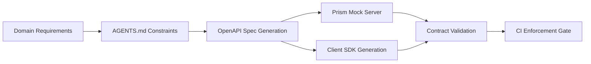

# Codex CLI for API-First Development: OpenAPI Spec Generation, Mock Servers, and Client SDK Automation


---

API-first development — writing the contract before the implementation — has been an industry best practice for years. Yet the gap between designing an OpenAPI spec and having a functioning mock server, validated contract, and generated SDKs still involves stitching together half a dozen tools manually. Codex CLI collapses that pipeline into a conversational workflow backed by structured output, agent skills, and CI enforcement.

This article walks through a complete API-first pipeline: from spec generation through mock validation, client SDK scaffolding, and contract drift detection in CI.

## The API-First Pipeline with Codex CLI



The pipeline has four stages: spec authoring, mock server provisioning, SDK generation, and continuous contract validation. Codex CLI can drive each stage interactively or in batch via `codex exec`.

## Stage 1: Encoding API Standards in AGENTS.md

Before generating any specification, encode your organisation's API design standards in `AGENTS.md` so every Codex session respects them [^1]:

```markdown
<!-- AGENTS.md -->
## API Design Standards

- All new APIs MUST have an OpenAPI 3.1 specification in `specs/`
- Use kebab-case for URL paths, camelCase for JSON properties
- Every endpoint MUST define 400, 401, 403, and 500 error responses
- Pagination follows cursor-based pattern with `next_cursor` field
- All request/response schemas MUST include `example` values
- Version APIs via URL path prefix (`/v1/`, `/v2/`)
- Use `$ref` components for shared schemas — no inline definitions
```

Directory-scoped overrides let teams refine these standards per service [^2]:

```
repo-root/
├── AGENTS.md                    # Organisation-wide API standards
└── services/
    ├── payments/
    │   └── AGENTS.md            # PCI-DSS constraints for payment APIs
    └── notifications/
        └── AGENTS.md            # Async-first, webhook schema rules
```

## Stage 2: Generating OpenAPI Specs with Codex CLI

### Interactive Spec Authoring

For greenfield APIs, start an interactive session with architectural constraints:

```bash
codex "Design a REST API for a user management service. \
  Output an OpenAPI 3.1 spec in YAML to specs/users-api.yaml. \
  Include CRUD for users and teams, cursor-based pagination, \
  OAuth 2.0 bearer auth, and rate limiting headers."
```

Codex reads the `AGENTS.md` standards, generates a spec with proper error responses and examples, and writes it to disk [^1]. Review it in the TUI before accepting.

### Batch Spec Generation with Structured Output

For CI pipelines or bulk generation, use `codex exec` with `--output-schema` to produce machine-readable results [^3]:

```bash
codex exec \
  --sandbox workspace-write \
  --output-schema specs/audit-schema.json \
  "Audit specs/users-api.yaml for OpenAPI 3.1 compliance. \
   Report missing examples, undocumented error codes, \
   and inline schema definitions that should be \$ref components."
```

Where `audit-schema.json` defines the expected output shape:

```json
{
  "$schema": "https://json-schema.org/draft/2020-12/schema",
  "type": "object",
  "properties": {
    "spec_file": { "type": "string" },
    "violations": {
      "type": "array",
      "items": {
        "type": "object",
        "properties": {
          "path": { "type": "string" },
          "rule": { "type": "string" },
          "severity": { "enum": ["error", "warning", "info"] },
          "message": { "type": "string" }
        },
        "required": ["path", "rule", "severity", "message"]
      }
    },
    "summary": {
      "type": "object",
      "properties": {
        "total_endpoints": { "type": "integer" },
        "compliant": { "type": "integer" },
        "violations_count": { "type": "integer" }
      }
    }
  },
  "required": ["spec_file", "violations", "summary"]
}
```

### Extracting Specs from Existing Code

For brownfield projects, Codex can reverse-engineer an OpenAPI spec from existing route handlers. The Speakeasy agent skills provide a dedicated `extract-oas-from-code` skill that pairs well with Codex CLI [^4]:

```bash
npx skills add speakeasy-api/skills
codex "Extract an OpenAPI 3.1 spec from the Express routes in src/routes/. \
  Use the speakeasy extract-oas-from-code skill. \
  Write the result to specs/extracted-api.yaml."
```

## Stage 3: Mock Server with Prism

Once you have a spec, spin up a Stoplight Prism mock server for frontend teams to develop against [^5]:

```bash
# Install Prism
npm install -g @stoplight/prism-cli

# Start mock server from spec
prism mock specs/users-api.yaml --port 4010 --dynamic
```

The `--dynamic` flag uses Faker.js to generate realistic test data matching your schema definitions rather than returning static examples [^5].

### Codex-Driven Mock Validation

Use Codex to generate integration tests against the mock:

```bash
codex "Write integration tests in tests/api/ that exercise \
  every endpoint in specs/users-api.yaml against \
  http://localhost:4010. Use vitest and node-fetch. \
  Verify response shapes match the OpenAPI schemas. \
  Include edge cases for pagination cursors and error responses."
```

### PostToolUse Hook for Spec Validation

Add a hook to validate specs whenever Codex modifies them:

```toml
# .codex/hooks.toml
[[post_tool_use]]
pattern = "specs/*.yaml"
command = "npx @stoplight/spectral-cli lint ${file} --ruleset .spectral.yaml"
on_failure = "block"
```

This prevents Codex from writing invalid specs — any Spectral rule violation blocks the change [^6].

## Stage 4: Client SDK Generation

### Speakeasy Agent Skills

Speakeasy's 21 agent skills include language-specific SDK generation for TypeScript, Python, Go, Java, C#, Ruby, and PHP [^4]. With the skills installed, Codex can generate SDKs conversationally:

```bash
codex "Generate a TypeScript client SDK from specs/users-api.yaml \
  using the Speakeasy SDK generation skill. \
  Output to packages/users-sdk-ts/. \
  Include retry logic and typed error classes."
```

### openapi-generator as an Alternative

For teams not using Speakeasy, `openapi-generator-cli` remains a solid open-source option [^7]:

```bash
codex exec --sandbox workspace-write \
  "Run openapi-generator-cli generate \
   -i specs/users-api.yaml \
   -g typescript-axios \
   -o packages/users-client/ \
   --additional-properties=supportsES6=true,npmName=@acme/users-client. \
   Then review the generated code and fix any type issues."
```

The advantage of routing generation through Codex is post-generation refinement: the agent can review generated code, fix type issues, add missing JSDoc comments, and align naming with your project's conventions — all in a single turn.

## Reusable API-First Skill

Create a reusable skill at `.agents/skills/api-first-auditor/SKILL.md`:

```markdown
---
name: api-first-auditor
description: >
  Audit OpenAPI specifications for completeness, generate mock server
  configurations, and scaffold client SDKs. Trigger when the user asks
  to review API specs, generate SDKs, or validate API contracts.
---

## Instructions

1. Validate the target OpenAPI spec with Spectral using `.spectral.yaml`
2. Check every endpoint has: error responses (400/401/403/500),
   request/response examples, and `$ref` component schemas
3. Verify pagination follows cursor-based pattern
4. Report findings as structured JSON matching `specs/audit-schema.json`
5. If `--fix` flag is provided, auto-remediate violations

## Tools Required
- `npx @stoplight/spectral-cli`
- `npx @openapitools/openapi-generator-cli`
```

Invoke it explicitly or let Codex match it implicitly when you mention API auditing [^8].

## CI Enforcement: Contract Drift Detection

The most valuable part of the pipeline is catching contract drift — when implementation diverges from the spec. Add a GitHub Actions workflow:


```yaml
# .github/workflows/api-contract.yml
name: API Contract Validation
on:
  pull_request:
    paths:
      - 'specs/**'
      - 'src/routes/**'
      - 'packages/*-client/**'

jobs:
  contract-check:
    runs-on: ubuntu-latest
    steps:
      - uses: actions/checkout@v4

      - name: Lint OpenAPI specs
        run: npx @stoplight/spectral-cli lint specs/*.yaml --ruleset .spectral.yaml

      - name: Validate spec-to-code consistency
        env:
          CODEX_API_KEY: ${{ secrets.CODEX_API_KEY }}
        run: |
          codex exec \
            --sandbox read-only \
            --output-schema specs/drift-schema.json \
            -o drift-report.json \
            "Compare specs/users-api.yaml against the route handlers \
             in src/routes/users/. Report any endpoints, parameters, \
             or response schemas that exist in code but not in the spec, \
             or vice versa."

      - name: Fail on drift
        run: |
          DRIFT=$(jq '.drift_count' drift-report.json)
          if [ "$DRIFT" -gt 0 ]; then
            echo "::error::API contract drift detected: $DRIFT inconsistencies"
            jq '.drifts[]' drift-report.json
            exit 1
          fi
```


This uses `codex exec` with a `CODEX_API_KEY` access token for headless CI authentication [^9], and structured output to produce a machine-readable drift report.

## Model Selection

| Task | Recommended Model | Rationale |
|------|-------------------|-----------|
| Interactive spec design | `gpt-5.4` (default) | Complex domain modelling benefits from strongest reasoning [^10] |
| Batch spec auditing | `gpt-5.4-mini` | Sufficient for structural validation; lower cost at scale |
| SDK review and refinement | `gpt-5.4` | Needs cross-file understanding of types and conventions |
| CI drift detection | `gpt-5.4-mini` | Structured comparison task; cost-sensitive in CI |

Override per task with `-c model=gpt-5.4-mini` or set in your CI profile [^10].

## Anti-Patterns

**Generating specs without domain review.** Codex produces syntactically valid OpenAPI, but domain correctness requires human review. Never merge a generated spec without a domain expert approving the resource model.

**Treating generated SDKs as final.** Generated client code often needs refinement — retry policies, error handling conventions, and documentation rarely match your project's standards out of the box. Use Codex for post-generation polish.

**Skipping mock validation.** A spec that passes linting may still produce unusable mock responses. Always test generated specs against Prism before committing.

**Monolithic specs.** For services with more than ~30 endpoints, split specs into domain-bounded files and use `$ref` across them. Single-file specs exceeding ~3,000 lines strain the context window.

## Known Limitations

- **`--output-schema` and `resume` are mutually exclusive**: structured output sessions cannot be resumed via `codex exec resume` [^11]
- **Sandbox network isolation**: Prism mock servers running locally are not accessible from within the Codex sandbox; run validation outside the sandbox or use `danger-full-access` in trusted CI environments [^3]
- **Context window for large specs**: OpenAPI specs beyond ~2,000 lines may require splitting or summarisation before Codex can process them effectively
- **Spectral custom rules**: Codex can generate `.spectral.yaml` rulesets but may produce rules using deprecated Spectral function syntax — validate generated rules manually

## Citations

[^1]: [Custom instructions with AGENTS.md — Codex CLI, OpenAI Developers](https://developers.openai.com/codex/guides/agents-md)
[^2]: [AGENTS.md directory hierarchy and override rules — OpenAI Developers](https://developers.openai.com/codex/guides/agents-md)
[^3]: [Non-interactive mode — Codex CLI, OpenAI Developers](https://developers.openai.com/codex/noninteractive)
[^4]: [Agent skills for OpenAPI and SDK generation — Speakeasy](https://www.speakeasy.com/blog/release-agent-skills)
[^5]: [Prism — Open-Source HTTP Mock and Proxy Server, Stoplight](https://stoplight.io/open-source/prism)
[^6]: [Features — Codex CLI, OpenAI Developers (hooks configuration)](https://developers.openai.com/codex/cli/features)
[^7]: [Usage — OpenAPI Generator](https://openapi-generator.tech/docs/usage/)
[^8]: [Agent Skills — Codex CLI, OpenAI Developers](https://developers.openai.com/codex/skills)
[^9]: [Command line options — Codex CLI Reference, OpenAI Developers](https://developers.openai.com/codex/cli/reference)
[^10]: [Codex Changelog — OpenAI Developers (gpt-5.4 default model)](https://developers.openai.com/codex/changelog)
[^11]: [Add --output-schema support to codex exec resume — GitHub Issue #14343](https://github.com/openai/codex/issues/14343)
