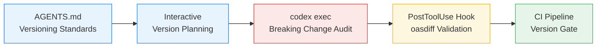

# Codex CLI for API Version Management: Breaking Change Detection, Deprecation Lifecycle, and Version Scaffolding


---

API versioning is one of those problems every senior developer recognises but few teams handle systematically. A field gets renamed, a required parameter appears, an endpoint quietly disappears — and downstream consumers break in production. The tooling to detect these changes exists (oasdiff, Optic's successors, Spectral), but integrating it into a consistent workflow remains manual and error-prone.

Codex CLI offers a structured approach: encode your versioning standards in `AGENTS.md`, use `codex exec` for automated breaking-change audits with structured output, build a reusable skill for version scaffolding, and wire PostToolUse hooks into CI so nothing ships without a compatibility check.

This article walks through the complete pipeline — from interactive version planning through to non-interactive CI enforcement — with concrete examples using OpenAPI 3.1 and oasdiff.

## The API Versioning Problem Space

Most teams adopt one of three versioning strategies: URI path versioning (`/v1/users`), header-based versioning (`Accept: application/vnd.api+json; version=2`), or query parameter versioning (`?api-version=2024-01-01`) [^1]. Each has trade-offs, but the real challenge is not choosing a strategy — it is enforcing it consistently as the API evolves.

Breaking changes fall into categories that tools like oasdiff check across 450+ rules [^2]:

- **Endpoint removal** — a path or method disappears entirely
- **Required parameter addition** — clients must now send a field they did not before
- **Response field removal** — consumers parsing a removed field get undefined behaviour
- **Type narrowing** — a field changes from `string` to `enum` or from `number` to `integer`
- **Authentication scope escalation** — an endpoint now requires broader permissions

Without automated detection, these changes surface as production incidents rather than PR review comments.

## Architecture: The Version Management Pipeline

The workflow has four stages, each mapping to a Codex CLI capability:



## Stage 1: Encoding Versioning Standards in AGENTS.md

Your `AGENTS.md` file should capture the versioning conventions that Codex applies to every API-related task. Place this at the repository root [^3]:

```markdown
# AGENTS.md

## API Versioning Standards

- All REST endpoints use URI path versioning: `/api/v{N}/resource`.
- New major versions require a complete OpenAPI spec at `specs/v{N}/openapi.yaml`.
- Breaking changes MUST increment the major version; additive changes do not.
- Deprecated endpoints carry a `deprecated: true` flag in the OpenAPI spec
  and a `Sunset` response header with a removal date (RFC 8594).
- Removal of deprecated endpoints requires a minimum 90-day sunset period.
- All spec changes must pass `oasdiff breaking` with zero errors before merge.
- Response envelope follows: `{ "data": T, "meta": { "api_version": "v3" } }`.
```

Codex reads this file at session start and applies these rules to every interaction involving API endpoints [^3]. When you ask Codex to add a new endpoint, it will scaffold the correct version prefix and response envelope. When you ask it to modify an existing endpoint, it will flag if the change is breaking.

## Stage 2: Interactive Version Planning

For major version bumps, start an interactive session to plan the migration:

```bash
codex "We need to create API v3 from the current v2 spec. \
  Review specs/v2/openapi.yaml, identify all endpoints, \
  and propose which breaking changes justify a v3. \
  Create specs/v3/openapi.yaml with the new structure."
```

Codex will read the existing spec, propose changes, and generate the new version — all while respecting the standards encoded in `AGENTS.md`. For complex APIs, pipe the current spec directly:

```bash
cat specs/v2/openapi.yaml | codex "Analyse this OpenAPI spec. \
  List all endpoints using deprecated patterns. \
  Propose a v3 spec that removes deprecated endpoints \
  and consolidates the remaining ones."
```

## Stage 3: Automated Breaking Change Audits with codex exec

For CI integration and batch workflows, `codex exec` with `--output-schema` produces structured audit reports [^4]:

First, define the output schema:

```json
{
  "type": "object",
  "properties": {
    "breaking_changes": {
      "type": "array",
      "items": {
        "type": "object",
        "properties": {
          "endpoint": { "type": "string" },
          "method": { "type": "string" },
          "change_type": { "type": "string" },
          "severity": { "type": "string", "enum": ["error", "warning"] },
          "description": { "type": "string" },
          "migration_suggestion": { "type": "string" }
        },
        "required": ["endpoint", "method", "change_type", "severity", "description"]
      }
    },
    "deprecation_status": {
      "type": "array",
      "items": {
        "type": "object",
        "properties": {
          "endpoint": { "type": "string" },
          "deprecated_since": { "type": "string" },
          "sunset_date": { "type": "string" },
          "days_remaining": { "type": "integer" },
          "has_sunset_header": { "type": "boolean" }
        },
        "required": ["endpoint", "deprecated_since", "sunset_date"]
      }
    },
    "version_summary": {
      "type": "object",
      "properties": {
        "current_version": { "type": "string" },
        "proposed_version": { "type": "string" },
        "total_breaking": { "type": "integer" },
        "total_deprecated": { "type": "integer" },
        "recommendation": { "type": "string" }
      }
    }
  },
  "required": ["breaking_changes", "deprecation_status", "version_summary"]
}
```

Then run the audit:

```bash
codex exec "Compare specs/v2/openapi.yaml against specs/v3/openapi.yaml. \
  Identify all breaking changes, check deprecation sunset dates, \
  and produce a version migration report." \
  --output-schema ./schemas/version-audit.json \
  -o ./reports/version-audit-report.json \
  -m o3
```

The structured output feeds directly into downstream tooling — Slack notifications, Jira ticket creation, or release note generation [^4].

### Combining with oasdiff

For maximum coverage, pipe oasdiff output into Codex for enriched analysis:

```bash
oasdiff breaking specs/v2/openapi.yaml specs/v3/openapi.yaml -f json \
  | codex exec "Analyse these breaking changes from oasdiff. \
    For each one, explain the consumer impact and suggest \
    a backwards-compatible alternative or migration path." \
  -o ./reports/enriched-breaking-changes.md
```

This combines oasdiff's deterministic 450+ rule checks with Codex's ability to reason about migration strategies [^2].

## Stage 4: The api-version-auditor Skill

Package the audit workflow as a reusable skill [^5]:

```
~/.codex/skills/
└── api-version-auditor/
    ├── SKILL.md
    └── schemas/
        └── version-audit.json
```

```yaml
---
name: api-version-auditor
description: >
  Audit OpenAPI specifications for breaking changes, deprecation lifecycle
  compliance, and version management standards. Use when reviewing API spec
  changes, planning version bumps, or checking deprecation sunset dates.
  Do NOT use for non-API code changes or internal service interfaces
  without OpenAPI specs.
---

## Audit Steps

1. Locate all OpenAPI specs in the repository (`specs/` or `openapi.yaml`).
2. Identify the current and proposed versions from file paths or spec `info.version`.
3. Run `oasdiff breaking <base> <revision>` if both specs exist.
4. Check every `deprecated: true` endpoint for:
   - A `Sunset` header in the spec's response headers (RFC 8594).
   - A sunset date at least 90 days from the deprecation date.
   - Whether the sunset date has passed (flag for removal).
5. For each breaking change, classify severity:
   - `error`: endpoint removal, required parameter addition, type change
   - `warning`: optional parameter removal, description change, enum extension
6. Produce a structured report matching `schemas/version-audit.json`.
7. Recommend whether the change requires a major version bump.

## Anti-Patterns
- Do NOT approve breaking changes without a version increment.
- Do NOT remove deprecated endpoints before the sunset date.
- Do NOT treat additive changes (new optional fields, new endpoints) as breaking.
```

Invoke the skill interactively with `$api-version-auditor` or reference it in `codex exec` prompts [^5].

## Stage 5: PostToolUse Hook for Spec Validation

Wire oasdiff into the agent loop so every spec modification triggers automatic validation [^6]:

```toml
# .codex/config.toml

[[hooks.PostToolUse]]
matcher = "^(Bash|apply_patch)$"

[[hooks.PostToolUse.hooks]]
type = "command"
command = '/bin/bash -c "if git diff --name-only HEAD | grep -q openapi; then oasdiff breaking <(git show HEAD:specs/v2/openapi.yaml) specs/v2/openapi.yaml -f json 2>/dev/null | python3 -c \"import sys,json; d=json.load(sys.stdin); print(json.dumps({\\\"hookSpecificOutput\\\":{\\\"hookEventName\\\":\\\"PostToolUse\\\",\\\"additionalContext\\\":\\\"Breaking changes detected: \\\"+str(len(d))}})) if d else print(json.dumps({\\\"hookSpecificOutput\\\":{\\\"hookEventName\\\":\\\"PostToolUse\\\",\\\"additionalContext\\\":\\\"No breaking changes detected.\\\"}}))\" ; else echo \"{}\"; fi"'
timeout = 30
statusMessage = "Checking for API breaking changes..."
```

This hook fires after every file edit or shell command. If the modified files include an OpenAPI spec, oasdiff runs automatically and injects context back into the agent's reasoning [^6]. The agent sees "Breaking changes detected: 3" and can decide whether to proceed or propose alternatives.

A simpler approach uses a dedicated validation script:

```bash
#!/usr/bin/env bash
# .codex/scripts/check-api-compat.sh
set -euo pipefail

CHANGED_SPECS=$(git diff --name-only HEAD -- 'specs/**/*.yaml' '*.openapi.yaml' 2>/dev/null || true)

if [ -z "$CHANGED_SPECS" ]; then
  echo '{}' # No spec changes, no hook output
  exit 0
fi

BREAKING=$(oasdiff breaking specs/v2/openapi.yaml specs/v2/openapi.yaml -f json 2>/dev/null || echo "[]")
COUNT=$(echo "$BREAKING" | python3 -c "import sys,json; print(len(json.load(sys.stdin)))" 2>/dev/null || echo "0")

cat <<EOF
{
  "hookSpecificOutput": {
    "hookEventName": "PostToolUse",
    "additionalContext": "oasdiff found $COUNT breaking change(s) in modified specs. Review before proceeding."
  }
}
EOF
```

Reference it in `config.toml`:

```toml
[[hooks.PostToolUse]]
matcher = "^apply_patch$"

[[hooks.PostToolUse.hooks]]
type = "command"
command = 'bash .codex/scripts/check-api-compat.sh'
timeout = 30
statusMessage = "Validating API compatibility..."
```

## Stage 6: CI Pipeline — The Version Gate

Integrate the full audit into GitHub Actions [^7]:


```yaml
# .github/workflows/api-version-gate.yaml
name: API Version Gate
on:
  pull_request:
    paths:
      - 'specs/**'
      - '**openapi*.yaml'
      - '**openapi*.json'

jobs:
  breaking-change-check:
    runs-on: ubuntu-latest
    steps:
      - uses: actions/checkout@v4
        with:
          fetch-depth: 0

      - name: Install oasdiff
        run: |
          brew install oasdiff || \
          go install github.com/oasdiff/oasdiff@latest

      - name: Detect breaking changes (deterministic)
        run: |
          git show origin/main:specs/v2/openapi.yaml > /tmp/base-spec.yaml
          oasdiff breaking /tmp/base-spec.yaml specs/v2/openapi.yaml \
            --fail-on ERR

      - name: Codex enriched analysis
        if: failure()
        env:
          CODEX_API_KEY: ${{ secrets.CODEX_API_KEY }}
        run: |
          oasdiff breaking /tmp/base-spec.yaml specs/v2/openapi.yaml -f json \
            > /tmp/breaking.json
          codex exec "Analyse these breaking changes and suggest \
            backwards-compatible alternatives for each one. \
            Format as a PR review comment." \
            --sandbox read-only \
            -o /tmp/review-comment.md < /tmp/breaking.json

      - name: Post review comment
        if: failure()
        uses: actions/github-script@v7
        with:
          script: |
            const fs = require('fs');
            const comment = fs.readFileSync('/tmp/review-comment.md', 'utf8');
            github.rest.issues.createComment({
              owner: context.repo.owner,
              repo: context.repo.repo,
              issue_number: context.issue.number,
              body: `## 🔴 API Breaking Changes Detected\n\n${comment}`
            });
```


This pipeline runs oasdiff first (deterministic, fast) and only invokes Codex when breaking changes are found (to generate human-readable migration guidance) [^7]. The two-tier approach keeps CI fast for clean PRs while providing actionable feedback on breaking ones.

## Version Scaffolding: Generating New API Versions

When it is time to create a new major version, Codex can scaffold the entire structure:

```bash
codex exec "Create API v4 from the current v3 spec at specs/v3/openapi.yaml. \
  Apply these breaking changes: \
  1. Remove the deprecated /users/search endpoint (sunset passed). \
  2. Change /orders response to use cursor pagination instead of offset. \
  3. Rename 'userId' to 'user_id' across all endpoints for snake_case consistency. \
  Generate specs/v4/openapi.yaml and a MIGRATION.md with upgrade instructions." \
  --sandbox workspace-write \
  -m o3
```

Codex generates both the new spec and the migration guide, respecting the conventions from `AGENTS.md`.

## Model Selection

| Task | Recommended Model | Rationale |
|------|------------------|-----------|
| Interactive version planning | `o3` | Complex reasoning about API design trade-offs [^8] |
| Batch breaking change audit | `o3` | Needs to understand semantic impact of changes |
| Version scaffolding | `o4-mini` | Mostly structural generation, lower reasoning demands [^8] |
| Migration guide generation | `o3` | Requires understanding consumer impact |
| CI enriched analysis | `o4-mini` | Cost-sensitive; oasdiff does the heavy detection |

## Anti-Patterns

**Treating oasdiff output as the complete picture.** oasdiff checks structural compatibility but cannot detect semantic breaking changes — for instance, an endpoint that returns the same shape but with different business logic. Use Codex to reason about semantic changes that structural tools miss.

**Skipping the sunset period.** Removing deprecated endpoints without honouring the advertised sunset date breaks the contract with consumers, even if the spec is structurally valid. The 90-day minimum is a common industry standard, but your `AGENTS.md` should encode your team's actual policy.

**Generating version bumps without reviewing the diff.** Codex can scaffold a new version, but the generated spec should always be reviewed against the base version using `oasdiff changelog` before merging. Treat generated specs as drafts, not final artefacts.

**Using `--sandbox danger-full-access` for spec audits.** Breaking change detection is a read-only operation. Use `--sandbox read-only` for audits and only escalate to `workspace-write` when generating new spec files [^4].

## Known Limitations

- **`--output-schema` and `--resume` are mutually exclusive** — structured audit reports cannot be produced in resumed sessions [^4].
- **Context window constraints for large specs** — OpenAPI specs for complex APIs can exceed 50,000 tokens. Consider splitting into per-domain spec files or using `$ref` extensively ⚠️.
- **oasdiff requires both specs to exist** — it compares two files and cannot infer a "before" state from git history alone. The CI pipeline above handles this by extracting the base spec from the main branch.
- **Optic is no longer maintained** — Optic's repository was archived in January 2026 following Atlassian's acquisition [^9]. Use oasdiff as the primary breaking-change detection tool.
- **Non-deterministic migration suggestions** — Codex may suggest different migration strategies across runs. Pin important decisions in `AGENTS.md` rather than relying on generated suggestions.

## Citations

[^1]: Fielding, R. et al., "Web API Versioning Strategies," *API Design Patterns*, Manning Publications, 2024. Covering URI, header, and query parameter approaches.

[^2]: oasdiff — OpenAPI Diff and Breaking Changes, [https://github.com/oasdiff/oasdiff](https://github.com/oasdiff/oasdiff). "Checks 450+ categories of breaking changes."

[^3]: "Custom instructions with AGENTS.md," OpenAI Codex Documentation, [https://developers.openai.com/codex/guides/agents-md](https://developers.openai.com/codex/guides/agents-md).

[^4]: "Non-interactive mode," OpenAI Codex Documentation, [https://developers.openai.com/codex/noninteractive](https://developers.openai.com/codex/noninteractive). Covers `codex exec`, `--output-schema`, `-o`, and sandbox flags.

[^5]: "Agent Skills," OpenAI Codex Documentation, [https://developers.openai.com/codex/skills](https://developers.openai.com/codex/skills). SKILL.md format and folder structure.

[^6]: "Hooks," OpenAI Codex Documentation, [https://developers.openai.com/codex/hooks](https://developers.openai.com/codex/hooks). PreToolUse and PostToolUse hook syntax, inline config.toml format.

[^7]: "GitHub Action," OpenAI Codex Documentation, [https://developers.openai.com/codex/github-action](https://developers.openai.com/codex/github-action). CI integration patterns with `CODEX_API_KEY`.

[^8]: "Command line options," OpenAI Codex CLI Reference, [https://developers.openai.com/codex/cli/reference](https://developers.openai.com/codex/cli/reference). Model selection via `--model` flag; o3 and o4-mini are the current default models.

[^9]: "Optic Is Dead — What Now for API Drift Detection?" DEV Community, [https://dev.to/flarecanary/optic-is-dead-what-now-for-api-drift-detection-2kb8](https://dev.to/flarecanary/optic-is-dead-what-now-for-api-drift-detection-2kb8). Optic repository archived January 2026.
