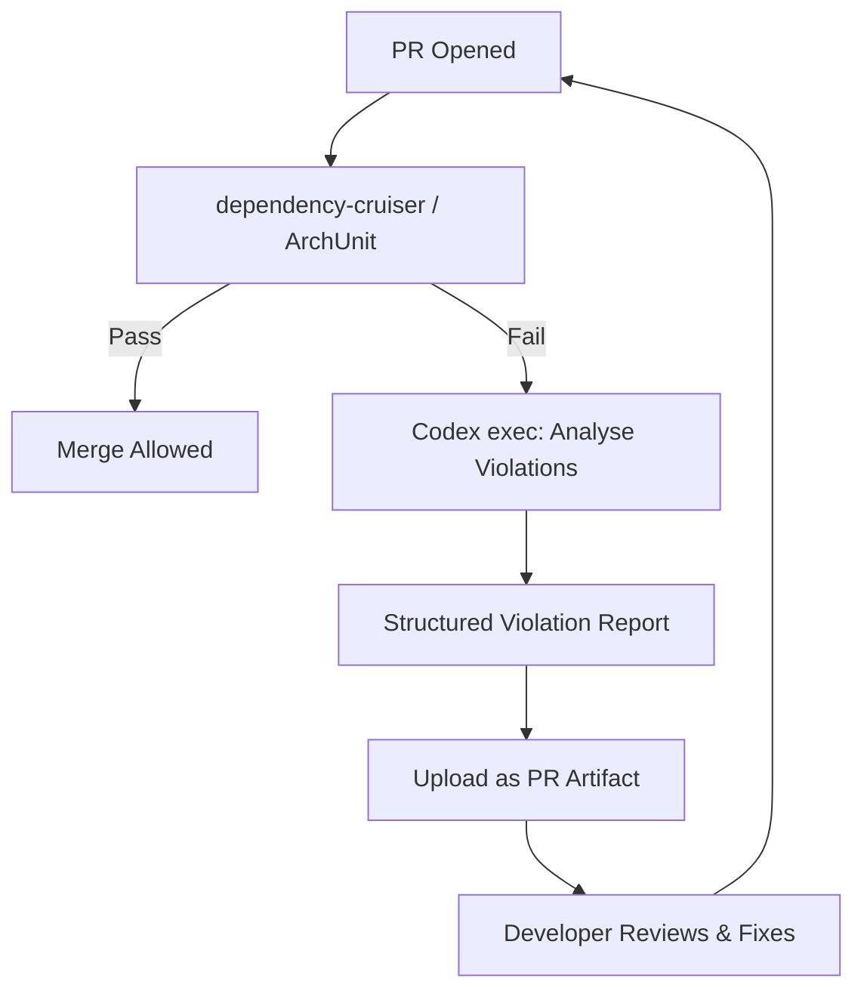

# Codex CLI for Architectural Fitness Functions: Dependency Analysis, Circular Detection, and Automated Boundary Enforcement


---

Every team starts with clean module boundaries. Six months later, a service layer imports a controller utility, a domain model references an HTTP client, and the architecture diagram on the wiki bears no resemblance to reality. Architectural fitness functions — automated checks that validate structural constraints on every commit — are the established remedy[^1]. Codex CLI turns what was traditionally a manual rules-authoring exercise into a conversational, agent-driven workflow: auditing existing violations, generating enforcement rules, wiring them into CI, and building reusable skills that keep boundaries intact as the codebase evolves.

## What Are Architectural Fitness Functions?

The term comes from Neal Ford and Rebecca Parsons' *Building Evolutionary Architectures*[^1]. A fitness function is any automated check that validates a structural property of the system — dependency direction, component size, naming conventions, or coupling metrics. The key insight is that these checks run alongside unit tests, providing continuous feedback on architectural drift rather than relying on periodic manual reviews.

In practice, fitness functions fall into two categories:

- **Static checks** — dependency direction, import restrictions, circular dependency detection, package naming. These run in seconds on every PR.
- **Dynamic checks** — latency budgets, throughput thresholds, resource consumption. These run in integration or staging environments.

This article focuses on the static category, where Codex CLI adds the most value.

## The Toolchain

Three mature open-source tools cover the major language ecosystems:

| Tool | Language | Mechanism |
|------|----------|-----------|
| **dependency-cruiser** | JavaScript/TypeScript | `.dependency-cruiser.js` rule config, CLI with JSON/SVG output[^2] |
| **ArchUnit** | Java/Kotlin | JUnit-style architecture tests in the test suite[^3] |
| **archunit (Go)** / **arch-go** | Go | Go test assertions with a fluent API for package dependency rules[^4] |

Codex CLI does not replace these tools. It accelerates three workflows that are normally tedious: auditing the current state, generating the rules, and maintaining them as the architecture evolves.

## Phase 1: Encoding Architectural Standards in AGENTS.md

Before generating anything, encode your target architecture in `AGENTS.md` so every Codex session inherits the constraints[^5]:

```markdown
# Architecture Standards

## Module Boundaries
- `domain/` MUST NOT import from `infrastructure/`, `api/`, or `cmd/`
- `application/` may import `domain/` only
- `infrastructure/` may import `domain/` and `application/`
- `api/` may import `application/` only — never `domain/` directly

## Dependency Rules
- No circular dependencies between packages
- No production code importing from `*_test` packages or `testutil/`
- Third-party HTTP clients confined to `infrastructure/http/`

## Fitness Function Tooling
- JavaScript/TypeScript projects: use dependency-cruiser
- Go projects: use arch-go or kcmvp/archunit
- Java projects: use ArchUnit with JUnit 5
- All rules must run in CI on every PR
```

This ensures that when you ask Codex to generate rules, it already knows the target architecture and tool preferences.

## Phase 2: Auditing Existing Violations with `codex exec`

Before writing rules, you need to know what you are dealing with. Use `codex exec` with `--output-schema` to produce a structured audit of current violations:

```json
{
  "type": "object",
  "properties": {
    "circular_dependencies": {
      "type": "array",
      "items": {
        "type": "object",
        "properties": {
          "cycle": { "type": "array", "items": { "type": "string" } },
          "severity": { "type": "string", "enum": ["critical", "warning"] }
        },
        "required": ["cycle", "severity"],
        "additionalProperties": false
      }
    },
    "boundary_violations": {
      "type": "array",
      "items": {
        "type": "object",
        "properties": {
          "from_module": { "type": "string" },
          "to_module": { "type": "string" },
          "violation_type": { "type": "string" },
          "files": { "type": "array", "items": { "type": "string" } }
        },
        "required": ["from_module", "to_module", "violation_type", "files"],
        "additionalProperties": false
      }
    },
    "summary": {
      "type": "object",
      "properties": {
        "total_violations": { "type": "integer" },
        "circular_count": { "type": "integer" },
        "boundary_count": { "type": "integer" }
      },
      "required": ["total_violations", "circular_count", "boundary_count"],
      "additionalProperties": false
    }
  },
  "required": ["circular_dependencies", "boundary_violations", "summary"],
  "additionalProperties": false
}
```

Run the audit:

```bash
codex exec \
  --output-schema ./arch-audit-schema.json \
  -o ./arch-audit-results.json \
  "Analyse the import graph of this project. Identify all circular dependencies \
   and all violations of the module boundary rules defined in AGENTS.md. \
   For each violation, list the specific files involved."
```

The structured output feeds directly into dashboards, Slack notifications, or baseline-comparison scripts. This is far more useful than asking the agent for a prose summary — the schema forces consistent, machine-readable results[^6].

> **Known limitation:** `--output-schema` and `--resume` are mutually exclusive as of Codex CLI v0.130[^7]. Plan audit runs as standalone sessions.

## Phase 3: Generating Enforcement Rules

### dependency-cruiser (TypeScript/JavaScript)

With the audit results in hand, ask Codex to generate the enforcement configuration:

```bash
codex "Read arch-audit-results.json and the module boundary standards in AGENTS.md. \
Generate a .dependency-cruiser.cjs config that enforces all boundary rules as \
'error' severity and flags circular dependencies as 'warn'. Include the \
no-orphans and no-deprecated-core rules from the default set."
```

Codex generates a config like this:

```javascript
/** @type {import('dependency-cruiser').IConfiguration} */
module.exports = {
  forbidden: [
    {
      name: 'no-circular',
      severity: 'warn',
      from: { pathNot: '^node_modules' },
      to: { circular: true }
    },
    {
      name: 'domain-no-infrastructure',
      severity: 'error',
      comment: 'Domain layer must not import infrastructure concerns',
      from: { path: '^src/domain/' },
      to: { path: '^src/infrastructure/' }
    },
    {
      name: 'domain-no-api',
      severity: 'error',
      from: { path: '^src/domain/' },
      to: { path: '^src/api/' }
    },
    {
      name: 'api-no-domain-direct',
      severity: 'error',
      comment: 'API layer must use application services, not domain directly',
      from: { path: '^src/api/' },
      to: { path: '^src/domain/' }
    }
  ],
  options: {
    doNotFollow: { path: 'node_modules' },
    tsPreCompilationDeps: true,
    enhancedResolveOptions: { exportsFields: ['exports'], conditionNames: ['import'] }
  }
};
```

Validate immediately:

```bash
npx depcruise --config .dependency-cruiser.cjs src/
```

### ArchUnit (Go)

For Go projects, Codex generates test files that integrate with the standard `go test` runner[^4]:

```bash
codex "Generate architecture test files using github.com/kcmvp/archunit that \
enforce the boundary rules from AGENTS.md. Place tests in arch_test.go at the \
repo root. Use table-driven tests for boundary rules."
```

The generated test:

```go
package architecture_test

import (
    "testing"
    "github.com/kcmvp/archunit"
)

func TestDomainLayerIsolation(t *testing.T) {
    forbidden := []struct {
        name   string
        from   string
        toNot  string
    }{
        {"domain must not import infrastructure", "domain/...", "infrastructure/..."},
        {"domain must not import api", "domain/...", "api/..."},
        {"domain must not import cmd", "domain/...", "cmd/..."},
    }

    for _, tc := range forbidden {
        t.Run(tc.name, func(t *testing.T) {
            archunit.Package(tc.from).ShouldNotRefer(tc.toNot)
        })
    }
}

func TestNoCircularDependencies(t *testing.T) {
    archunit.AllPackages().ShouldNotRefer("circular")
}
```

These run with `go test ./...` — no additional CI configuration needed.

## Phase 4: Building a Reusable Skill

Wrap the audit-and-generate workflow into a reusable Codex skill so any team member can run it:

```markdown
# arch-fitness-auditor

## Description
Audit the codebase for architectural boundary violations and circular
dependencies. Generate or update enforcement rules for the project's
language ecosystem.

## Triggers
- "audit architecture"
- "check module boundaries"
- "find circular dependencies"
- "generate fitness functions"

## Steps
1. Read AGENTS.md to load architectural boundary definitions
2. Identify the project language (package.json → JS/TS, go.mod → Go, pom.xml → Java)
3. Run the appropriate analysis tool if installed; otherwise analyse imports directly
4. Produce a structured violation report using the arch-audit schema
5. If requested, generate or update enforcement rules for the detected toolchain
6. Summarise findings: total violations, critical boundaries breached, circular chains

## Constraints
- Never auto-fix violations — report only, so developers make intentional decisions
- Flag existing violations as baseline; only fail CI on new violations
- Use error severity for boundary violations, warn for circular dependencies
```

Install the skill:

```bash
codex install ./skills/arch-fitness-auditor
```

Then invoke conversationally:

```bash
codex "Audit the architecture of this project and generate dependency-cruiser rules"
```

## Phase 5: CI Enforcement Pipeline

The final piece wires everything into GitHub Actions so violations block merges:


```yaml
name: Architecture Fitness
on:
  pull_request:
    branches: [main]

jobs:
  fitness-check:
    runs-on: ubuntu-latest
    steps:
      - uses: actions/checkout@v4

      - name: Install dependencies
        run: npm ci

      - name: Run dependency-cruiser
        run: npx depcruise --config .dependency-cruiser.cjs --output-type err src/

      - name: Architecture audit (Codex)
        if: failure()
        env:
          CODEX_API_KEY: ${{ secrets.CODEX_API_KEY }}
        run: |
          codex exec \
            --output-schema ./arch-audit-schema.json \
            -o ./violation-report.json \
            "Analyse the dependency-cruiser errors and suggest specific \
             refactoring steps to resolve each violation"

      - name: Upload violation report
        if: failure()
        uses: actions/upload-artifact@v4
        with:
          name: arch-violations
          path: ./violation-report.json
```




This pattern separates the fast, deterministic check (dependency-cruiser runs in seconds) from the expensive AI analysis (Codex runs only on failure to explain violations and suggest fixes).

## Model Selection

| Task | Recommended Model | Rationale |
|------|-------------------|-----------|
| Audit with `--output-schema` | `o4-mini` | Structured output, cost-efficient for large codebases[^8] |
| Rule generation (interactive) | `o3` | Benefits from deeper reasoning about architectural intent[^8] |
| CI violation analysis | `o4-mini` | Called only on failure; latency less critical than cost |

## Anti-Patterns

**Generating rules without understanding the architecture.** Codex can produce syntactically valid rules for any boundary you describe, but if the described architecture does not match the team's actual intent, you will spend more time suppressing false positives than catching real violations.

**Treating all violations as errors from day one.** Existing codebases invariably have legacy violations. Use a baseline approach: record current violations and only fail CI on *new* ones. dependency-cruiser supports this with its `--ignore-known` flag[^2].

**Over-constraining internal packages.** Fitness functions work best at module boundaries (domain ↔ infrastructure ↔ API). Enforcing import rules between files *within* a module creates friction without meaningful architectural benefit.

**Ignoring the sandbox.** Codex CLI runs in a sandboxed environment[^9]. Tools that require network access (e.g., fetching remote schemas for validation) will fail silently. Ensure all analysis tools and their dependencies are installed locally before running `codex exec`.

## Known Limitations

- **`--output-schema` and `--resume` are mutually exclusive** — audit runs must be standalone sessions[^7]
- **`--output-schema` may be silently ignored when MCP servers are active** — a known bug as of May 2026[^10]
- **Context window limits** — for very large monorepos (1000+ files), consider scoping audits to specific packages rather than the entire import graph
- **No native graph visualisation** — Codex cannot render dependency graphs visually; pipe dependency-cruiser output to `dot` or `d3` separately

## Citations

[^1]: Ford, N. & Parsons, R. — *Building Evolutionary Architectures*, O'Reilly. Architecture fitness functions concept. [https://www.infoq.com/articles/fitness-functions-architecture/](https://www.infoq.com/articles/fitness-functions-architecture/)

[^2]: dependency-cruiser — rules reference and CLI documentation. [https://github.com/sverweij/dependency-cruiser](https://github.com/sverweij/dependency-cruiser)

[^3]: ArchUnit — Java architecture testing framework. [https://www.archunit.org/](https://www.archunit.org/)

[^4]: kcmvp/archunit — Go architecture test framework with fluent API. [https://github.com/kcmvp/archunit](https://github.com/kcmvp/archunit)

[^5]: OpenAI — Custom instructions with AGENTS.md. [https://developers.openai.com/codex/guides/agents-md](https://developers.openai.com/codex/guides/agents-md)

[^6]: OpenAI — Non-interactive mode and `--output-schema` reference. [https://developers.openai.com/codex/noninteractive](https://developers.openai.com/codex/noninteractive)

[^7]: GitHub Issue #14343 — Add `--output-schema` support to `codex exec resume`. [https://github.com/openai/codex/issues/14343](https://github.com/openai/codex/issues/14343)

[^8]: OpenAI — Codex CLI models and selection guidance. [https://developers.openai.com/codex/cli](https://developers.openai.com/codex/cli)

[^9]: OpenAI — Codex CLI features, sandbox and permissions. [https://developers.openai.com/codex/cli/features](https://developers.openai.com/codex/cli/features)

[^10]: GitHub Issue #15451 — `--json` and `--output-schema` silently ignored when tools/MCP servers are active. [https://github.com/openai/codex/issues/15451](https://github.com/openai/codex/issues/15451)
