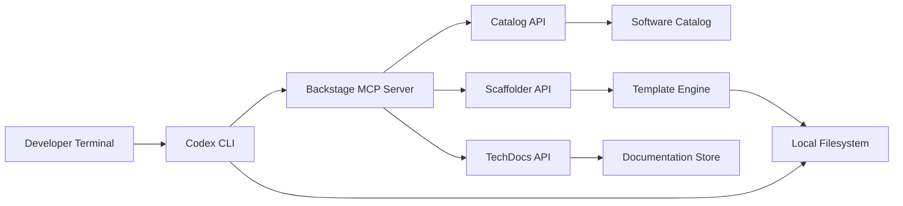
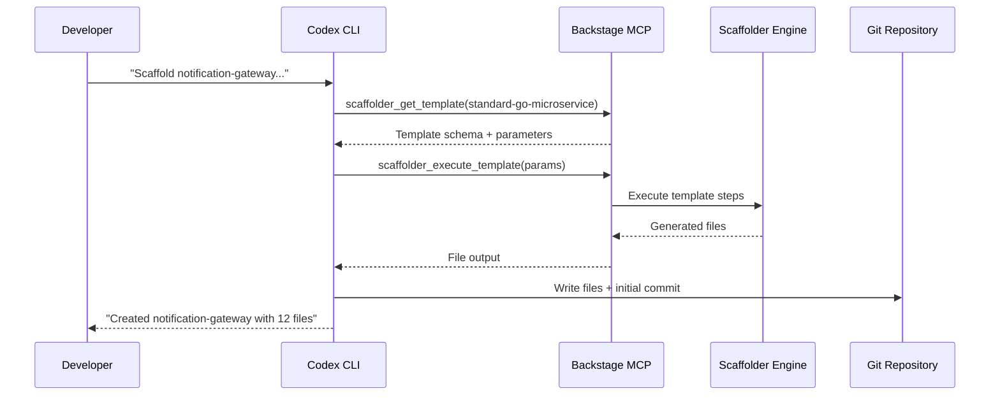

# Codex CLI with Backstage MCP: Developer Portal Integration, Golden Path Templates, and Catalog-Driven Workflows


---

## Introduction

Platform engineering teams invest heavily in Backstage developer portals to provide golden paths — opinionated, streamlined workflows that encode best practices, security requirements, and operational standards into software templates[^1]. Yet the portal's value remains trapped behind a web UI. Developers must context-switch from their terminal, navigate template wizards, and manually integrate scaffolded output into existing codebases.

With the Backstage MCP server now exposing catalog queries, scaffolder execution, and TechDocs retrieval as Model Context Protocol tools[^2], Codex CLI can connect directly to your developer portal. This article demonstrates how to configure the integration, query your software catalog from the terminal, execute golden path templates through conversational prompts, and build AGENTS.md standards that enforce catalog-driven development patterns.

---

## Architecture Overview



The standalone Backstage MCP server bridges LLM clients with your developer portal without requiring Backstage plugin installation — it runs as a single binary (~200 KB) with zero runtime dependencies and connects to Backstage's existing REST APIs[^2]. For organisations running Backstage 1.40+, the official `@backstage/plugin-mcp-actions-backend` plugin exposes plugin actions directly through the Actions Registry[^3].

---

## Configuring the Backstage MCP Server

### Standalone Server (HTTP Transport)

For teams that prefer not to modify their Backstage deployment, the standalone server connects via Backstage's REST APIs:

```toml
[mcp_servers.backstage]
url = "https://backstage-mcp.internal.example.com/mcp"
bearer_token_env_var = "BACKSTAGE_MCP_TOKEN"
startup_timeout_sec = 15
tool_timeout_sec = 120
enabled_tools = [
  "catalog_search",
  "catalog_get_entity",
  "scaffolder_list_templates",
  "scaffolder_get_template",
  "scaffolder_execute_template",
  "techdocs_get_content"
]
```

### Plugin-Based Server (STDIO Transport)

If you run the official Backstage MCP actions plugin, configure a local STDIO server that proxies through your authenticated session:

```toml
[mcp_servers.backstage]
command = "npx"
args = ["-y", "@backstage/mcp-server", "--config", "./backstage-app-config.yaml"]
env_vars = ["BACKSTAGE_BASE_URL", "BACKSTAGE_AUTH_TOKEN"]
startup_timeout_sec = 20
tool_timeout_sec = 120
```

### OAuth Authentication

Backstage 1.43 introduced dynamic OAuth support for MCP connections[^4]. Configure the OAuth callback in your global `~/.codex/config.toml`:

```toml
mcp_oauth_callback_port = 9876
```

When Codex CLI first calls a Backstage MCP tool, a browser popup prompts SSO authentication. Subsequent calls reuse the cached token, ensuring every MCP call executes with your user-specific permissions[^4].

---

## Catalog-Driven Development

### Querying the Software Catalog

With the MCP server connected, you can query your software catalog conversationally:

```bash
codex "What services does the payments team own? List their tech stack and lifecycle status"
```

Codex CLI calls the `catalog_search` tool with owner-based filters, returning structured entity metadata. This replaces manual navigation of the Backstage catalog UI for ownership discovery, dependency mapping, and API surface enumeration.

### Entity-Aware Code Generation

Combine catalog context with code generation by referencing specific entities:

```bash
codex "I need to add a new gRPC endpoint to the orders-service. \
  Check its catalog entry for the existing API spec and tech stack, \
  then generate the protobuf definition and Go service stub following our standards"
```

The agent fetches the entity's `spec.type`, `spec.lifecycle`, linked API definitions, and `metadata.annotations` to inform code generation decisions — respecting the team's existing patterns without manual context injection.

---

## Executing Golden Path Templates

### Template Discovery

```bash
codex "List all available scaffolder templates tagged with 'microservice' and show their required parameters"
```

The `scaffolder_list_templates` and `scaffolder_get_template` tools return template metadata including parameter schemas, steps, and ownership information[^5].

### Conversational Template Execution

Rather than filling web forms, execute templates through natural language:

```bash
codex "Scaffold a new Go microservice called 'notification-gateway' \
  using our standard-go-microservice template. \
  Set the owner to team-platform, lifecycle to experimental, \
  and include the Kafka consumer component"
```

Behind the scenes, Codex CLI:

1. Calls `scaffolder_get_template` to retrieve the parameter schema
2. Maps your natural language inputs to typed parameters using Zod schema validation[^4]
3. Executes `scaffolder_execute_template` with the validated inputs
4. Writes the generated output to your local filesystem



### Post-Scaffold Customisation

The real power emerges when you chain template execution with intelligent customisation:

```bash
codex "After scaffolding, update the generated Helm chart to use our \
  shared Redis subchart, add the standard Prometheus ServiceMonitor, \
  and register the new service in the catalog with the correct system reference"
```

---

## AGENTS.md Standards for Catalog Integration

Encode portal-driven development standards in your `AGENTS.md`:

```markdown
## Developer Portal Standards

### Service Creation
- ALL new services MUST be scaffolded via a Backstage template — never from scratch
- Before creating any service, query the catalog to verify the service name is unique
- New services MUST include a `catalog-info.yaml` at the repository root
- The `spec.owner` field MUST reference a valid group entity in the catalog
- The `spec.system` field MUST reference the parent system entity

### API Registration
- Every HTTP/gRPC API MUST have a corresponding API entity in the catalog
- API definitions MUST be stored in `api/` directory and referenced via `spec.definition.$text`
- Use lifecycle: production | experimental | deprecated — never omit

### Golden Path Compliance
- When generating infrastructure manifests, query the catalog for the service's
  existing annotations to determine which shared components are already provisioned
- Never duplicate what the golden path template already provides
```

---

## Batch Workflows with `codex exec`

### Catalog Audit

Run a structured audit across all services owned by your team:

```bash
codex exec \
  --prompt "Query the Backstage catalog for all components owned by team-platform. \
    For each service, check whether it has: \
    1. A catalog-info.yaml with all required annotations \
    2. A registered API entity \
    3. TechDocs configured and building \
    Report findings as structured JSON." \
  --output-schema '{
    "type": "object",
    "properties": {
      "services": {
        "type": "array",
        "items": {
          "type": "object",
          "properties": {
            "name": {"type": "string"},
            "has_catalog_info": {"type": "boolean"},
            "has_api_entity": {"type": "boolean"},
            "has_techdocs": {"type": "boolean"},
            "issues": {"type": "array", "items": {"type": "string"}}
          }
        }
      }
    }
  }'
```

### Bulk Template Updates

When your golden path template changes, update all downstream services:

```bash
codex exec \
  --prompt "The standard-go-microservice template now includes OpenTelemetry \
    instrumentation in v3.2. Query the catalog for all Go microservices \
    created from this template (annotation: backstage.io/template-origin). \
    For each service at template version < 3.2, generate a PR adding the \
    new OTel configuration following the template's current patterns."
```

---

## Model Selection

| Task | Recommended Model | Rationale |
|------|------------------|-----------|
| Catalog queries and discovery | o4-mini | Low complexity, fast responses[^6] |
| Template parameter mapping | o4-mini | Schema matching is structured |
| Post-scaffold customisation | o3 | Multi-file edits requiring architectural understanding[^6] |
| Catalog audit reports | o4-mini | Structured output, repetitive pattern |
| Bulk migration generation | o3 | Complex cross-service reasoning |

---

## Anti-Patterns

1. **Bypassing the portal** — Generating services without executing Backstage templates loses catalog registration, ownership tracking, and golden path compliance. Always scaffold through the MCP tools.

2. **Over-fetching catalog data** — Querying entire catalog contents exhausts context windows. Use filtered queries with owner, kind, and lifecycle parameters.

3. **Ignoring template versioning** — Backstage templates evolve. Always check `metadata.annotations['backstage.io/template-version']` before assuming generated code matches current standards.

4. **Hardcoding entity references** — Let the agent resolve entity references dynamically from the catalog rather than hardcoding system or owner values that may change.

5. **Skipping permission checks** — The MCP server enforces Backstage RBAC. If a tool call fails with access denied, do not retry with elevated credentials — escalate to the portal admin.

---

## Known Limitations

- **TechDocs MCP support is partial** — the standalone server can retrieve rendered documentation, but full-text search across TechDocs requires the official plugin with search indexing configured[^2]
- **`--output-schema` and `--resume` are mutually exclusive** — structured catalog audits cannot be resumed mid-session[^7]
- **Template execution is asynchronous** — complex templates with external actions (e.g., GitHub repository creation, ArgoCD sync) may complete after the MCP tool call returns; poll for task status
- **Context window limits** — large catalog responses (organisations with 500+ entities) may exceed token budgets; use pagination and filtered queries ⚠️

---

## Reusable SKILL.md

```markdown
# backstage-catalog-ops

## Purpose
Query, validate, and scaffold services through the Backstage developer portal
via MCP tools. Enforces golden path compliance and catalog registration standards.

## When to Use
- Creating new services or components
- Auditing catalog completeness for a team
- Updating services after template version bumps
- Discovering API dependencies before making breaking changes

## Steps
1. Verify Backstage MCP server is connected: check `codex mcp status`
2. Query the catalog using filtered searches (owner, kind, lifecycle)
3. For new services: execute the appropriate scaffolder template
4. Post-scaffold: add any customisations required beyond the golden path
5. Validate: confirm catalog-info.yaml is correct and entity appears in catalog

## Constraints
- NEVER create services without going through a Backstage template
- ALWAYS verify entity name uniqueness before scaffolding
- ALWAYS set spec.owner to a valid group entity
- Use o4-mini for catalog queries, o3 for multi-file customisation
```

---

## Citations

[^1]: [Golden Path in Software Engineering — Platform Engineering Success](https://talent500.com/blog/golden-path-in-software-engineering/) — Talent500, 2026
[^2]: [Backstage MCP Server — Standalone Catalog, Scaffolder, and TechDocs Tools](https://lobehub.com/mcp/oopsmyops-backstage-mcp) — LobeHub MCP Registry, 2026
[^3]: [@backstage/plugin-mcp-actions-backend — Official Actions Registry Plugin](https://backstage.io/api/next/modules/_backstage_plugin-mcp-actions-backend.html) — Backstage Documentation, 2026
[^4]: [Backstage as the Ultimate MCP Server — Dynamic OAuth and Actions Registry](https://vrabbi.cloud/post/backstage-as-the-ultimate-mcp-server/) — Vrabbi Cloud, 2026
[^5]: [Backstage Software Templates Documentation](https://backstage.io/docs/features/software-templates/) — Backstage.io, 2026
[^6]: [Model Context Protocol — Codex CLI Configuration](https://developers.openai.com/codex/mcp) — OpenAI Developers, 2026
[^7]: [Codex CLI Features — Non-Interactive Pipelines](https://developers.openai.com/codex/cli/features) — OpenAI Developers, 2026
