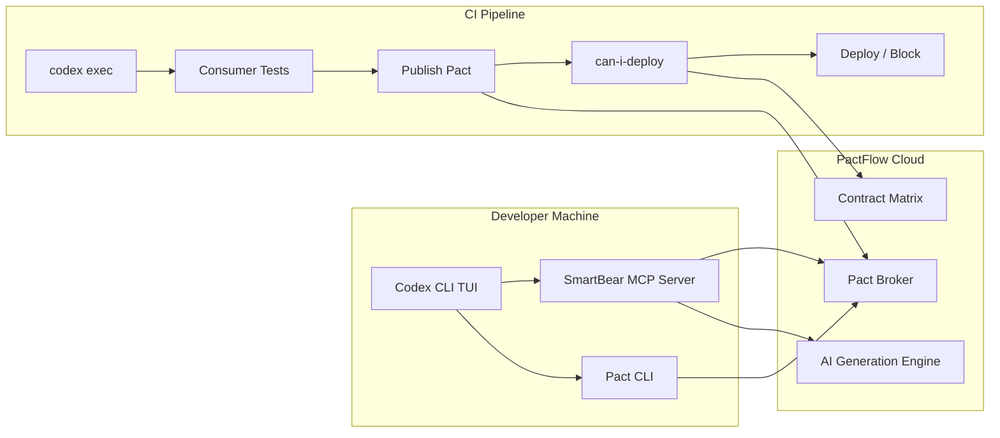
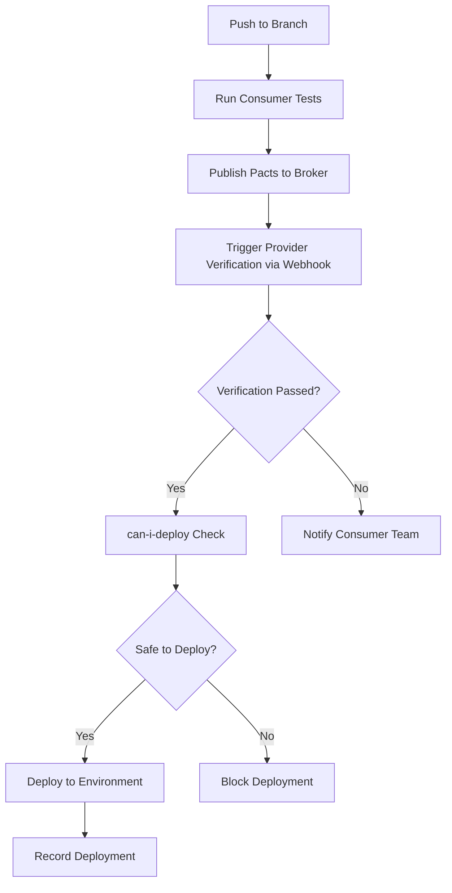

# Codex CLI for Contract Testing: PactFlow MCP Integration, Consumer-Driven Test Generation, and CI Verification Pipelines


## Introduction

Consumer-driven contract testing prevents integration failures across microservice boundaries without the overhead of full end-to-end test suites[^1]. The SmartBear MCP Server and PactFlow Agent Skills, released in 2026, bring contract testing directly into AI coding agents, including Codex CLI[^2]. This article covers the complete workflow: configuring the PactFlow MCP server in Codex CLI, generating consumer tests interactively and via `codex exec`, running provider verification, and building CI gates with `can-i-deploy`.

A key point for community users: the SmartBear MCP server works with both PactFlow Cloud *and* the open-source Pact Broker[^3][^11]. Core capabilities such as `can-i-deploy`, contract publishing, verification, environment tracking, and webhook management all work against a self-hosted OSS broker. AI-powered features, including test generation, test review, bi-directional contract testing, team metrics, and audit logs, require a PactFlow Cloud account[^3]. The table below summarises the split.

| Capability | OSS Pact Broker | PactFlow Cloud |
|-----------|:-:|:-:|
| `can-i-deploy` / matrix queries | Yes | Yes |
| Contract publishing and verification | Yes | Yes |
| Environment and deployment recording | Yes | Yes |
| Webhook configuration | Yes | Yes |
| Pacticipant and version management | Yes | Yes |
| AI test generation (`contract-testing_generate_pact_test`) | No | Yes |
| AI test review (`contract-testing_review_pact_test`) | No | Yes |
| Bi-directional contract testing (BDCT) | No | Yes |
| Team metrics and audit log | No | Yes |
| Administration (users, teams, roles) | No | Yes |

## Architecture overview



The SmartBear MCP server exposes `contract-testing_*` tools that provide direct access to the Pact Broker: matrix queries, provider state retrieval, AI-powered test generation (PactFlow Cloud only), and deployment tracking[^3]. Codex CLI connects to this server via the standard MCP stdio transport, giving the agent full contract testing capabilities within the TUI session or headless `codex exec` runs. For OSS broker users, the agent can still query the matrix, publish contracts, record deployments, and run `can-i-deploy` checks, covering the core contract testing lifecycle without a paid account.

## Configuring the PactFlow MCP server

### Prerequisites

- Node.js 20+ installed in your sandbox environment[^4]
- A PactFlow Cloud account *or* a self-hosted open-source Pact Broker
- API token from your PactFlow settings page, or basic auth credentials for the OSS broker

### Global configuration

Add the SmartBear MCP server to `~/.codex/config.toml`:

```toml
[mcp_servers.smartbear]
command = "npx"
args = ["-y", "@smartbear/mcp@latest"]
startup_timeout_sec = 15
tool_timeout_sec = 120

[mcp_servers.smartbear.env]
PACT_BROKER_BASE_URL = "https://yourorg.pactflow.io"
PACT_BROKER_TOKEN = "your-api-token"
```

For a self-hosted OSS broker, point `PACT_BROKER_BASE_URL` at your broker's URL and use `PACT_BROKER_USERNAME` and `PACT_BROKER_PASSWORD` instead of a token if your broker uses basic authentication.

### Project-scoped configuration

For team-shared configuration, place `.codex/config.toml` in your repository root. The project must be marked as trusted for Codex to load project-scoped MCP servers[^5]:

```toml
[mcp_servers.smartbear]
command = "npx"
args = ["-y", "@smartbear/mcp@latest"]
enabled_tools = [
    "contract-testing_generate_pact_test",
    "contract-testing_review_pact_test",
    "contract-testing_can_i_deploy",
    "contract-testing_fetch_provider_states",
    "contract-testing_record_deployment"
]

[mcp_servers.smartbear.env]
PACT_BROKER_BASE_URL = "https://yourorg.pactflow.io"
```

Note the use of `enabled_tools` to restrict which contract-testing capabilities the agent can invoke. This is a sensible default for preventing accidental deployment recordings in development. If you are using the OSS broker, remove `contract-testing_generate_pact_test` and `contract-testing_review_pact_test` from the list, as these require PactFlow Cloud.

### Verify configuration

In the TUI, run `/mcp` to confirm the SmartBear server is connected and its tools are discoverable.

## Installing PactFlow Agent Skills

The PactFlow Agent Skills bundle provides Codex with specialised contract testing knowledge beyond what the MCP tools alone offer[^6]. Install at project scope:

```bash
npx skills add pactflow/pactflow-agent-skills --scope project
```

This installs three skill files into `.codex/skills/`:

- **Drift**, for OpenAPI conformance testing and test case authoring (PactFlow Cloud only)
- **OpenAPI Parser**, which handles complex schema constructs such as anyOf/oneOf/allOf, discriminators, and polymorphic $ref chains
- **PactFlow**, covering full lifecycle management: test generation, contract publishing, provider verification, and deployment tracking

The OpenAPI Parser and the core PactFlow lifecycle skill work with both OSS and Cloud brokers. The Drift skill requires PactFlow Cloud.

## Encoding standards in AGENTS.md

Define your contract testing conventions in `AGENTS.md` so the agent follows team practices consistently:

```markdown
## Contract Testing Standards

- All new API endpoints MUST have a corresponding Pact consumer test
- Consumer tests live in `src/__tests__/contracts/`
- Use `like()` matchers for response body fields; never assert exact values
- Provider states follow the naming convention: `{entity} with id {id} exists`
- All pacts publish to the broker with the git branch as the consumer version tag
- Run `can-i-deploy` before any deployment to staging or production
- Record deployments with `contract-testing_record_deployment` after successful rollout
```

## Interactive consumer test generation

Within a TUI session, the agent can generate consumer tests by combining MCP tool access with its code generation capabilities:

```
> Generate a Pact consumer test for the OrderService GET /orders/{id} endpoint.
  The provider is InventoryService. Use TypeScript with jest-pact.
```

The agent will:

1. Call `contract-testing_fetch_provider_states` to retrieve existing states from the broker, preventing duplication[^7]
2. Generate a complete consumer test with appropriate matchers (`like()`, `eachLike()`, `term()`)
3. Include the provider state setup matching existing conventions
4. Write the test file to the configured contracts directory

If you are on PactFlow Cloud, the agent can also call `contract-testing_generate_pact_test` for AI-assisted generation directly from the broker. On the OSS broker, the agent generates the test using its own code generation capabilities with context from the MCP-fetched provider states.

### Example generated output

```typescript
import { pactWith } from "jest-pact";
import { like, eachLike } from "@pact-foundation/pact/src/dsl/matchers";
import { OrderClient } from "../clients/order-client";

pactWith(
  { consumer: "OrderService", provider: "InventoryService" },
  (interaction) => {
    interaction("get order by id", ({ provider, execute }) => {
      const orderId = "abc-123";

      beforeEach(() =>
        provider
          .given("order with id abc-123 exists")
          .uponReceiving("a request for order abc-123")
          .withRequest({ method: "GET", path: `/orders/${orderId}` })
          .willRespondWith({
            status: 200,
            headers: { "Content-Type": "application/json" },
            body: {
              id: like(orderId),
              items: eachLike({ sku: like("ITEM-001"), quantity: like(2) }),
              status: like("confirmed"),
            },
          })
      );

      execute("returns the order", async (mockserver) => {
        const client = new OrderClient(mockserver.url);
        const order = await client.getOrder(orderId);
        expect(order.id).toEqual(orderId);
      });
    });
  }
);
```

## Batch test generation with codex exec

For teams adopting contract testing across an existing codebase, `codex exec` enables non-interactive batch generation[^8]:

```bash
codex exec \
  "Audit all API client calls in src/clients/ that lack Pact consumer tests. \
   For each missing contract, generate a consumer test following the patterns \
   in src/__tests__/contracts/. Use existing provider states from the broker." \
  --model gpt-5.6-sol \
  --sandbox workspace-write
```

For structured reporting, combine with `--output-schema`:

```json
{
  "type": "object",
  "properties": {
    "generated_tests": {
      "type": "array",
      "items": {
        "type": "object",
        "properties": {
          "consumer": { "type": "string" },
          "provider": { "type": "string" },
          "endpoint": { "type": "string" },
          "test_file": { "type": "string" },
          "interactions_count": { "type": "integer" }
        },
        "required": ["consumer", "provider", "endpoint", "test_file"]
      }
    },
    "skipped": {
      "type": "array",
      "items": {
        "type": "object",
        "properties": {
          "endpoint": { "type": "string" },
          "reason": { "type": "string" }
        }
      }
    }
  },
  "additionalProperties": false
}
```

```bash
codex exec \
  "Generate missing contract tests for all API clients" \
  --output-schema ./contract-audit-schema.json \
  -o ./contract-audit-results.json \
  --model gpt-5.6-sol
```

Note: `--output-schema` and MCP tools may conflict when active simultaneously in certain CLI versions, as the final structured generation turn may need tools stripped. Check issue #15451 for current status[^9].

## Provider verification workflow

Provider verification confirms that the provider API fulfils the contracts written by consumers. Codex can generate the verification configuration:

```
> Set up provider verification for InventoryService using the Pact Verifier
  with proper consumerVersionSelectors. We deploy to staging and production.
```

The agent generates the verification setup with the critical `deployedOrReleased` selector that teams commonly omit[^7]:

```typescript
const { Verifier } = require("@pact-foundation/pact");

new Verifier({
  providerBaseUrl: "http://localhost:3001",
  provider: "InventoryService",
  pactBrokerUrl: process.env.PACT_BROKER_BASE_URL,
  pactBrokerToken: process.env.PACT_BROKER_TOKEN,
  publishVerificationResult: true,
  providerVersion: process.env.GIT_SHA,
  providerVersionBranch: process.env.GIT_BRANCH,
  consumerVersionSelectors: [
    { mainBranch: true },
    { deployedOrReleased: true },
    { matchingBranch: true },
  ],
  stateHandlers: {
    "order with id abc-123 exists": async () => {
      await seedDatabase({ id: "abc-123", items: [{ sku: "ITEM-001", quantity: 2 }] });
    },
  },
}).verifyProvider();
```

## CI/CD pipeline integration



### GitHub Actions workflow


```yaml
name: Contract Tests
on: [push]

jobs:
  consumer-tests:
    runs-on: ubuntu-latest
    steps:
      - uses: actions/checkout@v4
      - uses: actions/setup-node@v4
        with:
          node-version: "22"

      - name: Install dependencies
        run: npm ci

      - name: Run Pact consumer tests
        run: npm run test:contracts

      - name: Publish pacts
        run: |
          npx pact-broker publish ./pacts \
            --consumer-app-version ${{ github.sha }} \
            --branch ${{ github.ref_name }} \
            --broker-base-url ${{ secrets.PACT_BROKER_BASE_URL }} \
            --broker-token ${{ secrets.PACT_BROKER_TOKEN }}

      - name: Can I deploy?
        run: |
          npx pact-broker can-i-deploy \
            --pacticipant OrderService \
            --version ${{ github.sha }} \
            --to-environment staging \
            --broker-base-url ${{ secrets.PACT_BROKER_BASE_URL }} \
            --broker-token ${{ secrets.PACT_BROKER_TOKEN }}

  contract-audit:
    runs-on: ubuntu-latest
    if: github.ref == 'refs/heads/main'
    steps:
      - uses: actions/checkout@v4
      - name: Audit contract coverage
        run: |
          codex exec \
            "Check all API clients have corresponding Pact tests. Report gaps." \
            --output-schema ./schemas/contract-audit.json \
            -o ./reports/contract-gaps.json \
            --model gpt-5.6-luna \
            --sandbox read-only
      - uses: actions/upload-artifact@v4
        with:
          name: contract-audit
          path: ./reports/contract-gaps.json
```


## Model selection

| Task | Recommended model | Rationale |
|------|------------------|-----------|
| Consumer test generation | gpt-5.6-sol | Strongest code accuracy for matcher patterns[^10] |
| Contract coverage audit | gpt-5.6-luna | Sufficient for file scanning at lower cost |
| Provider verification setup | gpt-5.6-sol | Requires understanding of authentication flows |
| can-i-deploy diagnostics | gpt-5.6-luna | Structured output with straightforward analysis |

## Test review with MCP

The `contract-testing_review_pact_test` tool provides AI-powered review of existing tests against Pact best practices[^3]. This feature requires PactFlow Cloud. In the TUI:

```
> Review all Pact tests in src/__tests__/contracts/ for best-practice violations
```

The agent calls the MCP review tool and returns severity-ranked findings with line numbers and remediation guidance. Common issues flagged:

- Exact value matching where type matchers should be used
- Missing `deployedOrReleased` consumer version selector
- Provider states that duplicate existing broker entries
- Overly broad regex matchers that would pass invalid data

For OSS broker users, the agent can still review tests manually by reading the test files and applying Pact best practices from the installed Agent Skills, though without the broker-side AI analysis that PactFlow Cloud provides.

## Anti-patterns

1. **Generating without validating.** Always run the generated consumer tests before publishing. The agent may produce syntactically correct but logically flawed interactions.

2. **Skipping provider states.** Tests without proper provider states create brittle verification. Always fetch existing states from the broker first.

3. **Over-matching with exact values.** Pact tests should verify structure, not specific data. Use `like()` matchers for response bodies.

4. **Trusting can-i-deploy without understanding the matrix.** A green `can-i-deploy` only confirms compatibility with deployed versions. It does not guarantee the provider handles edge cases correctly.

5. **Recording deployments prematurely.** Only record after a successful health check in the target environment. The agent should never auto-record deployments without explicit approval.

## Known limitations

- **Sandbox network isolation**: the SmartBear MCP server requires outbound HTTPS access to your broker, whether `*.pactflow.io` or your self-hosted URL. Ensure your Codex sandbox configuration allows this[^5].
- **`--output-schema` and MCP conflict**: structured output generation may produce malformed JSON when MCP tools remain active during the final response turn[^9].
- **Provider verification requires a running service**: Codex cannot verify providers without network access to a running instance. Use `codex exec` outside the sandbox for verification tasks.
- **Message contracts**: Kafka/SQS message contract generation requires domain knowledge beyond what the MCP tools expose; the agent relies on AGENTS.md conventions for these.
- **OSS broker limitations**: AI test generation, AI test review, BDCT, drift detection, team metrics, and administration tools are unavailable on the open-source Pact Broker. The agent falls back to its own code generation capabilities for test authoring.

## Conclusion

The PactFlow MCP integration turns Codex CLI into a contract testing workflow engine. By combining the SmartBear MCP server's broker access with `codex exec` batch generation and AGENTS.md-encoded team standards, teams can achieve comprehensive contract coverage across microservice boundaries without manual test authoring overhead. The integration works with both PactFlow Cloud and the open-source Pact Broker, with core lifecycle operations, including publishing, verification, `can-i-deploy`, and deployment recording, fully supported on the OSS tier. AI-powered test generation and review remain PactFlow Cloud features. The key is encoding your team's conventions clearly and letting the agent fetch existing state from the broker rather than generating contracts in isolation.

## Citations

[^1]: Pact Foundation, 'Introduction to Pact,' https://docs.pact.io/ — accessed 2026-05-17

[^2]: PactFlow, 'Introducing the PactFlow MCP Server: AI-Powered Contract Testing, Now in Your IDE,' https://pactflow.io/blog/pactflow-mcp-server/ — accessed 2026-05-17

[^3]: SmartBear, 'Contract Testing with PactFlow | SmartBear MCP Server,' https://docs.pact.io/ai_tools/smartbear-mcp — accessed 2026-05-17

[^4]: SmartBear, 'smartbear-mcp GitHub repository,' https://github.com/SmartBear/smartbear-mcp — accessed 2026-05-17

[^5]: OpenAI, 'Model Context Protocol,' https://learn.chatgpt.com/docs/mcp — accessed 2026-05-17

[^6]: Pact Foundation, 'PactFlow Agent Skills: Installation,' https://docs.pact.io/ai_tools/installation — accessed 2026-05-17

[^7]: Pact Foundation, 'PactFlow AI Assistant Skill,' https://docs.pact.io/ai_tools/pactflow-skill — accessed 2026-05-17

[^8]: OpenAI, 'Non-interactive mode,' https://learn.chatgpt.com/docs/noninteractive — accessed 2026-05-17

[^9]: GitHub Issue #15451, '[Bug] --json and --output-schema are silently ignored when tools/MCP servers are active,' https://github.com/openai/codex/issues/15451 — accessed 2026-05-17

[^10]: OpenAI, 'Best practices,' https://learn.chatgpt.com/docs/best-practices — accessed 2026-05-17

[^11]: PactFlow, 'PactFlow vs OSS Self-Hosted Pact Broker,' https://pactflow.io/oss/ — accessed 2026-08-14
