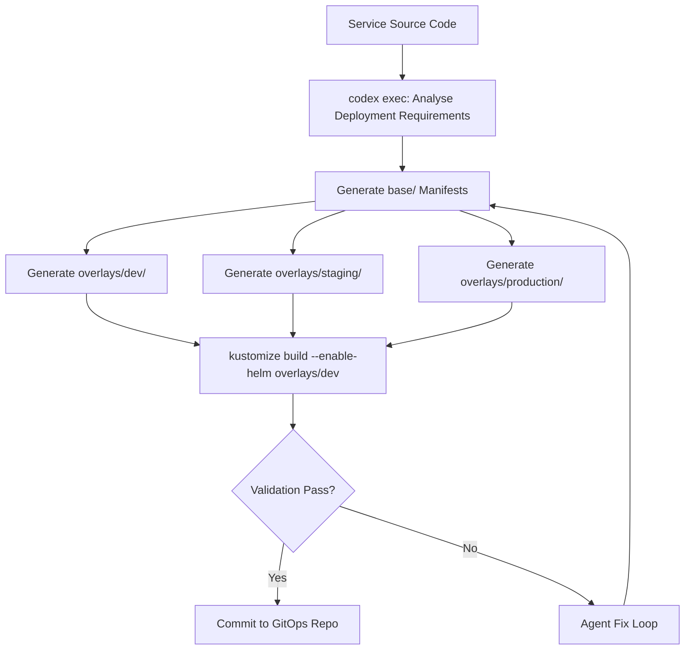
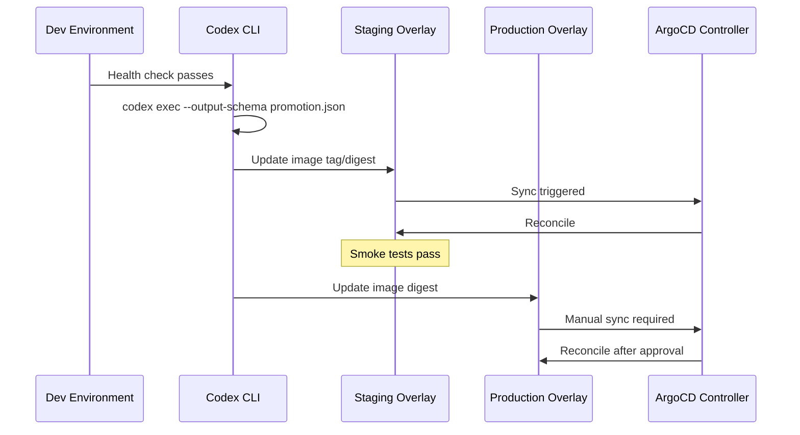

# Codex CLI for GitOps Workflows: ArgoCD Application Generation, Kustomize Overlay Management, and Environment Promotion Pipelines


---

## Introduction

GitOps treats Git as the single source of truth for declarative infrastructure and application state[^1]. ArgoCD v3.4 and Flux v2.x are the dominant CNCF-graduated reconciliation controllers[^2], yet maintaining sprawling manifest repositories — with per-environment Kustomize overlays, ArgoCD Application CRDs, and promotion gates — remains tedious manual toil. Codex CLI transforms this: using `codex exec` with `--output-schema`, interactive sessions with the Kubernetes MCP server, and PostToolUse hooks for manifest validation, you can generate, validate, and promote GitOps configurations with agent-driven precision.

This article covers three complementary workflows: generating ArgoCD Application manifests from service metadata, managing Kustomize overlay hierarchies, and building automated environment promotion pipelines — all orchestrated through Codex CLI.

---

## Prerequisites

| Component | Version | Purpose |
|-----------|---------|---------|
| Codex CLI | ≥ 0.130.0 | Agent runtime[^3] |
| ArgoCD | ≥ 3.3 | GitOps reconciliation[^4] |
| Kustomize | ≥ 5.6 | Overlay composition |
| Kubernetes MCP Server | latest | Cluster interaction[^5] |

Configure the Kubernetes MCP server in `~/.codex/config.toml`:

```toml
[mcp_servers.kubernetes]
command = "kubernetes-mcp-server"
args = ["--kubeconfig", "~/.kube/config"]
startup_timeout_sec = 10
tool_timeout_sec = 30
```

---

## Encoding GitOps Standards in AGENTS.md

Before generating any manifests, encode your organisation's GitOps conventions:

```markdown
# AGENTS.md — GitOps Standards

## ArgoCD Applications
- Use `apiVersion: argoproj.io/v1alpha1` for all Application CRDs
- Target namespace: `argocd` for Application resources
- Always set `spec.syncPolicy.automated.prune: true` for non-production
- Production applications require `spec.syncPolicy.automated.selfHeal: true` but NOT auto-prune
- Use `spec.source.kustomize` for all Kustomize-based deployments

## Kustomize Structure
- Base manifests in `base/`
- Environment overlays in `overlays/{dev,staging,production}/`
- Never duplicate resources across overlays — patch only
- All images must use digest pinning in production overlays

## Environment Promotion
- Promotion order: dev → staging → production
- Each promotion requires a passing health check from the previous environment
- Use Git tags with semver for release tracking
```

This ensures Codex respects your deployment topology regardless of session type[^6].

---

## Generating ArgoCD Application Manifests

### Interactive Generation

For a new microservice requiring ArgoCD onboarding:

```
> Generate an ArgoCD Application manifest for the payment-service.
  It lives in github.com/acme/platform-manifests under services/payment-service.
  Target cluster: in-cluster. Namespace: payments.
  Use Kustomize with overlays/dev as the initial environment.
```

Codex produces:

```yaml
apiVersion: argoproj.io/v1alpha1
kind: Application
metadata:
  name: payment-service-dev
  namespace: argocd
  labels:
    app.kubernetes.io/part-of: platform
    environment: dev
  finalizers:
    - resources-finalizer.argocd.argoproj.io
spec:
  project: default
  source:
    repoURL: https://github.com/acme/platform-manifests.git
    targetRevision: HEAD
    path: services/payment-service/overlays/dev
  destination:
    server: https://kubernetes.default.svc
    namespace: payments
  syncPolicy:
    automated:
      prune: true
      selfHeal: true
    syncOptions:
      - CreateNamespace=true
      - ServerSideApply=true
    retry:
      limit: 5
      backoff:
        duration: 5s
        factor: 2
        maxDuration: 3m
```

### Batch Generation with `codex exec`

For onboarding multiple services at once, define an output schema:

```json
{
  "type": "object",
  "properties": {
    "applications": {
      "type": "array",
      "items": {
        "type": "object",
        "properties": {
          "filename": { "type": "string" },
          "content": { "type": "string" }
        },
        "required": ["filename", "content"]
      }
    }
  },
  "required": ["applications"]
}
```

Execute:

```bash
codex exec \
  --sandbox workspace-write \
  --output-schema argocd-apps-schema.json \
  "Read services.yaml which lists all microservices with their repos, \
   namespaces, and target clusters. Generate an ArgoCD Application \
   manifest for each service across dev, staging, and production \
   environments following our AGENTS.md GitOps standards."
```

This produces structured JSON that your CI pipeline can parse to write individual YAML files and commit them to the GitOps repository[^7].

---

## Kustomize Overlay Management

### Generating Base and Overlay Hierarchies



### The Overlay Generation Skill

Create a reusable skill at `.codex/skills/kustomize-overlay-generator.md`:

```markdown
# Kustomize Overlay Generator

## Purpose
Generate environment-specific Kustomize overlays from base manifests.

## Inputs
- Base manifest directory path
- Target environment (dev/staging/production)
- Environment-specific overrides (replicas, resource limits, image tags)

## Constraints
- Production overlays MUST pin images by digest
- Staging replicas = production replicas (for realistic load testing)
- Dev overlays may use `:latest` tags
- All overlays must include namespace transformer
- Never duplicate base resources — use patches only

## Validation
Run `kustomize build` on the generated overlay and verify valid YAML output.
```

### Environment-Specific Patches

Codex generates strategic merge patches for each environment:

```yaml
# overlays/production/kustomization.yaml
apiVersion: kustomize.config.k8s.io/v1beta1
kind: Kustomization

namespace: payments

resources:
  - ../../base

patches:
  - path: replica-patch.yaml
  - path: resource-limits-patch.yaml

images:
  - name: acme/payment-service
    digest: sha256:a1b2c3d4e5f6...
```

```yaml
# overlays/production/replica-patch.yaml
apiVersion: apps/v1
kind: Deployment
metadata:
  name: payment-service
spec:
  replicas: 5
  template:
    spec:
      containers:
        - name: payment-service
          resources:
            requests:
              cpu: "500m"
              memory: "512Mi"
            limits:
              cpu: "2000m"
              memory: "2Gi"
```

---

## Environment Promotion Pipelines

### The Promotion Workflow



### CI-Driven Promotion with `codex exec`

```bash
#!/usr/bin/env bash
# promote.sh — Agent-driven environment promotion

set -euo pipefail

SERVICE="$1"
SOURCE_ENV="$2"
TARGET_ENV="$3"
IMAGE_DIGEST="$4"

codex exec \
  --sandbox workspace-write \
  --ephemeral \
  "Promote ${SERVICE} from ${SOURCE_ENV} to ${TARGET_ENV}. \
   Update the image digest to ${IMAGE_DIGEST} in \
   services/${SERVICE}/overlays/${TARGET_ENV}/kustomization.yaml. \
   If the target is production, ensure digest pinning is used \
   (never a mutable tag). Run kustomize build to validate. \
   Commit with message: 'promote(${SERVICE}): ${SOURCE_ENV} → ${TARGET_ENV} [${IMAGE_DIGEST:0:12}]'"
```

### Drift Detection as a Scheduled Task

Use `codex exec` with a cron schedule to detect configuration drift:

```bash
# Run hourly via cron or GitHub Actions schedule
codex exec \
  --sandbox read-only \
  --output-schema drift-report-schema.json \
  "Compare the rendered manifests from kustomize build for all \
   overlays against what ArgoCD reports as the live state via \
   the Kubernetes MCP server. Report any resources where the \
   desired state in Git differs from the live cluster state, \
   excluding expected transient fields (status, metadata.resourceVersion)."
```

---

## PostToolUse Hooks for Manifest Validation

Enforce manifest correctness before any file write reaches the GitOps repository:

```toml
# config.toml — GitOps validation hooks

[[hooks]]
event = "PostToolUse"
match_tool = "write_file"
match_path = "overlays/**/*.yaml"
command = "kustomize build $(dirname $CODEX_TOOL_ARG_PATH)/../ | kubectl apply --dry-run=server -f - 2>&1"
on_failure = "block"
description = "Validate Kustomize overlay renders and passes server-side dry-run"

[[hooks]]
event = "PostToolUse"
match_tool = "write_file"
match_path = "applications/**/*.yaml"
command = "kubectl apply --dry-run=client -f $CODEX_TOOL_ARG_PATH 2>&1"
on_failure = "block"
description = "Validate ArgoCD Application CRD syntax"
```

This ensures Codex cannot commit invalid manifests regardless of model hallucination[^8].

---

## Model Selection Matrix

| Task | Recommended Model | Reasoning Effort | Rationale |
|------|-------------------|------------------|-----------|
| Single Application CRD | o4-mini | medium | Structured, low-complexity YAML |
| Batch overlay generation | o3 | high | Cross-environment consistency |
| Drift analysis | o4-mini | low | Comparison logic, fast turnaround |
| Promotion pipeline design | o3 | high | Multi-step workflow reasoning |

Configure per-task profiles:

```toml
[profiles.gitops-batch]
model = "o3"
model_reasoning_effort = "high"
sandbox = "workspace-write"

[profiles.gitops-quick]
model = "o4-mini"
model_reasoning_effort = "medium"
sandbox = "workspace-write"
```

---

## Anti-Patterns

1. **Generating manifests without validation hooks** — Models hallucinate invalid API versions, non-existent fields, or deprecated sync options. Always enforce `kustomize build` and `kubectl --dry-run` via PostToolUse hooks.

2. **Using mutable image tags in production overlays** — Never allow `:latest` or branch-based tags in production. Enforce digest pinning through AGENTS.md constraints and hook validation.

3. **Bypassing the promotion order** — Deploying directly to production without traversing dev → staging violates GitOps auditability. Encode the promotion DAG in AGENTS.md.

4. **Over-generating ApplicationSets** — For simple per-environment deployments, individual Application CRDs are more debuggable than complex ApplicationSet generators with matrix combinatorics.

5. **Ignoring ArgoCD sync waves** — When generating multi-resource Applications, ensure Codex respects `argocd.argoproj.io/sync-wave` annotations for dependency ordering.

---

## Known Limitations

- **Sandbox network isolation**: `codex exec` in `workspace-write` mode cannot reach the Kubernetes API directly. Use the Kubernetes MCP server or pre-fetch cluster state before execution[^9].
- **`--output-schema` and MCP mutual exclusion**: As of v0.130.0, `--output-schema` cannot be combined with `--resume` in the same invocation[^10].
- **Context window for large repositories**: Manifest repos with hundreds of services may exceed context limits. Use subagents scoped to individual services or service groups.
- **ArgoCD Application CRD validation**: The agent validates YAML syntax but cannot verify ArgoCD-specific semantics (e.g., whether the target project permits the specified destination) without cluster access.

---

## Citations

[^1]: [GitOps Principles — OpenGitOps](https://opengitops.dev/)
[^2]: [ArgoCD vs FluxCD: Which GitOps Tool Should You Use in 2026? — DEV Community](https://dev.to/mechcloud_academy/the-gitops-standard-in-2026-a-comparative-research-analysis-of-argocd-and-fluxcd-46d8)
[^3]: [Codex CLI Changelog — OpenAI Developers](https://developers.openai.com/codex/changelog)
[^4]: [ArgoCD Releases — GitHub](https://github.com/argoproj/argo-cd/releases)
[^5]: [Kubernetes MCP Server — GitHub](https://github.com/containers/kubernetes-mcp-server)
[^6]: [Best Practices — Codex CLI OpenAI Developers](https://developers.openai.com/codex/learn/best-practices)
[^7]: [Non-interactive Mode — Codex CLI OpenAI Developers](https://developers.openai.com/codex/noninteractive)
[^8]: [Codex CLI 0.129.0 — Hooks browser and lifecycle events](https://developers.openai.com/codex/changelog)
[^9]: [Configuration Reference — Codex CLI OpenAI Developers](https://developers.openai.com/codex/config-reference)
[^10]: [Add --output-schema support to codex exec resume — GitHub Issue #14343](https://github.com/openai/codex/issues/14343)
