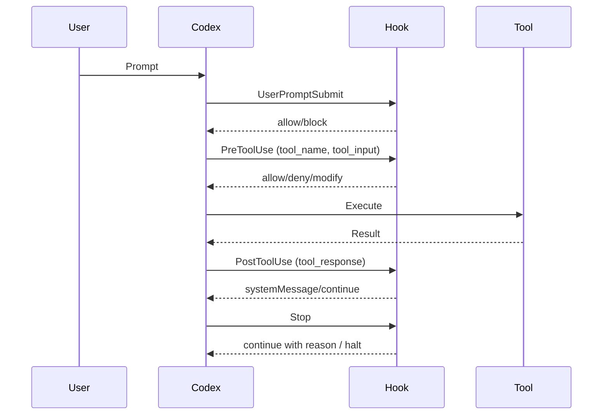

# Codex CLI Hooks: Lifecycle Governance with PreToolUse, PostToolUse, and Enterprise Enforcement


---

Codex CLI's hooks system provides a programmable interception layer over the agent's tool execution lifecycle. Every shell command, file edit, and MCP tool call can be inspected, blocked, or augmented by external scripts before and after execution[^1]. This article covers the six hook events, configuration patterns, enterprise governance enforcement, and practical recipes for teams adopting Codex in production environments.

## Hook Events

Codex exposes six lifecycle events, each firing at a distinct point in the agent loop[^1]:



| Event | Scope | Purpose |
|-------|-------|---------|
| `SessionStart` | Session | Fires on startup, resume, or clear. Filter by source via `matcher` |
| `PreToolUse` | Turn | Intercept tool calls before execution. Can deny or inject context |
| `PermissionRequest` | Turn | Runs when approval is needed (shell escalation, network) |
| `PostToolUse` | Turn | Fires after tool completion. Cannot undo side effects |
| `UserPromptSubmit` | Turn | Validates user prompts before processing |
| `Stop` | Turn | Triggers at turn completion. Enables auto-continuation logic |

## Configuration

Codex discovers hooks from multiple layers, merging them by precedence[^1]:

1. `~/.codex/hooks.json` or `[hooks]` in `~/.codex/config.toml` (user-global)
2. `<repo>/.codex/hooks.json` or `[hooks]` in `<repo>/.codex/config.toml` (project-local)
3. Plugin manifests when `[features].plugin_hooks = true`
4. Managed hooks from `requirements.toml` (enterprise/MDM)

Higher-precedence layers do not replace lower-precedence hooks — all matching hooks from all layers execute concurrently[^1].

### JSON Format

```json
{
  "hooks": {
    "PreToolUse": [
      {
        "matcher": "^Bash$",
        "hooks": [
          {
            "type": "command",
            "command": "/usr/local/bin/validate-shell-command.sh",
            "timeout": 30,
            "statusMessage": "Validating command..."
          }
        ]
      }
    ],
    "PostToolUse": [
      {
        "matcher": "^Bash$",
        "hooks": [
          {
            "type": "command",
            "command": "/usr/local/bin/audit-output.sh",
            "timeout": 10
          }
        ]
      }
    ]
  }
}
```

### TOML Equivalent

```toml
[[hooks.PreToolUse]]
matcher = "^Bash$"

[[hooks.PreToolUse.hooks]]
type = "command"
command = "/usr/local/bin/validate-shell-command.sh"
timeout = 30
statusMessage = "Validating command..."
```

## Hook Input and Output Contract

Every hook receives a JSON payload on stdin containing session context[^1]:

```json
{
  "session_id": "sess_abc123",
  "transcript_path": "/tmp/codex-sessions/abc123.jsonl",
  "cwd": "/home/dev/project",
  "hook_event_name": "PreToolUse",
  "model": "o4-mini",
  "turn_id": "turn_7f2a",
  "permission_mode": "default",
  "tool_name": "Bash",
  "tool_input": { "command": "rm -rf /tmp/build" }
}
```

Hooks respond via JSON on stdout:

```json
{
  "continue": true,
  "systemMessage": "Command approved by policy",
  "suppressOutput": false
}
```

### Blocking a Tool Call

For `PreToolUse`, return a deny decision[^1]:

```json
{
  "hookSpecificOutput": {
    "hookEventName": "PreToolUse",
    "permissionDecision": "deny",
    "permissionDecisionReason": "rm -rf against protected path"
  }
}
```

Alternatively, exit with code 2 and write the reason to stderr — Codex treats this as a block[^1].

## Matcher Patterns

Matchers use regex filtering against tool names[^1]:

| Pattern | Matches |
|---------|---------|
| `^Bash$` | Only the Bash tool |
| `^apply_patch$` | File edit operations |
| `Edit\|Write` | Either Edit or Write tools |
| `mcp__filesystem__.*` | All filesystem MCP tools |
| `""` or omitted | All tool calls |

For `SessionStart`, the matcher filters on source: `startup|resume|clear`.

## Practical Governance Recipes

### Recipe 1: Block Destructive Commands

A PreToolUse hook that denies dangerous shell operations:

```bash
#!/usr/bin/env bash
# validate-shell-command.sh
set -euo pipefail

INPUT=$(cat)
COMMAND=$(echo "$INPUT" | jq -r '.tool_input.command // empty')

# Block destructive patterns
if echo "$COMMAND" | grep -qE '(rm\s+-rf\s+/|DROP\s+TABLE|truncate|mkfs|dd\s+if=)'; then
  cat <<EOF
{
  "hookSpecificOutput": {
    "hookEventName": "PreToolUse",
    "permissionDecision": "deny",
    "permissionDecisionReason": "Blocked: destructive command pattern detected"
  }
}
EOF
  exit 0
fi

# Allow everything else
echo '{}'
```

### Recipe 2: Audit Trail Logger

A PostToolUse hook that logs every tool execution to a JSONL file for compliance:

```bash
#!/usr/bin/env bash
# audit-output.sh
set -euo pipefail

INPUT=$(cat)
TIMESTAMP=$(date -u +"%Y-%m-%dT%H:%M:%SZ")
SESSION_ID=$(echo "$INPUT" | jq -r '.session_id')
TOOL_NAME=$(echo "$INPUT" | jq -r '.tool_name')
EXIT_CODE=$(echo "$INPUT" | jq -r '.tool_response.exit_code // "n/a"')

jq -nc \
  --arg ts "$TIMESTAMP" \
  --arg sid "$SESSION_ID" \
  --arg tool "$TOOL_NAME" \
  --arg exit "$EXIT_CODE" \
  '{timestamp: $ts, session: $sid, tool: $tool, exit_code: $exit}' \
  >> /var/log/codex-audit.jsonl

echo '{}'
```

### Recipe 3: Secret Scanning on Prompts

A UserPromptSubmit hook that blocks prompts containing API keys:

```bash
#!/usr/bin/env bash
# scan-prompt.sh
set -euo pipefail

INPUT=$(cat)
PROMPT=$(echo "$INPUT" | jq -r '.prompt // empty')

# Detect common secret patterns
if echo "$PROMPT" | grep -qE '(sk-[a-zA-Z0-9]{20,}|AKIA[A-Z0-9]{16}|ghp_[a-zA-Z0-9]{36})'; then
  echo '{"decision": "block", "reason": "Prompt contains what appears to be an API key or secret"}'
  exit 0
fi

echo '{}'
```

## Enterprise Managed Hooks

For organisations requiring mandatory governance that individual developers cannot disable, Codex supports managed hooks via `requirements.toml`[^2][^3]:

```toml
[features]
hooks = true

[hooks]
managed_dir = "/etc/codex/hooks"

[[hooks.PreToolUse]]
matcher = "^Bash$"

[[hooks.PreToolUse.hooks]]
type = "command"
command = "/etc/codex/hooks/enterprise-policy.sh"
timeout = 30
```

Key properties of managed hooks[^1][^3]:
- Marked as trusted by policy — no user approval prompt
- Cannot be disabled from the `/hooks` browser
- Deployed via MDM, system configuration, or cloud policy
- Execute before user-defined hooks

## Tier-Aware Policy Mapping

Map Codex execution modes to governance tiers for graduated enforcement[^2]:

```json
{
  "tools": {
    "Bash.curl": {
      "background": "deny",
      "subagent": "ask",
      "interactive": "allow"
    },
    "Bash.rm": {
      "background": "deny",
      "subagent": "deny",
      "interactive": "allow"
    },
    "Bash.git_push": {
      "background": "deny",
      "subagent": "ask",
      "interactive": "allow"
    }
  }
}
```

This ensures that headless `codex exec --full-auto` sessions operate under the most restrictive policies, while interactive sessions where a human is present allow broader operations[^2].

## The /hooks TUI Command

Since v0.129.0, the `/hooks` command provides a browsable interface for discovering and toggling hooks[^4]. From the TUI you can:

- View all registered hooks across all configuration layers
- See which hooks are managed (locked) vs user-defined
- Toggle individual hooks on/off for debugging
- Inspect matcher patterns and timeout values

## Known Limitations

Several constraints affect hook reliability as of May 2026[^2][^5]:

1. **Partial tool coverage** — `PreToolUse` reliably fires for Bash commands but `apply_patch` file edits and MCP tool calls have intermittent hook coverage (tracked in issue #16732)[^2]
2. **No undo for PostToolUse** — blocking in PostToolUse cannot reverse already-executed side effects; it only provides feedback to the model[^1]
3. **Only `command` type supported** — `prompt` and `agent` handler types are parsed but currently skipped[^1]
4. **`suppressOutput` not implemented** — the field is parsed but has no effect today[^1]
5. **Timeout defaults to 600 seconds** — generous but potentially blocking for fast CI pipelines; always set explicit timeouts[^1]

## Workarounds

For the `apply_patch` coverage gap, express file edits as shell commands when governance is critical[^2]:

```bash
# Instead of relying on apply_patch hooks firing:
sed -i 's/old_value/new_value/g' config.yaml
# Or use git apply for patch-based edits:
git apply --stat my-changes.patch && git apply my-changes.patch
```

For MCP tool governance, run MCP servers behind a control plane that enforces policies at the server boundary rather than relying solely on client-side hooks[^2].

## Recommendations

1. **Start with audit-only PostToolUse hooks** — log everything before adding blocking policies
2. **Use `--full-auto` not `--dangerously-bypass-approvals-and-sandbox`** — the former keeps hooks active[^2]
3. **Set explicit timeouts** — prevent runaway hook scripts from blocking the agent loop
4. **Layer your configuration** — global hooks for organisation policy, repo-local hooks for project-specific checks
5. **Test hooks with `/hooks` and `CODEX_LOG_LEVEL=debug`** — verify matchers fire before deploying to CI

## Citations

[^1]: OpenAI, "Hooks – Codex," OpenAI Developers, May 2026. [https://developers.openai.com/codex/hooks](https://developers.openai.com/codex/hooks)

[^2]: Agentic Control Plane, "Codex CLI hook governance: what works today (and what doesn't)," May 2026. [https://agenticcontrolplane.com/blog/codex-cli-hooks-reference](https://agenticcontrolplane.com/blog/codex-cli-hooks-reference)

[^3]: OpenAI, "Governance hooks: configurable policies, threat detection, and audit trails," GitHub Issue #12190, 2026. [https://github.com/openai/codex/issues/12190](https://github.com/openai/codex/issues/12190)

[^4]: OpenAI, "Release 0.129.0," GitHub, May 2026. [https://github.com/openai/codex/releases/tag/rust-v0.129.0](https://github.com/openai/codex/releases/tag/rust-v0.129.0)

[^5]: Speakeasy, "AI agent hooks: the interface for governing AI agents," 2026. [https://www.speakeasy.com/resources/ai-agent-hooks](https://www.speakeasy.com/resources/ai-agent-hooks)
