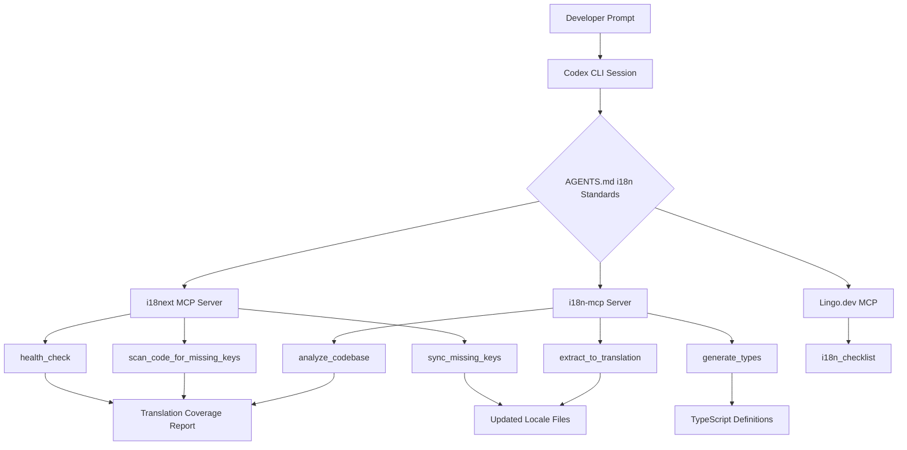

# Codex CLI for Internationalisation: Translation Auditing, MCP-Driven Workflows, and CI Enforcement


---

Internationalisation is one of those concerns that every team agrees matters yet few prioritise until a product manager sends a panicked message about a Japanese launch in six weeks. The work itself is not intellectually taxing — extract strings, maintain locale files, keep them synchronised — but it is relentlessly tedious and error-prone. That makes it an ideal target for agent-driven automation with Codex CLI.

This article walks through a four-phase i18n pipeline: encoding standards in `AGENTS.md`, auditing translation coverage with `codex exec`, integrating i18n-aware MCP servers for live translation management, and enforcing locale completeness in CI.

## The i18n Problem at Scale

A mature application with 2,000 translatable strings across eight locales contains 16,000 individual translation entries. Developers routinely introduce hardcoded strings, forget to add keys to secondary locales, or leave stale translations for deleted UI elements. Traditional linters catch syntax errors in locale files but miss semantic drift — a German translation that still references a feature renamed three sprints ago.

Codex CLI can reason about translation intent, detect hardcoded strings in source code, generate missing translations with contextual awareness, and validate consistency across locales — all from the terminal [^1].

## Phase 1: AGENTS.md i18n Standards

Encode your internationalisation conventions directly in `AGENTS.md` so every Codex session inherits them:

```markdown
## Internationalisation Standards

- All user-facing strings MUST use translation keys, never hardcoded text
- Translation key format: `<namespace>.<component>.<descriptor>` (e.g. `auth.loginForm.submitButton`)
- Base locale: `en-GB` in `locales/en-GB/*.json`
- Supported locales: en-GB, de-DE, fr-FR, ja-JP, es-ES, pt-BR, zh-Hans, ko-KR
- Framework: i18next with react-i18next `useTranslation` hook
- Namespace files map 1:1 to feature directories
- Pluralisation uses ICU MessageFormat syntax
- No HTML in translation values — use `<Trans>` components for markup
- Every new key MUST include a `_context` sibling for translator guidance
```

This eliminates the prompt overhead of re-explaining conventions each session [^2]. Codex loads `AGENTS.md` at session start, so a simple instruction like "add the password-reset flow" will automatically produce properly keyed, namespaced translations rather than hardcoded English strings.

## Phase 2: Translation Coverage Auditing with codex exec

### Structured Audit Schema

Define a JSON Schema for translation audit output:

```json
{
  "$schema": "https://json-schema.org/draft/2020-12/schema",
  "type": "object",
  "properties": {
    "audit_timestamp": { "type": "string", "format": "date-time" },
    "base_locale": { "type": "string" },
    "locales_checked": { "type": "array", "items": { "type": "string" } },
    "total_keys": { "type": "integer" },
    "hardcoded_strings": {
      "type": "array",
      "items": {
        "type": "object",
        "properties": {
          "file": { "type": "string" },
          "line": { "type": "integer" },
          "text": { "type": "string" },
          "suggested_key": { "type": "string" }
        }
      }
    },
    "missing_translations": {
      "type": "object",
      "additionalProperties": {
        "type": "array",
        "items": { "type": "string" }
      }
    },
    "stale_keys": { "type": "array", "items": { "type": "string" } },
    "coverage_by_locale": {
      "type": "object",
      "additionalProperties": { "type": "number" }
    }
  },
  "required": ["audit_timestamp", "base_locale", "total_keys", "coverage_by_locale"]
}
```

### Running the Audit

```bash
codex exec \
  --sandbox read-only \
  --output-schema i18n-audit-schema.json \
  "Audit the entire src/ directory for i18n issues: \
   1. Find hardcoded user-facing strings not wrapped in t() or <Trans> \
   2. Compare all locale files against the base en-GB locale \
   3. Identify keys present in en-GB but missing from other locales \
   4. Find keys in locale files with no corresponding usage in source code \
   5. Calculate coverage percentage per locale"
```

The `--sandbox read-only` profile ensures the audit cannot modify files [^3]. The `--output-schema` flag constrains output to parseable JSON, making it consumable by downstream tooling [^4].

### Batch Auditing Across Namespaces

For monorepos with feature-scoped locale directories:

```bash
for ns in auth dashboard settings billing; do
  codex exec \
    --sandbox read-only \
    --output-schema i18n-audit-schema.json \
    -o "reports/i18n-audit-${ns}.json" \
    "Audit the src/features/${ns}/ directory and locales/${ns}/ namespace for i18n completeness"
done
```

## Phase 3: MCP-Driven Translation Workflows

The i18n MCP ecosystem has matured significantly in 2026. Three servers are particularly useful with Codex CLI.

### i18next MCP Server

The `i18next-mcp-server` provides direct interaction with i18next translation files [^5]:

```toml
# ~/.codex/config.toml
[mcp_servers.i18next]
command = "npx"
args = ["-y", "i18next-mcp-server"]

[mcp_servers.i18next.env]
I18NEXT_PROJECT_ROOT = "."
I18NEXT_LOCALES_PATH = "./locales"
I18NEXT_DEFAULT_LANGUAGE = "en-GB"
I18NEXT_SUPPORTED_LANGUAGES = "en-GB,de-DE,fr-FR,ja-JP,es-ES,pt-BR,zh-Hans,ko-KR"
```

This exposes tools including `health_check` for translation completeness analysis, `scan_code_for_missing_keys` for detecting gaps between source code and locale files, `sync_missing_keys` for aligning keys across locales, and `coverage_report` for per-locale completeness metrics [^5].

### i18n-mcp (Comprehensive Management)

The `i18n-mcp` server adds codebase analysis capabilities including hardcoded string detection, automatic extraction of strings to translation keys with source code replacement, and TypeScript type generation from translation keys [^6]:

```toml
[mcp_servers.i18n]
command = "npx"
args = ["-y", "i18n-mcp", "--project-root", ".", "--locales-path", "./locales"]
```

With this configured, a Codex session can:

1. Run `analyze_codebase` to detect every hardcoded string
2. Use `extract_to_translation` to replace hardcoded strings with keyed lookups
3. Call `sync_missing_keys` to propagate new keys to all locales
4. Execute `cleanup_unused_translations` to remove orphaned entries

### Lingo.dev MCP

For teams needing framework-aware setup guidance, the Lingo.dev MCP provides a 13-step `i18n_checklist` tool that walks through project analysis, locale routing, translation setup, and build validation [^7]. It supports Next.js App Router, React Router, and TanStack Start, and connects to the Lingo.dev localization engine for glossary-aware translations.

```toml
[mcp_servers.lingo]
command = "npx"
args = ["-y", "lingo-mcp-server"]
```

### MCP Integration Architecture



## Phase 4: Reusable i18n-auditor Skill

Encapsulate the workflow as a Codex skill:

```markdown
# SKILL.md — i18n-auditor

name: i18n-auditor
description: Audit and repair internationalisation coverage across all locales

## Workflow

1. Run i18next MCP `health_check` to establish baseline coverage
2. Execute `scan_code_for_missing_keys` against the source directory
3. For each hardcoded string found:
   - Generate an appropriate translation key following namespace conventions
   - Replace the hardcoded string with a `t()` call or `<Trans>` component
   - Add the key and English value to the base locale file
4. Run `sync_missing_keys` to propagate new keys to all supported locales
5. Execute `cleanup_unused_translations` to remove stale entries
6. Generate a coverage report and commit changes

## Constraints

- Never delete a translation key that has been manually reviewed (marked with `_reviewed: true`)
- Prefer existing namespace patterns over creating new namespaces
- Use ICU MessageFormat for plurals and variables, never string concatenation
- Always add `_context` entries for new keys to aid human translators
```

Invoke with:

```bash
codex "Use the i18n-auditor skill to audit and repair the auth feature module"
```

## Phase 5: CI Enforcement

### GitHub Actions Pipeline


```yaml
name: i18n-coverage-gate
on:
  pull_request:
    paths:
      - 'src/**'
      - 'locales/**'

jobs:
  i18n-audit:
    runs-on: ubuntu-latest
    steps:
      - uses: actions/checkout@v4

      - name: Run i18n coverage audit
        env:
          CODEX_API_KEY: ${{ secrets.CODEX_API_KEY }}
        run: |
          codex exec \
            --sandbox read-only \
            --output-schema .codex/i18n-audit-schema.json \
            -o i18n-report.json \
            "Audit src/ and locales/ for i18n completeness. \
             Report hardcoded strings, missing translations, and stale keys."

      - name: Enforce coverage thresholds
        run: |
          node -e "
            const report = require('./i18n-report.json');
            const coverage = report.coverage_by_locale;
            const threshold = 95;
            let failed = false;
            for (const [locale, pct] of Object.entries(coverage)) {
              if (pct < threshold) {
                console.error(locale + ' coverage ' + pct + '% below threshold ' + threshold + '%');
                failed = true;
              }
            }
            if (report.hardcoded_strings?.length > 0) {
              console.error(report.hardcoded_strings.length + ' hardcoded strings detected');
              failed = true;
            }
            if (failed) process.exit(1);
            console.log('i18n coverage gate passed');
          "
```


This blocks merges when any locale drops below the coverage threshold or when hardcoded strings appear in changed files [^3].

### PostToolUse Hook for Translation Validation

Add a hook that validates locale files whenever Codex edits them:

```toml
# .codex/config.toml
[[hooks]]
event = "PostToolUse"
match_tool = "write_file"
match_args = { path_glob = "locales/**/*.json" }
command = "node scripts/validate-locales.js"
```

The validation script can check JSON syntax, verify key consistency across locales, and confirm ICU MessageFormat compliance [^8].

## Model Selection

| Task | Recommended Model | Rationale |
|------|-------------------|-----------|
| Interactive string extraction | `o4-mini` | Fast iteration, moderate reasoning |
| Structured coverage audit | `o3` | Complex cross-file analysis with schema adherence |
| Batch translation generation | `o4-mini` | High throughput, lower cost |
| Translation quality review | `o3` | Nuanced linguistic judgement |

The `o4-mini` model handles the bulk of routine i18n work effectively; reserve `o3` for audits requiring cross-file reasoning or linguistic nuance [^9].

## Anti-Patterns

**Generating translations without human review.** Machine-generated translations should be treated as drafts. Mark agent-generated entries with a metadata flag (e.g. `_source: "codex"`) so human translators can prioritise review.

**Ignoring context entries.** A bare translation key without `_context` metadata forces translators to guess meaning. Always generate context alongside keys.

**Treating all locales as equal priority.** Launch locales need 100% coverage; experimental locales can tolerate gaps. Configure per-locale thresholds in CI rather than applying a single gate.

**Over-namespacing.** Creating a unique namespace per component leads to fragmentation. Align namespaces with feature boundaries, not component hierarchy.

**Bypassing locale file structure.** Generating flat key-value pairs when the project uses nested JSON breaks existing tooling. Respect the established locale file structure declared in `AGENTS.md`.

## Known Limitations

- **`--output-schema` and MCP conflict**: The `--output-schema` flag is silently ignored when MCP servers are active in some configurations [^10]. Run structured audits without MCP, or use MCP tools interactively and `codex exec` audits separately.
- **Context window for large locale files**: Projects with thousands of keys per namespace may exceed context limits. Scope audits to individual features or namespaces.
- **Translation quality is not translation accuracy**: Codex can generate grammatically correct translations that miss cultural nuance. Professional human review remains essential for customer-facing copy.
- **Sandbox network isolation**: MCP servers connecting to cloud translation management platforms (i18nexus, Lingo.dev cloud) require `--sandbox danger-full-access` or network-permitted profiles, which weakens isolation [^3].

## Citations

[^1]: [OpenAI Codex CLI — Features](https://developers.openai.com/codex/cli/features) — Codex CLI feature overview including file analysis and code generation capabilities.

[^2]: [Custom instructions with AGENTS.md — Codex](https://developers.openai.com/codex/guides/agents-md) — Official documentation for encoding persistent project standards in AGENTS.md.

[^3]: [Non-interactive mode — Codex](https://developers.openai.com/codex/noninteractive) — Documentation for `codex exec`, sandbox profiles, and `--output-schema` usage.

[^4]: [Command line options — Codex CLI](https://developers.openai.com/codex/cli/reference) — Full CLI reference including `--output-schema` and `-o` output flags.

[^5]: [i18next-mcp-server — GitHub](https://github.com/gtrias/i18next-mcp-server) — MCP server providing health checking, missing key detection, and automated translation workflows for i18next projects.

[^6]: [i18n-mcp — GitHub](https://github.com/dalisys/i18n-mcp) — Comprehensive MCP server for i18n translation file management with codebase analysis, hardcoded string detection, and TypeScript type generation.

[^7]: [Lingo.dev i18n MCP](https://lingo.dev/en/docs/react/mcp) — Framework-aware i18n MCP server with guided setup checklist and localization engine integration.

[^8]: [OpenAI Codex Hooks Documentation](https://developers.openai.com/codex/cli/features) — Hooks lifecycle events including PostToolUse for file validation.

[^9]: [Codex Best Practices](https://developers.openai.com/codex/learn/best-practices) — Model selection guidance and task-appropriate configuration.

[^10]: [GitHub Issue #15451 — output-schema and MCP conflict](https://github.com/openai/codex/issues/15451) — Known issue where `--output-schema` is silently ignored when MCP servers are active.
