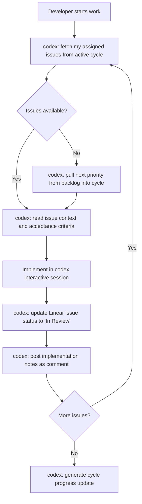

# Codex CLI with Linear MCP: Sprint Automation, Issue Decomposition, and Cycle-Driven Development


---

## Why Linear MCP Matters for Terminal-First Developers

Senior developers who live in the terminal face a context-switching tax every time they tab into a browser to check sprint status, decompose an epic, or update issue progress. The Linear MCP server — a centrally hosted, authenticated remote MCP endpoint — eliminates that friction by exposing Linear's full issue graph directly inside Codex CLI sessions[^1].

Since the February 2026 update, the server supports initiatives, milestones, project updates, and cycle management alongside core issue CRUD[^2]. Combined with Codex CLI's `codex exec` non-interactive mode and `--output-schema` structured output, this creates a programmable sprint automation layer that runs entirely from your terminal or CI pipeline.

---

## Setting Up the Linear MCP Server

### Quick Setup via CLI

```bash
codex mcp add linear --url https://mcp.linear.app/mcp
codex mcp login linear --scopes read,write
```

The `codex mcp add` command registers the server in `~/.codex/config.toml`, and `login` triggers the OAuth 2.1 dynamic client registration flow[^3].

### Manual Configuration

For teams preferring explicit configuration or using API keys:

```toml
[mcp_servers.linear]
url = "https://mcp.linear.app/mcp"
bearer_token_env_var = "LINEAR_API_KEY"
```

Set the environment variable in your shell profile:

```bash
export LINEAR_API_KEY="lin_api_xxxxxxxxxxxx"
```

### Verifying the Connection

```bash
codex mcp list --json | jq '.[] | select(.name == "linear")'
```

A successful configuration shows the server as `connected` with available tools listed.

---

## Core Sprint Workflow Patterns

### Pattern 1: Epic Decomposition into Sprint-Ready Issues

The most powerful pattern is feeding Codex an epic description and having it create properly sized, dependency-ordered issues directly in Linear.

```bash
codex exec "Read Linear project PRJ-42 and decompose the epic 'Migrate auth to OIDC' \
into sprint-sized issues. Each issue should be completable in 1-3 days. \
Set priority based on dependency order. Add implementation notes to each \
issue description. Create the issues in Linear under cycle 'Sprint 24'." \
--model gpt-5.5 \
--reasoning high
```

This leverages Codex's ability to call Linear MCP tools iteratively — reading the project context, analysing dependencies, then creating issues with appropriate labels, priorities, and cycle assignments[^4].

### Pattern 2: Sprint Planning from Backlog Analysis

```bash
codex exec "Analyse the backlog for team 'Platform' in Linear. \
Identify the top 8 issues by priority that fit within 40 story points. \
Check for dependency conflicts. Move selected issues into the next \
unstarted cycle. Post a sprint planning summary as a project update." \
--model gpt-5.5 \
--reasoning medium
```

### Pattern 3: Structured Sprint Reports

Using `--output-schema` for machine-readable sprint health data:

```bash
codex exec "Generate a sprint health report for the active cycle \
of team 'Backend'. Include velocity, burndown status, blocked issues, \
and at-risk items." \
--output-schema ./schemas/sprint-report.json \
-o ./reports/sprint-24-health.json
```

Where `sprint-report.json` defines:

```json
{
  "type": "object",
  "properties": {
    "cycle_name": { "type": "string" },
    "velocity_points": { "type": "number" },
    "completed_count": { "type": "integer" },
    "in_progress_count": { "type": "integer" },
    "blocked_issues": {
      "type": "array",
      "items": {
        "type": "object",
        "properties": {
          "id": { "type": "string" },
          "title": { "type": "string" },
          "blocker_reason": { "type": "string" }
        }
      }
    },
    "at_risk": { "type": "array", "items": { "type": "string" } },
    "recommendation": { "type": "string" }
  },
  "required": ["cycle_name", "velocity_points", "blocked_issues"]
}
```

---

## Cycle-Driven Development Workflow

The following workflow integrates Linear MCP into the daily development loop:



### Daily Standup Automation

Create a skill file at `.codex/skills/standup.md`:

```markdown
# Standup Report Generator

## When to use
Run at the start of each working day to generate a standup summary.

## Instructions
1. Query Linear for my issues updated in the last 24 hours
2. Categorise into: completed yesterday, working on today, blocked
3. Check if any issues are approaching cycle end without completion
4. Output a concise standup report
```

Invoke with:

```bash
codex "Run the standup skill and post the summary as a comment on today's daily thread in project 'Platform'"
```

---

## AGENTS.md Integration

Encode Linear workflow standards in your repository's `AGENTS.md`:

```markdown
## Linear Integration Standards

- All code changes MUST reference a Linear issue ID in commit messages (format: `PRJ-123`)
- When completing implementation, update the Linear issue status to "In Review"
- Sub-tasks discovered during implementation should be created as sub-issues, not comments
- Sprint scope changes require a project update with justification
- Use cycle IDs, not names, when programmatically assigning issues to sprints
```

This ensures Codex maintains Linear hygiene whether running interactively or via `codex exec`[^5].

---

## CI Pipeline Integration

### Automatic Issue Updates on PR Merge


```yaml
# .github/workflows/linear-sync.yml
name: Sync Linear on Merge
on:
  pull_request:
    types: [closed]

jobs:
  update-linear:
    if: github.event.pull_request.merged == true
    runs-on: ubuntu-latest
    steps:
      - uses: openai/codex-action@v1
        with:
          codex-args: |
            --model gpt-5.5
            --reasoning low
          prompt: |
            Extract Linear issue IDs from this PR title and body:
            Title: ${{ github.event.pull_request.title }}
            Body: ${{ github.event.pull_request.body }}

            For each issue found:
            1. Move status to "Done"
            2. Add a comment linking to the merged PR
            3. If this completes all sub-issues of a parent, update parent status
        env:
          LINEAR_API_KEY: ${{ secrets.LINEAR_API_KEY }}
```


### Sprint Burndown Alerts

Schedule a daily check for sprint health:


```yaml
name: Sprint Health Check
on:
  schedule:
    - cron: '0 9 * * 1-5'  # Weekdays at 9am

jobs:
  check-sprint:
    runs-on: ubuntu-latest
    steps:
      - uses: openai/codex-action@v1
        with:
          codex-args: --model gpt-5.5 --reasoning low
          prompt: |
            Check the active cycle for team 'Backend'.
            If more than 30% of points remain with less than 2 days left,
            post a warning project update flagging at-risk items.
            Otherwise, post a healthy status update.
        env:
          LINEAR_API_KEY: ${{ secrets.LINEAR_API_KEY }}
```


---

## Model Selection for Linear Workflows

| Task | Recommended Model | Reasoning Effort |
|------|------------------|-----------------|
| Issue decomposition | gpt-5.5 | High |
| Status updates | gpt-5.3 or Spark | Low |
| Sprint planning | gpt-5.5 | Medium |
| Backlog prioritisation | gpt-5.5 | High |
| Standup generation | gpt-5.3 | Low |

Issue decomposition benefits from higher reasoning because it requires understanding dependency graphs and estimating scope[^6]. Status updates are mechanical and benefit from Spark's speed.

---

## Anti-Patterns to Avoid

**Over-automating triage.** Codex can auto-assign issues via Linear's triage rules[^7], but blindly routing everything to the agent without human review of priority and scope leads to sprint bloat.

**Ignoring cycle boundaries.** Programmatically adding issues mid-sprint without capacity checks undermines the cycle's purpose. Always query remaining capacity before injection.

**Treating decomposition as deterministic.** The same epic decomposed twice may yield different issue structures. Pin decomposition outputs by reviewing and adjusting before committing to the cycle.

**Skipping the OAuth flow for shared machines.** Using personal API keys in shared CI environments leaks individual attribution. Prefer OAuth with service accounts for team pipelines.

---

## Known Limitations

- **SSE endpoint deprecation**: Linear is phasing out `https://mcp.linear.app/sse` in favour of `https://mcp.linear.app/mcp` (Streamable HTTP)[^2]. Update configurations before the two-month deprecation window completes.
- **output-schema and MCP conflict**: When using `--output-schema`, Codex cannot simultaneously call MCP tools and produce structured output in the same turn[^8]. Structure your prompts to complete MCP operations first, then format the final response.
- **Rate limiting**: Heavy automation against Linear's MCP endpoint may hit rate limits. Batch operations where possible rather than issuing individual tool calls per issue.
- **Read-only with restricted API keys**: Direct token authentication with restricted Linear API keys provides read-only access[^1]. Write operations require full OAuth or unrestricted keys.

---

## Practical Example: Full Sprint Setup

Combining all patterns into a single sprint kickoff command:

```bash
codex exec "For team 'Backend' in Linear:
1. Close the current active cycle and generate a retrospective summary
2. Create a new cycle named 'Sprint 25' starting Monday for 2 weeks
3. Review the backlog and select issues totalling ~40 points, prioritising:
   - Blocked items that are now unblocked
   - High-priority bugs
   - Items with external deadlines
4. Assign selected issues to Sprint 25
5. Post a sprint planning update to the Backend project
6. List any items that were incomplete in the previous sprint and recommend whether to carry forward or deprioritise" \
--model gpt-5.5 \
--reasoning high
```

This single invocation replaces a 30-minute planning ceremony with a reviewable output that the team lead can approve or adjust.

---

## Citations

[^1]: Linear, "MCP Server Documentation," linear.app/docs/mcp, accessed May 2026.
[^2]: Linear, "Linear MCP for Product Management — Changelog," linear.app/changelog/2026-02-05-linear-mcp-for-product-management, February 2026.
[^3]: OpenAI, "Command Line Options — Codex CLI," developers.openai.com/codex/cli/reference, accessed May 2026.
[^4]: OpenAI, "Non-interactive Mode — Codex CLI," developers.openai.com/codex/noninteractive, accessed May 2026.
[^5]: OpenAI, "Custom Instructions with AGENTS.md," developers.openai.com/codex/guides/agents-md, accessed May 2026.
[^6]: OpenAI, "Best Practices — Codex," developers.openai.com/codex/learn/best-practices, accessed May 2026.
[^7]: OpenAI, "Use Codex in Linear," developers.openai.com/codex/integrations/linear, accessed May 2026.
[^8]: OpenAI, "Features — Codex CLI," developers.openai.com/codex/cli/features, accessed May 2026.
