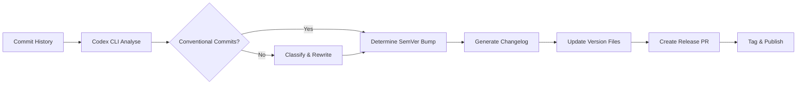
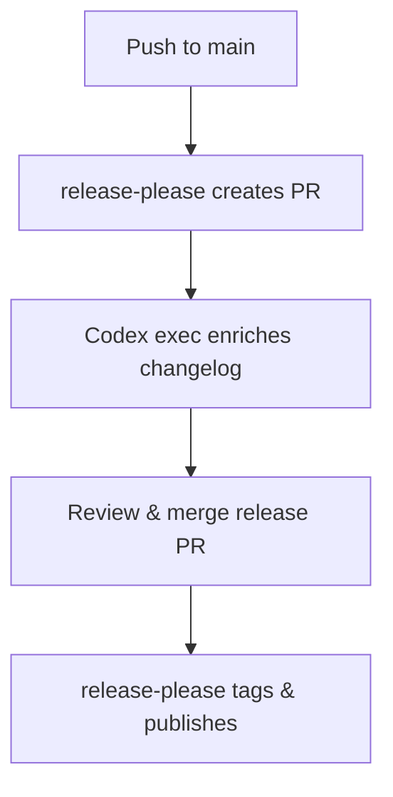

# Codex CLI for Release Management: Changelog Generation, Semantic Versioning, and Automated Release Pipelines


---

Release management remains one of the most error-prone manual processes in software engineering. Developers forget to bump versions, write vague changelog entries, or skip release notes entirely under deadline pressure. Codex CLI — OpenAI's open-source terminal agent built in Rust [^1] — can automate the entire pipeline from commit analysis through version determination to changelog generation, either interactively or in unattended CI runs via `codex exec` [^2].

This article builds a complete release management workflow using Codex CLI, AGENTS.md conventions, reusable skills, and GitHub Actions integration.

## The Release Pipeline



## Encoding Release Standards in AGENTS.md

The foundation is an `AGENTS.md` file that encodes your project's release conventions [^3]. Place this at the repository root so every Codex session — interactive or batch — inherits the rules:

```markdown
# Release Management

## Commit Conventions
- All commits MUST follow Conventional Commits 1.0.0
- Types: feat, fix, perf, refactor, docs, test, chore, ci, build
- Breaking changes use `!` suffix or `BREAKING CHANGE:` footer
- Scopes match top-level package directories

## Versioning
- Follow Semantic Versioning 2.0.0
- feat → minor bump, fix/perf → patch bump, BREAKING → major bump
- Pre-release versions use `-rc.N` suffix

## Changelog
- Follow Keep a Changelog 1.1.0 format
- Sections: Added, Changed, Deprecated, Removed, Fixed, Security
- Each entry references the PR number and author
- Write entries for a technical audience — no marketing language
```

## Interactive Changelog Drafting

For ad-hoc release preparation, pipe your commit log directly into Codex:

```bash
git log v1.4.2..HEAD --oneline --no-merges \
  | codex exec "Analyse these commits. Determine the correct SemVer \
    bump following our AGENTS.md conventions. Draft a Keep a Changelog \
    entry for the new version. Output the changelog section only."
```

Codex reads your `AGENTS.md` commit conventions, classifies each commit by type, determines whether the bump is patch, minor, or major, and produces a formatted changelog section [^2]. The key advantage over `conventional-changelog-cli` or `release-please` alone is that Codex understands *context* — it can identify that a `refactor` commit actually introduces a behavioural change warranting a `fix` classification, or that three related `feat` commits should be grouped under a single user-facing feature description.

## Structured Output for CI Integration

For deterministic pipeline integration, define a JSON Schema and use `--output-schema` to constrain Codex's response [^4]:

```json
{
  "$schema": "https://json-schema.org/draft/2020-12/schema",
  "type": "object",
  "properties": {
    "current_version": { "type": "string" },
    "next_version": { "type": "string" },
    "bump_type": { "enum": ["major", "minor", "patch"] },
    "breaking_changes": {
      "type": "array",
      "items": { "type": "string" }
    },
    "changelog_markdown": { "type": "string" },
    "commits_analysed": { "type": "integer" }
  },
  "required": ["current_version", "next_version", "bump_type", "changelog_markdown"]
}
```

```bash
git log v1.4.2..HEAD --format="%H %s" \
  | codex exec \
    --output-schema ./release-schema.json \
    -o ./release-output.json \
    --sandbox workspace-write \
    "Analyse these commits against AGENTS.md conventions. \
     Read package.json for the current version. \
     Determine the SemVer bump and generate a changelog."
```

The `--output-schema` flag ensures the response validates against your schema before output, making downstream parsing reliable [^4]. Note that `--output-schema` cannot be combined with `resume` in the same invocation [^2].

## A Reusable Release Skill

Create `$HOME/.agents/skills/release-manager/SKILL.md` for a portable, repeatable workflow [^5]:

```markdown
# Release Manager

Analyse the commit history since the last release tag and produce
a complete release preparation package.

## Steps
1. Find the latest release tag: `git describe --tags --abbrev=0`
2. Collect commits since that tag: `git log <tag>..HEAD --format="%H|%s|%b"`
3. Classify each commit per Conventional Commits 1.0.0
4. Flag any commits that violate conventions — suggest rewrites
5. Determine the SemVer bump (major/minor/patch)
6. Generate a Keep a Changelog 1.1.0 section
7. List any breaking changes with migration guidance
8. If package.json/Cargo.toml/pyproject.toml exists, state the version bump

## Output
Return the changelog section in markdown and a summary of the version bump.
```

Invoke with:

```bash
codex "Run the release-manager skill for this repository"
```

Or non-interactively:

```bash
codex exec "Run the release-manager skill" --sandbox workspace-write -o release-notes.md
```

## Enforcing Conventional Commits with Hooks

Codex CLI hooks can validate commit messages before they reach your remote [^6]. Add a `PostToolUse` hook in your project's `.codex/config.toml` that runs after any `git commit` operation:

```toml
[[hooks]]
event = "PostToolUse"
match_tool = "shell"
match_cmd = "git commit"
run = "git log -1 --format='%s' | grep -qE '^(feat|fix|perf|refactor|docs|test|chore|ci|build)(\\(.+\\))?!?:' || (echo 'ERROR: Commit message does not follow Conventional Commits' && exit 1)"
```

This ensures that even when Codex generates commit messages autonomously, they conform to your conventions [^6].

## GitHub Actions Integration

Wire the structured output into a release pipeline:


```yaml
name: Release Preparation
on:
  workflow_dispatch:
    inputs:
      dry_run:
        description: 'Dry run without creating release'
        type: boolean
        default: true

jobs:
  prepare-release:
    runs-on: ubuntu-latest
    steps:
      - uses: actions/checkout@v4
        with:
          fetch-depth: 0  # Full history for tag analysis

      - name: Install Codex CLI
        run: npm install -g @openai/codex

      - name: Analyse commits and generate changelog
        env:
          CODEX_API_KEY: ${{ secrets.CODEX_API_KEY }}
        run: |
          git log $(git describe --tags --abbrev=0)..HEAD --format="%H %s" \
            | codex exec \
              --output-schema ./release-schema.json \
              -o ./release-output.json \
              --sandbox workspace-write \
              --ephemeral \
              "Analyse commits and generate a release changelog per AGENTS.md"

      - name: Parse release output
        id: release
        run: |
          echo "version=$(jq -r .next_version release-output.json)" >> "$GITHUB_OUTPUT"
          echo "bump=$(jq -r .bump_type release-output.json)" >> "$GITHUB_OUTPUT"

      - name: Create Release PR
        if: ${{ !inputs.dry_run }}
        env:
          GH_TOKEN: ${{ secrets.GITHUB_TOKEN }}
        run: |
          NEXT_VERSION="${{ steps.release.outputs.version }}"
          jq -r .changelog_markdown release-output.json > CHANGELOG_ENTRY.md
          gh pr create \
            --title "release: v${NEXT_VERSION}" \
            --body-file CHANGELOG_ENTRY.md \
            --label "release"
```


Use `CODEX_API_KEY` (a Codex access token) rather than account-based authentication for CI environments [^7]. The `--ephemeral` flag prevents session files from persisting on the runner [^2].

## Complementing release-please and semantic-release

Codex CLI does not replace tools like `release-please` [^8] or `semantic-release` [^9] — it complements them. These tools excel at deterministic version bumping and publish automation. Codex adds value in three areas:

1. **Commit classification under ambiguity** — when a commit message says "update user service" without a conventional prefix, Codex can read the diff, determine it is a bug fix, and suggest the correct classification.
2. **User-facing changelog prose** — `release-please` generates changelogs from commit subjects verbatim. Codex can group related commits, rewrite terse subjects into readable descriptions, and add context about *why* a change matters.
3. **Breaking change detection** — Codex can analyse code diffs to identify API surface changes that developers forgot to mark as `BREAKING CHANGE`.

A hybrid pipeline might use Codex to *prepare* and *enrich* the changelog, then hand off to `release-please` for the actual version bump and tag creation.



## Model Selection

| Task | Recommended Model | Rationale |
|------|------------------|-----------|
| Commit classification | `o4-mini` | Fast, low-cost; sufficient for structured parsing [^10] |
| Changelog prose generation | `o3` | Better at natural language summarisation [^10] |
| Breaking change analysis | `o3` | Needs code comprehension and reasoning [^10] |
| CI batch analysis | `o4-mini` | Cost-sensitive unattended runs [^10] |

Override the model per invocation:

```bash
codex exec -m o3 "Generate user-facing release notes for v2.0.0"
```

## Anti-Patterns

- **Generating changelogs without human review** — Codex may misjudge the significance of changes or hallucinate PR numbers. Always review generated changelogs before publishing.
- **Skipping conventional commit enforcement** — If upstream commits are unstructured, Codex must guess intent from diffs, reducing accuracy. Enforce conventions at commit time.
- **Running version bumps in `danger-full-access` sandbox** — Version file edits only need `workspace-write`. Never grant broader permissions than necessary [^2].
- **Treating Codex output as the source of truth for version numbers** — Use Codex for *recommendation*; let deterministic tooling (`release-please`, `semantic-release`) make the final bump decision.

## Known Limitations

- **`--output-schema` and `resume` are mutually exclusive** — you cannot resume a prior session with a schema constraint [^2].
- **Context window limits** — repositories with thousands of commits since the last release may exceed the context window. Filter commits to the relevant range before piping.
- **Sandbox network isolation** — in default sandbox mode, Codex cannot fetch remote changelog templates or publish to package registries. Use `--sandbox workspace-write` for local file operations and handle publishing in a separate pipeline step [^2].
- **Non-deterministic output** — two identical runs may produce slightly different changelog prose. Pin output via `--output-schema` for structural consistency; accept that natural language sections will vary.

## Citations

[^1]: [OpenAI Codex CLI — GitHub repository](https://github.com/openai/codex) — "Lightweight coding agent that runs in your terminal", open-source Rust implementation.
[^2]: [Non-interactive mode — Codex CLI documentation](https://developers.openai.com/codex/noninteractive) — `codex exec` reference including `--output-schema`, `--ephemeral`, `--sandbox`, pipe patterns, and limitations.
[^3]: [Custom instructions with AGENTS.md — Codex documentation](https://developers.openai.com/codex/guides/agents-md) — AGENTS.md file format and inheritance for project-level conventions.
[^4]: [Command line options — Codex CLI reference](https://developers.openai.com/codex/cli/reference) — `--output-schema` flag for JSON Schema-constrained structured output.
[^5]: [Agent Skills — Codex documentation](https://developers.openai.com/codex/skills) — Skill definition, storage locations (`$HOME/.agents/skills`), and cross-surface reuse.
[^6]: [Features — Codex CLI documentation](https://developers.openai.com/codex/cli/features) — Hooks system including `PostToolUse` lifecycle events and `match_cmd` filtering.
[^7]: [Codex access tokens — Codex documentation](https://developers.openai.com/codex/changelog) — Access tokens for non-interactive CI/CD authentication, announced 5 May 2026.
[^8]: [release-please — Google](https://github.com/googleapis/release-please) — Automated release PR creation from Conventional Commits with changelog generation.
[^9]: [semantic-release](https://github.com/semantic-release/semantic-release) — Fully automated version management and package publishing, updated 16 May 2026.
[^10]: [Best practices — Codex documentation](https://developers.openai.com/codex/learn/best-practices) — Model selection guidance and automation best practices.
