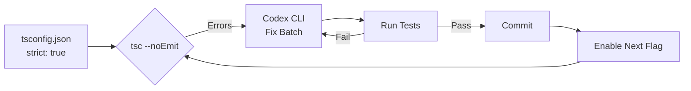
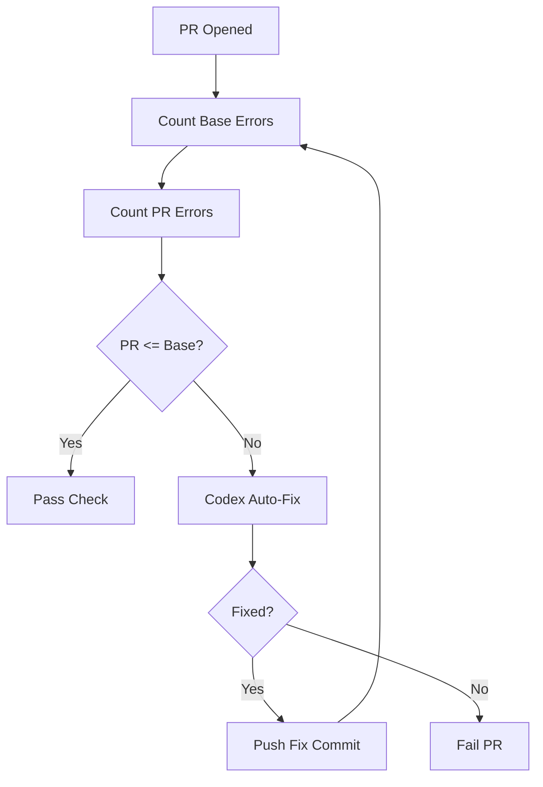

# Codex CLI for TypeScript 6.0 Strict Mode Migration: Incremental Type Safety, Zod Schema Generation, and CI Enforcement


---

TypeScript 6.0 shipped on 23 March 2026 with `strict: true` enabled by default[^1]. For teams upgrading from 5.x — where strict mode was opt-in — this change surfaces hundreds or thousands of latent type errors overnight. This article demonstrates how to use Codex CLI to automate incremental strict mode adoption, generate Zod runtime validation schemas from existing types, and enforce type-safety ratchets in CI.

## The Problem: TypeScript 6.0's Nine Default Changes

TypeScript 6.0 changed nine compiler defaults simultaneously[^2]: `strict` is now `true`, `module` is `esnext`, `target` is `es2025`, `moduleResolution` is `bundler`, `esModuleInterop` is `true`, `types` defaults to an empty array, `rootDir` defaults to the tsconfig directory, `noUncheckedSideEffectImports` is `true`, and `libReplacement` is `false`.

The `strict` umbrella alone enables `strictNullChecks`, `strictFunctionTypes`, `strictBindCallApply`, `strictPropertyInitialization`, `noImplicitAny`, `noImplicitThis`, `alwaysStrict`, and `useUnknownInCatchVariables`[^3]. On a 200-file codebase that never had `strict: true`, you can expect 300–800 new diagnostics.

## Phase 1: AGENTS.md Strict Migration Standards

Encode your migration strategy in AGENTS.md so every Codex session enforces consistent patterns:

```markdown
# TypeScript Strict Migration Standards

## Rules
- Never add `@ts-ignore` or `@ts-expect-error` to suppress strict errors
- Fix `noImplicitAny` by adding explicit types, never `any`
- Fix `strictNullChecks` with narrowing guards, not non-null assertions (!)
- Use `unknown` for catch clause variables, then narrow with type guards
- When adding Zod schemas, co-locate them with the type in a `.schema.ts` file
- All API boundary types must have a corresponding Zod schema

## Migration Order
1. noImplicitAny (highest value, most mechanical)
2. strictNullChecks (highest bug-prevention value)
3. strictPropertyInitialization
4. strictFunctionTypes
5. Remaining flags
```

The AGENTS.md hierarchy allows subdirectory overrides[^4], so legacy modules can maintain relaxed rules while new code enforces full strictness.

## Phase 2: Structured Error Audit with `codex exec`

Before fixing anything, audit the damage. Use `codex exec` with `--output-schema` to produce a structured migration report:

```json
{
  "$schema": "https://json-schema.org/draft/2020-12/schema",
  "type": "object",
  "properties": {
    "total_errors": { "type": "integer" },
    "by_flag": {
      "type": "object",
      "additionalProperties": { "type": "integer" }
    },
    "by_directory": {
      "type": "object",
      "additionalProperties": { "type": "integer" }
    },
    "estimated_effort_hours": { "type": "number" },
    "recommended_order": {
      "type": "array",
      "items": { "type": "string" }
    }
  },
  "required": ["total_errors", "by_flag", "by_directory"]
}
```

```bash
codex exec \
  --output-schema strict-audit.schema.json \
  "Run tsc --strict --noEmit on this project. Categorise every error by \
   which strict flag triggers it and which directory it appears in. \
   Estimate remediation effort assuming 3 minutes per noImplicitAny fix \
   and 5 minutes per strictNullChecks fix."
```

This produces machine-readable JSON that feeds directly into sprint planning or ticket creation[^5].

## Phase 3: Incremental Fix Batches

Rather than fixing everything at once, enable one flag at a time in `tsconfig.json` and let Codex fix the errors in bounded batches:

```bash
# Enable noImplicitAny only
codex exec "Enable noImplicitAny in tsconfig.json. Fix all resulting \
  type errors in src/services/ by adding explicit types. Never use 'any'. \
  Run tsc --noEmit after each file to confirm zero errors."
```

For larger codebases, combine with the `@ts-migrating` plugin[^6] which allows problematic lines to fall back to old compiler options while the rest of the code enforces strict:

```bash
codex exec "Install @ts-migrating. Configure it so strictNullChecks \
  is enforced project-wide, but files in src/legacy/ fall back to the \
  old config. Generate the ts-migrating.config.json accordingly."
```



## Phase 4: Zod Schema Generation for Runtime Validation

Static types vanish at runtime. For API boundaries, generate Zod 4.x schemas[^7] that provide runtime validation matching your TypeScript types:

```bash
codex exec "For every interface in src/api/types.ts, generate a \
  corresponding Zod schema in src/api/types.schema.ts. Use z.object() \
  with z.infer<> to ensure the Zod schema and TypeScript type stay \
  in sync. Use Zod 4 syntax including z.toJSONSchema() exports."
```

The generated output follows this pattern:

```typescript
import { z } from 'zod/v4';

export const UserSchema = z.object({
  id: z.string().uuid(),
  email: z.string().email(),
  name: z.string().min(1),
  role: z.enum(['admin', 'member', 'viewer']),
  createdAt: z.iso.datetime(),
});

export type User = z.infer<typeof UserSchema>;

// Export JSON Schema for OpenAPI integration
export const UserJsonSchema = z.toJSONSchema(UserSchema);
```

### Reusable Zod Generation Skill

Create a `SKILL.md` for repeatable schema generation:

```markdown
# zod-schema-generator

## Trigger
When asked to generate Zod schemas from TypeScript types.

## Steps
1. Read the target `.ts` file containing interfaces/types
2. For each exported interface:
   - Create a corresponding `z.object()` schema
   - Map primitives: string→z.string(), number→z.number(), boolean→z.boolean()
   - Map optional fields with `.optional()`
   - Map union types with `z.union()`
   - Map arrays with `z.array()`
   - Map nested objects recursively
3. Export `type X = z.infer<typeof XSchema>` to replace the original interface
4. Add `z.toJSONSchema()` export for OpenAPI consumers
5. Run `tsc --noEmit` to verify type compatibility
6. Run the project's test suite to catch regressions

## Constraints
- Never duplicate type definitions — the Zod schema IS the source of truth
- Use Zod 4.x API (z.iso.datetime, z.toJSONSchema, z.codec)
- Co-locate schema with usage: `types.schema.ts` next to `types.ts`
```

## Phase 5: PostToolUse Hook for Type Regression Prevention

Configure a hook that runs `tsc --noEmit` after every file edit, preventing Codex from introducing new type errors:

```toml
# .codex/config.toml
[[hooks]]
event = "PostToolUse"
tool = "write_file"
command = "npx tsc --noEmit --pretty 2>&1 | head -20"
on_failure = "block"
```

This ensures the agent cannot commit changes that regress type safety[^8]. For projects using `@ts-migrating`, adjust the command to use the migrating wrapper:

```toml
command = "npx ts-migrating check 2>&1 | head -20"
```

## Phase 6: CI Enforcement Pipeline

Enforce a strict-mode ratchet in GitHub Actions — the error count must never increase:


```yaml
name: TypeScript Strict Ratchet
on: [pull_request]

jobs:
  strict-check:
    runs-on: ubuntu-latest
    steps:
      - uses: actions/checkout@v4
      - uses: actions/setup-node@v4
        with:
          node-version: 22

      - run: npm ci

      - name: Count strict errors on base
        run: |
          git checkout ${{ github.event.pull_request.base.sha }}
          npx tsc --strict --noEmit 2>&1 | grep "error TS" | wc -l > /tmp/base-errors.txt
          git checkout ${{ github.sha }}

      - name: Count strict errors on PR
        run: |
          npx tsc --strict --noEmit 2>&1 | grep "error TS" | wc -l > /tmp/pr-errors.txt

      - name: Enforce ratchet
        run: |
          BASE=$(cat /tmp/base-errors.txt)
          PR=$(cat /tmp/pr-errors.txt)
          echo "Base: $BASE errors, PR: $PR errors"
          if [ "$PR" -gt "$BASE" ]; then
            echo "::error::Strict mode errors increased from $BASE to $PR"
            exit 1
          fi
          echo "Ratchet passed: $PR <= $BASE"

      - name: Codex auto-fix on failure
        if: failure()
        env:
          CODEX_API_KEY: ${{ secrets.CODEX_API_KEY }}
        run: |
          codex exec "Fix the TypeScript strict mode errors introduced \
            in this PR. Follow AGENTS.md conventions. Run tsc --noEmit \
            to verify." && git add -A && git commit -m "fix: resolve strict mode regressions"
```


This pipeline uses Codex access tokens[^9] to attempt automatic remediation when the ratchet fails.



## Model Selection

| Task | Recommended Model | Rationale |
|------|------------------|-----------|
| Error audit & categorisation | o3 | Complex reasoning over error patterns |
| Mechanical `noImplicitAny` fixes | o4-mini | High throughput, lower cost |
| `strictNullChecks` narrowing | o3 | Requires understanding data flow |
| Zod schema generation | o4-mini | Formulaic transformation |
| Batch migration across directories | o4-mini | Volume work, predictable patterns |

## Anti-Patterns

- **Suppressing errors with `@ts-ignore`** — Hides bugs rather than fixing them. The whole point of the migration is surfacing these issues.
- **Adding `any` to satisfy `noImplicitAny`** — Worse than the original implicit any because it suggests intentional opt-out.
- **Enabling all strict flags simultaneously on a large codebase** — Overwhelms reviewers. Enable incrementally and fix per-flag.
- **Generating Zod schemas without removing duplicate type definitions** — Creates drift between the Zod-inferred type and the manually maintained interface.
- **Running Codex without the PostToolUse type-check hook** — The agent may fix one error while introducing another.

## Known Limitations

- **`--output-schema` and `--resume` cannot be combined**[^10] — each audit run must be a fresh `codex exec` invocation.
- **`--output-schema` is silently ignored when MCP servers are active**[^11] — disable MCP for structured audit tasks.
- **Context window constraints** — very large codebases (1000+ files) may require per-directory batching to stay within token limits.
- **Non-deterministic fixes** — the same strict error may be fixed differently across runs; the PostToolUse hook ensures correctness but not consistency.

## Citations

[^1]: [Announcing TypeScript 6.0 — TypeScript Blog](https://devblogs.microsoft.com/typescript/announcing-typescript-6-0/)
[^2]: [TypeScript 6.0 vs 5.x: Complete Migration Guide — DevBolt](https://www.devbolt.dev/blog/typescript-6-migration-guide)
[^3]: [TypeScript Strict Mode: The Complete 2026 Guide — Coding Dunia](https://codingdunia.com/blog/typescript-strict-mode-guide/)
[^4]: [Custom instructions with AGENTS.md — OpenAI Developers](https://developers.openai.com/codex/guides/agents-md)
[^5]: [Non-interactive mode — OpenAI Developers](https://developers.openai.com/codex/noninteractive)
[^6]: [Introducing @ts-migrating: The Best Way To Upgrade Your TSConfig — DEV Community](https://dev.to/ycmjason/introducing-ts-migrating-the-best-way-to-upgrade-your-tsconfig-2jmn)
[^7]: [Zod 4.x Documentation](https://v3.zod.dev/)
[^8]: [Features — Codex CLI — OpenAI Developers](https://developers.openai.com/codex/cli/features)
[^9]: [Codex Access Tokens — OpenAI Developers](https://developers.openai.com/codex/changelog)
[^10]: [Add --output-schema support to codex exec resume — GitHub Issue #14343](https://github.com/openai/codex/issues/14343)
[^11]: [--json and --output-schema are silently ignored when tools/MCP servers are active — GitHub Issue #15451](https://github.com/openai/codex/issues/15451)
