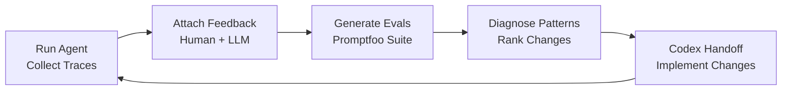
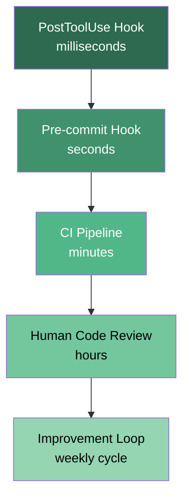

# Codex CLI Agent Improvement Loops: Closing the Harness Engineering Flywheel with Traces, Evals, and Automated Handoffs


Most teams treat their agent configuration — AGENTS.md, skills, hooks, tool policies — as a write-once artefact. They tune it until the agent stops producing obviously wrong output, then move on. The result is the same slow drift that plagues any undocumented system: the harness grows stale, edge cases accumulate, and nobody can explain why the agent hallucinates citations on Tuesdays.

OpenAI's May 2026 cookbook entry, *Build an Agent Improvement Loop with Traces, Evals, and Codex*, formalises a different approach: a closed-loop flywheel where execution traces feed human and model feedback, feedback generates reusable evaluations, evaluation results drive ranked harness changes, and Codex implements those changes — all inside a single repeatable workflow [^1]. This article unpacks that pattern for Codex CLI users, shows how to wire it into your existing observability stack, and highlights the pitfalls that break the loop.

## Why the Harness Matters More Than the Model

Harness engineering — the discipline of building constraints, tools, documentation, and feedback loops around an AI agent — is now widely recognised as the highest-leverage investment in agent quality [^2]. OpenAI's own research demonstrates that the same model scores up to 16 points higher on SWE-bench when the surrounding harness is improved, without changing a single model weight [^2]. Martin Fowler's treatment of the topic reinforces the point: "enforce quality with mechanisms, not prompts" [^3].

The harness for a Codex CLI session includes:

- **AGENTS.md** — repository-level instructions, conventions, and prohibited patterns [^4]
- **Skills** — reusable SKILL.md files encoding domain-specific workflows [^5]
- **Hooks** — PreToolUse and PostToolUse gates that validate or reject tool calls [^6]
- **Permission profiles** — sandbox, filesystem, and network policies [^7]
- **Tool surface** — MCP servers, validation scripts, and structured output schemas [^8]

When any of these components drifts out of alignment with the codebase or team expectations, agent output degrades. The improvement loop catches that drift systematically.

## The Flywheel Architecture

The cookbook pattern chains five stages into a repeatable cycle [^1]:



Each stage produces a durable artefact — JSONL traces, structured feedback records, a Promptfoo YAML suite, a ranked diagnosis report, and a `codex_handoff.md` document — so any stage can be inspected, replayed, or overridden independently.

### Stage 1: Trace Collection

The OpenAI Agents SDK exposes a processor interface that intercepts every span the agent emits — generation calls, tool invocations, handoffs, and guardrail checks [^9]. For the improvement loop, traces are exported to JSONL using a custom processor registered via `set_trace_processors()`:

```python
from agents import set_trace_processors
from halo_tracing import HaloJsonlTraceProcessor

processor = HaloJsonlTraceProcessor(
    path="./traces/run.jsonl",
    project_id="my-codex-project",
    service_name="code-review-agent",
)
set_trace_processors([processor])
```

Each span record captures model name, token counts, tool inputs and outputs, latency, parent-child relationships, and error status [^9]. For Codex CLI specifically, the same data is available via its native OpenTelemetry export when `otel_endpoint` is configured in `config.toml` [^10]:

```toml
[otel]
endpoint = "http://localhost:4318"
protocol = "http/protobuf"

[otel.resource_attributes]
project = "my-codex-project"
environment = "development"
```

The traces from either path feed identically into the feedback stage.

### Stage 2: Feedback Attachment

Raw traces show *what happened*; feedback explains *what mattered* [^1]. The cookbook supports two complementary feedback sources:

**Human feedback** — reviewers annotate specific trace runs with structured observations:

```json
{
  "trace_id": "abc-123",
  "category": "citation_error",
  "severity": "high",
  "observation": "Agent cited security-audit.md but the claim is not supported by that file",
  "evidence": "Section 3 of security-audit.md discusses network policy, not data encryption"
}
```

**LLM-generated feedback** — an analysis model critiques the agent's output against the traces, checking citation accuracy, artefact completeness, evidence grounding, and conflict handling [^1]. This runs as a separate `codex exec` pass:

```bash
codex exec \
  "Review the agent traces in ./traces/run.jsonl against the outputs in ./output/.
   For each output, check: (1) do cited files support the claims?
   (2) are required artefacts present? (3) are conflicts between sources surfaced?" \
  --model gpt-5.5 \
  --output-schema ./schemas/feedback.json \
  -o ./feedback/llm-feedback.json
```

Both feedback streams are stored as structured JSON, keyed by trace ID, making them machine-consumable downstream.

### Stage 3: Eval Generation

Feedback becomes reusable when it is encoded as test cases. The cookbook converts each feedback item into a Promptfoo assertion [^1] [^11]:

```yaml
# promptfooconfig.yaml
description: "Agent harness regression suite"
providers:
  - id: openai-codex-sdk
    config:
      model: gpt-5.5
      codexBin: codex

tests:
  - vars:
      question: "Summarise the data encryption posture from the security audit"
    assert:
      - type: llm-rubric
        value: "Response must cite specific sections from security-audit.md, not just the filename"
      - type: llm-rubric
        value: "If sources disagree, the response must surface the conflict explicitly"
      - type: contains
        value: "security-audit.md"

  - vars:
      question: "Generate the quarterly compliance report"
    assert:
      - type: javascript
        value: "output.includes('## Risk Summary') && output.includes('## Recommendations')"
      - type: llm-rubric
        value: "All factual claims must reference a source document"
```

Running the suite validates the current harness against accumulated expectations:

```bash
npx promptfoo@latest eval \
  -c promptfooconfig.yaml \
  --no-cache
```

Each cycle's feedback adds new test cases, creating a ratchet — the eval suite grows monotonically, preventing regressions [^11].

### Stage 4: Pattern Diagnosis

With traces, feedback, and eval results in hand, the diagnosis stage identifies systemic failure patterns rather than individual errors. The cookbook uses a HALO analysis engine [^1], but the same logic works as a structured `codex exec` pass:

```bash
codex exec \
  "Analyse the traces in ./traces/, feedback in ./feedback/, and eval results in ./eval-results/.
   Identify the top 5 harness changes that would fix the most failures.
   For each recommendation: describe the change, cite supporting traces and feedback,
   estimate impact (how many failures it would fix), and rate implementation effort." \
  --model gpt-5.5 \
  --output-schema ./schemas/diagnosis.json \
  -o ./diagnosis/recommendations.json
```

The output is a ranked list of harness modifications — each with evidence, estimated impact, and implementation guidance.

### Stage 5: Codex Handoff and Implementation

The final stage produces a `codex_handoff.md` document that Codex can act on directly [^1]:

```markdown
# Harness Improvement Handoff

## Recommendation 1: Enforce explicit conflict surfacing (Impact: 4/5 failures)
**Evidence:** Traces abc-123, def-456 show the agent silently reconciling contradictory sources.
**Change:** Add to AGENTS.md: "When sources disagree, always present both positions with citations before stating a conclusion."

## Recommendation 2: Add citation validation hook (Impact: 3/5 failures)
**Evidence:** Feedback items citing unsupported claims in 60% of runs.
**Change:** Create a PostToolUse hook that runs check_evidence_coverage.py after every file write.

## Recommendation 3: Require structured output for compliance reports (Impact: 2/5 failures)
**Evidence:** Eval failures on missing ## Risk Summary sections.
**Change:** Add --output-schema to the compliance report skill with required sections.
```

Codex then implements each change — editing AGENTS.md, creating hook scripts, updating config.toml — and the cycle restarts with fresh traces from the improved harness.

## Wiring This Into Codex CLI Daily Workflows

The cookbook uses the Agents SDK directly, but the pattern maps cleanly onto a Codex CLI skill:

```markdown
<!-- .codex/skills/harness-improvement.md -->
# Harness Improvement Loop

## Steps
1. Collect the last 5 session traces from ./traces/
2. Run LLM feedback analysis against each trace's outputs
3. Generate or update promptfooconfig.yaml with new test cases
4. Run the eval suite and capture results
5. Diagnose patterns across failures
6. Produce codex_handoff.md with ranked recommendations
7. Implement the top recommendation (one per cycle)
8. Commit changes with message "harness: <description of change>"

## Constraints
- Never modify application code — only harness artefacts (AGENTS.md, skills, hooks, config.toml)
- Each cycle implements exactly ONE recommendation to isolate the effect
- Always run the eval suite AFTER implementing changes to verify improvement
```

Triggering this as a weekly CI job creates a sustained improvement cadence without manual intervention.

## Feedback Loop Speed Hierarchy

Not all feedback mechanisms operate at the same timescale. The improvement loop sits at the outer ring of a layered quality system [^3]:



The goal is to push checks down the hierarchy — if the improvement loop identifies a recurring citation error, the fix should be a PostToolUse hook (milliseconds) rather than relying on human review (hours) [^3]. Each cycle should produce at least one check that operates at a faster layer than the feedback that motivated it.

## Anti-Patterns That Break the Loop

**Implementing all recommendations at once.** When multiple harness changes land simultaneously, you cannot attribute improvement or regression to any single change. The cookbook emphasises one recommendation per cycle [^1].

**Skipping the eval suite after changes.** Without re-running evals, you have no evidence that the change helped. Worse, you may have introduced a regression that compounds in the next cycle.

**Treating LLM feedback as ground truth.** LLM-generated feedback is a heuristic, not an oracle. Always weight human feedback higher and validate LLM observations against traces before encoding them as eval assertions [^1].

**Never pruning the eval suite.** As the suite grows, irrelevant or outdated assertions slow the cycle and produce false failures. Review the suite quarterly and remove tests that no longer reflect current requirements.

**Using the same model for execution and critique.** The analysis model should ideally differ from the execution model to avoid blind spots. If the agent uses `gpt-5.5` for coding tasks, consider using `gpt-5.4` or a different provider for the feedback analysis pass. ⚠️ This recommendation is based on general evaluation practice; the cookbook uses the same model family for both.

## Known Limitations

- **`--output-schema` and `--resume` are mutually exclusive** — structured output passes cannot be resumed if interrupted [^12].
- **Context window constraints** — large trace corpora may exceed the context window even with GPT-5.5's 1M token capacity; batch traces into manageable chunks [^13].
- **Non-deterministic feedback** — LLM-generated feedback varies between runs; anchor critical assertions with deterministic checks (regex, JSON schema validation) alongside LLM-rubric assertions [^11].
- **Sandbox network isolation** — if the eval suite or feedback analysis requires network access (e.g., fetching documentation), ensure the Codex CLI sandbox profile permits it [^7].

## Conclusion

The agent improvement loop transforms harness engineering from an ad-hoc craft into a data-driven discipline. By connecting traces to feedback, feedback to evals, and evals to implementation, you create a flywheel where every agent session contributes evidence toward the next harness improvement. The pattern works with any Codex CLI project — whether you are building a code review agent, a compliance auditor, or a migration pipeline. Start by exporting traces, attach feedback to your worst session, generate one eval, and let Codex close the loop.

## Citations

[^1]: OpenAI. "Build an Agent Improvement Loop with Traces, Evals, and Codex." *OpenAI Cookbook*, 12 May 2026. [https://developers.openai.com/cookbook/examples/agents_sdk/agent_improvement_loop](https://developers.openai.com/cookbook/examples/agents_sdk/agent_improvement_loop)

[^2]: OpenAI. "Harness engineering: leveraging Codex in an agent-first world." *OpenAI Blog*, February 2026. [https://openai.com/index/harness-engineering/](https://openai.com/index/harness-engineering/)

[^3]: Fowler, Martin. "Harness engineering for coding agent users." *martinfowler.com*, 2026. [https://martinfowler.com/articles/harness-engineering.html](https://martinfowler.com/articles/harness-engineering.html)

[^4]: OpenAI. "Custom instructions with AGENTS.md." *Codex Developer Documentation*, 2026. [https://developers.openai.com/codex/guides/agents-md](https://developers.openai.com/codex/guides/agents-md)

[^5]: OpenAI. "Agent Skills." *Codex Developer Documentation*, 2026. [https://developers.openai.com/codex/skills](https://developers.openai.com/codex/skills)

[^6]: OpenAI. "Hooks." *Codex Developer Documentation*, 2026. [https://developers.openai.com/codex/cli/features](https://developers.openai.com/codex/cli/features)

[^7]: OpenAI. "Agent approvals & security." *Codex Developer Documentation*, 2026. [https://developers.openai.com/codex/agent-approvals-security](https://developers.openai.com/codex/agent-approvals-security)

[^8]: OpenAI. "Non-interactive mode." *Codex Developer Documentation*, 2026. [https://developers.openai.com/codex/noninteractive](https://developers.openai.com/codex/noninteractive)

[^9]: OpenAI. "Tracing." *OpenAI Agents SDK Documentation*, 2026. [https://openai.github.io/openai-agents-python/tracing/](https://openai.github.io/openai-agents-python/tracing/)

[^10]: OpenAI. "Advanced Configuration." *Codex Developer Documentation*, 2026. [https://developers.openai.com/codex/config-advanced](https://developers.openai.com/codex/config-advanced)

[^11]: Promptfoo. "Evaluate Coding Agents." *Promptfoo Documentation*, 2026. [https://www.promptfoo.dev/docs/guides/evaluate-coding-agents/](https://www.promptfoo.dev/docs/guides/evaluate-coding-agents/)

[^12]: OpenAI. "Command line options." *Codex CLI Reference*, 2026. [https://developers.openai.com/codex/cli/reference](https://developers.openai.com/codex/cli/reference)

[^13]: OpenAI. "Models." *Codex Developer Documentation*, 2026. [https://developers.openai.com/codex/models](https://developers.openai.com/codex/models)
