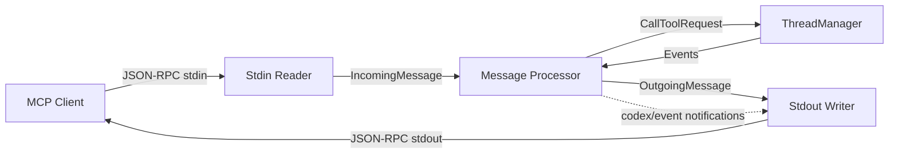
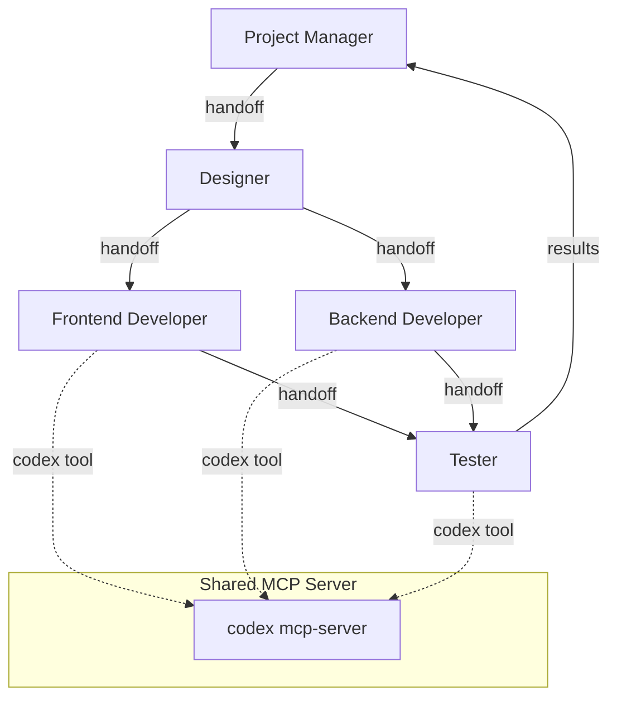

# Codex CLI as an MCP Server: Exposing Agent Capabilities to the Agents SDK and Other MCP Clients


---

Most developers know Codex CLI as an MCP *client* — it connects to external MCP servers like Linear, Supabase, or Apollo to pull tools into its agent loop. Fewer realise that Codex CLI can flip the relationship entirely and run as an MCP *server* itself, exposing its full coding agent capabilities — file editing, command execution, sandboxed environments — as callable tools for other agents and orchestration frameworks[^1].

This inversion unlocks a powerful pattern: treating Codex as a composable building block inside larger multi-agent systems rather than as a standalone terminal tool. The OpenAI Agents SDK, Claude Code, Cursor, and any MCP-compliant client can delegate coding tasks to Codex without shelling out to the CLI or parsing its output[^2][^3].

This article covers the `codex mcp-server` architecture, practical integration patterns with the Agents SDK, multi-agent orchestration workflows, and the operational considerations that matter when Codex becomes a tool rather than the top-level agent.

## The `codex mcp-server` Subcommand

Running `codex mcp-server` starts Codex as a stdio-based JSON-RPC server that speaks the Model Context Protocol (MCP spec version `2025-03-26`)[^4]. The server exposes two tools:

| Tool | Purpose | Key Parameters |
|------|---------|---------------|
| `codex` | Start a new coding session | `prompt` (required), `model`, `approval-policy`, `sandbox`, `cwd`, `base-instructions`, `config`, `profile` |
| `codex-reply` | Continue an existing session | `prompt` (required), `threadId` (required) |

The `codex` tool returns a `threadId` alongside its response content. Subsequent turns pass that `threadId` to `codex-reply`, maintaining full conversation context across multiple invocations[^1].

### Sandbox and Approval Policies

When Codex runs as a server, the calling agent controls the sandbox and approval posture via tool parameters:

- **`sandbox`**: `read-only`, `workspace-write`, or `danger-full-access`
- **`approval-policy`**: `untrusted` (every action requires approval), `on-request` (only flagged actions), or `never` (fully autonomous)[^1]

For automated pipelines, `"approval-policy": "never"` with `"sandbox": "workspace-write"` is the standard configuration — the calling agent trusts Codex to modify files within the project but not to execute arbitrary system commands[^5].

## Architecture: Three Async Tasks

The `codex-mcp-server` crate (written in Rust, like the rest of Codex CLI) runs three concurrent async tasks[^4]:



1. **Stdin Reader** — deserialises line-delimited JSON from stdin into `IncomingMessage` objects and forwards them to the processor channel.
2. **Message Processor** — routes requests to handlers. `CallToolRequest` messages spawn an async task via `run_codex_tool_session()`, which creates a full Codex session through the `ThreadManager` configured with `SessionSource::Mcp`.
3. **Stdout Writer** — serialises `OutgoingMessage` objects (responses and `codex/event` notifications) back to the client[^4].

Session multiplexing is supported: multiple threads share a single MCP connection via `threadId` metadata in notification `_meta` fields, enabling concurrent multi-agent workflows over one server process[^4].

## Integration with the OpenAI Agents SDK

The canonical integration uses `MCPServerStdio` from the Python Agents SDK to launch Codex as a child process[^1][^5]:

```python
from agents import Agent, Runner
from agents.mcp import MCPServerStdio

async with MCPServerStdio(
    name="Codex CLI",
    params={
        "command": "npx",
        "args": ["-y", "@openai/codex", "mcp-server"],
    },
    client_session_timeout_seconds=360000,
) as codex_mcp_server:

    developer = Agent(
        name="Developer",
        instructions="""You are a senior developer. Use the codex tool
        with approval-policy 'never' and sandbox 'workspace-write'
        to implement code changes. Always verify files exist before
        reporting completion.""",
        model="gpt-5.5",
        mcp_servers=[codex_mcp_server],
    )

    result = await Runner.run(
        developer,
        "Refactor the authentication module to use JWT refresh tokens",
    )
```

The `client_session_timeout_seconds` is set to 360,000 (100 hours) because coding tasks can run for minutes rather than seconds — the default MCP timeout is far too short[^5].

### Prerequisites

- Node.js 18+ (for `npx` to launch Codex)
- Python 3.10+ (for the Agents SDK)
- `OPENAI_API_KEY` in the environment
- Packages: `openai-agents`, `python-dotenv`[^1]

## Multi-Agent Orchestration Patterns

The real power emerges when multiple specialised agents share the same Codex MCP server. The OpenAI Cookbook demonstrates a five-role orchestration pattern[^5]:



Each agent has a focused role:

1. **Project Manager** — decomposes requirements into `REQUIREMENTS.md`, `AGENT_TASKS.md`, and `TEST.md`. Does not use the Codex tool directly.
2. **Designer** — produces UI/UX specifications and design documents.
3. **Frontend/Backend Developers** — invoke the `codex` tool with `workspace-write` sandbox to generate and modify code.
4. **Tester** — validates deliverables against acceptance criteria using `codex` in `read-only` sandbox mode[^5].

### Gated Handoffs

The critical pattern is gating handoffs on artifact existence. Each agent verifies that required files from the previous stage exist before proceeding:

```python
tester = Agent(
    name="Tester",
    instructions="""Before running tests, verify these files exist:
    - src/components/App.tsx
    - src/api/routes.ts
    - TEST.md
    If any are missing, request the appropriate developer to complete
    their work before proceeding.""",
    model="gpt-5.5",
    mcp_servers=[codex_mcp_server],
)
```

Without gated handoffs, agents advance prematurely and produce work against incomplete dependencies[^5].

## Cross-Agent Delegation: Codex for Claude Code

Community wrappers like `codex-as-mcp` and the `agentic-developer-mcp` server enable Claude Code, Cursor, and other MCP clients to delegate coding sub-tasks to Codex[^2][^3]. The pattern is straightforward: the outer agent analyses the problem, identifies a discrete coding task, and delegates it to Codex via the MCP tool:

```toml
# ~/.claude/config.toml (or equivalent MCP client config)
[mcp_servers.codex]
command = "npx"
args = ["-y", "@openai/codex", "mcp-server"]
```

This creates an asymmetric collaboration where the orchestrating agent handles reasoning and planning whilst Codex handles the sandboxed file manipulation[^3].

## Debugging with the MCP Inspector

The MCP Inspector provides a visual debugging interface for the server's tool calls and responses[^1]:

```bash
npx @modelcontextprotocol/inspector codex mcp-server
```

This launches a web UI where you can:

- Send `codex` and `codex-reply` tool calls manually
- Inspect the JSON-RPC messages flowing over stdio
- Monitor `codex/event` notifications in real time
- Verify `threadId` handling across multi-turn conversations

## Model Selection for MCP-Served Codex

When Codex runs as an MCP server, the calling agent can override the model per invocation via the `model` parameter on the `codex` tool. Current model options[^6]:

| Model | Best For | Notes |
|-------|----------|-------|
| `gpt-5.5` | Complex multi-file refactors, architecture changes | Highest capability, highest cost |
| `gpt-5.4` | Standard development tasks | Good cost-performance balance |
| `gpt-5.3-codex` | Long-running agentic tasks | 25% faster than predecessor[^7] |
| `gpt-5.3-codex-spark` | Rapid edits, targeted fixes | 1000+ tokens/s on Cerebras hardware, 128k context[^8] |

For orchestrated workflows, a common pattern routes complex tasks to `gpt-5.5` and simpler validation or formatting tasks to `gpt-5.3-codex-spark` for speed[^6].

## Subagents vs. MCP Server: When to Use Which

Codex CLI already has a built-in subagent system that spawns parallel worker threads. When should you use the MCP server pattern instead?

| Criterion | Built-in Subagents | MCP Server |
|-----------|-------------------|------------|
| **Orchestrator** | Codex is the top-level agent | External agent (Agents SDK, Claude, Cursor) orchestrates |
| **Language** | N/A (Codex manages internally) | Python, TypeScript, or any MCP client |
| **Concurrency control** | `max_threads` in config (default 6)[^9] | Managed by the calling framework |
| **Sandbox inheritance** | Children inherit parent sandbox | Each call specifies its own sandbox |
| **Session state** | Shared within the Codex session | Isolated per `threadId` |
| **Use case** | Parallel subtasks within one coding session | Multi-agent pipelines, CI/CD integration, cross-tool orchestration |

Use built-in subagents when Codex is already the right top-level agent and you want parallel execution. Use the MCP server when Codex needs to be *one component* in a larger system[^9].

## Operational Considerations

### Timeout Configuration

The default MCP tool timeout of 60 seconds is insufficient for most coding tasks. Set `client_session_timeout_seconds` to at least 300,000 (83 hours) in the Agents SDK, or configure `tool_timeout_sec` in `config.toml` when consuming Codex from other MCP clients[^1].

### Token Consumption

Each MCP-invoked Codex session consumes tokens independently. In a five-agent orchestration where three agents call Codex, expect 3× the token usage compared to a single Codex session. Monitor costs using the traces dashboard, which captures all MCP server invocations with execution times[^5].

### Approval Elicitation

When `approval-policy` is set to `untrusted` or `on-request`, the MCP server uses the MCP elicitation protocol to surface approval requests to the calling client. The client must implement the elicitation handler; otherwise, the session blocks indefinitely. For automated workflows, always use `"approval-policy": "never"`[^4].

### Thread Lifecycle

Threads created via the `codex` tool persist until the MCP server process terminates. Long-running orchestrations that create many threads will accumulate memory. Consider scoping each major task to a fresh `codex` invocation rather than extending threads indefinitely with `codex-reply`[^4].

## Anti-Patterns

- **Wrapping Codex in a shell script instead of MCP** — Parsing CLI output is fragile. The MCP server provides structured JSON responses and event notifications. Use it.
- **Sharing sandbox: danger-full-access across all agents** — Grant the minimum sandbox level each agent needs. Testers should run in `read-only`; only developers need `workspace-write`.
- **Skipping gated handoffs** — Without artifact validation between agent stages, downstream agents produce work against missing dependencies.
- **Using `codex-reply` across unrelated tasks** — Each `threadId` accumulates context. Starting a new `codex` session for each distinct task keeps context clean and avoids confusion.
- **Ignoring the traces dashboard** — Multi-agent orchestrations are opaque without observability. Always review traces to identify bottlenecks and failed handoffs[^5].

## Known Limitations

- **No streaming to the MCP client** — The server emits `codex/event` notifications during execution, but the final tool response arrives only when the session completes. Long tasks appear to hang from the client's perspective[^4].
- **Single-process concurrency** — All threads share one `codex mcp-server` process. CPU-bound operations (like sandbox setup) serialise across threads.
- **No resume after crash** — If the MCP server process dies, all in-flight `threadId` sessions are lost. The calling agent must handle retries.
- **`output-schema` not supported** — The `codex` MCP tool does not support the `--output-schema` flag available in `codex exec`. Structured output must be parsed from the text response.

## Conclusion

Running `codex mcp-server` transforms Codex CLI from an interactive terminal tool into a composable coding agent that any MCP-compliant system can invoke. The two-tool surface — `codex` for session creation, `codex-reply` for continuation — is deliberately minimal, keeping integration straightforward whilst exposing the full power of Codex's sandboxed execution environment.

For teams building multi-agent systems with the OpenAI Agents SDK, Codex-as-MCP-server is the cleanest path to delegating coding tasks without reimplementing file editing, command execution, or sandbox isolation. For teams using Claude Code or Cursor, community wrappers provide the same capability with minimal configuration.

The pattern is simple: let the orchestrator orchestrate; let Codex code.

## Citations

[^1]: [Use Codex with the Agents SDK — OpenAI Developers](https://developers.openai.com/codex/guides/agents-sdk)
[^2]: [codex-as-mcp — GitHub (kky42)](https://github.com/kky42/codex-as-mcp)
[^3]: [Codex MCP Wrapper — Awesome MCP Servers](https://mcpservers.org/servers/teabranch/agentic-developer-mcp)
[^4]: [MCP Server Implementation (codex-mcp-server) — DeepWiki](https://deepwiki.com/openai/codex/6.4-mcp-server-implementation-(codex-mcp-server))
[^5]: [Building Consistent Workflows with Codex CLI & Agents SDK — OpenAI Cookbook](https://developers.openai.com/cookbook/examples/codex/codex_mcp_agents_sdk/building_consistent_workflows_codex_cli_agents_sdk)
[^6]: [Models — Codex | OpenAI Developers](https://developers.openai.com/codex/models)
[^7]: [Introducing GPT-5.3-Codex — OpenAI](https://openai.com/index/introducing-gpt-5-3-codex/)
[^8]: [Introducing GPT-5.3-Codex-Spark — OpenAI](https://openai.com/index/introducing-gpt-5-3-codex-spark/)
[^9]: [Subagents — Codex | OpenAI Developers](https://developers.openai.com/codex/subagents)
