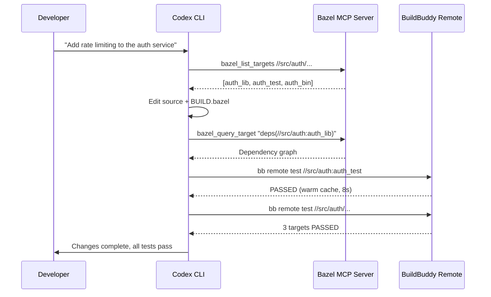

# Codex CLI for Bazel Monorepo Workflows: MCP Server Integration, Remote Builds, and AGENTS.md Conventions


---

Bazel monorepos present a unique challenge for AI coding agents. The build graph is explicit and hermetic, the dependency model is declarative, and a single misplaced `BUILD.bazel` entry can cascade into hundreds of broken targets. These properties make Bazel repositories simultaneously the hardest environment for agents to operate in and the one where they can deliver the most value — because the build system itself acts as a deterministic verification layer that catches agent mistakes before they reach production.

This article covers how to configure Codex CLI for effective Bazel monorepo work, integrating the Bazel MCP Server for build-graph-aware tool calls, offloading validation to BuildBuddy Remote Bazel for fast feedback loops, and encoding Bazel conventions into AGENTS.md so the agent respects the build graph from the first turn.

## Why Bazel Demands Special Agent Configuration

Standard Codex CLI sandbox defaults assume a workspace where running `npm test` or `cargo build` is sufficient to validate changes. Bazel breaks these assumptions in several ways:

1. **External cache directories** — Bazel writes to `~/.cache/bazel` (or a custom `--output_base`), which sits outside the workspace sandbox boundary [^1]
2. **Network dependencies** — Bzlmod fetches modules from the Bazel Central Registry and other registries during `bazel fetch` [^2]
3. **Runfiles resolution** — binaries and test fixtures resolve via runfiles trees, not filesystem paths relative to source [^3]
4. **WORKSPACE removal in Bazel 9** — the legacy WORKSPACE system was completely removed in Bazel 9.0 (January 2026), meaning agents must understand Bzlmod exclusively [^4]

Without addressing these, Codex will either fail to build or request `danger-full-access`, defeating the sandbox's purpose.

## Sandbox Configuration for Bazel

The minimum viable `config.toml` for Bazel monorepos extends the sandbox with writable roots for Bazel's output directories and selective network access for dependency fetching:

```toml
[sandbox_workspace_write]
writable_roots = [
  "~/.cache/bazel",
  "~/.cache/bazelisk",
  "/tmp/bazel-*",
]
network_access = true
```

For tighter control, use a named permission profile that restricts network access to known registries:

```toml
[permissions.bazel]
[permissions.bazel.filesystem]
"~/.cache/bazel" = "write"
"~/.cache/bazelisk" = "write"

[permissions.bazel.network]
enabled = true
mode = "limited"

[permissions.bazel.network.domains]
"bcr.bazel.build" = "allow"
"mirror.bazel.build" = "allow"
"github.com" = "allow"
"objects.githubusercontent.com" = "allow"
```

Activate it with `codex --profile bazel` or set `default_permissions = "bazel"` in your project-scoped `.codex/config.toml` [^5].

## Bazel MCP Server: Build-Graph-Aware Tool Calls

The [Bazel MCP Server](https://github.com/nacgarg/bazel-mcp-server) exposes six tools that give Codex direct access to the build graph without shelling out to `bazel` and parsing stdout [^6]:

| Tool | Purpose |
|------|---------|
| `bazel_build_target` | Compile specified targets |
| `bazel_query_target` | Query the dependency graph |
| `bazel_test_target` | Run tests for specified targets |
| `bazel_list_targets` | Enumerate all targets in a package |
| `bazel_fetch_dependencies` | Fetch external dependencies |
| `bazel_set_workspace_path` | Switch workspace at runtime |

### Configuration

Add the MCP server to your Codex configuration:

```toml
[mcp_servers.bazel]
command = "npx"
args = ["-y", "github:nacgarg/bazel-mcp-server"]

[mcp_servers.bazel.env]
MCP_WORKSPACE_PATH = "."
```

Each tool accepts optional `additionalArgs` for passing flags like `--verbose_failures` or `--test_output=all` [^6].

### Why MCP Beats Shell Commands

When Codex shells out to `bazel query`, it must parse the text output and infer structure. The MCP server returns structured responses that the model can reason about directly. More importantly, the MCP server handles workspace path resolution, `.bazelrc` loading, and error propagation consistently — eliminating an entire class of "it works on my machine" failures.

## Remote Builds with BuildBuddy

For large monorepos, local Bazel builds become the bottleneck. BuildBuddy's Remote Bazel service solves five critical problems for agent workflows [^7]:

1. **Network latency** — runners are co-located with cache and RBE servers, achieving sub-millisecond round-trips
2. **Resource contention** — remote runners provide up to 100 GB of disk and substantial CPU, far exceeding typical agent sandboxes
3. **Workspace locking** — Bazel's output-base lock prevents parallel builds; cloned remote runners eliminate this constraint
4. **Analysis cache thrash** — snapshotted runners maintain warm caches across builds, avoiding the 30–60 second cold-start penalty
5. **Cross-platform testing** — agents can test on Linux and macOS without local hardware

### Integration via SKILL.md

Create a reusable skill at `.codex/skills/remote-bazel/SKILL.md` [^8]:

```markdown
# Remote Bazel Build & Test

## When to use
Use `bb remote` instead of `bazel` for all build and test commands
in this repository. This sends builds to a remote runner with
a warm analysis cache and co-located remote cache.

## Commands
- Build: `bb remote build //path/to:target`
- Test: `bb remote test //path/to:target`
- Test all: `bb remote test //...`
- Cross-platform: `bb remote --os=linux --arch=amd64 test //...`

## Environment
Requires BB_API_KEY in the environment. The CLI mirrors local
git state including uncommitted changes automatically.

## Important
- Always use `bb remote` rather than raw `bazel` commands
- Check build results before moving to the next task
- Use `--test_output=errors` for concise failure output
```

The `bb remote` CLI automatically mirrors uncommitted local changes to the remote runner, meaning Codex can edit a file and immediately validate without committing [^7].

## AGENTS.md Conventions for Bazel Repositories

The OpenAI Codex repository itself uses Bazel and documents critical conventions in its AGENTS.md [^3]. Adopt similar patterns for your own monorepo:

```markdown
# Bazel Conventions

## Build file maintenance
- Every new source file MUST have a corresponding entry in its
  package's BUILD.bazel
- Never create source files without updating BUILD.bazel in the
  same change
- Use `bazel_query_target` via MCP to verify dependency edges
  before adding new deps

## Runfiles resolution
- Never use hardcoded filesystem paths for test fixtures
- Use the language-appropriate runfiles library
  (e.g., `@rules_python//python/runfiles` for Python,
  `codex_utils_cargo_bin::find_resource!` for Rust)
- Paths that work under `cargo test` may break under `bazel test`

## Bzlmod (Bazel 9+)
- All external dependencies use MODULE.bazel, not WORKSPACE
- WORKSPACE files do not exist in this repository
- Use `bazel mod show_repo --all_repos` to inspect available
  external repos
- When adding dependencies, update MODULE.bazel and run
  `bazel mod tidy`

## Compile-time file access
- If adding include_str!, include_bytes!, sqlx::migrate!, or
  similar build-time reads, update the crate's BUILD.bazel
  (compile_data, build_script_data, or data attributes)
- Bazel does NOT make source-tree files available to compile-time
  access automatically

## Prohibited patterns
- Do not use glob() with allow_empty = True to paper over
  missing sources
- Do not add deps without verifying visibility with
  `bazel query 'visible(...)'`
- Do not bypass the build graph by running compilers directly
```

## Workflow: Agent-Driven Bazel Development

The following diagram shows the edit-build-test loop when Codex operates in a Bazel monorepo with MCP and Remote Bazel configured:



The key insight is that the agent validates incrementally — first querying the build graph to understand the dependency surface, then running targeted tests, then broadening to the full package. This mirrors how experienced Bazel developers work and avoids the naive `bazel test //...` that can take minutes even on remote runners.

## Structured Audits with codex exec

Use `codex exec` with `--output-schema` to audit BUILD.bazel files across the monorepo [^9]:

```bash
codex exec \
  --profile bazel \
  --sandbox read-only \
  --output-schema '{
    "type": "object",
    "properties": {
      "packages_audited": { "type": "integer" },
      "issues": {
        "type": "array",
        "items": {
          "type": "object",
          "properties": {
            "package": { "type": "string" },
            "severity": { "type": "string", "enum": ["error", "warning"] },
            "description": { "type": "string" },
            "fix": { "type": "string" }
          }
        }
      }
    }
  }' \
  "Audit all BUILD.bazel files under src/ for: missing test targets, \
   overly broad globs, visibility violations, and deps that should be \
   replaced with more specific targets. Use bazel query to verify."
```

This produces machine-parseable JSON suitable for CI gates or dashboard ingestion.

## Model Selection for Bazel Workflows

| Task | Recommended Model | Rationale |
|------|-------------------|-----------|
| BUILD.bazel authoring | `gpt-5.5` | Complex dependency reasoning requires frontier capability [^10] |
| Bzlmod MODULE.bazel edits | `gpt-5.5` | Registry resolution and version constraint logic |
| Source code within targets | `codex-spark` | Fast iteration on implementation; build graph handled separately [^11] |
| Build graph audits | `gpt-5.4` | Good balance of reasoning and cost for structured analysis [^10] |
| Starlark macro authoring | `gpt-5.5` | Starlark's subtle scoping rules require strong reasoning |

## Anti-Patterns

**Running `bazel test //...` on every change.** This rebuilds the entire dependency closure. Use `bazel query "rdeps(//..., set(changed_files))"` to compute the affected targets, then test only those.

**Granting `danger-full-access` because Bazel needs cache writes.** Use `writable_roots` to grant access to `~/.cache/bazel` specifically, preserving sandbox protection for the rest of the filesystem.

**Trusting agent-generated `visibility` attributes.** Codex may default to `visibility = ["//visibility:public"]` to avoid errors. Encode your visibility policy in AGENTS.md and use a PostToolUse hook to reject overly permissive visibility:

```toml
[[hooks]]
type = "PostToolUse"
command = "grep -rn '//visibility:public' --include='BUILD.bazel' . && echo 'BLOCK: public visibility detected' && exit 1 || exit 0"
```

**Ignoring `compile_data` and `data` attributes.** When Codex adds source files that use build-time file inclusion (e.g., `include_str!` in Rust, resource loading in Java), BUILD.bazel must be updated simultaneously. The AGENTS.md convention above makes this explicit [^3].

**Skipping `bazel mod tidy` after MODULE.bazel changes.** ⚠️ Agents frequently add dependencies to MODULE.bazel without running the tidy command, leaving the lockfile inconsistent. Enforce this with a hook or skill instruction.

## Known Limitations

- **Output-schema and resume are mutually exclusive** — `codex exec --output-schema` sessions cannot be resumed if interrupted [^12]
- **Context window pressure** — large monorepos with hundreds of BUILD.bazel files may exceed context limits; scope queries to specific subtrees
- **Bazel MCP Server is community-maintained** — it tracks Bazel releases but may lag behind new Bazel 9 features
- **Remote Bazel requires BuildBuddy account** — the `bb remote` command needs a valid `BB_API_KEY`; self-hosted alternatives exist but require more setup
- **Non-deterministic generation** — agent-generated BUILD.bazel content may vary between runs; always validate with `bazel build` before committing

## Citations

[^1]: [Codex CLI Sandbox Configuration — OpenAI Developers](https://developers.openai.com/codex/concepts/sandboxing)
[^2]: [Bazel 9 LTS Release — Bazel Blog, January 2026](https://blog.bazel.build/2026/01/20/bazel-9.html)
[^3]: [OpenAI Codex AGENTS.md — Bazel Conventions](https://github.com/openai/codex/blob/main/AGENTS.md)
[^4]: [Bazel 9.0.0 Release — GitHub](https://github.com/bazelbuild/bazel/releases/tag/9.0.0)
[^5]: [Codex CLI Configuration Reference — OpenAI Developers](https://developers.openai.com/codex/config-reference)
[^6]: [Bazel MCP Server — nacgarg/bazel-mcp-server, GitHub](https://github.com/nacgarg/bazel-mcp-server)
[^7]: [Remote Bazel: The Missing Piece for AI Coding Agents — BuildBuddy Blog](https://www.buildbuddy.io/blog/remote-bazel-with-agents/)
[^8]: [Configuring Remote Bazel with Agents — BuildBuddy Blog](https://www.buildbuddy.io/blog/configuring-remote-bazel-with-agents/)
[^9]: [Codex CLI Non-Interactive Mode — OpenAI Developers](https://developers.openai.com/codex/noninteractive)
[^10]: [Codex Models — OpenAI Developers](https://developers.openai.com/codex/models)
[^11]: [GPT-5.3-Codex-Spark Announcement — OpenAI](https://openai.com/index/introducing-gpt-5-3-codex-spark/)
[^12]: [codex exec --output-schema and resume exclusion — GitHub Issue #14343](https://github.com/openai/codex/issues/14343)
