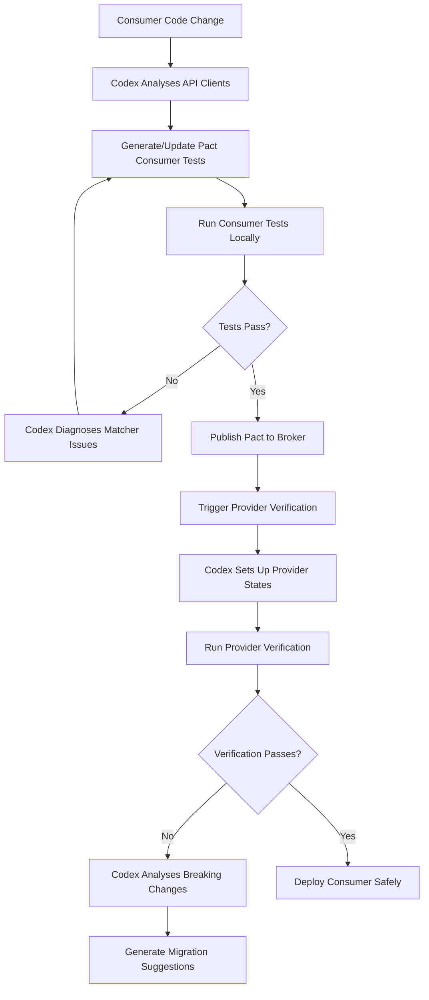

# Codex CLI for Consumer-Driven Contract Testing: Pact Generation, Provider Verification, and CI Contract Gates


---

Consumer-driven contract testing solves one of the thorniest problems in microservice architectures: how do you know your services are compatible before deploying them together? The Pact framework[^1] has long been the industry standard for this, but writing and maintaining consumer contracts across dozens of services is tedious, error-prone work. Codex CLI turns this into an agent-driven workflow — generating consumer tests from existing integration patterns, running provider verification in non-interactive pipelines, and enforcing contract hygiene through CI gates.

This article covers Pact V4 specification contracts[^2] with `pact-js` and `pact-jvm`, using Codex CLI v0.130+[^3] with GPT-5.5[^4] as the recommended model for complex code generation tasks.

## Why Contract Testing Needs Agent Assistance

Traditional integration tests verify compatibility by running services together. Contract tests invert this: the consumer declares what it expects from a provider, and each side verifies independently[^1]. The approach scales far better, but introduces its own maintenance burden:

- **Consumer test authorship** requires understanding the provider's API surface and encoding expectations as Pact interactions.
- **Provider verification** must run against every registered consumer contract on every change.
- **Contract drift** accumulates when teams add endpoints or change payloads without updating contracts.

Codex CLI addresses each of these by reading your existing consumer code, inferring the API calls being made, and generating Pact interactions that match your actual usage patterns rather than aspirational API documentation.

## Encoding Contract Testing Conventions in AGENTS.md

Before generating any contracts, encode your team's conventions so Codex produces consistent output. AGENTS.md files are discovered from the Git root to the working directory, with closer files overriding earlier guidance[^5].

```markdown
<!-- services/order-service/AGENTS.md -->
# Contract Testing Conventions

## Pact Configuration
- Use Pact V4 specification for all new contracts
- Consumer names follow the pattern: `{service-name}-consumer`
- Provider names follow the pattern: `{service-name}-provider`
- Pact files are written to `pacts/` directory at project root
- All interactions MUST include provider states

## Interaction Naming
- Format: `a request to {HTTP method} {resource} {condition}`
- Example: `a request to GET /orders when orders exist`

## Prohibited Patterns
- NEVER use `like()` matchers on ID fields — use `uuid()` instead
- NEVER hardcode base URLs in consumer tests
- NEVER skip provider state setup in verification

## Test Structure
- One Pact test file per provider dependency
- Group interactions by resource path
- Include both happy-path and error-case interactions
```

Place a project-level `AGENTS.md` at the Git root for cross-service rules, and service-level files for specific provider relationships[^5].

## Generating Consumer Contracts with Codex CLI

### Interactive Consumer Test Generation

Point Codex at your consumer service code and ask it to generate Pact tests from existing API client usage:

```bash
codex --model gpt-5.5 \
  "Analyse the API client in src/clients/payment-client.ts.
   Identify every HTTP call made to the payment service.
   Generate a Pact V4 consumer test file covering each interaction
   with appropriate matchers and provider states.
   Write the test to tests/contract/payment.consumer.pact.test.ts"
```

Codex reads the client code, identifies the HTTP methods, paths, request bodies, and expected response shapes, then generates Pact interactions using the V4 DSL[^2]. Because it reads your actual code rather than an OpenAPI specification, the generated contracts reflect real usage — including query parameters your code actually sends and response fields it actually reads.

### Structured Contract Audit with `codex exec`

For CI integration or batch auditing, use `codex exec` with `--output-schema` to produce machine-readable contract gap reports[^6]:

```json
{
  "type": "object",
  "properties": {
    "service": { "type": "string" },
    "provider_dependencies": {
      "type": "array",
      "items": {
        "type": "object",
        "properties": {
          "provider": { "type": "string" },
          "endpoints_used": { "type": "integer" },
          "endpoints_covered": { "type": "integer" },
          "missing_interactions": {
            "type": "array",
            "items": { "type": "string" }
          }
        }
      }
    }
  }
}
```

```bash
codex exec \
  "Audit contract test coverage for the order service.
   Compare API client calls in src/clients/ against
   existing Pact tests in tests/contract/.
   Report coverage gaps." \
  --output-schema contract-audit-schema.json \
  -o contract-audit-report.json \
  --sandbox read-only
```

This produces a structured report identifying which provider endpoints lack contract coverage, enabling targeted remediation.

## Provider Verification Workflows

Provider verification confirms that the provider's implementation satisfies all registered consumer contracts. Codex CLI can automate the verification setup and diagnose failures.

### Setting Up Verification with Provider States

Provider state handlers are the most error-prone part of contract testing. Codex can generate them from your existing test fixtures:

```bash
codex --model gpt-5.5 \
  "Read the Pact files in pacts/ directory.
   Extract all provider states referenced by consumers.
   Generate provider state handlers in
   tests/contract/provider-states.ts that use our existing
   test fixture factories in tests/fixtures/.
   Each state handler should set up the database via
   the repository layer, not by direct SQL insertion."
```

### Non-Interactive Provider Verification in CI

Run provider verification as part of your CI pipeline using `codex exec`[^6]:

```bash
codex exec \
  "Run pact provider verification for the payment service.
   Use the Pact files from the pact-broker at
   \$PACT_BROKER_URL with consumer version selectors
   for the main branch and deployed environments.
   If verification fails, analyse the failure output and
   suggest the minimal provider change needed to satisfy
   the contract." \
  --sandbox workspace-write \
  --model gpt-5.5
```

## The Contract Testing Flow



## Building a Reusable Contract Auditor Skill

Encode the contract audit workflow as a reusable Codex skill[^7]:

```markdown
<!-- .codex/skills/contract-auditor/SKILL.md -->
# Contract Auditor Skill

## Purpose
Audit and maintain Pact consumer-driven contracts across services.

## Capabilities
1. **Coverage audit**: Compare API client calls against existing
   Pact interactions to find coverage gaps
2. **Contract generation**: Generate Pact V4 consumer tests from
   API client code
3. **Drift detection**: Compare Pact contracts against current
   provider OpenAPI specs to find drift
4. **Provider state scaffolding**: Generate provider state handlers
   from consumer Pact files and existing test fixtures

## Workflow
1. Read all files matching `src/clients/**/*.{ts,js,java,kt}`
2. Extract HTTP calls (method, path, request/response shapes)
3. Read existing Pact tests in `tests/contract/`
4. Identify uncovered interactions
5. Generate missing Pact tests following AGENTS.md conventions
6. Verify generated tests compile and pass

## Constraints
- Use Pact V4 specification only
- Apply matchers from `@pact-foundation/pact` MatchersV3
- Never generate contracts for internal-only endpoints
  marked with @internal JSDoc tag
```

## Enforcing Contract Hygiene with Hooks

Use Codex hooks to enforce contract testing conventions on every agent interaction[^8]. Configure a `PostToolUse` hook that validates generated test files:

```toml
# codex.toml
[hooks.post_tool_use.contract_lint]
event = "PostToolUse"
command = """
if echo "$CODEX_TOOL_RESULT" | grep -q "pact.test"; then
  npx pact-lint check tests/contract/ --spec v4 --strict
fi
"""
on_failure = "stop"
```

This ensures that any Pact test file Codex creates or modifies conforms to the V4 specification and passes your team's linting rules before the agent continues.

## CI Pipeline: Contract Gate

Integrate contract testing as a deployment gate in GitHub Actions[^9]:


```yaml
# .github/workflows/contract-gate.yml
name: Contract Gate
on:
  pull_request:
    paths:
      - 'src/clients/**'
      - 'tests/contract/**'

jobs:
  contract-audit:
    runs-on: ubuntu-latest
    steps:
      - uses: actions/checkout@v4

      - name: Install dependencies
        run: npm ci

      - name: Run contract coverage audit
        env:
          CODEX_API_KEY: ${{ secrets.CODEX_API_KEY }}
        run: |
          npx @openai/codex exec \
            "Audit contract test coverage. Compare all API client
             calls in src/clients/ against Pact tests in
             tests/contract/. Fail if any provider dependency
             has less than 80% endpoint coverage." \
            --output-schema .codex/schemas/contract-audit.json \
            -o contract-report.json \
            --sandbox read-only \
            --model gpt-5.5

      - name: Check coverage threshold
        run: |
          node -e "
            const r = require('./contract-report.json');
            const failing = r.provider_dependencies
              .filter(d => d.endpoints_covered / d.endpoints_used < 0.8);
            if (failing.length > 0) {
              console.error('Contract coverage below 80%:', failing);
              process.exit(1);
            }
          "

      - name: Run consumer Pact tests
        run: npm run test:contract:consumer

      - name: Run provider verification
        run: npm run test:contract:provider
```


## Bi-Directional Contract Testing with OpenAPI

For teams already maintaining OpenAPI specifications, Codex can bridge between specification-first and consumer-driven approaches. ⚠️ Bi-directional contract testing (BDCT) is a PactFlow commercial feature, not available in Pact OSS[^10].

```bash
codex --model gpt-5.5 \
  "Compare the OpenAPI spec at docs/openapi.yaml against
   all consumer Pact files in pacts/.
   Identify any consumer expectations that exceed what
   the OpenAPI spec declares — these represent undocumented
   API usage that should either be added to the spec or
   removed from consumer code."
```

This hybrid approach catches both directions of drift: consumers using undocumented endpoints, and specifications declaring endpoints no consumer actually uses.

## Model Selection for Contract Testing Tasks

| Task | Recommended Model | Rationale |
|---|---|---|
| Consumer test generation | GPT-5.5[^4] | Complex code analysis across multiple files |
| Contract audit (structured) | GPT-5.5 | Accurate cross-referencing of clients and tests |
| Provider state scaffolding | GPT-5.5 | Requires understanding test fixture patterns |
| Simple contract lint check | GPT-5.3-Codex-Spark[^4] | Fast, low-cost verification task |

## Anti-Patterns

- **Generating contracts from OpenAPI specs alone** — contracts should reflect actual consumer usage, not theoretical API surface. Use client code as the source of truth.
- **Skipping provider states** — stateless Pact interactions are brittle and misleading. Always specify the precondition.
- **One massive Pact file per provider** — split by resource or domain boundary for independent evolution.
- **Trusting generated matchers without review** — Codex may over-constrain responses with exact matchers where flexible matchers (`like()`, `eachLike()`) are appropriate. Always review generated matcher choices.
- **Running contract generation with `--sandbox danger-full-access`** — read-only or workspace-write is sufficient for contract test generation. Over-permissioned sandboxes risk unintended side effects.

## Known Limitations

- **`--output-schema` and `exec resume` cannot be combined** — if your contract audit runs across multiple sessions, you must re-specify the schema each time[^11].
- **Context window constraints** — services with very large API client surfaces (50+ endpoints per provider) may exceed the context window. Split audits by provider in these cases.
- **Non-deterministic generation** — Codex may produce slightly different Pact interactions on repeated runs. Pin generated contracts in version control and use Codex for updates, not regeneration.
- **Sandbox network isolation** — provider verification requires network access to the Pact Broker. Use `--sandbox danger-full-access` only for verification runs, not generation.
- **Pact V4 plugin support** — Codex can generate standard HTTP and message interactions but may not correctly configure Pact V4 plugin-based interactions for custom transport protocols[^2].

## Citations

[^1]: [Pact Documentation — Introduction](https://docs.pact.io/)
[^2]: [Pact V4 Specification — pact-foundation/pact-specification](https://github.com/pact-foundation/pact-specification/tree/version-4)
[^3]: [Codex CLI Changelog — v0.130.0 (May 8, 2026)](https://developers.openai.com/codex/changelog)
[^4]: [Codex Models Documentation](https://developers.openai.com/codex/models)
[^5]: [Custom Instructions with AGENTS.md — Codex Developers](https://developers.openai.com/codex/guides/agents-md)
[^6]: [Non-Interactive Mode — Codex Developers](https://developers.openai.com/codex/noninteractive)
[^7]: [Skills Documentation — Codex CLI Features](https://developers.openai.com/codex/cli/features)
[^8]: [Codex CLI Configuration Reference — Hooks](https://developers.openai.com/codex/config-reference)
[^9]: [Codex GitHub Action Documentation](https://developers.openai.com/codex/github-action)
[^10]: [PactFlow Bi-Directional Contract Testing](https://pactflow.io/bi-directional-contract-testing/)
[^11]: [Add --output-schema support to codex exec resume — GitHub Issue #14343](https://github.com/openai/codex/issues/14343)
