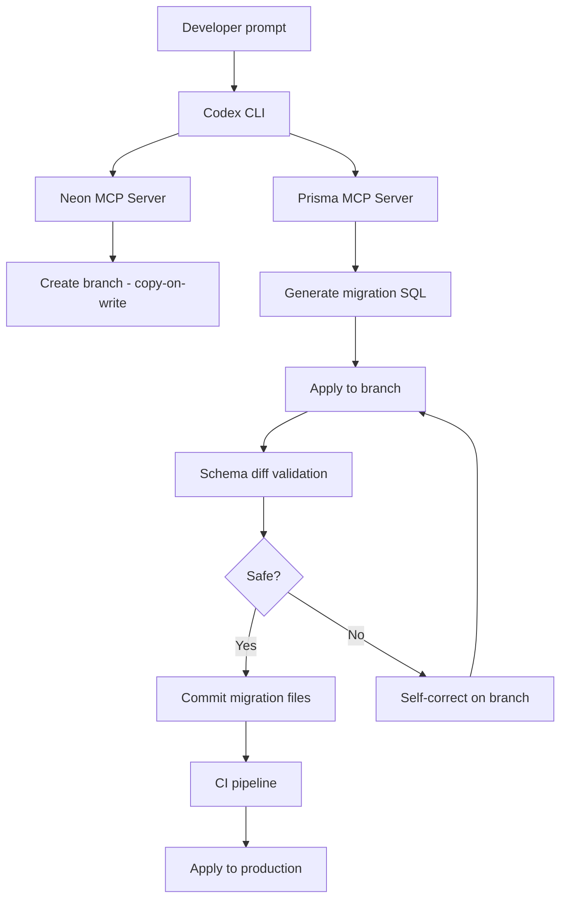

# Codex CLI for Database Schema Migrations: Branch-Based Safety with Neon and Prisma MCP Servers


---

Database schema migrations remain one of the highest-risk operations in production systems. A misapplied migration can corrupt data, lock tables for minutes, or cascade failures across dependent services. Codex CLI, combined with database-aware MCP servers, transforms this workflow from a manual, high-stakes process into an agent-assisted pipeline with isolated branching, structured validation, and automated safety checks.

This article covers the practical integration of Codex CLI with the Neon MCP server and the Prisma MCP server for safe, auditable schema migrations — from interactive refactoring through to CI enforcement.

## The Migration Safety Problem

Traditional migration workflows suffer from three compounding risks:

1. **Destructive operations executed against shared databases** — a `DROP COLUMN` in development wipes data before anyone reviews it
2. **No isolation between migration authoring and testing** — developers generate and apply in the same environment
3. **Late discovery of lock contention** — `ALTER TABLE` on a large table acquires an exclusive lock, but this only surfaces under production load

Branch-based database providers like Neon solve the isolation problem with copy-on-write branches[^1]. Codex CLI provides the intelligence layer: generating migrations, validating them against a schema diff, and enforcing safety rules through `AGENTS.md` constraints.

## Architecture Overview



## Configuring MCP Servers

### Neon MCP Server

The Neon MCP server exposes branch management, schema comparison, and migration lifecycle tools directly to Codex[^2]. Configure it in `.codex/config.toml`:

```toml
[mcp_servers.neon]
url = "https://mcp.neon.tech/mcp"
bearer_token_env_var = "NEON_API_KEY"
```

Set project context so the MCP server targets the correct database:

```bash
neon set-context --project-id <project-id> --org-id <org-id>
```

This generates a `.neon` file that Codex references for all subsequent API interactions[^3].

### Prisma MCP Server

Prisma's MCP server (built into CLI v6.6.0+) exposes `migrate-dev`, `migrate-status`, and `migrate-reset` as callable tools[^4]. For projects using Prisma ORM:

```toml
[mcp_servers.prisma]
command = "npx"
args = ["prisma", "mcp"]
```

The Prisma MCP server handles schema introspection, migration generation, and status queries — letting Codex orchestrate the full Prisma Migrate lifecycle without shell scripting[^5].

## AGENTS.md: Encoding Migration Safety Rules

Define migration constraints in a dedicated `db/migrations/AGENTS.md`:

```markdown
## Database Migration Rules

- NEVER apply migrations directly to the main branch or production database
- ALWAYS create an isolated Neon branch before generating or applying migrations
- NEVER use DROP TABLE or DROP COLUMN without confirming data has been backed up or migrated
- ALWAYS generate a reversible migration (up + down) unless explicitly instructed otherwise
- Use `compare_database_schema` to validate the diff before marking a migration complete
- Maximum lock time: flag any ALTER TABLE on tables with >1M rows as requiring online migration tooling (gh-ost or pt-online-schema-change)
- Prefer additive migrations: add new columns as nullable, backfill, then add constraints
```

Codex loads these rules before executing any migration task, preventing destructive operations even in `suggest` mode[^6].

## Interactive Migration Workflow

### Phase 1: Prompt-Driven Schema Design

```bash
codex "Normalise the users table — extract address fields into a separate
addresses table with a foreign key. Use Drizzle migrations. Work on an
isolated Neon branch."
```

Codex autonomously:
1. Calls `prepare_database_migration` via the Neon MCP server to create a temporary branch[^7]
2. Generates the migration SQL (CREATE TABLE, INSERT/SELECT backfill, ALTER TABLE DROP COLUMN)
3. Applies the migration to the isolated branch
4. Runs `compare_database_schema` to produce the schema diff between parent and child branches

### Phase 2: Validation and Self-Correction

If the schema diff reveals unexpected changes (e.g., a dropped index that wasn't part of the refactoring), Codex detects the discrepancy and generates a corrective migration — all on the isolated branch. No production data is touched[^1].

### Phase 3: Completion

Once validated:

```bash
# Codex commits migration files to your working tree
git add db/migrations/
git commit -m "feat(db): normalise users.address into addresses table"
```

The Neon branch can then be deleted via the MCP server or left for CI to validate against.

## Non-Interactive Migration Auditing with codex exec

For CI pipelines, use `codex exec` with `--output-schema` to produce structured migration risk reports:

```json
{
  "$schema": "https://json-schema.org/draft/2020-12/schema",
  "type": "object",
  "properties": {
    "migration_files": {
      "type": "array",
      "items": { "type": "string" }
    },
    "risk_level": {
      "type": "string",
      "enum": ["low", "medium", "high", "critical"]
    },
    "destructive_operations": {
      "type": "array",
      "items": {
        "type": "object",
        "properties": {
          "operation": { "type": "string" },
          "table": { "type": "string" },
          "reversible": { "type": "boolean" }
        }
      }
    },
    "lock_risk_tables": {
      "type": "array",
      "items": { "type": "string" }
    },
    "recommendation": { "type": "string" }
  },
  "required": ["migration_files", "risk_level", "destructive_operations", "recommendation"]
}
```

Execute the audit:

```bash
codex exec \
  --output-schema migration-risk-schema.json \
  --sandbox read-only \
  -m o3 \
  "Audit all pending migration files in db/migrations/ for destructive operations,
   lock risk on large tables, and reversibility. Output structured risk assessment."
```

The structured output integrates directly into CI gates — a `critical` risk level blocks the pipeline until a human approves[^8].

## Reusable Migration Auditor Skill

Create `.codex/skills/migration-auditor/SKILL.md`:

```markdown
# Migration Auditor

## Trigger
Activated when the user requests a migration audit, schema review, or asks
about migration safety.

## Steps
1. List pending migration files using `prisma migrate status` or by reading
   the migrations directory
2. For each migration file, identify:
   - Destructive operations (DROP, TRUNCATE, ALTER TABLE ... DROP)
   - Lock-acquiring operations on tables exceeding 100k rows
   - Missing down/rollback migrations
3. Cross-reference with AGENTS.md safety rules
4. Produce a structured risk report

## Output
Structured JSON conforming to migration-risk-schema.json
```

## CI Pipeline Integration

### GitHub Actions Gate


```yaml
name: Migration Safety Gate
on:
  pull_request:
    paths:
      - 'db/migrations/**'

jobs:
  migration-audit:
    runs-on: ubuntu-latest
    steps:
      - uses: actions/checkout@v4

      - name: Audit migrations
        env:
          CODEX_API_KEY: ${{ secrets.CODEX_API_KEY }}
          NEON_API_KEY: ${{ secrets.NEON_API_KEY }}
        run: |
          codex exec \
            --output-schema .codex/schemas/migration-risk-schema.json \
            --sandbox read-only \
            -m o3 \
            "Audit new migration files for safety risks" \
            -o /tmp/audit-result.json

      - name: Gate on risk level
        run: |
          RISK=$(jq -r '.risk_level' /tmp/audit-result.json)
          if [ "$RISK" = "critical" ] || [ "$RISK" = "high" ]; then
            echo "::error::Migration risk level is $RISK — requires manual approval"
            exit 1
          fi
```


### Branch-Based Integration Testing

For deeper validation, the CI pipeline can create a Neon branch, apply migrations, run integration tests against the branched database, then tear down — all without touching production[^9].

## The MCP Landscape for Database Migrations

The current MCP ecosystem for database migrations (as of May 2026) includes[^10]:

| Server | Status | Capabilities |
|--------|--------|-------------|
| **Neon MCP** | Production | Branch management, schema diff, migration lifecycle |
| **Prisma MCP** | Production (v6.6.0+) | migrate-dev, migrate-status, migrate-reset, schema introspection |
| **Liquibase AI** | Private preview | 19 tools, ephemeral H2 validation |
| **boringSQL/dryrun** | Community (Rust) | Lock analysis, DDL linting, offline safety |
| **Atlas MCP** | Community (stagnant) | Declarative schema, migrate-lint |

Notable gaps: Flyway, Alembic, golang-migrate, and Rails migrations have no MCP servers. For these frameworks, Codex operates through shell commands rather than structured tool calls.

## Model Selection

| Task | Recommended Model | Rationale |
|------|------------------|-----------|
| Interactive schema design | o3 | Complex reasoning about normalisation and data relationships |
| Migration file generation | o4-mini | Straightforward code generation, cost-efficient |
| Risk auditing (CI) | o3 | Needs to reason about lock contention and data loss risks |
| Schema diff review | o4-mini | Pattern matching against known safe/unsafe operations |

## Anti-Patterns

- **Applying migrations in `full-auto` mode against production** — always use branch isolation or `read-only` sandbox for auditing
- **Trusting generated DOWN migrations without testing** — Codex may generate syntactically valid but semantically incomplete rollbacks
- **Skipping schema diff validation** — the `compare_database_schema` step catches unintended side effects that code review misses
- **Using MCP servers with overly permissioned API keys** — scope Neon API keys to specific projects; use read-only keys for CI auditing
- **Generating migrations for large tables without online migration tooling** — Codex cannot predict production lock contention; flag tables above your row-count threshold

## Known Limitations

- **`--output-schema` cannot be used with `resume`** — each audit run is stateless[^11]
- **Context window constraints** — large migration histories (100+ files) may exceed the model's context; use directory-scoped auditing
- **Sandbox network isolation** — `read-only` and `workspace-write` sandboxes block outbound network; MCP servers configured via `url` require appropriate sandbox settings
- **Non-deterministic suggestions** — migration generation may vary between runs; always review generated SQL before applying
- **No native support for online migration tools** — gh-ost and pt-online-schema-change integration requires custom shell scripting within Codex

## Citations

[^1]: Neon, "Safe AI-powered schema refactoring with OpenAI Codex and Neon," 2026. [https://neon.com/guides/openai-codex-neon-mcp](https://neon.com/guides/openai-codex-neon-mcp)

[^2]: Neon, "Neon MCP Server overview," 2026. [https://neon.com/docs/ai/neon-mcp-server](https://neon.com/docs/ai/neon-mcp-server)

[^3]: Neon, "Changelog — March 27, 2026," [https://neon.com/docs/changelog/2026-03-27](https://neon.com/docs/changelog/2026-03-27)

[^4]: Prisma, "Prisma MCP Server," 2026. [https://www.prisma.io/docs/postgres/integrations/mcp-server](https://www.prisma.io/docs/postgres/integrations/mcp-server)

[^5]: Prisma, "Prisma ORM 6.6.0: ESM Support, D1 Migrations & Prisma MCP Server," 2026. [https://www.prisma.io/blog/prisma-orm-6-6-0-esm-support-d1-migrations-and-prisma-mcp-server](https://www.prisma.io/blog/prisma-orm-6-6-0-esm-support-d1-migrations-and-prisma-mcp-server)

[^6]: OpenAI, "Custom instructions with AGENTS.md," 2026. [https://developers.openai.com/codex/guides/agents-md](https://developers.openai.com/codex/guides/agents-md)

[^7]: Neon, "neon-postgres-branches Agent Skills," MCP Servers. [https://mcpservers.org/agent-skills/neondatabase/neon-postgres-branches](https://mcpservers.org/agent-skills/neondatabase/neon-postgres-branches)

[^8]: OpenAI, "Non-interactive mode — Codex," 2026. [https://developers.openai.com/codex/noninteractive](https://developers.openai.com/codex/noninteractive)

[^9]: OpenAI, "GitHub Action — Codex," 2026. [https://developers.openai.com/codex/github-action](https://developers.openai.com/codex/github-action)

[^10]: ChatForest, "Database Migration & Schema Management MCP Servers," March 2026. [https://chatforest.com/reviews/database-migration-mcp-servers/](https://chatforest.com/reviews/database-migration-mcp-servers/)

[^11]: GitHub, "Add --output-schema support to codex exec resume — Issue #14343," [https://github.com/openai/codex/issues/14343](https://github.com/openai/codex/issues/14343)
