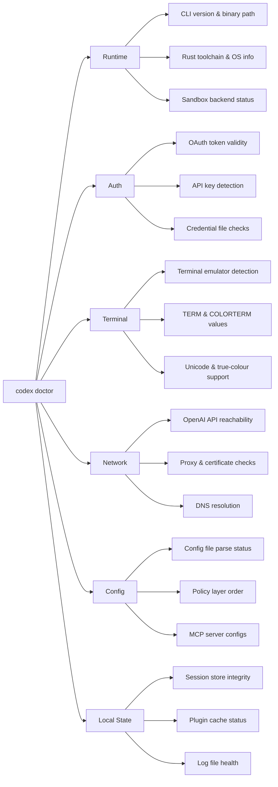

# Codex CLI Doctor: The New First-Class Diagnostics Command in v0.131.0


Codex CLI v0.131.0, released on 18 May 2026, introduces `codex doctor` — a single subcommand that runs support-ready diagnostics across six categories: runtime, authentication, terminal, network, configuration, and local state[^1]. Before this release, diagnosing a broken Codex installation meant stitching together `RUST_LOG` output, grepping log files, checking `auth.json` manually, and running `/debug-config` inside a TUI session that might not even start. `codex doctor` consolidates all of that into one offline command you can run before you've even logged in.

This article walks through what the command checks, how to read its output, and how to integrate it into team support workflows.

## Why a Dedicated Diagnostics Command?

Codex CLI has accumulated diagnostic surfaces since its early releases: `RUST_LOG` environment variables for runtime tracing, `/debug-config` and `/feedback` slash commands inside the TUI, the `codex sandbox` subcommand for policy testing, and JSONL rollout files for post-session analysis[^2]. Each is useful in isolation, but none gives you a single pre-flight health check.

The gap became acute as Codex expanded beyond solo developer use into enterprise deployments with corporate proxies, SSO authentication, managed device policies, and remote app-server architectures[^3]. Support tickets increasingly arrived with incomplete information — a screenshot of an error message with no context about the runtime environment. `codex doctor` addresses this by producing a structured, shareable diagnostic report in one invocation.



## The Six Diagnostic Categories

### Runtime

The runtime check reports the installed CLI version, the binary's absolute path, the operating system and architecture, and the status of the sandbox backend (macOS Seatbelt, Linux Landlock, or Windows AppContainer)[^4]. This immediately surfaces version mismatches — a common issue when a system-wide install shadows a project-local one — and confirms whether the sandbox can actually enforce the configured policy.

```bash
codex doctor
```

Expected output for the runtime section:

```
✓ Runtime
  CLI version:     0.131.0
  Binary path:     /usr/local/bin/codex
  Platform:        linux/amd64
  Sandbox backend: landlock (kernel 6.8+)
  Rust toolchain:  1.82.0-stable
```

A common failure here is a sandbox backend showing `unavailable` on older Linux kernels that lack Landlock support, or on WSL 1 where the Windows AppContainer path isn't available[^5].

### Authentication

The auth check validates credential state without making a full API call. It inspects `~/.codex/auth.json` for OAuth token presence and expiry, checks for an `OPENAI_API_KEY` environment variable, and verifies that the active credential has not been revoked[^6]. For Bedrock users (new in v0.130.0), it also validates AWS SigV4 credentials from configured profiles[^7].

```
✓ Auth
  Method:          OAuth (device code)
  Token status:    valid (expires in 47h)
  API key env:     not set
  Bedrock auth:    not configured
```

If the token has expired, the output includes a remediation hint:

```
✗ Auth
  Method:          OAuth (device code)
  Token status:    EXPIRED (expired 3h ago)
  → Run 'codex login' to re-authenticate
```

### Terminal

Terminal diagnostics detect the emulator in use, read `TERM` and `COLORTERM` environment variables, and test for Unicode rendering and true-colour support[^8]. This matters because Codex CLI's TUI relies on terminal capabilities for diff rendering, syntax highlighting, and the new responsive Markdown tables introduced in v0.131.0[^1].

```
✓ Terminal
  Emulator:        iTerm2 (3.5.6)
  TERM:            xterm-256color
  COLORTERM:       truecolor
  Unicode:         supported (width: 120, height: 40)
  Vim mode:        available
```

### Network

The network check probes connectivity to the OpenAI API endpoint, detects HTTP proxies (from `HTTP_PROXY`, `HTTPS_PROXY`, and `NO_PROXY` environment variables), validates TLS certificate chains, and runs a DNS resolution test[^9]. For enterprise environments behind corporate proxies, this is often the fastest way to identify man-in-the-middle certificate issues that cause opaque TLS handshake failures.

```
✓ Network
  API endpoint:    https://api.openai.com (reachable, 43ms)
  Proxy:           none detected
  TLS:             valid certificate chain
  DNS:             api.openai.com → 104.18.x.x (12ms)
```

### Configuration

The config diagnostic parses `~/.codex/config.toml` (and any project-level `.codex/config.toml` files), reports the effective policy layer order, lists configured MCP servers and their connection status, and flags any unrecognised keys or deprecated options[^10]. This replaces the need to start a TUI session and run `/debug-config` — particularly useful when the config itself is preventing the TUI from launching.

```
✓ Config
  Global config:   ~/.codex/config.toml (valid)
  Project config:  .codex/config.toml (valid)
  Policy layers:   project → global → defaults
  MCP servers:     2 configured, 2 reachable
  Warnings:        none
```

### Local State

The local state check inspects the session store (ThreadStore), plugin cache, and log directory[^11]. It reports the number of stored sessions, whether the SQLite database backing the ThreadStore is intact, the total size of cached plugins, and whether log rotation is functioning. Corrupted session databases were a known source of resume and fork failures before v0.130.0 improved ThreadStore reliability[^1].

```
✓ Local State
  Sessions:        142 stored (ThreadStore: healthy)
  Plugin cache:    23 plugins (48 MB)
  Log directory:   ~/.codex/logs/ (12 files, rotation: active)
  Auth file:       ~/.codex/auth.json (present, 1.2 KB)
```

## Targeted Diagnostics

You do not always need all six categories. `codex doctor` accepts category flags to run a subset:

```bash
# Check only auth and network
codex doctor --categories auth,network

# Check only runtime
codex doctor --categories runtime
```

This is useful in CI pipelines where you want a fast pre-flight check without inspecting terminal capabilities or local state.

## Machine-Readable Output

For automated tooling and support ticket automation, `codex doctor` supports JSON output:

```bash
codex doctor --format json
```

This produces structured JSON that can be piped into issue templates, attached to support tickets, or ingested by monitoring systems. The JSON schema includes a top-level `status` field (`pass`, `warn`, or `fail`), a `categories` array with individual results, and a `remediation` array of suggested fixes[^1].

```json
{
  "status": "warn",
  "version": "0.131.0",
  "categories": [
    {
      "name": "runtime",
      "status": "pass",
      "checks": [...]
    },
    {
      "name": "auth",
      "status": "warn",
      "checks": [...],
      "remediation": ["Token expires in 2h — run 'codex login' to refresh"]
    }
  ]
}
```

## Integrating with Team Support Workflows

### Pre-Flight in CI/CD

Add `codex doctor` as a pipeline step before `codex exec` to catch environment issues early:

```bash
# In your CI pipeline
codex doctor --categories runtime,auth,network --format json > /tmp/doctor.json
if jq -e '.status == "fail"' /tmp/doctor.json > /dev/null; then
  echo "Codex environment check failed:"
  jq '.categories[] | select(.status == "fail") | .remediation[]' /tmp/doctor.json
  exit 1
fi

# Proceed with codex exec
codex exec "Run the test suite and report failures"
```

### Support Ticket Templates

Standardise support requests by asking users to attach the output of `codex doctor --format json`. This gives support teams immediate visibility into the six diagnostic categories without back-and-forth questions about OS version, proxy configuration, or auth state.

### AGENTS.md Convention

Encode a diagnostic-first convention in your project's `AGENTS.md`:

```markdown
## Troubleshooting

When Codex CLI fails to start or behaves unexpectedly:
1. Run `codex doctor` and review the output
2. Address any ✗ (fail) items before investigating further
3. If filing a bug, attach `codex doctor --format json` output
```

## Relationship to Existing Diagnostic Tools

`codex doctor` does not replace the existing diagnostic surfaces — it complements them:

| Tool | When to use | Requires running session? |
|---|---|---|
| `codex doctor` | Pre-flight health check, support tickets | No |
| `RUST_LOG=debug codex` | Runtime tracing during active debugging | Yes |
| `/debug-config` | Inspecting effective config inside TUI | Yes |
| `/feedback` | Submitting diagnostics to OpenAI | Yes |
| `codex sandbox` | Testing sandbox policy offline | No |
| `codex debug` | Low-level debug helpers | No |

The key distinction is that `codex doctor` works offline, before authentication, and without starting a TUI session[^1]. Every other diagnostic tool except `codex sandbox` requires a functioning session.

## Other v0.131.0 Highlights Worth Knowing

While `codex doctor` is the headline operational improvement, v0.131.0 shipped several other features that affect day-to-day workflows[^1]:

- **Unified `@` mentions**: The mention picker now searches files, directories, plugins, and skills in a single interface, backed by app-server plugin metadata
- **Plugin marketplace CLI**: New CLI commands for discovering, sharing, and managing plugins with version-aware workflows and default-enabled plugin hooks
- **Daemon-managed remote control**: Remote workflows support runtime enable/disable APIs and registry-backed environment configuration
- **Python SDK migration**: The SDK moved to `openai-codex` / `openai_codex` with pinned runtime types and concurrent turn routing
- **TUI enhancements**: Service-tier display, blended token usage counters, and responsive Markdown tables

## Practical Troubleshooting Scenarios

### Scenario 1: Codex Won't Start After OS Update

```bash
$ codex doctor --categories runtime,terminal
✗ Runtime
  Sandbox backend: unavailable (Landlock requires kernel 6.1+)
  → Current kernel: 5.15.0
  → Upgrade kernel or set sandbox_mode = "none" in config.toml

✓ Terminal
  ...
```

### Scenario 2: Corporate Proxy Blocking API Calls

```bash
$ codex doctor --categories network
✗ Network
  API endpoint:    https://api.openai.com (unreachable, timeout after 10s)
  Proxy:           HTTPS_PROXY=http://proxy.corp.example:8080
  TLS:             certificate verification failed (self-signed CA)
  → Add corporate CA to NODE_EXTRA_CA_CERTS or system trust store
```

### Scenario 3: Mysterious Session Resume Failures

```bash
$ codex doctor --categories local-state
✗ Local State
  Sessions:        ThreadStore: corrupted (SQLite integrity check failed)
  → Run 'codex doctor --repair local-state' to attempt recovery
```

## Summary

`codex doctor` fills a long-standing gap in Codex CLI's diagnostic story. Before v0.131.0, understanding why Codex wasn't working required expertise across multiple tools and manual inspection of files scattered across the filesystem. Now, a single command produces a structured report covering runtime, auth, terminal, network, config, and local state — with remediation hints and machine-readable output for automation. For teams running Codex at scale, it turns "it doesn't work" support tickets into actionable diagnostic data.

## Citations

[^1]: OpenAI, "Changelog – Codex," *OpenAI Developers*, 18 May 2026. [https://developers.openai.com/codex/changelog](https://developers.openai.com/codex/changelog)

[^2]: D. Vaughan, "Codex CLI Diagnostic Toolkit: Tracing, Sandbox Testing, and the Built-In Debugging Commands," *Codex Resources*, 7 April 2026. [https://codex.danielvaughan.com/2026/04/07/codex-cli-diagnostic-toolkit-tracing-sandbox-testing/](https://codex.danielvaughan.com/2026/04/07/codex-cli-diagnostic-toolkit-tracing-sandbox-testing/)

[^3]: OpenAI, "CLI – Codex," *OpenAI Developers*, 2026. [https://developers.openai.com/codex/cli](https://developers.openai.com/codex/cli)

[^4]: OpenAI, "Sandbox configuration – Codex CLI," *OpenAI Developers*, 2026. [https://developers.openai.com/codex/cli/sandbox](https://developers.openai.com/codex/cli/sandbox)

[^5]: OpenAI, "Bug Report: Commands failed to run in sandbox in Codex CLI," *GitHub Issue #4934*, 2026. [https://github.com/openai/codex/issues/4934](https://github.com/openai/codex/issues/4934)

[^6]: SmartScope, "Codex CLI Logs: Location, Debug Flags & 401 Error Fix (2026)," 2026. [https://smartscope.blog/en/generative-ai/chatgpt/codex-cli-diagnostic-logs-deep-dive/](https://smartscope.blog/en/generative-ai/chatgpt/codex-cli-diagnostic-logs-deep-dive/)

[^7]: OpenAI, "Codex CLI v0.130.0 Release Notes," *GitHub Releases*, May 2026. [https://github.com/openai/codex/releases](https://github.com/openai/codex/releases)

[^8]: OpenAI, "Features – Codex CLI," *OpenAI Developers*, 2026. [https://developers.openai.com/codex/cli/features](https://developers.openai.com/codex/cli/features)

[^9]: CodexUse, "Codex not working? Quick fixes and triage," 2026. [https://codexuse.com/blog/codex-not-working-troubleshooting/](https://codexuse.com/blog/codex-not-working-troubleshooting/)

[^10]: OpenAI, "Command line options – Codex CLI," *OpenAI Developers*, 2026. [https://developers.openai.com/codex/cli/reference](https://developers.openai.com/codex/cli/reference)

[^11]: OpenAI, "Codex CLI v0.131.0 Release Notes — codex doctor PR #22336," *GitHub Releases*, 18 May 2026. [https://github.com/openai/codex/releases](https://github.com/openai/codex/releases)
