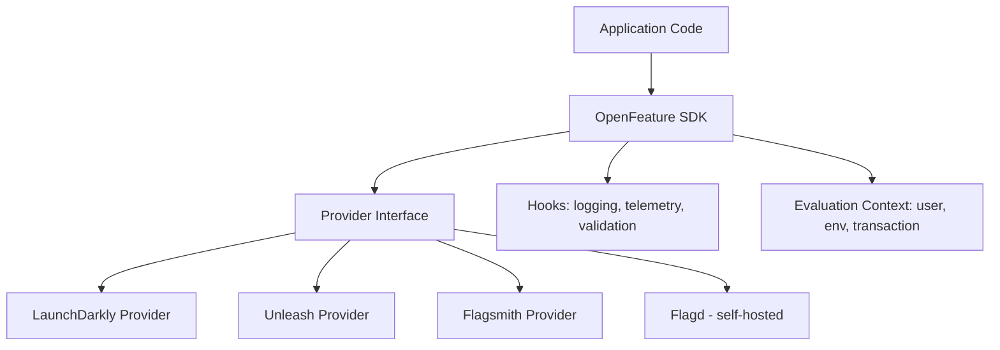
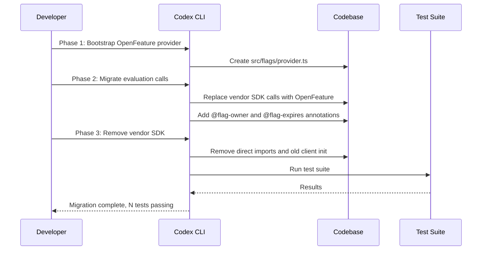
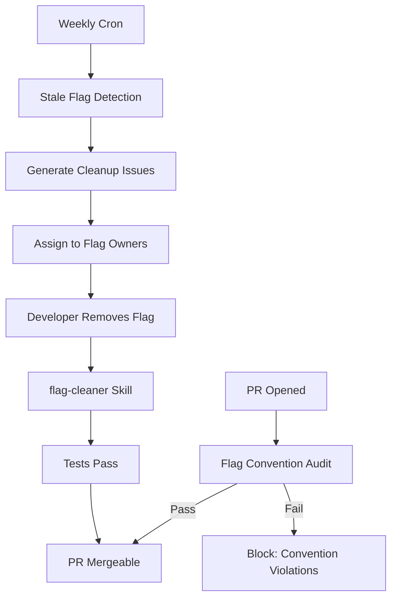

# Codex CLI for Feature Flag Lifecycle Management: OpenFeature Migration, Stale Flag Detection, and CI Enforcement


---

## The Feature Flag Debt Problem

Feature flags are one of the most powerful primitives in modern software delivery. They decouple deployment from release, enable progressive rollouts, and make trunk-based development viable at scale. But every flag you create is a promise to remove it later — a promise that teams routinely break.

Industry data paints a grim picture: the median codebase accumulates stale flags at roughly twice the rate it removes them, and teams that skip quarterly flag audits see compounding technical debt that degrades code readability, test reliability, and deployment confidence [^1]. Uber's internal analysis found approximately 2,000 stale flags across their mobile applications before building Piranha to automate cleanup [^2]. FlagShark's 2026 survey of GitHub repositories found that 68% of feature flag evaluation calls reference flags that have been at 100% for over 90 days [^3].

This article shows how to use Codex CLI to audit an existing codebase for feature flag hygiene, migrate vendor-specific SDK calls to the OpenFeature standard, detect and remove stale flags, and enforce flag lifecycle policies in CI.

## The OpenFeature Standard

Before encoding conventions, it helps to understand the target. OpenFeature is a CNCF incubating project that provides a vendor-agnostic API for feature flagging [^4]. As of early 2026, the specification sits at v0.8.0, covering evaluation context, hooks, events, tracking, transaction context propagation, and multi-provider support [^5]. The Node.js SDK is at v1.20.2 with full spec compliance and TypeScript-first design [^5].

The architectural benefit is straightforward: switching providers — from LaunchDarkly to Flagsmith, Unleash, Flipt, or an in-house system — requires zero application code changes. Only the provider configuration changes [^4].



## Encoding Flag Conventions in AGENTS.md

The first step in any Codex-assisted workflow is encoding your target conventions so the agent follows them consistently. Create or update your project-root `AGENTS.md`:

```markdown
# Feature Flag Standards

## SDK
- Use OpenFeature SDK exclusively — no direct vendor SDK calls
- Provider is configured once at application bootstrap in `src/flags/provider.ts`
- Never import from `@launchdarkly/node-server-sdk` or `unleash-client` directly

## Naming
- Flag keys use kebab-case: `enable-new-checkout`, `rollout-payment-v2`
- Prefix short-lived release flags with `release-`
- Prefix long-lived operational flags with `ops-`
- Prefix experiment flags with `exp-`

## Lifecycle
- Every flag must have a `@flag-owner` JSDoc tag on its evaluation call
- Every release flag must have a `@flag-expires YYYY-MM-DD` JSDoc tag
- Release flags must be removed within 30 days of reaching 100% rollout
- Operational flags require quarterly review documented in `docs/flag-register.md`

## Evaluation Context
- Always pass userId and environment in evaluation context
- Never hardcode default values — use the SDK's default mechanism
- Transaction context propagation via AsyncLocalStorage (Node.js)

## Prohibited Patterns
- No flag evaluation inside constructors or module-level scope
- No nested flag checks (flag within flag)
- No string comparison against flag values — use typed evaluation methods
```

This gives Codex the constraints it needs to generate compliant code, identify violations, and produce consistent audit outputs.

## Auditing Existing Flag Usage

Before migrating, you need a clear picture of your flag landscape. Use `codex exec` with `--output-schema` to produce a structured inventory:

```bash
codex exec \
  "Audit this codebase for all feature flag usage. For each flag found, \
   identify: the flag key, the SDK being used, the file and line number, \
   whether it has an owner annotation, whether it has an expiry annotation, \
   and whether it follows the naming convention in AGENTS.md." \
  --output-schema ./schemas/flag-audit.json \
  -o ./reports/flag-audit.json
```

Where `flag-audit.json` defines the expected shape:

```json
{
  "type": "object",
  "properties": {
    "total_flags": { "type": "integer" },
    "vendor_specific_calls": { "type": "integer" },
    "openfeature_calls": { "type": "integer" },
    "missing_owner": { "type": "array", "items": { "type": "string" } },
    "missing_expiry": { "type": "array", "items": { "type": "string" } },
    "naming_violations": { "type": "array", "items": { "type": "string" } },
    "flags": {
      "type": "array",
      "items": {
        "type": "object",
        "properties": {
          "key": { "type": "string" },
          "sdk": { "type": "string" },
          "file": { "type": "string" },
          "line": { "type": "integer" },
          "has_owner": { "type": "boolean" },
          "has_expiry": { "type": "boolean" },
          "naming_valid": { "type": "boolean" }
        }
      }
    }
  }
}
```

This audit gives you the baseline: how many flags exist, how many are vendor-specific, and how many lack lifecycle metadata.

## Migrating to OpenFeature

With the audit in hand, use Codex interactively to migrate vendor-specific calls. The migration has three phases:

### Phase 1: Bootstrap the Provider

```bash
codex "Set up OpenFeature with our LaunchDarkly provider. \
  Create src/flags/provider.ts that initialises the LaunchDarkly \
  OpenFeature provider with the SDK key from environment variable \
  LAUNCHDARKLY_SDK_KEY. Register it as the default provider. \
  Follow AGENTS.md conventions."
```

Codex generates the bootstrap file using the `@launchdarkly/openfeature-node-server` provider package rather than the raw LaunchDarkly SDK, because AGENTS.md prohibits direct vendor imports [^6].

### Phase 2: Migrate Evaluation Calls

```bash
codex "Migrate all LaunchDarkly SDK calls to OpenFeature. \
  Replace ldClient.variation() with client.getBooleanValue() \
  or the appropriate typed method. Preserve the flag key, default \
  value, and evaluation context. Add @flag-owner and @flag-expires \
  annotations where missing — use the git blame author as owner \
  and today + 90 days as expiry for release flags."
```

### Phase 3: Remove Vendor SDK

```bash
codex "Remove all direct imports of @launchdarkly/node-server-sdk. \
  Remove the old LaunchDarkly client initialisation code. \
  Update package.json to remove the direct SDK dependency \
  (keep the OpenFeature provider package). Run the test suite."
```



## Detecting Stale Flags

Stale flag detection is where Codex adds genuine value beyond what deterministic tools provide. Deterministic tools like Piranha [^2] and FlagShark [^3] excel at AST-level pattern matching and automated PR generation, but they require you to already know which flags are stale. Codex can reason about flag staleness by combining code analysis with git history, flag register documentation, and naming conventions.

```bash
codex exec \
  "Analyse the codebase for stale feature flags. A flag is stale if: \
   1. It has a @flag-expires date before today (2026-05-18) \
   2. It is a release- prefixed flag with no code path for the off state \
   3. Git blame shows it was last modified more than 90 days ago \
   4. It is listed as 100% in docs/flag-register.md \
   For each stale flag, output the key, reason for staleness, files affected, \
   and the recommended action (remove flag and dead code path, or escalate)." \
  --output-schema ./schemas/stale-flags.json \
  -o ./reports/stale-flags.json
```

The structured output feeds directly into downstream automation — Jira ticket creation, Slack notifications, or automated cleanup PRs.

## Building a Flag Cleanup Skill

For repeated flag cleanup work, encode the workflow as a reusable skill:

```markdown
# SKILL.md — flag-cleaner

## Purpose
Remove a single stale feature flag and its associated dead code paths.

## Input
- Flag key to remove
- Resolved value (true or false — the value the flag should permanently resolve to)

## Steps
1. Find all evaluation calls for the given flag key
2. Replace each evaluation call with the resolved value
3. Simplify the surrounding conditional logic (remove dead branches)
4. Remove the flag key from docs/flag-register.md
5. Remove any @flag-owner and @flag-expires annotations for this flag
6. Run the linter (ruff or eslint depending on language)
7. Run the test suite
8. Summarise changes: files modified, lines removed, tests passing

## Constraints
- Never delete test files — update assertions to match the resolved behaviour
- If a flag guards a database migration or external API call, STOP and report
- Preserve all logging statements (remove only the flag conditional)
```

Invoke it with:

```bash
codex "Use the flag-cleaner skill to remove the flag 'release-new-checkout' \
  with resolved value true."
```

## PostToolUse Hook for Flag Convention Enforcement

Prevent new violations from entering the codebase by adding a PostToolUse hook that checks every file write for flag convention compliance:

```toml
# .codex/hooks.toml

[[hooks]]
event = "PostToolUse"
tool = "apply_patch"
command = "python3 .codex/scripts/check-flag-conventions.py $CODEX_CHANGED_FILES"
on_failure = "block"
```

The enforcement script:

```python
#!/usr/bin/env python3
"""Check feature flag conventions on changed files."""
import re
import sys
from pathlib import Path

VENDOR_IMPORTS = [
    r"from\s+['\"]@launchdarkly",
    r"require\(['\"]@launchdarkly",
    r"from\s+['\"]unleash-client",
    r"import\s+.*LaunchDarklyClient",
]

FLAG_EVAL_PATTERN = re.compile(
    r"(?:getBooleanValue|getStringValue|getNumberValue|getObjectValue)"
    r"\(['\"]([^'\"]+)['\"]"
)

NAMING_PATTERN = re.compile(r"^(release|ops|exp)-[a-z0-9]+(-[a-z0-9]+)*$")

errors = []
for filepath in sys.argv[1:]:
    content = Path(filepath).read_text()

    # Block vendor-specific imports
    for pattern in VENDOR_IMPORTS:
        if re.search(pattern, content):
            errors.append(f"{filepath}: Direct vendor SDK import detected")

    # Check flag naming conventions
    for match in FLAG_EVAL_PATTERN.finditer(content):
        key = match.group(1)
        if not NAMING_PATTERN.match(key):
            errors.append(f"{filepath}: Flag key '{key}' violates naming convention")

    # Check for lifecycle annotations
    if FLAG_EVAL_PATTERN.search(content):
        if "@flag-owner" not in content:
            errors.append(f"{filepath}: Missing @flag-owner annotation")

if errors:
    print("Feature flag convention violations:")
    for e in errors:
        print(f"  ✗ {e}")
    sys.exit(1)
```

## CI Pipeline: Flag Hygiene Gate

Integrate the audit and stale detection into your CI pipeline so flag debt never ships unchecked:


```yaml
# .github/workflows/flag-hygiene.yml
name: Feature Flag Hygiene
on:
  pull_request:
  schedule:
    - cron: '0 9 * * 1'  # Weekly Monday audit

jobs:
  flag-audit:
    runs-on: ubuntu-latest
    steps:
      - uses: actions/checkout@v4
        with:
          fetch-depth: 0  # Full history for git blame analysis

      - name: Install Codex CLI
        run: npm install -g @openai/codex@latest

      - name: Run flag convention check
        run: |
          codex exec \
            "Audit all feature flag usage for convention violations per AGENTS.md. \
             Report any vendor-specific SDK calls, missing lifecycle annotations, \
             and naming violations." \
            --output-schema ./schemas/flag-audit.json \
            -o ./reports/flag-audit.json
        env:
          CODEX_API_KEY: ${{ secrets.CODEX_API_KEY }}

      - name: Check for new violations
        run: |
          python3 scripts/check-flag-audit.py ./reports/flag-audit.json

  stale-flag-detection:
    runs-on: ubuntu-latest
    if: github.event_name == 'schedule'
    steps:
      - uses: actions/checkout@v4
        with:
          fetch-depth: 0

      - name: Install Codex CLI
        run: npm install -g @openai/codex@latest

      - name: Detect stale flags
        run: |
          codex exec \
            "Identify all stale feature flags per the criteria in AGENTS.md. \
             Include flag key, staleness reason, affected files, and recommended action." \
            --output-schema ./schemas/stale-flags.json \
            -o ./reports/stale-flags.json
        env:
          CODEX_API_KEY: ${{ secrets.CODEX_API_KEY }}

      - name: Create cleanup issues
        run: python3 scripts/create-flag-cleanup-issues.py ./reports/stale-flags.json
        env:
          GITHUB_TOKEN: ${{ secrets.GITHUB_TOKEN }}
```




## Combining Codex with Deterministic Tools

Codex is not a replacement for dedicated flag cleanup tools — it complements them. The recommended stack for a mature flag lifecycle:

| Layer | Tool | Role |
|-------|------|------|
| Detection | FlagShark / Piranha | AST-based flag discovery, lifecycle tracking, automated cleanup PRs [^2][^3] |
| Reasoning | Codex CLI | Cross-referencing git history, documentation, naming conventions; generating migration code |
| Standard | OpenFeature SDK | Vendor-agnostic evaluation API [^4] |
| Enforcement | PostToolUse hooks | Prevent new violations during agent-assisted development |
| CI gate | `codex exec` | Structured audit and stale detection as pipeline stages |

Piranha uses tree-sitter for structural search and replace — given a flag key and its resolved value, it generates the exact code transformations needed to remove the conditional logic and dead branches [^2]. FlagShark adds lifecycle state tracking and automated PR generation on top of AST parsing [^3]. Codex adds the reasoning layer: determining *which* flags are stale by cross-referencing multiple signals, generating the migration code to move from vendor SDKs to OpenFeature, and producing human-readable explanations of why a flag should be removed.

## Model Selection

| Task | Recommended Model | Reasoning |
|------|-------------------|-----------|
| Interactive migration (Phases 1–3) | `o3` | Complex multi-file refactoring benefits from strong reasoning [^7] |
| Structured audit (`codex exec`) | `o4-mini` | Sufficient for pattern matching and structured output; lower cost [^7] |
| Flag cleanup skill | `o4-mini` | Mechanical transformation with clear rules [^7] |
| Stale flag reasoning | `o3` | Cross-referencing git history, docs, and conventions requires deeper reasoning [^7] |

## Anti-Patterns

- **Big-bang migration**: migrating all vendor calls in a single commit. Migrate per-module and run tests after each batch.
- **Trusting generated default values**: Codex may infer defaults from context that differ from your provider's defaults. Always verify against your flag dashboard.
- **Removing flags without checking downstream consumers**: flags evaluated in mobile clients, CDN edge workers, or third-party integrations may not appear in your primary codebase.
- **Skipping the flag register update**: removing code but leaving the flag in `docs/flag-register.md` creates ghost entries that confuse future audits.
- **Using `codex exec` for cleanup without human review**: stale flag removal can have cascading effects. Always review generated cleanup PRs before merging.

## Known Limitations

- **`--output-schema` and `--resume` cannot be combined** — each audit run starts a fresh session [^8]
- **Context window constraints** — very large codebases with thousands of flag evaluations may exceed the context window; scope audits per module
- **Non-deterministic output** — running the same audit twice may produce slightly different flag inventories; use deterministic tools (Piranha, FlagShark) as the source of truth for flag counts
- **Sandbox network isolation** — `codex exec` cannot query your flag provider's API to check current flag states; pipe that data in via stdin or a local file ⚠️
- **OpenFeature provider ecosystem maturity varies** — not all providers implement the full v0.8.0 specification; check provider compatibility before migrating ⚠️

## Citations

[^1]: Swetrix, "12 Essential Feature Flagging Best Practices for 2026", [https://swetrix.com/blog/feature-flagging-best-practices](https://swetrix.com/blog/feature-flagging-best-practices)
[^2]: Uber Engineering, "Introducing Piranha: An Open Source Tool to Automatically Delete Stale Code", [https://github.com/uber/piranha](https://github.com/uber/piranha)
[^3]: FlagShark, "The Best Feature Flag Cleanup Tools in 2026", [https://flagshark.com/blog/best-feature-flag-cleanup-tools-2026/](https://flagshark.com/blog/best-feature-flag-cleanup-tools-2026/)
[^4]: OpenFeature, "OpenFeature — a standard for feature flagging", [https://openfeature.dev/](https://openfeature.dev/)
[^5]: OpenFeature, "OpenFeature Specification v0.8.0", [https://openfeature.dev/specification/](https://openfeature.dev/specification/)
[^6]: LaunchDarkly, "OpenFeature providers", [https://launchdarkly.com/docs/sdk/openfeature](https://launchdarkly.com/docs/sdk/openfeature)
[^7]: OpenAI, "Codex CLI Reference — Command line options", [https://developers.openai.com/codex/cli/reference](https://developers.openai.com/codex/cli/reference)
[^8]: OpenAI, "Add --output-schema support to codex exec resume", GitHub Issue #14343, [https://github.com/openai/codex/issues/14343](https://github.com/openai/codex/issues/14343)
