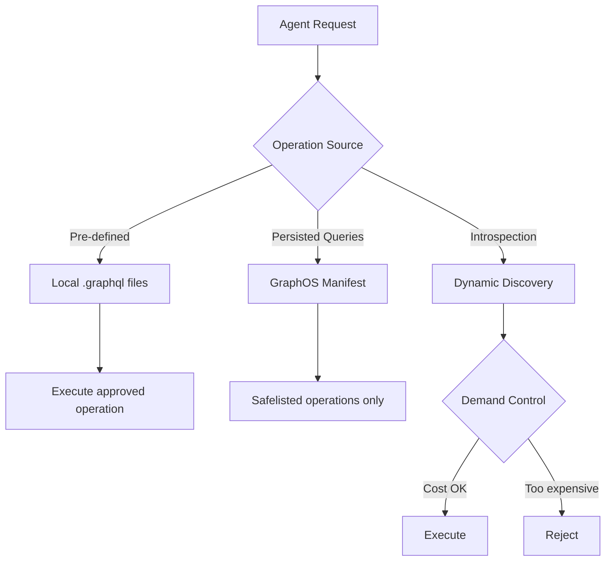

# Codex CLI for GraphQL Development: Apollo Skills, MCP Server Integration, and Schema-Driven Workflows


---

GraphQL APIs demand precision that free-form code generation struggles to deliver. A misnamed field, an incorrect nullability annotation, or a resolver that silently drops pagination cursors can cascade into production failures that schema validation alone cannot catch. Codex CLI, combined with Apollo's recently launched agent skills and MCP server, creates a development workflow where the agent understands GraphQL conventions, validates operations against live schemas, and enforces architectural boundaries — all without leaving the terminal.

This article covers the full stack: installing Apollo Skills for schema-aware code generation, configuring the Apollo MCP Server for runtime schema introspection and operation execution, encoding GraphQL conventions in `AGENTS.md`, and wiring the whole thing into CI.

## Apollo Skills: Schema-Aware Agent Knowledge

Apollo released their agent skills library in early 2026 [^1], providing structured knowledge modules that activate contextually when Codex encounters GraphQL-related tasks. The library currently ships 11 skills covering the full Apollo ecosystem [^2]:

| Skill | Coverage |
|---|---|
| `graphql-schema` | Type design, naming conventions, pagination patterns, error handling |
| `graphql-operations` | Query/mutation patterns, fragments, variables, error management |
| `apollo-client` | React integration, caching, local state management |
| `apollo-server` | Resolvers, authentication, plugins, subscriptions |
| `apollo-connectors` | REST-to-GraphQL via `@source` and `@connect` directives |
| `apollo-federation` | Subgraph schemas, entities, `@key`, `@shareable` |
| `apollo-router` | Supergraph routing, demand control, configuration |
| `apollo-mcp-server` | MCP configuration guidance |
| `apollo-ios` / `apollo-kotlin` | Mobile client patterns |
| `rover` | Schema management, composition, local supergraph dev |

### Installation for Codex CLI

```bash
npx skills add apollographql/skills
```

The interactive installer detects Codex CLI and places skill files in the appropriate location [^2]. Skills activate automatically when relevant — ask Codex to design a schema and the `graphql-schema` skill loads; ask it to wire up a resolver and `apollo-server` activates. Each skill weighs under 5,000 tokens, so activation is lightweight [^1].

For version pinning in team environments:

```bash
gh skill install apollographql/skills --pin v1.0.0 --agent codex
```

## Apollo MCP Server: Runtime Schema Intelligence

Skills provide knowledge; the Apollo MCP Server provides capabilities [^3]. It exposes GraphQL operations as MCP tools that Codex can call directly, turning schema introspection, validation, and query execution into first-class agent actions.

### Configuration

Add the MCP server to your Codex configuration:

```toml
# ~/.codex/config.toml (global) or .codex/config.toml (project)

[mcp_servers.apollo]
command = "npx"
args = ["-y", "@apollo/mcp-server", "--config", "./apollo-mcp.yaml"]
```

The server configuration itself lives in a YAML file [^4]:

```yaml
# apollo-mcp.yaml
graphql:
  endpoint: http://localhost:4000/graphql

operations:
  source: local
  paths:
    - ./operations/queries/*.graphql
    - ./operations/mutations/*.graphql

introspection:
  execute:
    enabled: true
  search:
    enabled: true
  validate:
    enabled: true

overrides:
  mutation_mode: explicit
```

This configuration exposes four runtime tools to Codex [^5]:

- **introspect** — navigate the schema type-by-type
- **search** — semantic discovery across types and fields
- **validate** — pre-execution operation checking against the live schema
- **execute** — run approved operations and return typed results

### Security: Three Access Patterns

The MCP server implements three escalating access patterns [^3][^5]:



**Pre-defined operations** are the safest starting point. Each `.graphql` file becomes an MCP tool with a typed input schema derived from the operation's variables. Non-null types become required parameters; nullable types with defaults become optional [^5].

**Persisted queries** from GraphOS provide safelisting — the Router only accepts operations registered in the manifest [^4].

**Dynamic introspection** offers the most flexibility but requires demand control. Apollo Router's `@cost` and `@listSize` directives gate expensive operations before execution [^5]:

```graphql
type Query {
  users(first: Int!): UserConnection!
    @listSize(assumedSize: 50, slicingArguments: ["first"])
}

type User @cost(weight: 2) {
  id: ID!
  orders: [Order!]! @cost(weight: 5)
}
```

### Mutation Safety

By default, the MCP server blocks all mutations (`mutation_mode: none`). For development workflows, set `mutation_mode: explicit` to allow only mutations defined in your local `.graphql` files whilst keeping introspection read-only [^5]. Never use `mutation_mode: all` in shared environments.

## GraphOS MCP Tools: Documentation Access

Separately from the self-hosted MCP server, Apollo provides hosted MCP tools for documentation access [^6]. These require no authentication and give Codex searchable access to Apollo's full documentation:

```bash
codex mcp add graphos-tools --url https://mcp.apollographql.com
```

This adds three tools: documentation search, full-page retrieval, and the Connectors specification [^6]. Useful when Codex needs to reference Apollo best practices mid-task without you pasting documentation links.

## Encoding GraphQL Conventions in AGENTS.md

Apollo Skills provide general GraphQL knowledge, but your project's specific conventions belong in `AGENTS.md` [^7]. A GraphQL-focused configuration might include:

```markdown
# AGENTS.md

## GraphQL Schema Conventions

- Use Relay-style cursor pagination (`Connection`/`Edge`/`PageInfo`) for all list fields
- Prefix mutation inputs with the mutation name: `CreateUserInput`, `UpdateOrderInput`
- Return union types for mutation results: `CreateUserPayload = User | ValidationError`
- Mark all ID fields as `ID!`, never `String!`
- Use `@deprecated(reason: "...")` before removing fields; minimum 90-day sunset

## Federation Boundaries

- Each subgraph owns exactly one domain entity as its `@key` root
- Never reference another subgraph's internal types directly
- Use `@shareable` only for genuinely cross-cutting value types (e.g., `Money`, `Address`)

## Forbidden Patterns

- No `JSON` scalar types — use typed objects instead
- No deeply nested input types (max 3 levels)
- No queries returning unbounded lists without pagination
```

Codex reads these rules before every task [^7], meaning schema generation, resolver scaffolding, and code reviews all respect your conventions without repeated prompting.

## Practical Workflows

### Schema-First Development with Validation

Start with a schema design task and let Codex validate against the live endpoint:

```bash
codex "Design a GraphQL schema for the payments domain following our
AGENTS.md conventions. Validate all operations against the running
dev server using the Apollo MCP tools before finalising."
```

With both Apollo Skills and the MCP server configured, Codex will:

1. Generate schema types following the `graphql-schema` skill's patterns
2. Create operations (queries, mutations) following `graphql-operations` conventions
3. Call the MCP `validate` tool to check operations against the live schema
4. Fix any validation errors before presenting the result

### Federation Subgraph Scaffolding

```bash
codex "Scaffold a new 'inventory' subgraph following our federation
conventions. Include entity definitions with @key, reference resolvers,
and a docker-compose entry for local supergraph composition with Rover."
```

The `apollo-federation` skill provides entity patterns, `@key` directive usage, and `@shareable` rules. The `rover` skill handles composition commands [^2].

### Batch Operation Auditing with `codex exec`

For CI integration, audit all operations against schema conventions in non-interactive mode [^8]:

```bash
codex exec \
  --model o4-mini \
  --approval-mode full-auto \
  --output-schema '{"type":"object","properties":{"operations":{"type":"array","items":{"type":"object","properties":{"file":{"type":"string"},"issues":{"type":"array","items":{"type":"string"}},"severity":{"type":"string","enum":["error","warning","info"]}}}},"summary":{"type":"string"}}}' \
  "Audit all .graphql files in operations/ against our AGENTS.md
   GraphQL conventions. Check naming, pagination patterns, nullability,
   and deprecated field usage. Use the Apollo MCP validate tool to
   verify each operation compiles against the schema."
```

The structured output feeds directly into CI reporting.

### Reusable GraphQL Auditor Skill

Encode the audit workflow as a reusable skill [^9]:

```markdown
<!-- .codex/skills/graphql-auditor.md -->
---
title: GraphQL Schema Auditor
trigger: graphql audit, schema review, operation check
---

## Process

1. Read AGENTS.md for project GraphQL conventions
2. List all .graphql files in the operations/ directory
3. For each operation file:
   a. Check naming conventions match AGENTS.md rules
   b. Verify pagination patterns use Relay cursors
   c. Validate against live schema using Apollo MCP validate tool
   d. Flag deprecated field usage
4. Output structured findings as JSON with file, issues, severity
5. Summarise total errors, warnings, and pass rate
```

## CI Integration

Wire the auditor into GitHub Actions [^10]:


```yaml
# .github/workflows/graphql-audit.yml
name: GraphQL Schema Audit
on:
  pull_request:
    paths:
      - 'operations/**/*.graphql'
      - 'schema/**/*.graphql'

jobs:
  audit:
    runs-on: ubuntu-latest
    steps:
      - uses: actions/checkout@v4

      - name: Start dev server
        run: docker compose up -d graphql-server

      - name: Run GraphQL audit
        env:
          CODEX_API_KEY: ${{ secrets.CODEX_API_KEY }}
        run: |
          npx codex exec \
            --model o4-mini \
            --approval-mode full-auto \
            "Run the graphql-auditor skill and fail if any
             errors are found. Output results to audit-report.json."

      - name: Check results
        run: |
          if jq -e '.operations[] | select(.severity == "error")' audit-report.json > /dev/null 2>&1; then
            echo "::error::GraphQL audit found schema errors"
            jq '.operations[] | select(.severity == "error")' audit-report.json
            exit 1
          fi
```


## Model Selection

| Task | Recommended Model | Rationale |
|---|---|---|
| Schema design and review | GPT-5.5 or o3 | Complex architectural reasoning about type relationships [^11] |
| Operation validation | o4-mini | Mechanical checking suits a faster, cheaper model |
| Federation planning | o3 | Cross-subgraph boundary decisions need deeper reasoning |
| Batch CI auditing | o4-mini | Cost-effective for repetitive validation passes |

## Anti-Patterns

**Trusting generated schemas without validation.** Always validate against a running endpoint. The MCP `validate` tool exists precisely for this — use it.

**Exposing `mutation_mode: all` in shared environments.** Dynamic mutation access lets the agent execute arbitrary writes. Use `explicit` mode and define mutations as `.graphql` files.

**Skipping demand control with introspection enabled.** Without `@cost` and `@listSize` directives, an agent can construct queries that exhaust your API. Configure Apollo Router's demand control before enabling dynamic introspection [^5].

**Over-relying on skills without project-specific AGENTS.md.** Apollo Skills encode general best practices. Your project's pagination style, naming conventions, and federation boundaries must be in `AGENTS.md` to override generic patterns.

**Using Codex to generate persisted query manifests.** Manifests are security boundaries — generate them through your existing CI pipeline and Apollo GraphOS, not through agent output.

## Known Limitations

- **`--output-schema` and `--resume` are mutually exclusive** — structured audit output cannot be resumed from a prior session [^8]
- **MCP and `--output-schema` conflict** — when using `--output-schema`, MCP tool calls may behave unexpectedly; test your pipeline thoroughly ⚠️
- **Context window pressure** — large schemas (500+ types) may require `/compact` or selective introspection rather than full schema loading
- **Non-deterministic generation** — schema design suggestions vary between runs; pin to specific model versions for reproducible CI results
- **Sandbox network isolation** — in `full-auto` mode, the sandbox restricts network access; ensure your GraphQL endpoint is reachable from the sandbox configuration [^8]

## Citations

[^1]: Apollo GraphQL Blog, "Apollo Skills: Teaching AI Agents How to Use Apollo and GraphQL", 2026. [https://www.apollographql.com/blog/apollo-skills-teaching-ai-agents-how-to-use-apollo-and-graphql](https://www.apollographql.com/blog/apollo-skills-teaching-ai-agents-how-to-use-apollo-and-graphql)

[^2]: Apollo GraphQL, "apollographql/skills — GitHub Repository", 2026. [https://github.com/apollographql/skills](https://github.com/apollographql/skills)

[^3]: Apollo GraphQL Blog, "Building a Secure AI Agent API Stack with GraphQL, Apollo Skills, and MCP Server", 2026. [https://www.apollographql.com/blog/building-a-secure-ai-agent-api-stack-with-graphql-apollo-skills-and-mcp-server](https://www.apollographql.com/blog/building-a-secure-ai-agent-api-stack-with-graphql-apollo-skills-and-mcp-server)

[^4]: Apollo GraphQL Docs, "Apollo MCP Server", 2026. [https://www.apollographql.com/docs/apollo-mcp-server](https://www.apollographql.com/docs/apollo-mcp-server)

[^5]: Apollo GraphQL Blog, "Connect AI Agents to Your GraphQL API Using MCP and Type-Safe Tool Configuration", 2026. [https://www.apollographql.com/blog/connect-ai-agents-to-your-graphql-api-using-mcp-and-type-safe-tool-configuration](https://www.apollographql.com/blog/connect-ai-agents-to-your-graphql-api-using-mcp-and-type-safe-tool-configuration)

[^6]: Apollo GraphQL Docs, "GraphOS MCP Tools", 2026. [https://www.apollographql.com/docs/graphos/platform/graphos-mcp-tools](https://www.apollographql.com/docs/graphos/platform/graphos-mcp-tools)

[^7]: OpenAI Developers, "Custom instructions with AGENTS.md — Codex", 2026. [https://developers.openai.com/codex/guides/agents-md](https://developers.openai.com/codex/guides/agents-md)

[^8]: OpenAI Developers, "Non-interactive mode — Codex CLI", 2026. [https://developers.openai.com/codex/cli/reference](https://developers.openai.com/codex/cli/reference)

[^9]: OpenAI Developers, "Agent Skills — Codex", 2026. [https://developers.openai.com/codex/skills](https://developers.openai.com/codex/skills)

[^10]: OpenAI Developers, "Features — Codex CLI", 2026. [https://developers.openai.com/codex/cli/features](https://developers.openai.com/codex/cli/features)

[^11]: OpenAI Developers, "CLI — Codex", 2026. [https://developers.openai.com/codex/cli](https://developers.openai.com/codex/cli)
