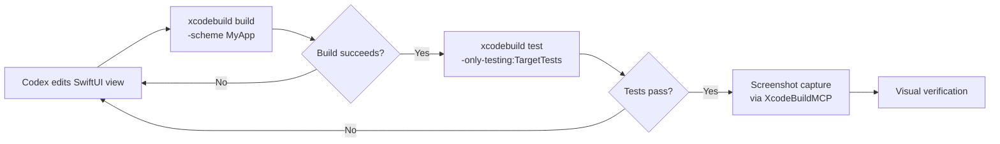
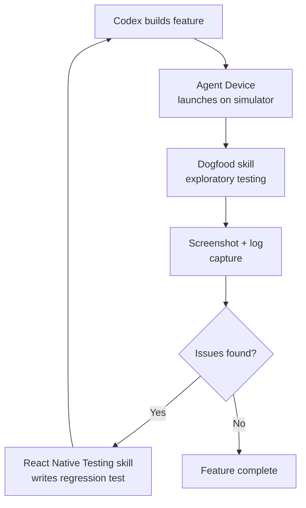

# Codex CLI for Mobile Development: iOS with XcodeBuildMCP, Android CLI Skills, and React Native Plugin Workflows


---

Mobile development has historically been hostile to terminal-first agent workflows. Platform toolchains assume GUI interaction, build systems are opaque, and validation requires simulators or physical devices. Yet Codex CLI now supports genuine end-to-end mobile development across iOS, Android, and cross-platform frameworks — not through brittle workarounds, but through purpose-built MCP servers, platform-native CLIs, and community plugins that keep the agent in a tight build-test-iterate loop.

This article covers the three pillars of Codex CLI mobile development in 2026: XcodeBuildMCP for iOS and macOS, Google's Android CLI with its skills and knowledge base system, and Callstack's React Native plugins for cross-platform work.

## iOS Development: XcodeBuildMCP and CLI-First SwiftUI

OpenAI's official guidance for iOS development with Codex is explicit: stay CLI-first [^1]. The recommended stack centres on SwiftUI for UI, `xcodebuild` or Tuist for builds, and XcodeBuildMCP for the agentic feedback loop.

### XcodeBuildMCP Configuration

XcodeBuildMCP is a Model Context Protocol server maintained by Sentry that provides Codex with scheme inspection, simulator control, screenshot capture, and build automation [^2]. Installation is straightforward:

```bash
brew tap getsentry/xcodebuildmcp
brew install xcodebuildmcp
```

Configure it in your project's `.codex/config.toml`:

```toml
[mcp_servers.xcodebuildmcp]
command = "npx"
args = ["-y", "xcodebuildmcp@latest", "mcp"]
```

Alternatively, XcodeBuildMCP v2.1.0+ ships an `init` subcommand that auto-detects Codex CLI and writes the configuration automatically [^2].

### The CLI-First Build Loop

The key principle is maintaining a tight validation loop after every change. OpenAI recommends running the narrowest command that proves the affected contract, expanding to broader builds only after narrower checks pass [^1]:



### AGENTS.md for iOS Projects

A well-structured `AGENTS.md` for an iOS project encodes build commands, conventions, and constraints that Codex needs:

```markdown
# Project: MyApp (iOS)

## Build
- `xcodebuild -scheme MyApp -destination 'platform=iOS Simulator,name=iPhone 16'`
- Always use `xcodebuild`, never open Xcode GUI
- Target iOS 18+ deployment

## Conventions
- SwiftUI only — no UIKit unless wrapping a legacy component
- Use @Observable and @Environment for state management
- Prefer Tuist for project generation over manual .xcodeproj edits

## Testing
- `xcodebuild test -scheme MyAppTests`
- Run tests after every structural change
```

### Recommended Skills

OpenAI documents several iOS-specific skills that Codex can leverage [^1]:

| Skill | Purpose |
|-------|---------|
| SwiftUI expert | General best practices and conventions |
| Liquid Glass expert | iOS 26+ design API adoption |
| SwiftUI performance audit | View update bottleneck identification |
| Swift concurrency expert | Async/await and compiler warning resolution |
| SwiftUI view refactor | File decomposition and consistency |

These skills follow the Agent Skills open standard and can be installed via `android skills add` or placed directly in `.agents/skills/` [^3].

## Android Development: Google's Android CLI

Google launched Android CLI on 16 April 2026 as an official command-line interface purpose-built for agent workflows [^4]. It wraps `sdkmanager`, `avdmanager`, `adb`, and parts of Gradle into a single `android` binary, reducing LLM token usage by 70% compared to raw tool invocations [^4].

### Installation and Agent Setup

```bash
# Download from developer.android.com/tools/agents
# Then initialise for agent use:
android init
```

The `init` command installs the `android-cli` skill into detected agents, including Codex CLI [^5]. Skills are placed in the agent's standard skill directory — for Codex, that means `.agents/skills/`.

### Core Workflow

Android CLI provides a complete development workflow from project creation through deployment:

```bash
# Scaffold a new project
android create --output=./MyApp --name=com.example.myapp empty-activity-agp-9

# Install required SDK packages
android sdk install platforms/android-35 build-tools/35.0.0

# Create and start an emulator
android emulator create --profile=medium_phone
android emulator start medium_phone

# Build with Gradle (no dedicated subcommand — edit build.gradle.kts directly)
cd MyApp && ./gradlew assembleDebug

# Deploy to emulator
android run --apks=app/build/outputs/apk/debug/app-debug.apk
```

### The Knowledge Base

Android CLI includes a built-in documentation search that queries the Android Knowledge Base — current guidance from developer.android.com, Firebase, Google Developers, and Kotlin docs [^5]:

```bash
# Search for guidance
android docs search 'Jetpack Compose performance optimisation'

# Fetch specific topic using kb:// URL
android docs fetch kb://android/topic/performance/overview
```

This is particularly valuable for Codex sessions because it provides authoritative, up-to-date context without consuming web search credits or risking stale documentation.

### Skills System

Google's skills follow the same SKILL.md standard used by Codex, Claude Code, and other agents [^4]:

```bash
# List available skills
android skills list --long

# Search for relevant skills
android skills find 'edge-to-edge'

# Install specific skills for Codex
android skills add --agent='codex' edge-to-edge

# Install all skills
android skills add --all
```

### Screen Capture and UI Automation

Android CLI provides agent-friendly UI interaction tools that Codex can use for visual verification [^5]:

```bash
# Capture screenshot with annotated UI element labels
android screen capture --annotate --output=annotated.png

# Get UI layout hierarchy as JSON
android layout --output=hierarchy.json

# Resolve visual label to tap coordinates
android screen resolve --screenshot=annotated.png --string="input tap #5"
```

The `--annotate` flag draws labelled bounding boxes around UI elements, giving Codex a visual reference for the current screen state — essential for verifying layout changes without manual inspection.

### AGENTS.md for Android Projects

```markdown
# Project: MyApp (Android)

## Build
- `./gradlew assembleDebug` for debug builds
- `./gradlew test` for unit tests
- `android run --apks=app/build/outputs/apk/debug/app-debug.apk` for deployment

## Conventions
- Kotlin only — no Java for new code
- Jetpack Compose for all UI
- Use `android docs search` before implementing unfamiliar APIs
- Target API 35+, minSdk 28

## Validation
- After UI changes: `android screen capture --annotate --output=screen.png`
- After layout changes: `android layout --diff`
```

## Cross-Platform: React Native with Callstack Plugins

Callstack released two Codex plugins in 2026 that bundle expertise for React Native development and testing [^6].

### Installation

```bash
# Install plugins
npx codex-plugin add callstackincubator/agent-skills

# Or project-specific
npx codex-plugin add callstackincubator/agent-skills --project
```

### Building React Native Apps Plugin

This plugin bundles three skills [^6]:

- **Callstack Best Practices** — performance-focused guidance covering profiling, startup time, rendering behaviour, memory issues, bundle size, and native integration trade-offs
- **Vercel Best Practices** — architectural patterns covering app structure and development approaches
- **Upgrading React Native** — structured version migration support including template comparisons, dependency alignment, and platform-specific changes

### Testing React Native Apps Plugin

The testing plugin combines test authoring with device automation [^6]:

- **React Native Testing** — test structure and assertions using React Native Testing Library
- **Agent Device** — simulator, emulator, and physical device interaction: app launch, navigation, input, screenshots, logs, performance analysis, and UI inspection
- **Dogfood** — turns the agent into an exploratory QA tester powered by Agent Device



## Sandbox Considerations

Mobile development workflows require careful sandbox configuration because build tools need filesystem access beyond the working directory and network access for dependency resolution [^7]:

```toml
# .codex/config.toml for mobile projects
sandbox_mode = "workspace-write"

[sandbox_workspace_write]
writable_roots = [
    "~/Library/Developer/CoreSimulator",   # iOS Simulator data
    "~/.android",                           # Android SDK and AVD
    "~/.gradle",                            # Gradle caches
    "/tmp"
]
network_access = true  # Required for pod install, gradle sync
```

For teams requiring tighter controls, consider using permission profiles that grant network access only during dependency resolution phases [^8].

## Model Selection for Mobile Work

Mobile development sessions tend to be context-heavy — build system configuration, platform APIs, and UI framework patterns all compete for the context window. The model selection matrix matters:

| Task | Recommended Model | Rationale |
|------|-------------------|-----------|
| Greenfield scaffolding | GPT-5.5 | Complex multi-file generation benefits from stronger reasoning [^9] |
| UI iteration | GPT-5.3-Codex | Faster turnaround for incremental SwiftUI/Compose edits [^9] |
| Build debugging | GPT-5.5 | Build system errors require broader context understanding [^9] |
| Test generation | GPT-5.3-Codex | Pattern-following task, speed matters more than reasoning [^9] |

Switch models mid-session with `/model` when transitioning between task types.

## Practical Workflow: End-to-End iOS Feature

Here is a complete workflow for adding a new feature to an existing iOS project:

```bash
# Start Codex with XcodeBuildMCP configured
codex --profile ios

# Prompt
"Add a settings screen with dark mode toggle and notification preferences.
Use @Observable for state. Write the view, the model, and a unit test.
Build and run in Simulator after each change."
```

Codex will:
1. Create the `SettingsView.swift` and `SettingsModel.swift` files
2. Run `xcodebuild build` via XcodeBuildMCP to verify compilation
3. Write `SettingsModelTests.swift` and run targeted tests
4. Launch the Simulator and capture a screenshot for visual verification
5. Iterate if any step fails

The entire loop stays terminal-first. No Xcode GUI interaction required.

## Anti-Patterns

- **Opening Xcode GUI mid-session.** This breaks the agent's understanding of project state. Stick to `xcodebuild` and XcodeBuildMCP.
- **Skipping `android init`.** Without it, Codex lacks the Android CLI skill and falls back to raw `adb` commands — verbose and error-prone.
- **Full project builds after every edit.** Use targeted scheme and test builds. Full builds waste tokens and time.
- **Ignoring platform-specific AGENTS.md.** Mobile projects need explicit build commands and deployment targets. Generic AGENTS.md files lead to the agent guessing at platform conventions.
- **Running without `network_access = true`.** Pod install, Gradle sync, and SPM resolution all require network. Sandbox failures here are cryptic and waste entire turns.

## Known Limitations

- **Android CLI has no `gradle` subcommand.** When Codex needs to modify dependencies or build flavours, it must edit `build.gradle.kts` directly [^5]. This works but lacks the validation that a dedicated command would provide.
- **XcodeBuildMCP requires macOS.** There is no Linux or Windows equivalent for iOS builds. CI workflows need macOS runners.
- **Android CLI disables `android emulator` on Windows** [^5]. Windows users must use physical devices or WSL with Android SDK.
- **Context window pressure.** Mobile projects with complex build systems can exhaust context quickly. Use `model_auto_compact_token_limit` aggressively and keep AGENTS.md concise.

## Citations

[^1]: OpenAI, "Build for iOS — Codex Use Cases," developers.openai.com/codex/use-cases/native-ios-apps (accessed 2026-05-18)
[^2]: Sentry, "XcodeBuildMCP — MCP server for iOS/macOS projects," github.com/getsentry/XcodeBuildMCP (accessed 2026-05-18)
[^3]: OpenAI, "Agent Skills — Codex," developers.openai.com/codex/skills (accessed 2026-05-18)
[^4]: Google, "Android CLI and skills: Build Android apps 3x faster using any agent," android-developers.googleblog.com/2026/04/build-android-apps-3x-faster-using-any-agent.html (accessed 2026-05-18)
[^5]: Google, "Overview of Android CLI," developer.android.com/tools/agents/android-cli (accessed 2026-05-18)
[^6]: Callstack, "Announcing Codex Plugins for React Native Development," callstack.com/blog/announcing-codex-plugins-for-react-native-development (accessed 2026-05-18)
[^7]: OpenAI, "Sandbox — Codex Concepts," developers.openai.com/codex/concepts/sandboxing (accessed 2026-05-18)
[^8]: OpenAI, "Advanced Configuration — Codex," developers.openai.com/codex/config-advanced (accessed 2026-05-18)
[^9]: OpenAI, "Models — Codex," developers.openai.com/codex/models (accessed 2026-05-18)
