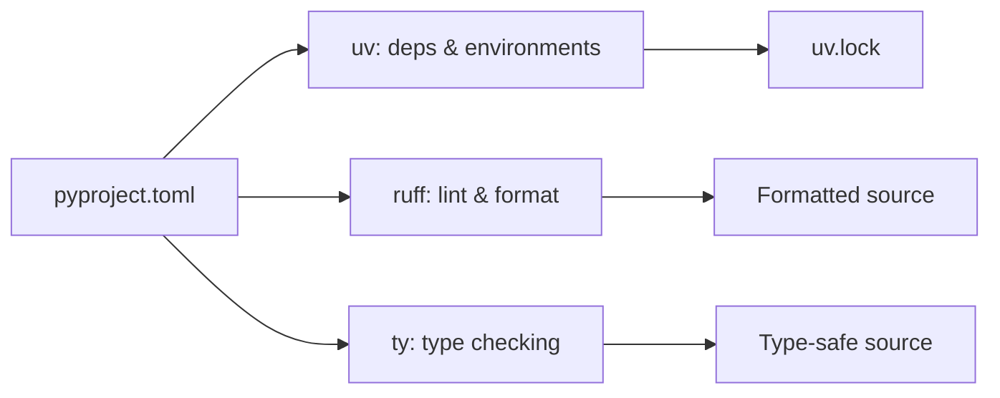
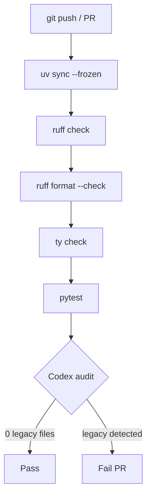

# Codex CLI for Python Project Modernisation: Migrating to uv, Ruff, and ty with Automated Auditing and CI Enforcement


---

## The Astral–OpenAI Convergence

On 19 March 2026, Astral announced it had entered into an agreement to join OpenAI as part of the Codex team [^1]. The deal brought three tools that had already accumulated hundreds of millions of monthly downloads — **uv** (package and project manager), **Ruff** (linter and formatter), and **ty** (type checker) — under the same roof as the agent that generates and modifies Python code [^2]. All three remain open source under their existing licences [^1].

The strategic implication is straightforward: Codex can now lint, format, type-check, and resolve dependencies with tooling it controls, tightening the feedback loop between code generation and code quality. This article shows how to use Codex CLI to audit a legacy Python project, migrate it to the Astral toolchain, and enforce the new standards in CI.

## The Modern Python Toolchain in 2026

Before touching Codex, it helps to understand what each tool replaces.

| Tool | Replaces | Speed Claim |
|------|----------|-------------|
| **uv** (v0.11.x) | pip, pip-tools, virtualenv, pyenv, pipx | 10–100× faster than pip [^3] |
| **Ruff** (v0.15.x) | flake8, isort, black, pylint, autoflake | ~100× faster than flake8 + black [^4] |
| **ty** (beta) | mypy, pyright | ~7× faster than mypy [^5] |

All three are single Rust binaries configured in **pyproject.toml** — one file to rule the entire toolchain [^6].



## Encoding Standards in AGENTS.md

The first step in any Codex-assisted migration is encoding your target conventions so the agent follows them consistently. Create or update your project-root `AGENTS.md`:

```markdown
# Python Standards

## Toolchain
- Package management: `uv` (never pip, never conda)
- Linting and formatting: `ruff check .` and `ruff format .`
- Type checking: `ty check`
- All configuration lives in `pyproject.toml` — no setup.py, setup.cfg, tox.ini, or .flake8

## Environment
- Python 3.12 via `uv python install 3.12`
- Virtual environment created by `uv sync`
- Lock file: `uv.lock` (always committed)

## Commands
- Install: `uv sync`
- Lint: `uv run ruff check . --fix`
- Format: `uv run ruff format .`
- Type check: `uv run ty check`
- Test: `uv run pytest`

## Rules
- No `requirements.txt` — use `pyproject.toml` [project.dependencies]
- No `setup.py` — use PEP 621 metadata in pyproject.toml
- Ruff rule set: extend defaults with `I` (isort), `UP` (pyupgrade), `PT` (pytest-style)
- ty errors are blocking; warnings are advisory during migration
```

Codex reads this file on every session start and follows it for all code modifications [^7]. Because AGENTS.md files are hierarchical, you can add subdirectory overrides — for example, relaxing `ty` strictness in a `legacy/` subtree with a local `legacy/AGENTS.md` file [^7].

## Auditing the Legacy Project

### Interactive Audit

Start a Codex session in the project root:

```bash
codex
```

Then prompt:

> Audit this Python project for modernisation opportunities. Identify: (1) whether it uses setup.py, setup.cfg, or requirements.txt instead of pyproject.toml, (2) any pip/virtualenv/pyenv usage that should be replaced with uv, (3) flake8/black/isort/pylint config that should be consolidated into ruff, (4) mypy/pyright config that should move to ty, (5) any Python version pins below 3.12.

Codex will walk the repository, inspect configuration files, and produce a structured summary of modernisation targets.

### Structured Batch Audit with `codex exec`

For CI integration or repeatable audits, use `codex exec` with `--output-schema`:

```bash
codex exec \
  --model o4-mini \
  --output-schema '{"type":"object","properties":{"legacy_packaging":{"type":"array","items":{"type":"object","properties":{"file":{"type":"string"},"issue":{"type":"string"},"action":{"type":"string"}}}},"legacy_linting":{"type":"array","items":{"type":"object","properties":{"file":{"type":"string"},"tool":{"type":"string"},"replacement":{"type":"string"}}}},"legacy_typing":{"type":"array","items":{"type":"object","properties":{"file":{"type":"string"},"tool":{"type":"string"},"replacement":{"type":"string"}}}},"python_version":{"type":"string"},"total_issues":{"type":"integer"}},"required":["legacy_packaging","legacy_linting","legacy_typing","total_issues"]}' \
  "Audit this Python project for modernisation. Find legacy packaging (setup.py, requirements.txt, setup.cfg), legacy linting (flake8, black, isort, pylint), and legacy typing (mypy, pyright) that should migrate to uv, ruff, and ty respectively."
```

The structured JSON output can be piped to downstream tooling or stored as an audit trail [^8].

## Migration Workflow

### Step 1: Packaging — setup.py to pyproject.toml

Prompt Codex interactively:

> Migrate this project from setup.py to pyproject.toml using PEP 621 metadata. Use hatchling as the build backend. Convert all dependencies from requirements.txt to [project.dependencies]. Generate a uv.lock by running `uv lock`. Remove setup.py, setup.cfg, and requirements.txt once pyproject.toml is verified.

Codex will:
1. Parse existing `setup.py` / `setup.cfg` / `requirements.txt`
2. Generate a compliant `pyproject.toml` with `[build-system]`, `[project]`, and `[project.optional-dependencies]`
3. Run `uv lock` to resolve and pin dependencies
4. Verify the lock file resolves cleanly before removing legacy files

### Step 2: Linting — flake8/black/isort to Ruff

```bash
codex exec \
  --model o4-mini \
  "Consolidate all linting and formatting config into [tool.ruff] in pyproject.toml. Migrate rules from .flake8, pyproject.toml [tool.black], and pyproject.toml [tool.isort]. Enable rule sets: E, F, W, I, UP, PT, B, SIM. Set line-length to 88. Remove .flake8 and any standalone isort/black config. Run ruff check --fix and ruff format on the entire codebase."
```

The key Ruff configuration section in `pyproject.toml`:

```toml
[tool.ruff]
line-length = 88
target-version = "py312"

[tool.ruff.lint]
select = ["E", "F", "W", "I", "UP", "PT", "B", "SIM"]
ignore = ["E501"]  # line length handled by formatter

[tool.ruff.lint.isort]
known-first-party = ["myproject"]

[tool.ruff.format]
quote-style = "double"
```

### Step 3: Type Checking — mypy to ty

ty uses a gradual guarantee: adding type annotations to working code never introduces new errors [^5]. This makes migration predictable.

```toml
[tool.ty]
python-version = "3.12"

[tool.ty.rules]
# Start permissive, tighten over time
unresolved-attribute = "warn"
invalid-assignment = "error"
unresolved-import = "error"

[[tool.ty.overrides]]
include = ["src/legacy/**"]
rules = { unresolved-attribute = "ignore", invalid-assignment = "warn" }
```

Prompt Codex:

> Remove mypy.ini and any [tool.mypy] sections. Add [tool.ty] configuration to pyproject.toml. Run `ty check` and fix any errors. For warnings in legacy modules, add a ty override section to ignore them during migration.

## Reusable Codex Skill

Create `.codex/skills/python-moderniser/SKILL.md`:

```markdown
# Python Moderniser

## When to use
When auditing or migrating Python projects to the modern Astral toolchain.

## Steps
1. Check for legacy packaging (setup.py, requirements.txt, setup.cfg)
2. Check for legacy linting (flake8, black, isort, pylint, .flake8)
3. Check for legacy typing (mypy, pyright, mypy.ini)
4. Generate pyproject.toml with uv, ruff, and ty configuration
5. Run `uv lock`, `ruff check --fix`, `ruff format .`, `ty check`
6. Verify all tools pass before removing legacy config

## Constraints
- Never remove legacy files until replacements are verified
- Always commit uv.lock
- Preserve all dependency version constraints during migration
- Use PEP 621 metadata format
```

Skills are loaded when Codex identifies a matching task, giving the agent a repeatable playbook across repositories [^9].

## PostToolUse Hook for Lint Enforcement

To prevent Codex from introducing code that fails Ruff or ty, add a `PostToolUse` hook that runs after every file modification:

```toml
[[hooks.PostToolUse]]
matcher = "^(apply_patch|write)$"

[[hooks.PostToolUse.hooks]]
type = "command"
command = "uv run ruff check --quiet . && uv run ruff format --check --quiet . && uv run ty check --quiet"
timeout = 60
statusMessage = "Running ruff + ty checks"
```

If the hook exits non-zero, Codex receives the failure output and automatically attempts to fix the issue before proceeding [^10]. This creates a tight feedback loop where generated code is continuously validated against your project standards.

## CI Enforcement Pipeline


```yaml
# .github/workflows/python-quality.yml
name: Python Quality Gate
on: [push, pull_request]

jobs:
  quality:
    runs-on: ubuntu-latest
    steps:
      - uses: actions/checkout@v4

      - name: Install uv
        uses: astral-sh/setup-uv@v6
        with:
          version: "0.11"

      - name: Install dependencies
        run: uv sync --frozen

      - name: Ruff lint
        run: uv run ruff check .

      - name: Ruff format check
        run: uv run ruff format --check .

      - name: Type check
        run: uv run ty check

      - name: Tests
        run: uv run pytest --tb=short

      - name: Codex modernisation audit
        if: github.event_name == 'pull_request'
        env:
          CODEX_API_KEY: ${{ secrets.CODEX_API_KEY }}
        run: |
          npx codex exec \
            --model o4-mini \
            --output-schema '{"type":"object","properties":{"legacy_files":{"type":"array","items":{"type":"string"}},"issues":{"type":"integer"}},"required":["legacy_files","issues"]}' \
            "Check if any legacy Python packaging, linting, or typing config files have been reintroduced (setup.py, requirements.txt, .flake8, mypy.ini). List any found." \
          | jq -e '.issues == 0'
```


The final step uses `codex exec` as a semantic guard — catching regressions that static tools miss, such as a developer adding a `requirements.txt` "just for Docker" [^8].



## Model Selection

| Task | Recommended Model | Rationale |
|------|-------------------|-----------|
| Interactive migration | o3 | Complex refactoring benefits from deeper reasoning [^11] |
| Batch audit (`codex exec`) | o4-mini | Structured output, lower cost, sufficient for pattern matching [^11] |
| PostToolUse hook validation | N/A | Hooks run external tools, not model inference |
| CI semantic guard | o4-mini | Cost-effective for yes/no regression checks [^11] |

## Anti-Patterns

- **Big-bang migration**: Migrating packaging, linting, and typing simultaneously in one commit. Migrate sequentially — packaging first, then linting, then typing — with passing CI at each stage.
- **Deleting legacy config before verification**: Always run the replacement tooling successfully before removing old configuration files.
- **Ignoring uv.lock**: The lock file must be committed. Without it, `uv sync --frozen` in CI has nothing to resolve against [^3].
- **Treating ty warnings as blocking immediately**: ty's gradual guarantee means you can start with permissive rules and tighten over time. Blocking on all warnings in a partially-typed codebase creates migration paralysis [^5].
- **Skipping AGENTS.md**: Without encoded conventions, Codex may revert to generating `pip install` commands or `requirements.txt` files in subsequent sessions.

## Known Limitations

- **`--output-schema` and `--resume` are mutually exclusive**: Structured audit output cannot be used with session resumption [^8]. ⚠️
- **Context window constraints**: Large monorepos with hundreds of Python files may exceed the context window during a single audit pass. Use subdirectory-scoped audits or goal-mode for long-horizon migrations.
- **ty is in beta**: Some edge cases in complex type patterns (recursive generics, advanced Protocol usage) may produce false positives [^5]. ⚠️
- **Sandbox network isolation**: `uv lock` and `uv sync` require network access. Use `sandbox_mode = "permissive"` or pre-populate the uv cache before running in a restricted sandbox.
- **Astral–OpenAI deal pending regulatory approval**: As of May 2026, the acquisition has not formally closed [^1]. ⚠️ The tools remain independently usable regardless of the deal's outcome.

## Citations

[^1]: Astral, "Astral to join OpenAI," astral.sh/blog/openai, March 2026.
[^2]: DEV Community, "OpenAI Just Acquired Astral: What It Means for uv, Ruff, and Every Python Developer," dev.to, March 2026.
[^3]: DataCamp, "Python UV: The Ultimate Guide to the Fastest Python Package Manager," datacamp.com/tutorial/python-uv, 2026.
[^4]: GitHub, "astral-sh/ruff: An extremely fast Python linter and code formatter, written in Rust," github.com/astral-sh/ruff, 2026.
[^5]: Astral, "ty documentation," docs.astral.sh/ty/, 2026.
[^6]: KDnuggets, "Python Project Setup 2026: uv + Ruff + Ty + Polars," kdnuggets.com, 2026.
[^7]: OpenAI, "Custom instructions with AGENTS.md," developers.openai.com/codex/guides/agents-md, 2026.
[^8]: OpenAI, "Codex CLI reference — codex exec," developers.openai.com/codex/cli/reference, 2026.
[^9]: OpenAI, "Skills — Codex CLI," developers.openai.com/codex/cli/skills, 2026.
[^10]: OpenAI, "Hooks — Codex," developers.openai.com/codex/hooks, 2026.
[^11]: OpenAI, "Codex CLI features — model selection," developers.openai.com/codex/cli/features, 2026.
