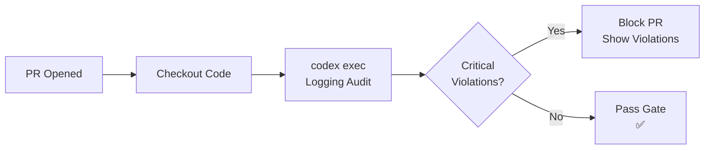

# Codex CLI for Structured Logging Standardisation: Auditing, Migration, and CI Enforcement


---

Inconsistent logging is one of those problems that nobody prioritises until a production incident demands it. You grep through megabytes of free-text log lines, each formatted differently, half missing request context, and the structured observability pipeline you paid for sits idle because nothing upstream is emitting JSON. This article demonstrates how to use Codex CLI to audit a codebase for logging anti-patterns, migrate to a structured logging standard, and enforce that standard permanently through hooks and CI gates.

## Why Structured Logging Matters Now

Structured logging — emitting logs as machine-parseable key-value records rather than interpolated strings — is not new, but in 2026 the tooling ecosystem has converged around it. Node.js teams have Pino (222,000 ops/sec vs Winston's 36,000) [^1]. Go teams have `log/slog` in the standard library since Go 1.21, now the default recommendation for all new services [^2]. Python has `structlog` layered atop the standard `logging` module. The common pattern: a JSON handler, consistent field names (`request_id`, `user_id`, `service`, `level`), and log levels aligned with your observability backend.

The challenge is not choosing a library — it is migrating an existing codebase from `console.log` or `fmt.Printf` to structured output, and keeping it that way as the team grows.

## Encoding Logging Standards in AGENTS.md

The first step is making your logging conventions legible to Codex. An `AGENTS.md` file at the repository root [^3] gives Codex durable guidance that loads automatically into context across CLI, IDE extension, and web app [^4].

```markdown
# Logging Standards

## Required library
- Node.js services: `pino` with `pino-pretty` for local development
- Go services: `log/slog` with `slog.JSONHandler` for production

## Field conventions
Every log line MUST include:
- `service`: the service name from `package.json` or Go module path
- `request_id`: propagated from the `X-Request-ID` header
- `level`: one of `debug`, `info`, `warn`, `error`, `fatal`
- `timestamp`: ISO 8601, UTC

## Prohibited patterns
- NEVER use `console.log`, `console.error`, or `fmt.Println` for application logging
- NEVER interpolate variables into log message strings — use structured fields
- NEVER log credentials, tokens, or PII in any field

## Log level policy
- `debug`: developer-only diagnostics, stripped in production builds
- `info`: business events (request received, job completed)
- `warn`: recoverable anomalies (retry, fallback)
- `error`: failures requiring investigation
- `fatal`: process-terminating events only
```

Codex reads this before every interaction [^3], so any code it generates or reviews will follow these conventions without repeated prompting.

## Interactive Logging Audit

Start with an interactive session to understand the current state:

```bash
codex "Audit this repository for logging anti-patterns. Find all
instances of console.log, console.error, fmt.Println, fmt.Printf
used for application logging (not test files). For each, report
the file, line number, current log content, and suggest the
structured equivalent using our AGENTS.md logging standard."
```

Codex will read the `AGENTS.md` logging standards, scan the codebase, and produce a file-by-file report distinguishing build scripts and tests (where `console.log` is acceptable) from application code (where it is not). You review the suggestions interactively, approve the safe ones, and build confidence in the migration path.

## Structured Audit with `codex exec`

For CI integration and repeatable analysis, use `codex exec` with `--output-schema` to produce machine-readable findings [^5]:

```bash
codex exec \
  --model o3 \
  --output-schema logging-audit-schema.json \
  "Audit this codebase for structured logging violations against
   the standards defined in AGENTS.md. Report every violation."
```

The schema file enforces a consistent output shape:

```json
{
  "type": "object",
  "properties": {
    "summary": {
      "type": "object",
      "properties": {
        "total_violations": { "type": "integer" },
        "files_scanned": { "type": "integer" },
        "severity_counts": {
          "type": "object",
          "properties": {
            "critical": { "type": "integer" },
            "warning": { "type": "integer" },
            "info": { "type": "integer" }
          }
        }
      }
    },
    "violations": {
      "type": "array",
      "items": {
        "type": "object",
        "properties": {
          "file": { "type": "string" },
          "line": { "type": "integer" },
          "severity": { "type": "string" },
          "current_code": { "type": "string" },
          "suggested_fix": { "type": "string" },
          "reason": { "type": "string" }
        },
        "required": ["file", "line", "severity", "current_code", "reason"]
      }
    }
  },
  "required": ["summary", "violations"]
}
```

The `--output-schema` flag constrains the model's final response to match this schema via OpenAI's structured output feature [^5], making the result directly parseable by downstream CI tooling.

## Migration Workflow: Node.js Example

Once the audit identifies violations, use Codex to perform the migration in batches. A practical approach: pipe the audit output back into a targeted fix prompt.

```bash
# Generate the fix plan
codex exec \
  --model o3 \
  -o /tmp/migration-plan.md \
  "Read the logging audit results. For each violation in src/,
   generate the exact code change needed to migrate from console.log
   to pino structured logging. Group changes by file. Preserve all
   existing log semantics — do not remove information, only restructure it."

# Apply the fixes interactively for review
codex "Apply the migration plan from /tmp/migration-plan.md.
       Show me each change before applying it."
```

A typical migration transforms this:

```javascript
// Before: unstructured, missing context
console.log(`User ${userId} placed order ${orderId} worth £${total}`);
```

Into this:

```javascript
// After: structured, parseable, context-rich
logger.info({ userId, orderId, total, currency: 'GBP' }, 'order placed');
```

The structured version gives your observability pipeline filterable fields, consistent formatting, and the ability to alert on `orderId` patterns without regex gymnastics.

## Migration Workflow: Go Example

For Go codebases migrating from `log.Printf` to `log/slog`:

```go
// Before: unstructured
log.Printf("failed to fetch user %s: %v", userID, err)

// After: structured with slog
slog.Error("failed to fetch user",
    slog.String("user_id", userID),
    slog.Any("error", err),
)
```

Go's `slog` package supports handler redirection, so existing `log.Printf` calls can be captured by setting a default slog logger [^2]. This allows incremental migration without a big-bang rewrite — precisely the kind of staged approach Codex handles well when guided by `AGENTS.md` conventions.

## Building a Reusable Logging Audit Skill

Convert the audit workflow into a reusable skill [^6] so any team member can invoke it consistently:

```
~/.agents/skills/
  logging-auditor/
    SKILL.md
    schemas/
      logging-audit-schema.json
```

The `SKILL.md`:

```yaml
---
name: logging-auditor
description: >
  Audit a codebase for structured logging violations. Use when asked to
  "check logging", "audit logs", "find console.log usage", or
  "verify logging standards". Reports violations with severity,
  location, and suggested fixes.
---

## Steps

1. Read the project's AGENTS.md for logging standards. If none exist,
   use the default standards: structured JSON output, consistent fields
   (service, request_id, level, timestamp), no string interpolation in
   log messages.

2. Scan all application source files (exclude test files, build scripts,
   and node_modules/.vendor/).

3. Identify violations:
   - **Critical**: credentials or PII in log output
   - **Warning**: unstructured logging calls (console.log, fmt.Println,
     print(), System.out.println)
   - **Info**: missing standard fields, inconsistent level usage

4. Report findings using the schema in schemas/logging-audit-schema.json.

5. Summarise: total violations, files affected, estimated migration effort.
```

Invoke it explicitly with `$logging-auditor` or implicitly by asking Codex to "audit the logging in this project" [^6].

## Enforcing Standards with Hooks

Codex hooks [^7] provide lifecycle automation that fires before or after tool execution. A `PostToolUse` hook can verify that any code Codex writes or modifies does not introduce logging anti-patterns:

```json
{
  "hooks": {
    "PostToolUse": [
      {
        "matcher": "^(Bash|apply_patch)$",
        "hooks": [
          {
            "type": "command",
            "command": "python3 .codex/hooks/check_logging.py",
            "timeout": 30,
            "statusMessage": "Checking logging standards"
          }
        ]
      }
    ]
  }
}
```

The hook script reads the tool output from stdin and checks for prohibited patterns:

```python
#!/usr/bin/env python3
"""PostToolUse hook: reject code containing logging anti-patterns."""
import json
import re
import sys

PROHIBITED = [
    r'\bconsole\.(log|error|warn|info)\b',
    r'\bfmt\.Print(ln|f)?\b',
    r'\blog\.Print(ln|f)?\b',
]

def main():
    event = json.load(sys.stdin)
    output = event.get("output", "")

    violations = []
    for pattern in PROHIBITED:
        if re.search(pattern, output):
            violations.append(pattern)

    if violations:
        result = {
            "continue": True,
            "systemMessage": (
                f"⚠️ Logging standard violation detected. "
                f"Patterns found: {', '.join(violations)}. "
                f"Use structured logging per AGENTS.md."
            )
        }
    else:
        result = {"continue": True}

    json.dump(result, sys.stdout)

if __name__ == "__main__":
    main()
```

The hook does not block execution (`"continue": true`) but injects a system message [^7] that steers Codex to self-correct. For stricter enforcement in enterprise settings, managed hooks can be deployed at the organisation level and cannot be disabled by individual users [^7].

## CI Pipeline: Logging Standards Gate

Integrate the structured audit into your CI pipeline using the Codex GitHub Action [^8]:


```yaml
name: Logging Standards Gate
on: [pull_request]

jobs:
  logging-audit:
    runs-on: ubuntu-latest
    steps:
      - uses: actions/checkout@v4

      - name: Run logging audit
        uses: openai/codex-action@v1
        with:
          codex_api_key: ${{ secrets.CODEX_API_KEY }}
          command: |
            codex exec \
              --model o3 \
              --output-schema .codex/schemas/logging-audit-schema.json \
              -o /tmp/audit-result.json \
              "Audit changed files in this PR for structured logging
               violations against AGENTS.md standards."

      - name: Check violations
        run: |
          CRITICAL=$(jq '.summary.severity_counts.critical' /tmp/audit-result.json)
          if [ "$CRITICAL" -gt 0 ]; then
            echo "::error::$CRITICAL critical logging violations found"
            jq '.violations[] | select(.severity == "critical")' /tmp/audit-result.json
            exit 1
          fi
          echo "✅ No critical logging violations"
```




This pipeline blocks PRs with critical violations (credentials in logs, PII exposure) whilst allowing warnings for unstructured logging that can be addressed incrementally. The `--output-schema` flag ensures the audit result is always valid JSON that `jq` can process reliably [^5].

## Model Selection

| Task | Recommended Model | Rationale |
|------|-------------------|-----------|
| Interactive audit | `o3` | Deep reasoning for nuanced pattern detection across file boundaries [^9] |
| Batch migration | `o3` | Code generation accuracy matters; cost amortised over large changesets |
| CI gate audit | `o4-mini` | Faster, cheaper; pattern matching is well-defined [^9] |
| Quick violation count | `o4-mini` | Simple extraction task, minimal reasoning needed |

## Anti-Patterns

**Trusting generated log levels blindly.** Codex may default to `info` when `warn` or `error` is semantically correct. Always review level assignments against your log level policy.

**Logging entire request/response bodies.** Structured logging makes it tempting to attach full payloads. This bloats storage costs and risks PII exposure. Constrain logged fields in `AGENTS.md`.

**Migrating everything at once.** Large codebases benefit from incremental migration — one service or module per PR. Use the audit skill to track coverage over time.

**Skipping the test suite after migration.** Logging changes can break tests that assert on log output format. Run `npm test` or `go test ./...` after every migration batch.

**Over-permissioned sandbox for CI audits.** The logging audit only needs read access. Use `--sandbox read-only` in CI to prevent unintended writes [^5].

## Known Limitations

- **`--output-schema` and `--resume` are mutually exclusive** — you cannot resume a structured audit session [^5].
- **Context window constraints** apply to very large codebases. For repositories exceeding 100k lines, scope audits to changed files or specific directories.
- **Hook matchers for `apply_patch`** are less reliable than for `Bash` tool calls [^7]. ⚠️ Test hook behaviour with `apply_patch` in your environment before relying on it for enforcement.
- **Non-deterministic suggestions** mean two runs may produce slightly different migration code. Pin important migrations with explicit test coverage.
- **Sandbox network isolation** prevents hooks from calling external logging validation services. Validation must be self-contained [^5].

## Citations

[^1]: SigNoz, "Pino Logger: Complete Node.js Guide with Examples [2026]," 2026. [https://signoz.io/guides/pino-logger/](https://signoz.io/guides/pino-logger/)

[^2]: Go Blog, "Structured Logging with slog," 2023. [https://go.dev/blog/slog](https://go.dev/blog/slog)

[^3]: OpenAI, "Custom instructions with AGENTS.md – Codex," 2026. [https://developers.openai.com/codex/guides/agents-md](https://developers.openai.com/codex/guides/agents-md)

[^4]: OpenAI, "Best practices – Codex," 2026. [https://developers.openai.com/codex/learn/best-practices](https://developers.openai.com/codex/learn/best-practices)

[^5]: OpenAI, "Non-interactive mode – Codex," 2026. [https://developers.openai.com/codex/noninteractive](https://developers.openai.com/codex/noninteractive)

[^6]: OpenAI, "Agent Skills – Codex," 2026. [https://developers.openai.com/codex/skills](https://developers.openai.com/codex/skills)

[^7]: OpenAI, "Hooks – Codex," 2026. [https://developers.openai.com/codex/hooks](https://developers.openai.com/codex/hooks)

[^8]: OpenAI, "Automating Code Quality and Security Fixes with Codex CLI on GitLab," 2026. [https://developers.openai.com/cookbook/examples/codex/secure_quality_gitlab](https://developers.openai.com/cookbook/examples/codex/secure_quality_gitlab)

[^9]: OpenAI, "Command line options – Codex CLI," 2026. [https://developers.openai.com/codex/cli/reference](https://developers.openai.com/codex/cli/reference)
